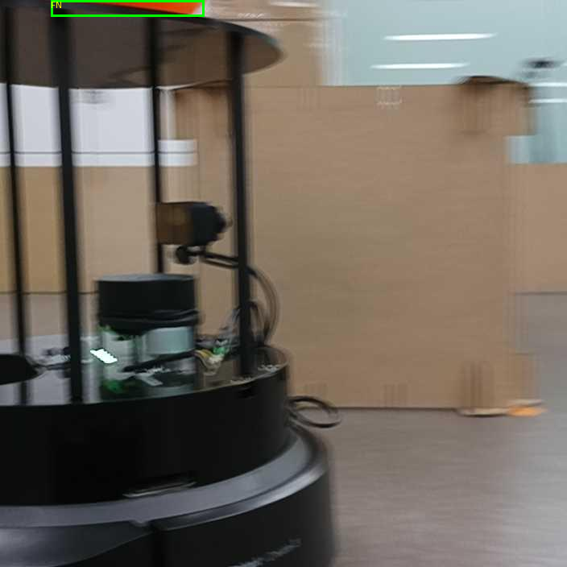

# Phase 4: 최종 평가와 모델 선정

[전체 안내](../README.md) · [이전 단계: Phase 3](phase3.md)

Phase 3에서 validation으로 고정한 모델별 최적 체크포인트를 동일한 test 조건에서 비교합니다.
새 학습이나 confidence 임계값 조정 없이 최종 모델을 선정하고 이미지별 오류를 분석합니다.
호스트 명령은 `detection/`에서 실행합니다.

이 문서는 `1e83132`에 저장된 `scripts/final_benchmark.py`,
[최종 결과 보고서](../results/final/report.md), [최종 비교 CSV](../results/final/final_comparison.csv)를
기준으로 작성했습니다.

## 평가 대상과 선행 조건

| 모델 | 선택 실험 | 최적 설정 | 체크포인트 |
| --- | --- | --- | --- |
| YOLO11n | 004 | SGD, 학습률 0.02, momentum 0.937, batch 16, 가중치 감쇠 0.0005, LambdaLR | `experiments/phase3/004/yolo11n/weights/best.pt` |
| YOLOv8n | 007 | SGD, 학습률 0.01, momentum 0.937, batch 16, 가중치 감쇠 0.001, LambdaLR | `experiments/phase3/007/yolov8n/weights/best.pt` |

실행에는 다음 자료가 필요합니다.

- `results/phase3/yolo11n_best.yaml`과 `yolov8n_best.yaml`
- `results/phase3/exp05_selection.json`의 완료된 모델별 선택 결과
- 선택 실행의 원본 설정, `native.yaml`, `run_info.json`, 최적 체크포인트, 상세 validation 결과
- Phase 1 비교 CSV, Phase 2 증강 요약 CSV, Phase 3 누적 요약 CSV
- `dataset/images/test/`와 `dataset/annotations/instances_test.json`
- 빌드된 YOLO Docker 이미지와 NVIDIA L4 GPU

스크립트는 최적 설정과 원본 실행 기록, validation 지표, 체크포인트 크기,
단계별 학습 이력이 일치하는지 검사합니다.
`experiments/`와 데이터는 Git 제외 대상이므로 결과 CSV만 있어서는 평가를 재실행할 수 없습니다.

## 공통 평가 조건

| 항목 | 값 |
| --- | --- |
| 데이터 | 기존 test 42장, 정답 객체 33개 |
| 입력 해상도 | 704×704 |
| confidence 임계값 | 0.25 |
| 정답 매칭 IoU | 0.50 |
| NMS IoU | 0.70 |
| AP 계산 점수 하한 | 0.001 |
| 하드웨어 | NVIDIA L4 |
| 추론 정밀도·배치 | FP32, batch 1 |
| 시간 측정 | 준비 실행 20회 후 test 전체 3회, 총 126회 측정 |

평가 조건은 `configs/phase1/evaluation.yaml`에서 읽고 선택 실행의 validation 조건과 대조합니다.
추론 시간에는 디코딩된 RGB의 전처리, GPU 전송, 추론, 후처리, CPU 박스 반환을 포함합니다.
파일 읽기, 모델 로드, 정답 매칭, 결과 저장은 제외합니다.
체크포인트와 test 주석의 SHA-256을 기록하여 평가 대상을 추적합니다.

## 실행

```bash
# 선행 조건 검사 후 Docker 명령만 출력
python3 scripts/final_benchmark.py

# 두 모델의 최종 test 평가와 보고서 생성
python3 scripts/final_benchmark.py --execute
```

별도 모델 선택 옵션이나 `collect` 명령은 없습니다. 두 모델을 평가한 뒤 결과를 함께 저장합니다.
재실행하면 최종 비교·보고서·오류 분석 파일을 갱신하고,
`predictions/`, `fp_samples/`, `fn_samples/`를 새로 생성합니다.
수동으로 작성한 오류 분류나 샘플은 재실행 전에 별도로 보관하세요.

## 저장된 최종 결과

아래 값은 `1e83132`의 `results/final/final_comparison.csv`에 저장된 test 결과이며,
이 문서 정리 과정에서 새로 측정한 값은 아닙니다.

| 모델 | Recall | F1 | mAP50 | mAP50–95 | 정답 예측 비율 | 추론 시간(ms/장) | TP / FP / FN |
| --- | --- | --- | --- | --- | --- | --- | --- |
| YOLO11n | 1.0000 | 1.0000 | 1.0000 | 0.9492 | 100.00% | 13.454 | 33 / 0 / 0 |
| YOLOv8n | 0.9697 | 0.9846 | 1.0000 | 0.9774 | 96.97% | 11.591 | 32 / 0 / 1 |

최종 선택 모델은 **YOLO11n**입니다.
선정 우선순위는 test Recall → F1 → mAP50 → 정답 예측 비율 → 추론 속도이며,
앞 지표가 같으면 다음 지표를 비교합니다.
YOLOv8n의 추론 시간과 mAP50–95가 더 좋지만, YOLO11n은 FN이 없어 우선 지표인 Recall에서 앞섭니다.
mAP50–95는 보고 지표이며 최종 선정 우선순위에는 포함하지 않습니다.

정답 예측 비율은 `TP / (TP + FP + FN) × 100`입니다.
평균 confidence는 운영 임계값 이상의 예측 점수 평균이며,
YOLO11n은 0.9228, YOLOv8n은 0.9468입니다.
Phase 3의 validation 지표와 이 단계의 test 지표는 서로 다른 데이터에서 측정한 값입니다.

## 산출물

결과는 `results/final/`에 저장합니다. 사용 안내는 이 문서에서 관리하고,
실행 시 생성하는 `results/final/report.md`는 해당 실행의 결과 보고서로 보관합니다.

| 경로 (`results/final/` 기준) | 내용 |
| --- | --- |
| `final_comparison.csv` | 최종 test 지표, 학습·검증 이력, 하드웨어, 시간·메모리, 체크포인트·주석 해시 |
| `final_comparison.json` | 평가 조건, 최종 선택 모델, 모델별 지표, 단계별 이력 |
| `report.md` | 비교표, 선정 근거, 학습·검증 이력, 오류 분석 안내 |
| `error_analysis.csv` | 이미지별 정답·예측 수, TP/FP/FN, confidence, IoU, 예측·샘플 경로 |
| `predictions/<모델명>/` | 이미지별 정답, 운영 임계값 이상 예측, 매칭 결과, FN의 JSON |
| `fp_samples/` | FP가 있는 이미지의 표시 샘플 |
| `fn_samples/` | FN이 있는 이미지의 표시 샘플 |

## 오류 분석

### 오류 집계

[이미지별 오류 분석 CSV](../results/final/error_analysis.csv)를 기준으로,
YOLO11n은 FP·FN이 없으며 YOLOv8n은 FN 1개가 있습니다. 두 모델 모두 FP는 없습니다.

| 모델 | 정상 탐지(TP) | 오탐(FP) | 미탐(FN) | 오류 샘플 |
| --- | --- | --- | --- | --- |
| YOLO11n | 33 | 0 | 0 | 없음 |
| YOLOv8n | 32 | 0 | 1 | 이미지 ID 36 |

### 미탐 사례: 이미지 상단에서 일부만 보이는 객체

이미지 ID 36의 `_img_521_jpg.rf.3531d67a65d11e1e1196cdd157dfcf01.jpg`에서
YOLOv8n이 정답 객체 1개를 놓쳤습니다.



객체가 이미지의 상단 가장자리에 걸쳐 있어 극히 일부만 보입니다.
정답 박스는 `[x1, y1, x2, y2] = [63, 0, 253, 20]`으로,
704×704 이미지에서 높이 20픽셀(약 2.8%)의 얇은 영역입니다.
호박의 전체 윤곽을 확인하기 어려운 **화면 경계에서 잘린 객체의 미탐 사례**로 정리할 수 있습니다.
이 시각적 특성이 탐지에 영향을 주었을 가능성은 있지만, 저장된 결과만으로 원인을 확정하지는 않습니다.

### 같은 이미지의 모델별 예측 비교

| 모델 | 임계값 이상 예측 수 | Confidence | 매칭 IoU | 판정 |
| --- | --- | --- | --- | --- |
| YOLO11n | 1 | 0.3064 | 0.6573 | TP 1, FN 0 |
| YOLOv8n | 0 | 해당 없음 | 해당 없음 | TP 0, FN 1 |

YOLO11n은 운영 confidence 임계값 0.25와 정답 매칭 IoU 0.50을 모두 충족해 정상 탐지로 집계됐습니다.
다만 confidence가 0.3064로 임계값에 가까워, 이 사례는 YOLO11n에서도 높은 확신의 탐지는 아닙니다.
YOLOv8n의 저장 JSON에는 운영 임계값 이상의 예측이 없습니다.
임계값 아래 후보는 이 파일에 저장되지 않으므로, 후보 자체가 없었는지 점수가 낮아 제외됐는지는 구분할 수 없습니다.

원본 매칭 결과는 [YOLO11n 예측 JSON](../results/final/predictions/yolo11n/36__img_521_jpg.rf.3531d67a65d11e1e1196cdd157dfcf01.json)과
[YOLOv8n 예측 JSON](../results/final/predictions/yolov8n/36__img_521_jpg.rf.3531d67a65d11e1e1196cdd157dfcf01.json)에서 확인할 수 있습니다.
이 한 건의 미탐 차이가 최종 선정의 우선 지표인 test Recall 차이로 이어졌습니다.

## 코드 검사

다음 명령은 실제 GPU 평가 없이 코드 테스트를 실행합니다.

```bash
python3 -m unittest discover -s scripts/tests -p 'test_final_benchmark.py' -v
```
