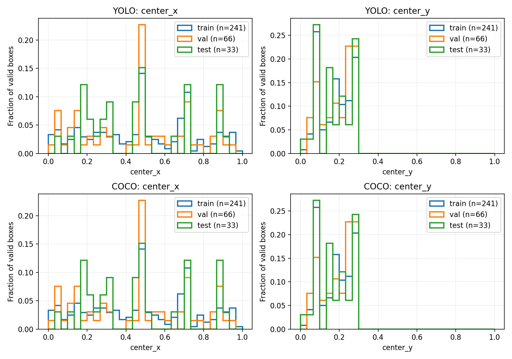
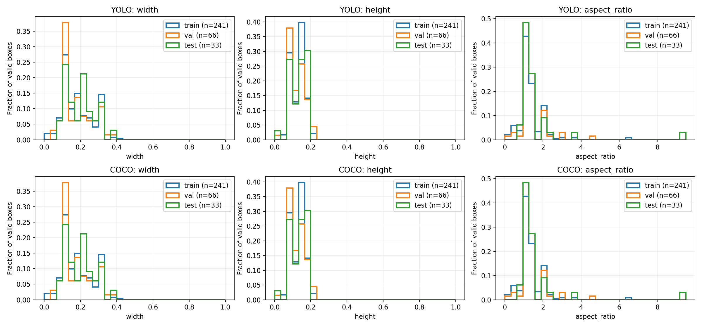
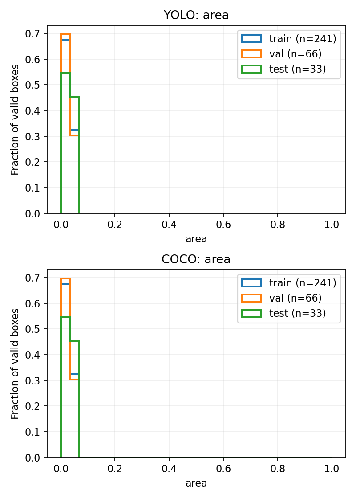

# Phase 0 Dataset Freeze & EDA

Dataset: trick_or_bot_v01 · root: `/home/shbong/Trick_or_Bot/detection/dataset`

Expected images: **416**; observed readable images: **417**. Count matches: **False**.
Manifest SHA-256: `7006a59ddbea204fe0940da7b11f5cca911260c5f6231ba931df0d843b102c93`. Original dataset is read only; no split changes or clipping performed.

## Split comparison

| Format | Split | Images | Annotations | Positive | Negative | Unknown | Invalid | Edge touch |
|---|---|---:|---:|---:|---:|---:|---:|---:|
| YOLO | train | 292 | 241 | 241 (82.5%) | 51 (17.5%) | 0 | 0 | 40.7% |
| YOLO | val | 83 | 66 | 66 (79.5%) | 17 (20.5%) | 0 | 0 | 34.8% |
| YOLO | test | 42 | 33 | 33 (78.6%) | 9 (21.4%) | 0 | 0 | 36.4% |
| COCO | train | 292 | 241 | 241 (82.5%) | 51 (17.5%) | 0 | 0 | 40.7% |
| COCO | val | 83 | 66 | 66 (79.5%) | 17 (20.5%) | 0 | 0 | 34.8% |
| COCO | test | 42 | 33 | 33 (78.6%) | 9 (21.4%) | 0 | 0 | 36.4% |

## Freeze checks

- YOLO/COCO split membership mismatches: 0. See split_comparison.csv.
- Structural issues: 0; invalid boxes: 0. See validation_issues.csv and invalid_bboxes.csv.
- Cross-split leakage candidates: 675. See leakage_candidates.csv; manual review required.
- Candidate evidence: filename identity 0, identical files 0, identical decoded pixels 0, dHash similarity 675 pairs (evidence can overlap).
- Actual split: train=292/417, val=83/417, test=42/417; target 70/20/10%.
- A count mismatch, invalid annotations, structural errors or unresolved leakage candidates prevents an unconditional freeze approval.

## Definitions and formulas

- YOLO: class_id cx cy w h, normalized. Convert to pixels: x=(cx-w/2)W, y=(cy-h/2)H, bw=wW, bh=hH. COCO: [x,y,bw,bh] in pixels. Categories are checked independently: YOLO data.yaml IDs; COCO category IDs named pumpkin (no assumed 0/1 mapping).
- Center: ((x+bw/2)/W, (y+bh/2)/H); normalized width=bw/W, height=bh/H; normalized area=bw*bh/(W*H); aspect ratio=bw/bh in pixel coordinates.
- All parsed annotation rows, including invalid rows, count as annotations. Positive means at least one annotation row, not necessarily a valid box. Negative means a present empty YOLO label or a COCO image with zero annotations. Missing YOLO labels/COCO records are unknown, never silently negative. Ratios use readable physical images per split as denominator. Orphan COCO annotations are listed as structural issues and excluded from bbox counts.
- Distribution statistics and charts include only finite, positive-size, in-boundary, valid-category boxes. Percentiles use numpy linear interpolation; std is population standard deviation (ddof=0). Histogram heights are per-split bin counts / valid bbox count, with common bins across splits. Aspect ratio uses the full observed range; other axes use [0,1].
- Boundary tolerance: 1e-06 pixels (floating-point tolerance, not a visual margin). Invalid outside: x < -eps, y < -eps, x+bw > W+eps, or y+bh > H+eps. Edge touch: any boundary distance <= eps among valid boxes; denominator = valid boxes.
- Truncation cannot be established from a bbox alone. Edge contact is a truncation candidate proxy, outside-image counts indicate geometric overflow. Explicit truncated ratio = true flags / annotations carrying a recognized truncated flag; blank CSV ratio means no metadata. iscrowd is not a truncation flag.
- Resolution comes from Pillow-decoded image dimensions, compared with COCO metadata. Resolution ratio = images with that resolution / readable images in split.
- Split matching compares exact relative image filenames in YOLO physical directories and COCO image records, retaining negative images. val maps to the configured valid directory. No filename identity heuristic is used for this equality check.
- Leakage compares every pair from different splits. Filename identity strips Roboflow .rf.<hash> and case-folds; exact file SHA-256 and decoded RGB SHA-256 detect exact duplicates. dHash uses grayscale 9x8 LANCZOS pixels and 64 horizontal comparisons; Hamming distance <= 5 is a near-duplicate candidate. Similar backgrounds can yield false positives; crops/rotations can evade detection. Filenames alone do not establish capture-session independence.
- freeze_manifest.csv hashes all analyzed images, labels, COCO JSON and data.yaml, ordered by dataset-relative path. It records byte counts and file SHA-256. Unrelated raw_data is excluded. Compare manifests between runs to detect changes; source files must remain stable during analysis.

## Distribution and resolution tables

See bbox_distribution_summary.csv (min/p25/median/p75/max/mean/std), image_resolution_summary.csv, and split_summary.csv for machine-readable comparisons.

| Split | Resolution | Images |
|---|---|---:|
| test | 704 x 704 | 42 |
| train | 704 x 704 | 292 |
| val | 704 x 704 | 83 |





## Reproduce

From repository root:

```bash
python3 -m pip install -r detection/scripts/requirements-analysis.txt
python3 detection/scripts/analyze_dataset.py --dataset-root /home/shbong/Trick_or_Bot/detection/dataset --output-dir /home/shbong/Trick_or_Bot/detection/records/dataset_analysis --expected-images 416 --edge-epsilon 1e-06 --dhash-threshold 5
```

Dependencies: numpy, matplotlib (Agg backend), Pillow, PyYAML. Tests: python3 -m unittest discover -s detection/scripts/tests.
