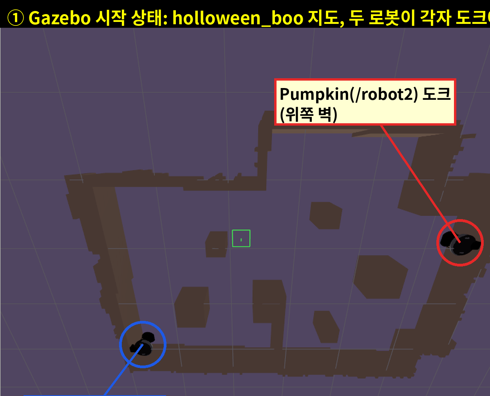
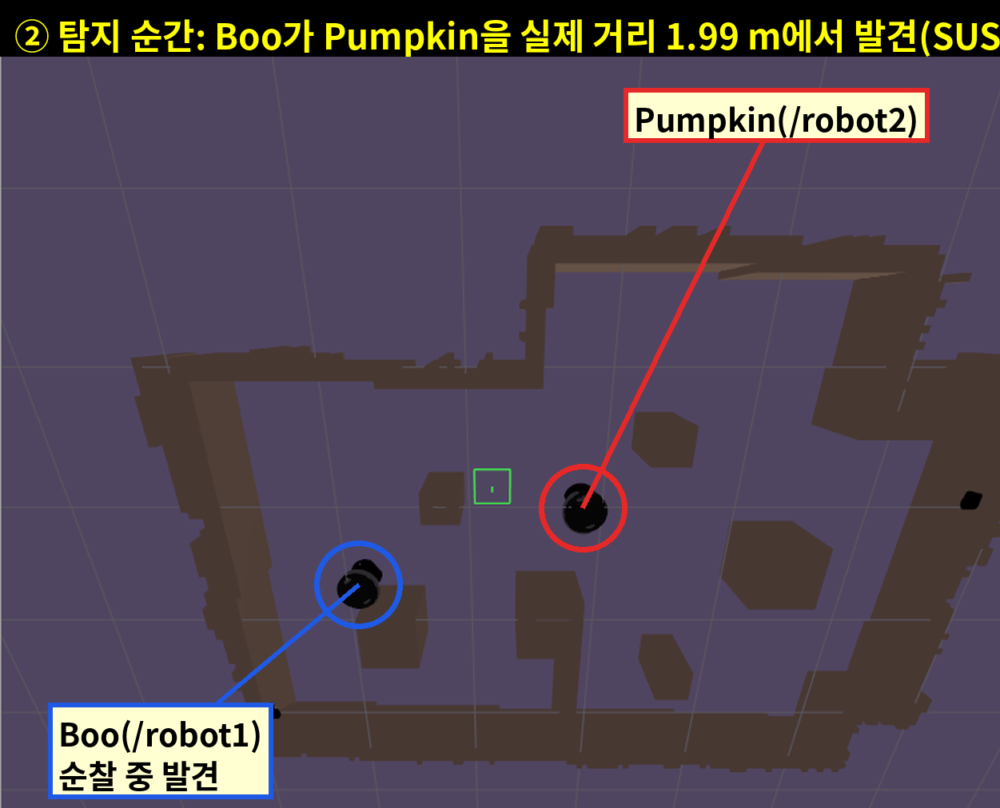
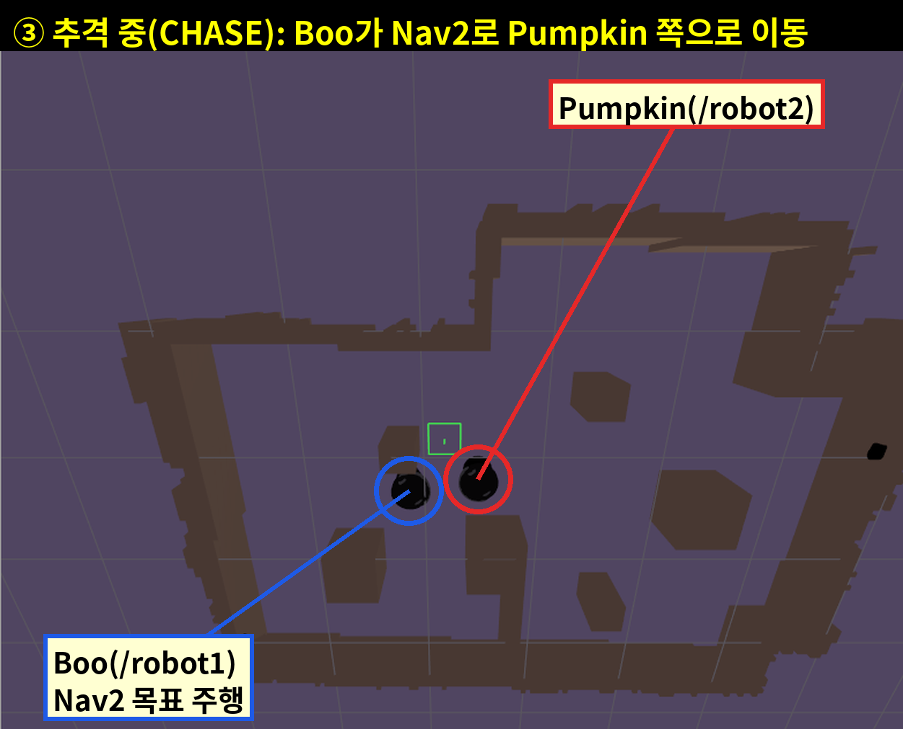
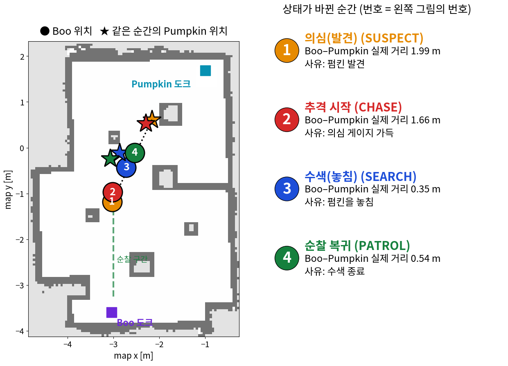

# Boo Nav2 구현 수행 증명 (2026-10-10 토)

- 작성: 2026-10-10_2110
- 담당: Boo(술래, `/robot1`)의 Nav2 이동 제어 (`ros2_ws/src/tob_control`)
- 브랜치: `feature/lwh` (커밋 `f66bc06`, `cf33dc7`, `fd1c249`, `943e94f`)

## 1. 오늘 한 일 (한눈에)

| # | 작업 | 결과 |
|---|---|---|
| 1 | Nav2 목표 전송·취소·결과 확인 `nav2_client.py` 작성 | 완료 (서버가 없어도 멈추지 않음, 교체된 이전 목표의 늦은 결과 무시) |
| 2 | Boo 행동 상태기계 `boo_fsm.py` 작성 (PATROL / SUSPECT / CHASE / SEARCH / IDLE) | 단위 시험 15개 통과 |
| 3 | 전체 이동 관리 노드 `boo_controller_node.py` 작성 (관측·게임·안전 상태 → FSM → Nav2, `/tob/boo/state` 발행) | 모의 Nav2와 실제 Nav2 모두에서 동작 확인 |
| 4 | 팀원이 준 `nav2.yaml` 정리 (`config/`로 이동, 이전 파일은 `config/past_config/`), Lv1 속도 0.12 m/s 적용 | 완료 |
| 5 | Nav2 실행 launch 작성 (`tob_bringup/launch/navigation.launch.py`), 지도 파일을 `tob_bringup/maps/`에 복제 | 완료 |
| 6 | Gazebo 시험 환경 구성: `holloween_boo` 지도 월드, Boo 도크 위치(벽에 붙임), Pumpkin 우상단 도크 | 완료 |
| 7 | 시험 도구 작성: 모의 Nav2 서버, 펌킨 실제 위치를 따라가는 가짜 탐지기(거리 2.5 m·시야각 69°·벽 가림 반영), 펌킨 시나리오 주행, 정리 스크립트 | 완료 |
| 8 | 가이던스 `docs/guidance/가이던스_nav2_01차.md` 작성·수정, 사용자가 Gazebo에서 시험 후 기록(log, rosbag)으로 결과 확인 | 완료 |

## 2. 시험 결과 (Gazebo, 실제 Nav2)

- Boo가 순찰 구간을 오가다가 Pumpkin을 **실제 거리 1.99 m**에서 발견 → 의심(SUSPECT) → 게이지가 가득 차면 추격(CHASE) → **약 0.38~0.40 m까지 접근**했다.
- 시야각 밖으로 벗어나 놓치면 수색(SEARCH) → 순찰(PATROL)로 돌아간다. 이후 2.29 m에서 다시 발견·추격했다.
- 상세 기록: `boo_nav/result_boo_nav/log_boo_nav/scenario_261010_181150.txt`, rosbag `bag_261010_174651`(로컬 보관, git 제외)

## 3. 사진과 영상

모두 오늘 이 저장소의 도구(가이던스 `가이던스_nav2_01차` 순서: 시뮬레이터, Nav2·Boo 컨트롤러, 가짜 탐지기, Pumpkin 시나리오)를 그대로 실행해 새로 캡처했다. 지도는 `holloween_boo`이다.

### ① 시작 상태

Boo는 아래쪽 벽의 도크, Pumpkin은 위쪽 벽(우상단)의 도크에 있다.

### ② 탐지 순간

Boo가 순찰 중 Pumpkin을 실제 거리 1.99 m에서 발견했다(SUSPECT).

### ③ 추격

의심 게이지가 가득 차 CHASE로 넘어가 Nav2 목표로 Pumpkin 쪽으로 이동 중이다.

### ④ 지도 위 상태 전환 위치 (사진 ②③과 같은 실행)

### 영상
[boo_nav2_chase_261010.mp4](boo_nav2_chase_261010.mp4) (100초, 약 0.4 MB). 같은 시나리오를 화면 녹화했다. 로그: `boo_nav/result_boo_nav/log_boo_nav/*_video.txt`.

## 4. 오늘 발견·해결한 문제

| 문제 | 원인 | 조치 |
|---|---|---|
| localization(AMCL)이 멈춤 | 내가 시험 환경 스크립트에 넣은 네트워크 설정(`ROS_AUTOMATIC_DISCOVERY_RANGE=LOCALHOST`) | 설정 제거 |
| 시작 직후 순찰이 영구 정지 | Nav2가 켜지기 전 목표 3번 실패 | 서버 준비 전에는 목표를 보내지 않고, 실패로 멈춘 뒤 5초 후 재시도 |
| 시뮬레이션이 옛 지도로 뜸 | 월드 생성에 옛 지도 사용 | `holloween_boo`로 월드 재생성 |
| 정리 스크립트가 가짜 탐지기를 못 끔 | 종료 대상 목록 누락 | 목록에 추가 |
| 가짜 관측이 실제 Pumpkin과 1.75 m 어긋남 | 고정 좌표 사용 | Pumpkin 실제 위치를 따르는 탐지기로 교체 |

## 5. 남은 일 (팀과 정할 것)

- 추격 정지 거리 0.45 m 유지 여부 (Pumpkin 상단 판 위가 어느 정도 보이는 거리까지를 최소 접근 거리로 본다. 가까워지면 시야각 이탈로 놓침)
- 잡힘 거리 0.5 m(중심 간)·안전 정지 0.64 m와의 정합
- Nav2 속도 출력과 `velocity_gate_node`(tob_safety) 연결 방식
- 순찰 지점 실측값, Pumpkin 도크 위치(위쪽 벽 확인됨)
- 수색(SEARCH) 단계에서 Boo가 마지막 목격 위치로 정지 거리 없이 들어가 Pumpkin과 **0.20 m**까지 붙은 실행이 있었다(`scenario_261010_211726_capture.txt`). 추격 정지 거리(0.45 m)는 CHASE에만 적용된다.
