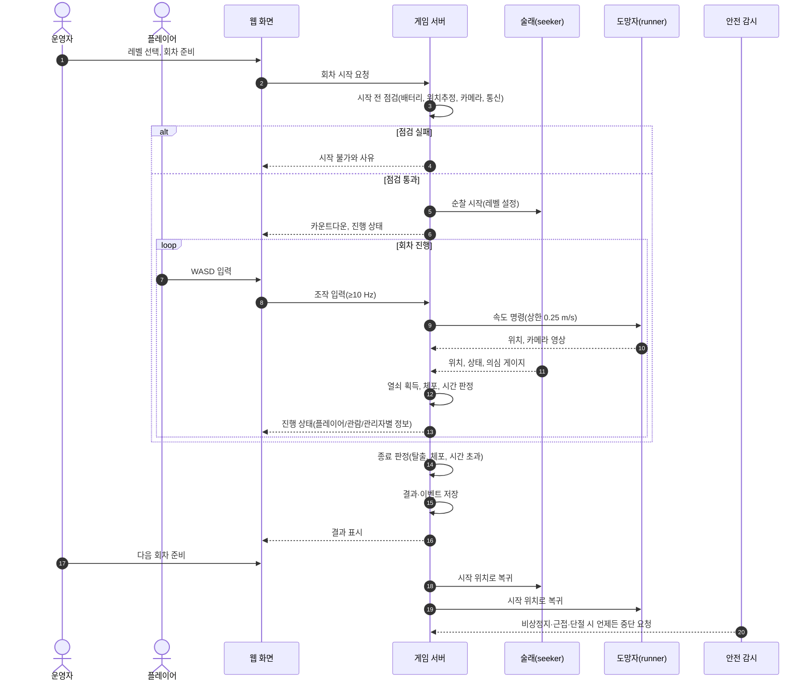
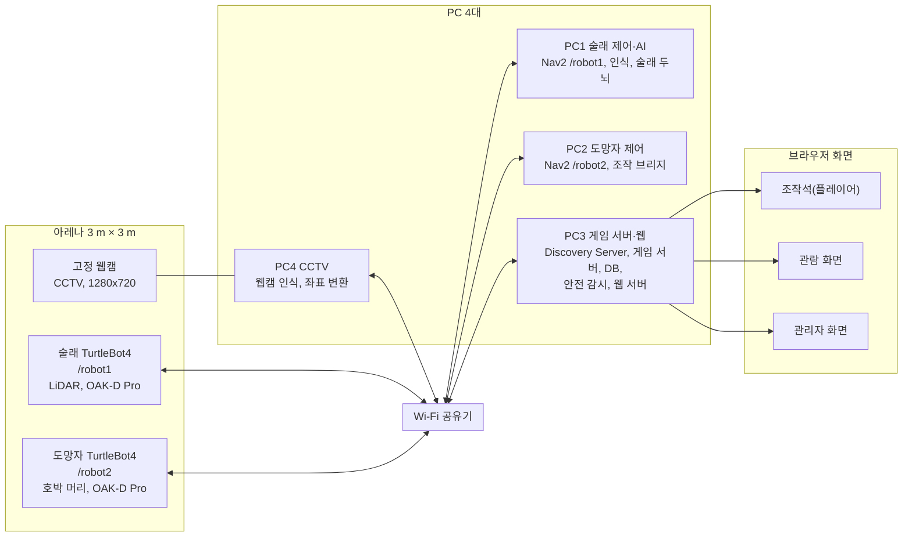
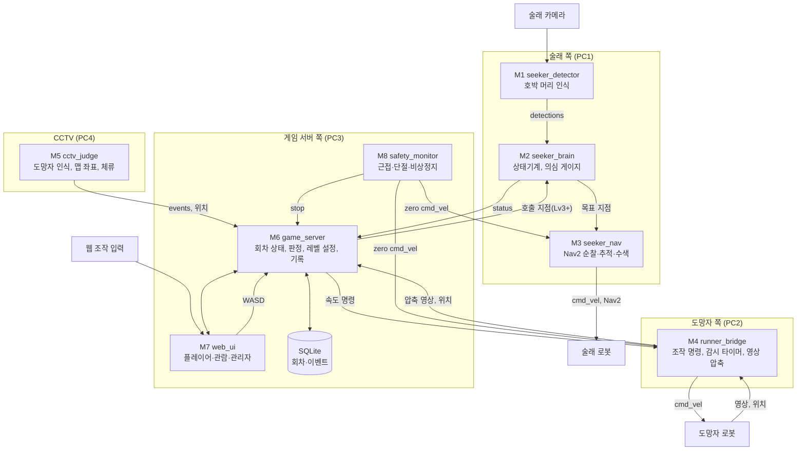
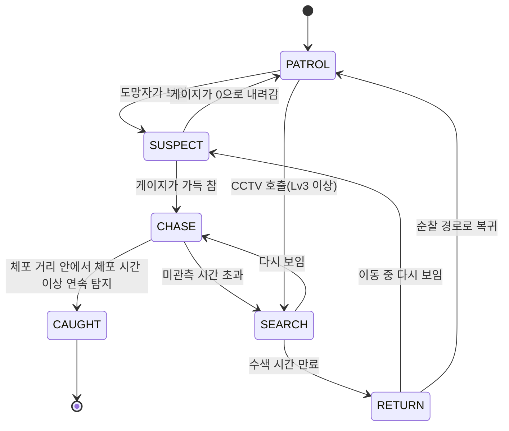
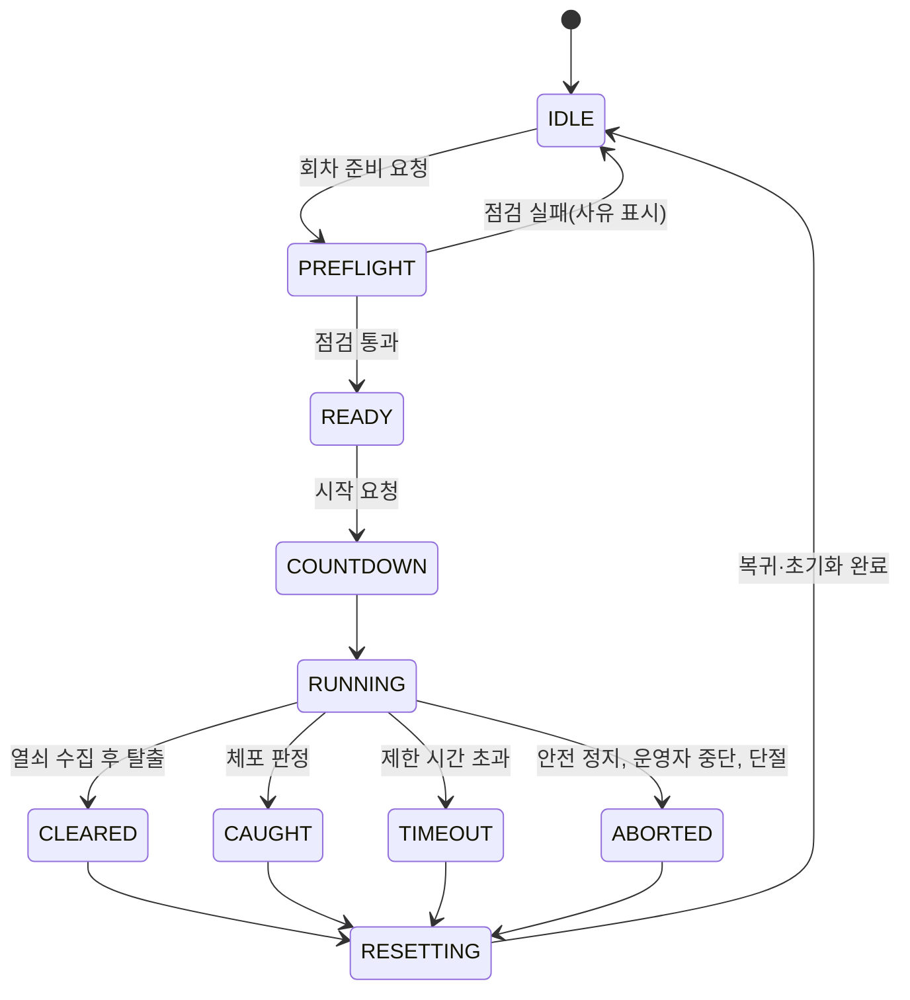

# SDD — Trick or Bot (시스템 설계서)

- 작성: 2026-10-08_1550
- 문서 ID: SDD-TOB-001 (초안, 팀 검토 전)
- 입력 문서: [SRD_fix03.md](SRD_fix03.md)(TR·SR), [brd.md](brd.md)(BR, Case1~3), [schedule.md](schedule.md), 튜터님 DAY5 "시스템 설계도 마감일" 목차 지침
- 확인 필요 항목: [open_issues.md](open_issues.md) (본문의 `OI-xx`)
- 목차 순서(튜터님 지침): **시나리오 → 시스템 아키텍처(전체) → 상세 설계(기능별) → 인터페이스 → 검증 → 구현 적합성(유지보수, 추적성)**
- 이 문서가 답하는 질문: **어떻게(How).** 기능, 각 기능이 받는 것과 보내는 것, 그 연결을 이 문서만 보고 알 수 있게 쓴다.
- 표기: `[제안]`은 이 초안이 새로 정한 이름·값이다. 팀이 바꿔도 된다. 토픽·패키지 이름은 모두 `[제안]`이다.
- 마감: 시스템 설계도(아키텍처 다이어그램) 오후 마감 **10/13(화)**. 튜터님 평가 대상이다.

---

## 1. 개요

술래 로봇이 카메라로 도망자 로봇(호박 머리)을 스스로 찾아 쫓고, 플레이어는 웹 화면으로 도망자를 조작해 열쇠를 모아 탈출하는 실물 술래잡기 게임이다.
설계 원칙은 다섯 가지다.

1. **판정은 한 곳에서 한다.** 열쇠·체포·시간·승패는 게임 서버만 결정한다. 로봇 노드는 위치와 상태를 보고하고 서버의 명령을 따른다.
2. **웹은 게임 서버만 본다.** 웹 화면이 로봇 노드와 직접 통신하지 않는다(SRD §6).
3. **안전 정지는 게임 판정과 분리한다.** 안전 감시 노드가 별도로 두 로봇을 멈춘다(TR-11).
4. **레벨은 설정 파일로 바꾼다.** 코드를 고치지 않고 YAML과 지도 파일만 교체한다(TR-15).
5. **단위 테스트가 끝나는 즉시 이웃 모듈과 연결한다.** 통합 단계를 따로 두지 않는다(타임라인 3절).

## 2. 시나리오

### 2.1 한 판 (Case1) — 시퀀스



### 2.2 다음 회차 준비 (Case2)와 장애 중단 (Case3)

| 단계 | Case2 종료 후 다음 회차 준비 | Case3 장애 중단과 복구 |
|---|---|---|
| 시작 | 회차가 끝나거나 중단됨 | 통신 단절·동작 이상·운영자 정지·근접 <0.3 m |
| 처리 | 결과 확인 → 두 로봇 시작 위치 복귀 → 게임 상태 초기화 → 시작 전 점검 → 준비 완료 기록 | 안전 감시가 정지 → 게임 서버가 회차를 `ABORTED`로 바꾸고 사유 저장 → 운영자 확인·복구 → 초기화 |
| 예외 | 복귀 실패·배터리 <30%이면 시작 차단, 사유와 소요 시간 기록 | 복구 불가면 제공 불가 상태를 유지, 개발자 지원은 계획 외 개입으로 기록 |
| 목표값 | 종료부터 다음 회차 시작 가능까지 ≤90 s (TR-10) | 근접 정지 ≤0.5 s (TR-11) |

## 3. 시스템 아키텍처 (전체)

### 3.1 물리 구성



- **통신 구조:** PC3가 FastDDS Discovery Server(ID 0, UDP 11811)를 열고 TB4 2대와 PC1·PC2·PC4가 클라이언트가 된다(튜터 DAY5 Client Setup). 일반 노드는 `ROS_SUPER_CLIENT=False`(SR-005). → OI-15
- **화면:** 조작석·관람·관리자 화면은 브라우저로 PC3의 웹 서버에 접속한다. 어느 모니터를 쓸지는 환경 담당이 정한다.

### 3.2 논리 구성 (모듈과 데이터 흐름)



### 3.3 모듈 목록

| ID | 모듈 | 위치 | 역할 | 관련 TR | 담당 |
|---|---|---|---|---|---|
| M1 | seeker_detector | PC1 | 술래 카메라 영상에서 도망자를 탐지하고 깊이로 맵 좌표를 만든다 | TR-05, 18 | detect 담당(고은빈, 박성은) |
| M2 | seeker_brain | PC1 | 순찰·의심·추적·체포 직전·수색·복귀 상태기계와 의심 게이지 | TR-04, 06, 08 | 미정 |
| M3 | seeker_nav | PC1 | Nav2 목표 전송·취소·재계획, 순찰 경로, 이탈 방지 | TR-04, 12 | Nav2 담당(전주은, 김희성) |
| M4 | runner_bridge | PC2 | 서버 명령을 도망자 `cmd_vel`로 바꾸고 입력 끊김을 감시하며 영상을 압축·송출 | TR-01, 02 | 미정 |
| M5 | cctv_judge | PC4 | 웹캠에서 도망자를 인식해 맵 좌표로 바꾸고 구역 체류를 판정 | TR-07, 09 | 미정 |
| M6 | game_server | PC3 | 회차 상태, 열쇠·체포·시간 판정, 레벨 설정, 시작 전 점검, 기록, API | TR-03, 08, 09, 10, 14, 15, 16, 17 | 미정 |
| M7 | web_ui | 브라우저 | 플레이어·관람·관리자 화면 | TR-02, 03, 13 | 미정 |
| M8 | safety_monitor | PC3 | 두 로봇 거리·통신·비상정지를 감시하고 정지를 건다 | TR-11, 12 | 미정 |
| M9 | tob_bringup | 전체 | launch 파일, 레벨·지도 설정, PC별 환경 설정 | TR-15 | 환경 담당(미정) |

## 4. 상세 설계 (기능별)

### 4.1 M1 seeker_detector — 도망자 인식

| 항목 | 내용 |
|---|---|
| 목적 | 술래 카메라 영상에서 호박 머리 도망자를 찾아 거리·맵 좌표와 함께 내보낸다 |
| 입력 | `/robot1` OAK-D RGB 영상, depth 영상, 카메라 내부 파라미터, `/robot1/amcl_pose`, TF(맵↔카메라) |
| 출력 | `/robot1/seeker/detections` — 검출 있음 여부, 맵 좌표, 로봇까지 거리, 신뢰도, bbox, 타임스탬프 |
| 처리 | ① YOLO로 호박 머리 1클래스 탐지 → ② bbox 아래·중심 영역의 depth 중앙값으로 거리 구함 → ③ 카메라 좌표를 TF로 맵 좌표로 변환 → ④ 신뢰도·크기 기준으로 사람·소품 오탐 제거 |
| 파라미터 | 모델 경로, 신뢰도 문턱(초기 0.5 `[제안]`), 처리 주기 ≥10 fps, depth 샘플 영역 크기 |
| 예외 | 영상이 끊기면 `valid=false`를 발행해 M2가 "관측 없음"으로 처리. depth가 없으면 bbox 크기로 거리를 추정(정확도 낮음, OI-08) |
| 합격 | TR-05(P≥95%, R≥90%, ≥10 fps, 지연 ≤200 ms), TR-18(mAP50≥0.85, 좌표 오차 ≤0.2 m @1.5 m) |
| 재사용 | `detection_alert`의 검출 JSON·tracking 구조, YOLO 학습 파이프라인 |

### 4.2 M2 seeker_brain — 상태기계와 의심 게이지



| 항목 | 내용 |
|---|---|
| 목적 | 탐지 결과로 술래 행동을 정한다. 사람 개입 없이 상태가 전환된다(BR-02) |
| 입력 | `detections`, 현재 레벨 설정(`/game/level`), 게임 상태(`/game/state`), CCTV 호출 지점(`/game/call_point`) |
| 출력 | 상태(`/robot1/seeker/status`: state, gauge, 마지막 목격 위치, 타임스탬프), M3에 목표 지점 |
| 의심 게이지 `[제안]` | 보이는 동안 `gauge += (1 / T_full) × clamp(1.5 / d, 0.5, 2.0) × dt`. 안 보이면 `gauge -= 0.5 / T_full × dt`. `T_full`은 레벨표 값, `d`는 도망자까지 거리(m). → 1.0 m에서 2.0 m보다 빨리 찬다(TR-06) |
| 체포 `[제안]` | CHASE에서 거리 ≤0.5 m(레벨 설정)인 상태가 3 s 연속이면 M6에 `CAUGHT` 후보를 보낸다. 최종 판정은 M6이 한다 |
| 접근 간격 `[제안]` | 술래는 도망자 앞 0.4 m 이내로 들어가지 않는다(안전 정지 0.3 m보다 먼저 멈춤) |
| 수색 | 레벨표: Lv1 없음(바로 RETURN), Lv2 3 s 제자리 회전, Lv3 마지막 위치 + 가까운 은신처 1곳 6 s … |
| 미관측 시간 `[제안]` | 1.0 s 동안 `detections`가 없으면 CHASE → SEARCH(Lv1은 바로 RETURN) |
| 파라미터 | 레벨 YAML에서 읽는다: 속도, `T_full`, 수색 방식·시간, 체포 거리·시간 |
| 예외 | `valid=false`가 길어지면 "관측 없음"으로 보고 PATROL 유지. 상태 전환마다 시각과 함께 로그 |
| 합격 | TR-06(시나리오 10개 전환 순서 100% 일치), TR-08(경계값 5회씩) |

### 4.3 M3 seeker_nav — 술래 이동

| 항목 | 내용 |
|---|---|
| 목적 | M2가 준 목표로 Nav2를 통해 이동한다(순찰, 추적, 수색, 복귀) |
| 입력 | M2 목표 지점, `/robot1/amcl_pose`, 지도 |
| 출력 | Nav2 goal(`NavigateToPose`), 취소, `/robot1/seeker/nav_result` |
| 처리 | 순찰은 레벨 순찰 지점을 순서대로 순회(무작위는 Lv4). 추적은 갱신 ≥1 Hz로 목표 재계산. 목표가 막히면 재시도 2회 후 M2에 실패 보고 |
| 예외 | 막다른 길·교착은 복구 행동 후 실패 보고(맵 설계에서 막다른 길을 피한다). 안전 정지 신호가 오면 goal을 취소하고 `cmd_vel=0` |
| 합격 | TR-04(순찰 한 바퀴 완주율 ≥95%), TR-12(경계 이탈 없음) |
| 재사용 | `amr_goto`의 goToPose + isTaskComplete 반복, 목표 갱신(replan) 구조 |

### 4.4 M4 runner_bridge — 도망자 조작 연결

| 항목 | 내용 |
|---|---|
| 목적 | 플레이어 입력을 도망자 속도 명령으로 안전하게 바꾸고 영상을 송출한다 |
| 입력 | 게임 서버의 조작 명령(`/robot2/runner/command`: 전진·회전 값, 시퀀스 번호), `/robot2` 카메라 영상, `/game/state`, `/safety/stop` |
| 출력 | `/robot2/cmd_vel`, 압축 영상(`/robot2/runner/video`), 위치 |
| 처리 | 속도를 0.25 m/s로 제한. 입력이 0.5 s 없으면 `cmd_vel=0`(감시 타이머). 게임 상태가 RUNNING이 아니면 명령을 무시. 영상은 JPEG으로 압축해 ≥10 fps, ≤2 Mbps |
| 예외 | 서버와 통신이 끊기면 즉시 정지. `/safety/stop`이 켜져 있는 동안 명령을 무시 |
| 확인 | Jazzy에서 `cmd_vel` 메시지 형식(Twist인지 TwistStamped인지)을 실제 로봇에서 확인한다 |
| 합격 | TR-01(입력→움직임 ≤300 ms, 입력 끊김 0.5 s 후 정지), TR-02(영상 지연 ≤500 ms, ≥15 fps) |

### 4.5 M5 cctv_judge — 웹캠 판정

| 항목 | 내용 |
|---|---|
| 목적 | 고정 웹캠 영상에서 도망자를 찾아 맵 좌표로 바꾸고, 발전기 구역 체류와 CCTV 노출을 판정한다 |
| 입력 | 웹캠 영상, homography 보정 파일, 구역 정의(레벨 YAML) |
| 출력 | `/cctv/detections`(맵 좌표), `/cctv/events`(ZONE_DWELL, EXPOSED) |
| 처리 | YOLO 탐지 → bbox 아래 가운데 점을 homography로 맵 좌표로 변환 → 구역(반경 0.3 m) 안에 머문 시간 누적. 노출 이벤트는 M6이 술래 호출로 바꾼다 |
| 우선 | Lv1에서는 쓰지 않는다(OI-12). Lv2 체류 판정, Lv3 이후 호출(TR-07, 권장) |
| 합격 | TR-07(위치 차이 ≤0.3 m, 포착→술래 이동 시작 ≤2 s), TR-09(정확도 ≥95%) |
| 재사용 | `webcam_detector_node`, `car_locator_node`, `homography.py`, `move_judge.py`의 멈춤 판단 로직 |

### 4.6 M6 game_server — 회차 상태, 판정, 기록



| 항목 | 내용 |
|---|---|
| 목적 | 한 판의 상태를 관리하고 규칙대로 판정·기록한다 |
| 입력 | 웹 요청(시작, 중단, 조작), 두 로봇의 위치·상태, 술래 상태, CCTV 이벤트, 안전 정지 |
| 출력 | `/game/state`, `/game/level`, `/game/call_point`, 로봇 시작 위치 복귀 명령, DB 기록, 웹 상태 |
| 시작 전 점검(`PREFLIGHT`) | 배터리 ≥30%, 두 로봇 AMCL 수렴, 카메라 연결, 통신 상태. 하나라도 실패하면 시작 불가와 사유를 표시한다(TR-14) |
| 판정 | 열쇠: 도망자 위치가 열쇠 반경 0.3 m에 들어가면(Lv1) 획득, Lv2부터 설정 시간 체류. 탈출: 열쇠를 모두 모은 뒤 탈출문 구역 진입. 체포: M2의 후보를 받아 확정. 시간: 레벨 제한 시간. 모두 서버 시각 기준 |
| 정보 필터 | 플레이어 화면에는 술래 위치를 넣지 않는다. 관람·관리자 화면에는 술래 상태·게이지·위치를 넣는다(TR-03) |
| 초기화 | 두 로봇을 시작 위치로 보내고(오차 ≤0.1 m, 10°), 열쇠·게이지·타이머를 지우고, 이전 명령이 남지 않게 한다(TR-10) |
| 기록 | 회차 결과·이벤트를 SQLite에 저장. 필수 필드 누락 0건(TR-16). 배터리 기반 남은 회차 수 계산(TR-17) |
| 설정 | 레벨 YAML을 읽는다(§5.4). 파일만 바꿔 레벨을 만든다(TR-15) |
| 예외 | 시작 후 안전 정지·단절이면 `ABORTED`와 사유 저장. 게임상 패배(`CAUGHT`, `TIMEOUT`)는 정상 결과로 기록 |

### 4.7 M7 web_ui — 화면

| 화면 | 사용자 | 내용 |
|---|---|---|
| 플레이어(조작석) | 플레이어 | 레벨 선택, 시작, 1인칭 영상, 미니맵(내 위치, 열쇠, 탈출문), 남은 시간, 열쇠 수, 경고(소리·표시), 게임오버·클리어, 닉네임·리더보드 |
| 관람 | 동행인·대기 인원 | 술래 상태, 의심 게이지, 탐지 박스, 두 로봇 위치, 남은 시간 (TR-13, 권장) |
| 관리자 | 운영자 | 탑뷰 지도(두 로봇), 시작·정지·리셋·**비상정지**, 로봇 직접 조종(끼임 해제), 배터리·시작 전 점검, 장애·로그 |

- 조작은 WASD 키 입력을 ≥10 Hz로 서버에 보낸다. 키가 떼어지거나 연결이 끊기면 0을 보낸다.
- 테마: 할로윈(주황·보라). 튜터 DAY5 샘플(`day5/*.py`)의 로그인·카메라 스트리밍·DB 표시 구조를 참고한다.

### 4.8 M8 safety_monitor — 안전 감시

| 항목 | 내용 |
|---|---|
| 목적 | 게임 판정과 상관없이 사람·로봇 충돌과 통제 불능을 막는다(BR-07) |
| 입력 | 두 로봇 `amcl_pose`, 각 노드 상태 신호(heartbeat), 비상정지 버튼, 배터리 |
| 출력 | `/safety/stop`(래치), 두 로봇 `cmd_vel=0` 연속 발행, Nav2 취소 요청, 서버에 중단 사유 |
| 정지 조건 | ① 두 로봇 사이 거리 <0.3 m(0.5 s 안에 정지) ② 서버·로봇·술래 상태 신호가 1 s 이상 끊김 `[제안]` ③ 아레나 경계 밖 이탈 ④ 비상정지 버튼 |
| 해제 | 운영자만 관리자 화면에서 해제한다. 해제 뒤 회차는 `ABORTED`이므로 초기화부터 한다 |
| 예외 | 위치 추정이 불안하면(AMCL 분산 큼) 거리 판정을 보수적으로 한다(정지 쪽으로) |
| 합격 | TR-11(근접·통신 차단·비상정지 각 10회), TR-12(경계 이탈 없음, 끼임 알림 ≤10 s) |

### 4.9 M9 tob_bringup — 실행과 설정

| 항목 | 내용 |
|---|---|
| 목적 | PC마다 필요한 노드를 launch 한 번으로 띄우고 설정을 분리한다 |
| launch | `pc1_seeker.launch.py`, `pc2_runner.launch.py`, `pc3_server.launch.py`, `pc4_cctv.launch.py`, 통합 `all.launch.py`(Day8~9) |
| 설정 | `config/levels/lv1.yaml`…, `config/maps/lvN.{pgm,yaml}`, `config/homography.yaml`, PC별 환경 변수(`ROS_DOMAIN_ID`, `ROS_DISCOVERY_SERVER`) |

## 5. 인터페이스

> 이름은 모두 `[제안]`이다. 타입 중 `tob_msgs/*`는 새로 만들 메시지 패키지다(§7.1).

### 5.1 ROS 토픽·서비스

| 이름 | 타입 | 주기·QoS `[제안]` | 보내는 곳 → 받는 곳 | 내용 |
|---|---|---|---|---|
| `/robot1/amcl_pose`, `/robot2/amcl_pose` | `PoseWithCovarianceStamped` | 기본 | AMCL → M2, M6, M8 | 로봇 위치 |
| `/robot1/seeker/detections` | `tob_msgs/Detection` | ≥10 Hz, best effort | M1 → M2 | 도망자 유무, 맵 좌표, 거리, 신뢰도, 타임스탬프 |
| `/robot1/seeker/status` | `tob_msgs/SeekerStatus` | ≥5 Hz, reliable | M2 → M6, M8 | 상태, 게이지, 마지막 목격 위치 |
| `/robot1/seeker/goal` | `PoseStamped` | 이벤트 | M2 → M3 | 이동 목표 |
| `/robot1/seeker/nav_result` | `tob_msgs/NavResult` | 이벤트 | M3 → M2 | 도착·실패 |
| `/robot2/runner/command` | `tob_msgs/RunnerCommand` | ≥10 Hz | M6 → M4 | 전진·회전, 시퀀스 번호 |
| `/robot2/cmd_vel` | `Twist` 또는 `TwistStamped`(확인) | ≥10 Hz | M4 → 로봇 | 속도 |
| `/robot2/runner/video` | `CompressedImage` | ≥10 fps, best effort | M4 → M6 | 1인칭 영상 |
| `/cctv/detections`, `/cctv/events` | `tob_msgs/Detection`, `tob_msgs/GameEvent` | 이벤트 | M5 → M6 | 맵 좌표, 체류·노출 |
| `/game/state` | `tob_msgs/GameState` | ≥5 Hz, transient local | M6 → 전체 | 회차 상태, 남은 시간, 열쇠 수 |
| `/game/level` | `std_msgs/String`(YAML) | 레벨 변경 시, transient local | M6 → M2, M3, M5 | 현재 레벨 설정 |
| `/game/call_point` | `PointStamped` | 이벤트 | M6 → M2 | CCTV 호출 지점 |
| `/safety/stop` | `std_msgs/Bool` | 래치 | M8 → M3, M4, M6 | 안전 정지 |
| `/game/start`, `/game/stop`, `/game/reset`, `/game/preflight` | `std_srvs/Trigger` | 호출 | M7(서버 경유) → M6 | 회차 제어 |

### 5.2 웹 API (게임 서버)

| 방법 | 경로 | 내용 |
|---|---|---|
| GET | `/api/levels` | 사용 가능한 레벨 목록 |
| POST | `/api/rounds` | 회차 준비·시작(레벨, 닉네임) |
| POST | `/api/rounds/{id}/stop` | 운영자 중단 |
| POST | `/api/rounds/{id}/reset` | 초기화 |
| POST | `/api/estop` | 비상정지 |
| GET | `/api/rounds/{id}` | 회차 결과·이벤트 |
| GET | `/api/leaderboard` | 최단 시간 순위 |
| WS | `/ws/control` | WASD 입력(≥10 Hz) |
| WS | `/ws/state/{role}` | role = player / observer / admin. 역할별로 걸러 낸 상태 |
| GET | `/video/runner` | 도망자 1인칭 영상(MJPEG) |

### 5.3 DB (SQLite3)

| 테이블 | 열 |
|---|---|
| `rounds` | `round_id`, `level`, `nickname`, `started_at`, `ended_at`, `result`(CLEARED/CAUGHT/TIMEOUT/ABORTED), `end_reason`, `keys`, `caught_at`, `operator_interventions`, `safety_stops`, `battery_start_seeker`, `battery_start_runner`, `battery_end_seeker`, `battery_end_runner`, `version` |
| `events` | `event_id`, `round_id`, `t`, `type`(상태 전환, 열쇠 획득, 경고, 정지 등), `payload_json` |
| `staff_time` | `round_id`, `task`(안내·초기화·복구), `seconds`, `extra_support` — KPI-02·BRD-N BR-17용 |

### 5.4 레벨 설정 파일 (YAML)

```yaml
# config/levels/lv1.yaml — 예시 [제안]
level: 1
name: 첫 번째 밤
time_limit_s: 240
seeker:
  speed_mps: 0.12
  suspect_full_s: 3.0        # 1.5 m에서 게이지가 다 차는 시간
  patrol: [P1, P2]           # 순찰 지점 이름
  search: none               # none | spin3 | hide1_6s ...
  catch_dist_m: 0.5
  catch_time_s: 3.0
keys: [G3, G4, G5]
key_dwell_s: 0               # 0이면 닿으면 획득
cctv: []
items: []
map: maps/lv1.yaml
points:                      # 이름별 맵 좌표(x, y, yaw)
  P1: [0.0, 0.0, 0.0]
```

## 6. 검증

### 6.1 단위 테스트 (모듈별, 실물 또는 로그·재생)

| 모듈 | 시험 | 입력 | 합격 | 관련 TR |
|---|---|---|---|---|
| M1 | 정밀도·재현율·지연 | 아레나 이미지 200장 이상(사람·소품 포함), 실시간 | P≥95%, R≥90%, ≥10 fps, 지연 ≤200 ms, mAP50≥0.85 | TR-05, 18 |
| M1 | 좌표 오차 | 기준점 5곳에 도망자를 세움 | 오차 ≤0.2 m @1.5 m | TR-18 |
| M2 | 상태 전환 | 시나리오 10개를 로그·가상 detection 재생으로 실행 | 전환 순서 100% 일치, 전환마다 로그 | TR-06 |
| M2 | 게이지 거리 의존 | 같은 노출 시간에 1.0 m와 2.0 m | 1.0 m가 더 빨리 참 | TR-06 |
| M2 | 체포 경계 | 0.45/0.55 m, 2.5/3.5 s 각 5회 | 판정 일치 | TR-08 |
| M3 | 순찰 완주 | Lv1 경로 반복 | 완주율 ≥95% | TR-04 |
| M4 | 조작 지연·감시 타이머 | 키 입력 로그 + 로봇 움직임 영상 | ≤300 ms(95백분위), 0.5 s 무입력 정지 | TR-01 |
| M4 | 영상 지연 | 타이머를 찍어 화면과 비교 30회 | ≤500 ms, ≥15 fps | TR-02 |
| M5 | 좌표·체류 | 구역 경계 안팎 위치 각 20회 | 정확도 ≥95%, 오차 ≤0.3 m | TR-07, 09 |
| M6 | 시작 차단 | 배터리·위치추정·카메라 실패를 인위로 만듦 | 모두 시작 불가와 사유 표시 | TR-14 |
| M6 | 기록 | 30회차 로그 검사 스크립트 | 필수 필드 누락 0건 | TR-16 |
| M6 | 초기화 | 10회 연속 회차 | ≤90 s, 위치 ≤0.1 m, 방향 ≤10° | TR-10 |
| M7 | 화면 갱신·정보 필터 | 플레이어/관람/관리자 화면 대조 | ≥5 Hz, 술래 위치는 플레이어 화면에 없음 | TR-03, 13 |
| M8 | 안전 정지 | 근접·통신 차단·비상정지 각 10회, 끼임 10회 | <0.3 m에서 0.5 s 안에 정지, 끼임 알림 ≤10 s | TR-11, 12 |

### 6.2 통합 게이트 (타임라인 3절 인용)

단위 테스트가 통과하면 그날 안에 이웃 모듈과 연결한다. 연결이 깨지면 새 기능을 멈추고 복구한다.

| 게이트 | 통과 조건 | 즉시 할 통합 | 목표일 |
|---|---|---|---|
| G0 | 두 로봇이 각자 지정 위치로 자율주행, 지도 1장·초기 위치 확정, 웹캠 좌표 보정 | 하드웨어 점검 완료 | 10/8 |
| G1 | 서버가 위치·상태·열쇠를 받아 저장·발행, 술래가 순찰하며 상태 보고, 도망자 위치가 서버에 올라옴 | 통합 ① M6 ↔ M2·M3·M4 | 10/10 |
| G2 | 사용자 화면이 서버 상태를 표시, 조작 입력이 도망자를 움직임, 1인칭 영상 표시 | 통합 ② M7 ↔ M6 ↔ M4 | 10/11 |
| G3 | 웹캠이 구역 체류·노출을 판정해 이벤트 발행 | 통합 ③ M5 ↔ M6 ↔ M2 | 10/11 |
| G4 | 술래가 호박을 탐지해 게이지가 오르고 체포 판정까지 도달 | 통합 ④ 레벨 1 한 판 end-to-end | 10/11~12 |
| G5 | 레벨 1 한 판이 사람 개입 없이 3회 연속 성공 | Lv2·3·아이템 착수 | 10/13~14 |

### 6.3 인수 시험 (BRD-N 10장 인용)

BA-01 기본 게임, BA-02 제한 정보·관람, BA-03 중단·초기화·배터리 차단, BA-04 반복 운영(충전 1회 이상 포함), BA-06 경제성 산출물.
공통 시험 조건: 버전(장비·모델·맵·규칙·UI)을 기록하고 묶음 안에서 고정한다. 시작한 모든 회차를 분모에 넣는다. 로그와 rosbag(`bag_*/`)은 `result_<theme>` 폴더에 CLAUDE.md §2 규칙으로 남긴다.

## 7. 구현 적합성

### 7.1 패키지 구조 `[제안]`

```
rokey_ws/src/
├── tob_msgs/        # Detection, SeekerStatus, NavResult, RunnerCommand, GameState, GameEvent
├── tob_seeker/      # M1 seeker_detector, M2 seeker_brain, M3 seeker_nav
├── tob_runner/      # M4 runner_bridge
├── tob_cctv/        # M5 cctv_judge (detection_alert 재사용)
├── tob_game/        # M6 game_server, M8 safety_monitor, level loader, DB
├── tob_web/         # M7 React 화면 (또는 서버 정적 파일)
└── tob_bringup/     # M9 launch, config/levels, config/maps, homography.yaml
```

기존 `detection_alert`, `amr_goto`, `amr_controller`는 미니프로젝트 패키지다. 필요한 코드를 위 패키지로 옮겨 쓰고 원본은 참고용으로 둔다.

### 7.2 유지보수

- 레벨·지도·속도·판정값은 모두 YAML과 지도 파일로 분리한다(TR-15, BR-08).
- 모든 상태 전환·판정·정지에 시각과 이유를 로그로 남긴다(TR-16, 장애 분석).
- 모듈 하나가 죽어도 안전 정지가 동작한다(M8은 게임 판정과 독립).
- 파라미터는 `--ros-args -p`로 바꿀 수 있게 한다. 주석과 help는 한국어로 쓴다(CLAUDE.md §5).

### 7.3 예외 처리 요약

| 상황 | 감지 | 처리 |
|---|---|---|
| 통신 단절 | 상태 신호 1 s 미수신 | 안전 정지 → `ABORTED` |
| 영상 끊김 | `detections.valid=false` | 술래는 "관측 없음" → PATROL 유지, 도망자 영상은 화면에 끊김 표시 |
| 로봇 끼임 | 10 s 이상 진행 없음 | 관리자 알림, 수동 조작으로 빼냄 |
| 배터리 부족 | 시작 전 <30%, 진행 중 하한 | 시작 차단 / 안전 종료 |
| Nav2 실패 | goal 실패 2회 | M2에 실패 보고, 다음 순찰점 또는 RETURN |
| 위치추정 상실 | AMCL 분산 큼 | 시작 불가, 진행 중이면 안전 정지 |

### 7.4 추적성 (TR → 모듈 → 시험)

| TR | 모듈 | 시험(§6.1) | TR | 모듈 | 시험 |
|---|---|---|---|---|---|
| TR-01 | M4, M6, M7 | M4 조작 지연 | TR-10 | M6, M3, M4 | M6 초기화 |
| TR-02 | M4, M6, M7 | M4 영상 지연 | TR-11 | M8 | M8 안전 정지 |
| TR-03 | M6, M7 | M7 화면 | TR-12 | M3, M8 | M8 안전 정지 |
| TR-04 | M2, M3 | M3 순찰 완주 | TR-13 | M2, M6, M7 | M7 화면 |
| TR-05 | M1 | M1 정밀도·재현율 | TR-14 | M6 | M6 시작 차단 |
| TR-06 | M2 | M2 상태 전환, 게이지 | TR-15 | M6, M9 | 새 레벨 제작 시간 측정 |
| TR-07 | M5, M6, M2 | M5 좌표·체류 | TR-16 | M6 | M6 기록 |
| TR-08 | M2, M6 | M2 체포 경계 | TR-17 | M6 | 방전 시험 |
| TR-09 | M6, M5 | M5 체류 | TR-18 | M1 | M1 정밀도, 좌표 오차 |

BR → TR 연결은 [SRD_fix03.md](SRD_fix03.md) §9의 추적표를 따른다.

## 8. 미결정 사항

[open_issues.md](open_issues.md)의 OI-01~OI-20 중 이 설계에 직접 영향을 주는 것은 다음과 같다.

- 설계도 마감 전에 정해야 하는 것(A): 용어 통일(OI-01), BR ID 충돌(OI-02), MVP 레벨 수(OI-03), 아레나 크기(OI-04), 웹캠 개수(OI-05), 속도 값(OI-06), 웹 프레임워크(OI-07).
- 구현 전에 정해야 하는 것(B): 체포 판정에 depth를 쓸지(OI-08), 순찰 방식(OI-09), 도망자에게 보이는 정보(OI-10), 술래가 쓸 정보 범위(OI-11), 열쇠 판정 방식(OI-12), 비전 모델(OI-13), 역할 배정(OI-14), PC·DDS 구조(OI-15).
- 이 설계에서 임시로 정한 값: 모든 `[제안]` 표시 값(게이지 수식, 미관측 시간 1.0 s, 접근 간격 0.4 m, 상태 신호 단절 1 s, 토픽·패키지 이름).
