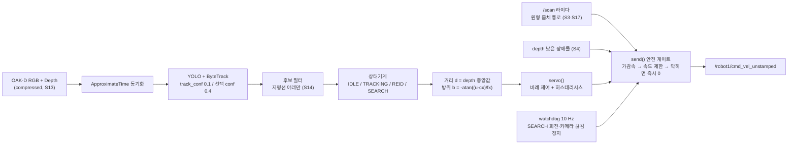
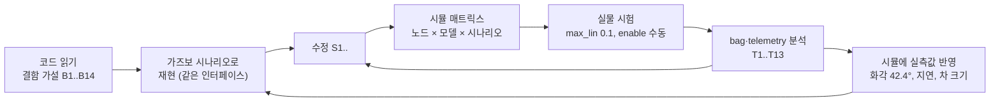

# [기술검증] AMR 제어 기술 탐색 및 검증

관련 이슈·To-do: [기술검증]AMR 제어 기술 탐색 및 검증 (../%EC%9D%B4%EC%8A%88%20&%20To-do%20%ED%8A%B8%EB%9E%98%EC%BB%A4/%5B%EA%B8%B0%EC%88%A0%EA%B2%80%EC%A6%9D%5DAMR%20%EC%A0%9C%EC%96%B4%20%EA%B8%B0%EC%88%A0%20%ED%83%90%EC%83%89%20%EB%B0%8F%20%EA%B2%80%EC%A6%9D%203ed0f4c1b9cc809e8cabec53f31cb31b.md)
기록일: 2026년 10월 5일
담당자: sj b
마지막 수정: 2026년 10월 6일 오전 12:25
분류: 실험
분야: Robot
생성일: 2026년 10월 5일 오후 9:35
작성 상태: 정리 완료

<aside>
📌

**한 줄 요약**: 출발 코드 `follow_object_node_v3.py`에서 시작했다. 가즈보 시뮬과 실물 시험으로 결함을 찾아 고쳐, 터틀봇4가 검은 RC카를 YOLO로 찾고 약 1 m(실물 0.85 m) 거리로 따라가게 했다. 결과물은 안전 수정본 `follow_object_node_v3_safe.py`(676줄)다.

저장소: `TGS10218/ROKEY_mP4_A1` 브랜치 **`feature/real-trial-261003`** 폴더 `tb4_follow_sim/`. 상세 원문은 `docs/FOLLOW_NODE_EXPLAINED.md`, `REPORT.md`, `docs/REAL_TRIAL_261003.md`, `docs/PLAN1_PLAN2.md`, `docs/THEORY_PAPERS.md`.

</aside>

<aside>
⚠️

**기억할 것**

- 출발 코드를 그대로 실물에 올리면 안 된다. 로봇이 안 움직이고(B1·B2), 고쳐도 라이다가 옆을 본다(B3).
- 실물은 `max_lin 0.1 m/s`로 시작한다. 재획득 직후 거리 튐(T4)이 남아 있어 속도를 올리기 전에 확인이 필요하다.
- 로봇 `camera_info`의 fx 564.65는 실제와 맞지 않는다. **fx 909(화각 42.4°)로 덮어쓴다**(S18).
- 비례 제어라 움직이는 차를 `속도/0.6`만큼 뒤처져 따라간다. 0.3 m/s보다 빠른 차는 따라잡지 못한다(B13, 설계 한계).
- 시뮬 숫자는 방향만 알려 준다. 정지거리·장애물 임계값·모델 선택은 실물 bag으로 다시 정한다.
</aside>

| 파일 | 역할 | 상태 |
| --- | --- | --- |
| `scripts/follow_object_node_v3.py` | 출발 코드 (252줄) | 비교용으로 보존 |
| `scripts/follow_object_node_v3_safe.py` | **1안 = 현재 기준 코드.** 안전 수정 S1~S18 (676줄) | 10/3 실물 시도 3회 (S17·S18은 bag 재계산·회전 루프 시뮬까지만 확인) |
| `scripts/follow_object_node_v3_motion.py` | 2안: 1안 + 모션 개선 M1~M3 (717줄) | 실물 미검증 |
| `aruco_follow_node.py` | 대안: RC카에 붙인 ArUco 마커로 추종. 제어·안전 규칙은 1안과 같음 (250줄) | 시뮬만 검증, **실물 시험 안 함** |
| `scripts/tb4_real_iface_adapter.py` | 시뮬 ↔ 실물 인터페이스 맞춤 (토픽·형식·실측 지연·depth 오차) | 시뮬용 |
| `real/run_real.sh`, `run_plan1.sh`, `run_plan2.sh`, `preflight.sh`, `record_real.sh` | 실물 실행·점검·기록 | 실물용 |

## 0. 탐색한 제어 방식과 선택 이유

| 방식 | 무엇을 해결하나 | 판단 | 근거 |
| --- | --- | --- | --- |
| **비례 시각 서보 (방위·거리 분리)** | 카메라로 찾은 차를 일정 거리로 따라감 | **채택** (기준 코드) | 출발 코드 구조 유지. 시뮬·실물에서 동작 확인. 단점은 이동 타깃 뒤처짐(B13) |
| 연속 데드밴드·히스테리시스 (S16·S17) | 멈춤-출발 계단, 지연 때문에 생기는 좌우 진동 | **채택** | 실물 bag 분석 + 회전 루프 시뮬 (실물 주행 확인은 남음) |
| 차 속도 피드포워드 (S16·M3) | 뒤처짐 감소 | 코드에 넣되 **기본 끔** | 거리 잡음으로 출렁일 위험. 실물 비교 전 |
| 지연 보상 Smith 예측기 (M1)·가장자리 감속 (M2) | 지연 0.6 s 진동, 코너에서 차가 화면 밖으로 빠짐 | **2안으로 보류** | 시뮬에서 우열을 못 가름 (환경 변동이 더 큼). 거리 보상은 해로움 |
| ArUco 마커 추종 | YOLO 놓침·id 끊김, depth 없이 거리 추정 | **대안 (실물 시험 안 함)** | 실측 반영 전 시뮬에서만 추종률이 더 높았음. 마커가 차를 가려 YOLO와 함께 쓰기 어려움 |
| Nav2로 마지막 관측 위치까지 이동 | 벽에 가려진 차 찾기 | **범위 밖** | 경로 계획·회피 스택이라 인식 능력은 더하지 않음. 지도가 필요함 |
| 라이다 보조 추적 | 뒤쪽·옆쪽 차 찾기 | **보류 (제안만)** | 차가 라이다 평면보다 낮아 실물에서 15~65 %만 보임 |

### 검증 상태 요약 (근거 등급: S = 시뮬, R = 실물)

| 항목 | 등급 | 결과 | 판정 |
| --- | --- | --- | --- |
| 1안으로 실물 추종 (0.1 m/s) | R | 3회 시도, 범퍼 충돌 0, 차 정지 시 0.864 m 유지 | 저속에서 동작 확인 |
| 장애물 안전 (기둥·낮은 박스·폴·depth 상실) | S | v3_safe 충돌 0 | 실물 정지거리 미측정 |
| 0.3 m/s 추종 (실측 조건 시뮬) | S | RC카와 충돌 3회 (1회 실행) | **속도 상향 금지**, 원인 분리 필요 |
| S17·S18 (진동·코너) | R(bag 재계산)·S | 지연 0.6 s에서 회전 방향 반전 0회 (시뮬) | 실물 주행 확인 필요 |
| 2안 (M1~M3) | S | 우열 불분명 | 미검증 |
| ArUco 추종 | S | 시뮬 추종률 100 / 100 / 94.1 % (실측 반영 전) | **실물 시험 안 함** |

## 1. 코드 작성 내용

### 1-1. 구조



### 1-2. 입력·출력

| 구분 | 토픽 | 용도 |
| --- | --- | --- |
| 입력 | `/robot1/oakd/rgb/image_raw/compressed`, `/robot1/oakd/stereo/image_raw/compressedDepth` | RGB·depth를 시각 동기화해 매 프레임 `cb()` 호출 |
| 입력 | `/robot1/oakd/rgb/camera_info` | cx, cy (fx는 909로 덮어씀) |
| 입력 | `/robot1/scan`, TF, `/robot1/odom` | 통로 막힘 판정, 마지막 관측 위치(LOP), 로봇 실제 속도 |
| 출력 | `/robot1/cmd_vel_unstamped` (Twist) | 속도 명령. 로봇의 `cmd_vel`은 TwistStamped라 직접 못 씀 |
| 출력 | `/robot1/follow/image`, `/robot1/follow/state` (JSON) | 디버그 화면, 상태·거리·명령·정지 사유 기록 |
| 파라미터 | `enable` (기본 false) | true일 때만 명령을 내보냄. 시작은 항상 false |

### 1-3. 매 프레임 처리 순서

1. **검출·추적**: YOLO가 박스를 내고 ByteTrack이 같은 차에 같은 id를 붙인다. 추적기에는 신뢰도 0.1 이상을 넘기고, 새 타깃 선택에는 0.4를 쓴다(S10).
2. **후보 거르기**: 클래스 `car`만 남긴다. 박스 아래 끝이 지평선(cy) 위에 있으면 버린다. 벽 TV를 차로 본 오검출을 이렇게 막는다(S14).
3. **상태기계**
    - **IDLE**: 정지한다. 후보가 생기면 가장 큰 박스를 잠근다.
    - **TRACKING**: 잠근 id로 거리·방위를 계산해 제어한다.
    - **REID**: id가 끊기면 위치 0.5 + 색 히스토그램 0.5 점수로 다시 찾는다. 0.6 이상이면 다시 잠근다. 15프레임 동안 못 찾으면 SEARCH로 간다.
    - **SEARCH**: 마지막 관측 위치 쪽으로 돈다 → 0.7 s 확인 → 같은 방향으로 계속 돈다. 10 s가 지나면 포기한다(S15).
4. **거리**: 박스 위 2/3 지점의 9×9 depth 패치 중앙값을 쓴다. 최근 값이 3개 이상일 때만 쓴다(S14). 0.6 s보다 오래된 값은 버린다(S2). 박스가 화면 아래에 닿으면 거리를 믿지 않는다(S14).
5. **방위**: 핀홀 모델로 `b = −atan((u − cx) / fx)`, fx는 909다.
6. **제어 → 안전 게이트 → 발행**: `servo()` → `send()` (4장 코드).

## 2. 적용한 이론

| 이론 | 근거 문헌 | 코드에서 쓴 곳 | 원 문헌과 다른 점 |
| --- | --- | --- | --- |
| 시각 서보: 오차를 지수적으로 0으로 (`v = −λe`) | Chaumette & Hutchinson 2006·2007, Malis 외 1999 (2.5D) | `servo()`: 회전 `ang = −1.2·e_b`, 전진 `lin = 0.6·(d − target)` | 상호작용 행렬 없이 방위·거리 두 축을 따로 제어하는 단순 비례 제어 (차동구동에 맞춘 근사) |
| 다중 물체 추적 (저점수 박스 2차 연결) | ByteTrack, ECCV 2022 / Ultralytics 문서 | `model.track(conf=0.1)`, 선택은 0.4 (S10) | 출발 코드는 0.4를 넘겨 2차 연결이 꺼져 있었음. 고친 뒤에도 시뮬에서 id 끊김 횟수는 비슷했음 |
| 색 히스토그램 재식별, 마지막 관측 위치(LOP) 탐색 | Algabri & Choi, Sensors 2020 | REID 점수, `update_lop()`·SEARCH | 논문은 LOP까지 이동 + PI 제어. 우리는 제자리 회전 + P 제어. 점수식(위치 0.5 + 색 0.5)은 자체 설계 |
| 지면 평면·지평선 제약 | Hoiem 외, IJCV 2008 | `ground_only` (S14) | 거리 추정에는 쓰지 않고 지평선 위/아래 판정에만 씀 (박스 바닥으로 잰 거리가 depth와 10~24 % 차이) |
| 강건 통계 (중앙값 붕괴점 50 %) | Hampel 1974, Pearson 2002 | 거리 중앙값, `min_fresh 3` (S14) | 3개는 "이상치 1개를 이기는 최소 창"이라는 공학적 선택 |
| 스테레오 depth 오차 ∝ 거리², 최소거리 | Gallup 외 CVPR 2008, Luxonis 문서 | `cut_bottom_px` (S14) | 실물에서 걸린 것은 최소거리보다 "차 아래가 화면 밖" 가시성 문제 |
| 속도에 비례하는 정지거리 | Dynamic Window (Fox 외 1997) | `stop_base 0.12 + stop_gain 0.6·v` (S3) | 계수는 실물 정지거리로 다시 보정 필요 |
| 지연 보상 (아는 지연 동안 자기 움직임 반영) | Smith 예측기 1957 | 2안 M1 `lat_comp` | 방위만 보상. 거리까지 보상하면 오히려 뒤처짐 (시뮬) |
| 등속 모델 피드포워드 | 칼만 예측의 가장 단순한 형태 | `estimate_v_car()`, `ff_gain` (S16, 기본 0) | 거리 잡음이 크면 출렁일 수 있어 기본은 끔 |

**비례 제어의 결과 (식으로 나오는 것)**

- 차가 v로 멀어지면 정상상태 거리는 `target + v / 0.6`이다(0.15 m/s → 약 1.25 m).
- 최대 0.3 m/s보다 빠른 차는 따라잡지 못한다.
- 가감속 제한 때문에 0.3 m/s에서 서려면 0.75 s 이상, 약 0.11 m가 더 걸린다. 그래서 안전 정지는 가감속 제한 없이 바로 0으로 한다(S5).

## 3. 테스트 및 수정 방식

### 3-1. 반복 순서



### 3-2. 원칙

- **결함은 먼저 재현한 뒤 고친다.** 코드에서 찾은 결함마다 그것이 드러나는 시뮬 시나리오를 만들었다.
    - 예: 기둥, 낮은 박스, 폴, depth 상실.
    - 출발 코드(v3)와 수정본(v3_safe)을 같은 시나리오로 나란히 돌리고 영상으로 남겼다.
- **실물은 안전 쪽에서 시작한다.**
    - 로봇의 라즈베리파이에는 아무것도 설치하거나 바꾸지 않는다.
    - `enable=false`로 시작한다. 디버그 화면에서 TRACKING을 확인한 뒤 수동으로 켠다.
    - `max_lin 0.1 m/s`로 달리고, E-Stop을 대기시킨다.
- **실물 기록으로 원인을 숫자로 찾는다.** `follow/state` 기록과 bag으로 상태별 시간, 놓침 횟수, 전방 여유, 지연을 계산했다.
    - 예: 방위와 로봇 회전량의 회귀 기울기 −1.71(기대값 −1.06) → fx 오류를 찾음.
- **수정마다 번호를 붙인다(S1~S18).** 코드 주석에도 같은 번호를 달아 되돌리거나 끌 수 있게 했다. 2안은 별도 파일로 두고 `ros2 param set`으로 하나씩 켜고 끈다.
- **시뮬도 실물에 맞춘다.** 실물에서 잰 화각·지연·최소 회전·depth 오차·차 크기를 시뮬에 넣었다. `ideal:=true`로 원래 조건으로 돌아갈 수 있다.

### 3-3. 시뮬 시나리오

| 시나리오 | 확인하는 것 |
| --- | --- |
| square / random / stopgo / lost / camdrop | 움직이는 차 추종 유지율, 놓침, 카메라 끊김 |
| pillar / lowbox / pole | 경로 옆 기둥, 라이다보다 낮은 박스, 정면 폴과의 충돌 |
| depthstop / depthloss | 접근 중 depth를 잃을 때 옛 거리로 계속 가는지 |
| approach | 차가 로봇 쪽으로 올 때 후진하다 뒤 기둥에 부딪히는지 |
| shutdown | 주행 중 Ctrl+C 때 정지 명령을 보내는지 |

지표: 차가 화면 안에 있는 비율, TRACKING 비율, 놓침(→SEARCH) 횟수, 거리 오차, 최소 전방 여유, 충돌 횟수.

## 4. 완성 코드 (현재 기준판: 1안 `follow_object_node_v3_safe.py`)

<aside>
🔎

"완성"은 지금 실물에 올리는 기준판이라는 뜻이다. S1~S16은 실물 시도에서 돌아갔다. S17·S18은 10/3 마지막 시도 뒤에 넣었고, bag 재계산과 회전 루프 시뮬으로만 확인했다. 실물 주행 확인이 남아 있다.

</aside>

### 4-1. 실행

```bash
# 실물 (노트북, 로봇에는 아무것도 설치하지 않음)
bash real/preflight.sh                      # 토픽·camera_info·압축 영상 주기·도크 상태 점검
bash real/run_plan1.sh 12                   # yolo12n, max_lin 0.1, fx 909, target_dist 0.85, enable=false
ros2 run rqt_image_view rqt_image_view /robot1/follow/image   # [TRACKING] 확인
ros2 param set /follow_object_node enable true                # 주행 (false 로 정지)
bash real/record_real.sh <시도ID> "메모"     # 기록 → summary.json

# 시뮬
bash run_sim.sh gui:=false
NODE=v3safe bash experiment.sh square 12 -p max_lin:=0.1
```

### 4-2. 핵심 코드 1: 모든 명령이 지나는 `send()`

```python
def send(self, lin, ang):
    """1) 가감속 제한 → 2) 최대 속도로 자르기 → 3) 안전 게이트(막히면 즉시 0, S5) → 4) 퍼블리시."""
    now = time.time(); dt = max(1e-3, now - self.t_prev); self.t_prev = now
    lin = float(np.clip(lin, self.cmd_prev.linear.x - self.P('acc_lin') * dt, self.cmd_prev.linear.x + self.P('acc_lin') * dt))
    ang = float(np.clip(ang, self.cmd_prev.angular.z - self.P('acc_ang') * dt, self.cmd_prev.angular.z + self.P('acc_ang') * dt))
    lin = float(np.clip(lin, -self.P('max_rev'), self.P('max_lin')))          # 후진 0.1 까지만 (S6)
    ang = float(np.clip(ang, -self.P('max_ang'), self.P('max_ang')))
    why = []
    scan_ok = time.time() - self.scan_time < self.P('lidar_stale')
    if lin > 0:
        sd = self.P('stop_base') + self.P('stop_gain') * max(lin, self.cmd_prev.linear.x)   # 속도 비례 정지거리 (S3)
        if not scan_ok: why.append('scan-stale')                                 # 라이다를 모르면 전진 금지
        elif self.front_clear < sd: why.append(f'lidar{self.front_clear:.2f}')   # 원형 몸체 통로 막힘 (S17)
        if self.depth_obs < sd: why.append(f'depthobs{self.depth_obs:.2f}')      # 라이다 아래 낮은 장애물 (S4)
        if self.d_now is not None and self.d_now < self.P('min_dist'): why.append('min_dist')
        if why: lin = 0.0
    elif lin < 0:
        if not scan_ok or self.rear_clear < self.P('rear_stop'):                 # 후방 확인 (S6)
            why.append('rear'); lin = 0.0
    self.block_reason = ','.join(why)
    cmd = Twist(); cmd.linear.x = lin; cmd.angular.z = ang
    self.cmd_prev = cmd
    if self.P('enable'):
        self.pub_cmd.publish(cmd)
    return cmd
```

### 4-3. 핵심 코드 2: 제어 `servo()`

```python
def servo(self, bearing, d):
    dead = math.radians(self.P('bearing_dead_deg'))                       # 5°
    # S17 히스테리시스: 돌고 있으면 5° 안에서 멈춤, 멈춰 있으면 8° 를 넘어야 시작 (지연 0.6 s 진동 방지)
    if self.turning and abs(bearing) < dead:
        self.turning = False
    elif not self.turning and abs(bearing) > math.radians(self.P('bearing_start_deg')):
        self.turning = True
    e_b = bearing - math.copysign(dead, bearing) if self.turning else 0.0
    ang = -self.P('lambda_ang') * e_b                                      # 시각 서보 v = −λe
    lin = 0.0
    if d is not None:                                                      # 거리를 모르면 전·후진 0 (S2)
        e_d = d - self.P('target_dist')
        dd = self.P('dist_dead')
        if abs(e_d) > dd:
            if self.P('dist_dead_cont'):
                e_d -= math.copysign(dd, e_d)                              # S16 연속 데드밴드 (멈춤-출발 계단 제거)
            lin = self.P('lambda_lin') * e_d
        if self.P('ff_gain') > 0 and self.v_car is not None:
            lin += self.P('ff_gain') * self.v_car                          # S16 차 속도 피드포워드 (기본 끔)
    return self.send(lin, ang)
```

### 4-4. 주요 파라미터 (완성 코드 기본값, 실물 실행값)

| 묶음 | 파라미터 |
| --- | --- |
| 검출 | `target car`, `conf 0.4`, `track_conf 0.1`, `ground_only true`, `cut_bottom_px 4`, `min_fresh 3` |
| 제어 | `target_dist 1.0` (실물 1안 0.85), `lambda_ang 1.2`, `lambda_lin 0.6`, `bearing_dead_deg 5`, `bearing_start_deg 8`, `dist_dead 0.1`, `max_lin 0.3` (실물 0.1), `max_ang 1.0`, `acc_lin 0.4`, `acc_ang 1.5`, `fx_override` (실물 909) |
| 재식별·탐색 | `reid_frames 15`, `reid_accept 0.6`, `search_ang 0.8`, `search_max_s 10`, `search_wait_s 0.7` |
| 안전 | `min_dist 0.45`, `stop_base 0.12`, `stop_gain 0.6`, `corridor_margin 0.02`, `rear_stop 0.35`, `max_rev 0.1`, `cam_timeout 1.0`, `lidar_stale 1.0`, depth 장애물 `obs_min_h 0.03`·`obs_max_h 0.60`·`obs_min_pts 12` |
| 통신 | `image_transport compressed`, `sensor_qos best_effort`, `image_queue 2` |

## 5. 수정 내역

### 5-1. 출발 코드 결함 → 수정 (시뮬 단계, 10/2~10/3)

| 결함 | 내용 | 확인 방법 | 수정 |
| --- | --- | --- | --- |
| B1 | `cmd_vel`을 Twist로 발행하는데 로봇은 TwistStamped → 로봇이 안 움직임 | 로봇 토픽 목록 | S1 `cmd_vel_unstamped` |
| B2 | target 기본값 `rc_car`가 모델 클래스에 없음 | data.yaml | S1 `car` |
| B3 | 라이다 정면 오프셋 0°가 실제로는 왼쪽 (RPLIDAR +90° 장착) | 실물 tf_static, 시뮬 폴 반복 충돌 | S3 TF 기반 통로 |
| B4 | depth를 잃으면 옛 거리로 계속 전진·후진 | 시뮬 depthstop/depthloss | S2 이력 폐기, 0.6 s 넘은 값 버림 |
| B5 | 정지거리 부족, 정지에도 가감속 제한 | 시뮬 pole | S3 속도 비례 정지거리, S5 즉시 정지 |
| B6 | ±20° 섹터가 가까이서 로봇 폭을 못 덮음 | 시뮬 pillar | S3 로봇 폭 통로 |
| B7 | 후진 때 뒤를 안 봄 | 시뮬 approach | S6 후방 확인, 최대 0.1 m/s |
| B8 | Ctrl+C 때 정지 명령 실패 | 노드 로그 | S9 종료 전 정지 발행 |
| B9 | REID 관성 주행이 안전 검사를 건너뜀 | 코드 | S7 모든 명령이 `send()` 통과 |
| B10 | 카메라가 끊겨도 정지 안 함 | 시뮬 camdrop | S8 1.0 s 끊기면 정지 |
| B11 | ByteTrack 저점수 연결이 꺼짐 | ultralytics 코드 | S10 (시뮬에서 효과는 확인 안 됨) |
| B12 | 라이다 평면(0.193 m)보다 낮은 물체를 못 봄 | 시뮬 lowbox | S4 depth로 바닥 위 3~60 cm 물체 감지 |
| B13 | 이동 타깃 뒤처짐 (비례 제어) | 식 | 미수정 (설계 선택), S16 피드포워드는 기본 끔 |
| B14 | 센서 구독 QoS가 reliable·큐 10이라 영상 0개 또는 묵은 프레임 | 시뮬 QoS 시험 | S12 best-effort, 큐 2 |

S11: `follow/state`에 상태·거리·명령·정지 사유를 JSON으로 발행 (기록·분석용).

### 5-2. 실물 시험에서 찾은 문제 → 수정 (10/3)

| 번호 | 증상 (실측) | 원인 | 수정 |
| --- | --- | --- | --- |
| T1 | 첫 프레임에서 노드 종료 가능 | ByteTrack 의존 패키지 `lap` 없음 | 노트북 venv에 `lap` 설치 |
| T2 | 노드가 영상을 0프레임 처리 | Wi-Fi로 raw 영상 구독 → RGB가 15~20 s 늦어 동기화 실패 | **S13** 압축 영상 구독 → 10.2 Hz |
| T4 | 재획득 순간 거리 7.03 m 1회 | depth 패치가 배경을 읽음 | **S14** `min_fresh 3` (bag 재생: 7 m 튐 3 → 0) |
| 근거리 | 0.45 m에서 거리 +23 cm, 클래스 dummy | 차 아래가 화면 밖 → 지붕을 읽음 | **S14** `cut_bottom_px` (잘리면 전·후진 0) |
| 오검출 | 벽 TV를 car로 → 거리 7 m | 지평선 위 물체 | **S14** `ground_only` |
| T13 | 뒤로 간 차를 못 찾고 포기 (탐색 중 최대 172°) | 0.5 rad/s × 6 s, LOP를 보면 대기 | **S15** 0.8 rad/s, 10 s, turn → wait → sweep (오프라인 시험 411° 회전) |
| 시도 T085 | 멈춤-출발 0.23회/s, 후진 20 % | 거리 데드밴드 경계에서 0 → 0.06 m/s 계단 | **S16** 연속 데드밴드 (+ 피드포워드 옵션) |
| 코너 | 벽 옆을 지날 때 전진이 막혀 차가 옆으로 빠짐 | 몸체를 직선 앞면으로 계산 | **S17** 원형 몸체 통로 (벽 옆 막힘 96 % → 60 %) |
| 진동 | 차가 정지해 있는데 방위 −15° ↔ +17° 진동, 회전 방향 반전 36회 | fx 564.65 오류(방위 1.6배 과장) + 지연 0.6 s + Create3 최소 회전 0.26 rad/s | **S18** `fx_override 909`, **S17** 히스테리시스 5°/8° (회전 루프 시뮬: 지연 0.6 s에서 반전 0회) |

남은 문제

- **T3**: 동기화 실패 경고가 없다.
- **T5**: id 깜빡임이 103회 중 54회 0.5 s 안에 끝났다.
- **T6**: 제자리 회전 중 전방 여유가 −0.05 m까지 줄었다.
- **T12**: 기록 스크립트를 부모·자식 모두에 SIGINT로 끄면 `summary.json`이 만들어지지 않는다. 터미널에서 Ctrl+C하거나 부모에게만 INT를 보내는 것으로 피한다.
- **처리율 저하**: 시도 T085에서 상태 처리율이 약 4.4 Hz로 떨어졌다(첫 시도 10 Hz). 원인은 확인하지 못했고, 기록 부하를 의심하고 있다.

### 5-3. 모션 개선 2안 (10/4, 별도 파일)

- **M1 지연 보상**: 영상 시각부터 지금까지 로봇이 돈 각도만큼 방위를 보정한다.
- **M2 화면 가장자리에서 회전 먼저**: 전진 속도에 `(1 − |방위|/21°)`를 곱한다.
- **M3 차 속도 피드포워드**: `ff_gain 0.5`, 2b에서만 켠다.
- 시뮬 비교로는 1안·2안의 우열을 가르지 못했다.
    - random·lost에서는 2안이 나은 회차가 있었고, square에서는 나빠진 회차가 있었다.
    - 비교하던 동안 남은 시뮬 프로세스가 쌓여 제어 주기가 떨어져 있었다.
    - → **기본은 1안**으로 한다. 2안은 실물에서 켜고 끄며 판단한다.

### 5-4. 시뮬을 실측에 맞춤 (10/5)

- RC카 0.25 × 0.08 × 0.085 m, 화각 42.4°, 영상 지연 0.4 s, 명령 지연 0.2 s, 최소 회전 0.26 rad/s, depth 오차식을 넣었다.
- 같은 1안 노드를 최대 0.3 m/s로 돌리자 **RC카와 충돌 3회**가 나왔다.
    - 이상 조건에서는 0회였다(10/4).
    - 각각 1회씩 돌린 결과라 원인은 아직 분리하지 못했다.
    - 두 실행 사이에 화각·지연·차 크기가 한꺼번에 바뀌었다. 점수 계산 버그(다른 월드를 기준으로 계산)도 함께 고쳤다. 따라서 변수 하나만 바꾼 비교가 아니다.
    - → 실물 속도를 올리기 전에 이 조건으로 시뮬을 다시 확인한다.


실측값 반영 후 로봇 카메라 (화각 42.4°, 차 1.0 m)

### 5-5. 대안: ArUco 마커 추종 노드 (10/4~10/5)

<aside>
⚠️

**실물 시험을 아직 하지 않았다.** 아래 숫자는 모두 가즈보 시뮬 결과다. 마커 인쇄본과 실물 실행 명령만 준비해 두었다.

</aside>

- `aruco_follow_node.py`: YOLO·depth 대신 RC카 뒷면·양옆의 ArUco(DICT_4X4_50 ID 1)를 `solvePnP`로 읽어 거리·방위를 얻는다.
- 제어·안전 규칙(비례 제어, S17 히스테리시스, 원형 통로 정지, 후진 제한, 카메라 끊김 정지)은 1안과 같다.
- 마커를 0.5 s 안에 다시 찾으면 직전 명령을 유지한다. 더 오래 못 찾으면 마지막 방향으로 탐색한다.
- 깃발·45° 경사판도 시험했지만 추종률이 낮았다. 그래서 차 뒷면 + 양옆에 붙이는 방식을 택했다.

| 시뮬 추종률 (square / random / lost) | ArUco 뒷면+양옆 8 cm | YOLO y12 (1안) |
| --- | --- | --- |
| 10/5 00:16 같은 세션 재측정 | **100 / 100 / 94.1 %** | 95.5 / 93.1 / 76.0 % |
- 위 값은 **실측값을 반영하기 전** 시뮬(화각 64°, 큰 차)에서 잰 것이다.
- 실측 크기 차에서는 8 cm 판이 들어가지 않아, 최종 월드 v1.0-aruco는 6 cm로 만들었다.
- 6 cm 판도 차 면을 대부분 가려 YOLO 검출이 0 %가 됐다. YOLO와 같이 쓰려면 배치를 다시 시험해야 한다(가즈보 월드 규격서 10장).


ArUco 뒷면 마커, 로봇 카메라 1.2 m (실측 반영 전 시뮬)

## 6. 결과

### 6-1. 시뮬 (10/3, 실측 반영 전): 움직이는 차 추종 유지율

| 시나리오 | v3 + 11n | v3 + 12n | v3_safe + 11n | v3_safe + 12n |
| --- | --- | --- | --- | --- |
| square | 81.4 % | 98.9 % | 80.8 % | 97.6 % |
| random | 56.7 % | 68.5 % | 49.8 % | 92.7 % |
| stopgo | 57.7 % | 48.2 % | 63.4 % | 61.7 % |
| lost | 79.1 % | 80.7 % | 90.3 % | 77.4 % |
| camdrop | 68.2 % | 90.4 % | 54.9 % | 97.7 % |
| **평균 (놓침)** | 73.9 % (8) | 81.1 % (5) | 65.7 % (8) | **80.6 % (4)** |

안전 시나리오

- 기둥(pillar), 낮은 박스(lowbox), 정면 폴(pole), depth 상실(depthstop), 무작위 주행(random): v3_safe는 두 모델 모두 **충돌이 없었다**.
- 출발 코드는 11n 조합에서 다섯 모두 충돌했다. 12n 조합은 pillar·lowbox에서 충돌했다. pole·depthstop은 12n이 정지한 차를 못 잡아 출발하지 않았을 뿐이다. 안전해서가 아니다.
- 차가 로봇 쪽으로 돌진하는 approach: v3_safe도 차가 밀어서 1~2회 부딪혔다.
- 같은 코드도 회차마다 평균이 ±10 %p 흔들렸다. 그래서 두 회차에 공통으로 나온 결론만 채택했다.

### 6-2. 실물 (10/3, robot1)

| 시도 | 설정 | 결과 |
| --- | --- | --- |
| 261003-1500 (695 s) | v3_safe + yolo12n, max_lin 0.1, S13 적용 | TRACKING 394.9 s, 놓침 39회, **범퍼 충돌 0**, 최대 속도 명령 0.10 m/s, 카메라·라이다 끊김 0 |
| 261003-T085 (1083 s) | S13·S14, target_dist 0.85 | 차 정지 3분 동안 0.864 m 유지 (흔들림 σ 3 mm), TRACKING 100 % |
| 261003-A | S13~S16 | 코너 문제·좌우 진동 발견 → S17·S18의 근거 |

## 7. 한계와 남은 일

- 비례 제어라 이동 타깃을 뒤처져 따라간다. 노드 상한 0.3 m/s보다 빠른 차는 따라잡지 못한다(B13). **실물은 0.1 m/s로 제한했으므로 0.1 m/s보다 빠른 차는 따라갈 수 없다.**
- 실물 근거는 10/3 하루, 로봇 1대, 시도 3회다. 조명·장소·차가 바뀌면 다시 재야 한다.
- 벽에 가려진 차는 제자리 탐색으로 못 찾는다. 마지막 관측 위치까지 장애물을 피해 이동해야 한다(지도 + Nav2 등, 이번 범위 밖).
- 재획득 직후 거리 튐(T4)은 S14로 막았지만, `max_lin`을 올리기 전에 실물에서 다시 확인해야 한다.
- 정지거리 계수(`stop_base/stop_gain`)와 depth 장애물 임계값은 시뮬 값이다. 실물 정지거리로 보정해야 한다.
- 시뮬은 시나리오마다 1회씩만 돌렸다. 회차 변동이 ±10 %p다.
- 2안과 ArUco 노드는 실물 시험을 하지 않았다. 두 노드를 1안보다 낫다고 말할 근거는 아직 없다.

## 8. 참고문헌

1. F. Chaumette, S. Hutchinson, "Visual servo control, Part I / II," *IEEE RAM* 13(4), 2006 / 14(1), 2007.
2. E. Malis, F. Chaumette, S. Boudet, "2 1/2 D visual servoing," *IEEE T-RA* 15(2), 1999.
3. Y. Zhang 외, "ByteTrack," *ECCV 2022*. [arXiv:2110.06864](https://arxiv.org/abs/2110.06864) · [Ultralytics tracking 문서](https://docs.ultralytics.com/modes/track/)
4. R. Algabri, M.-T. Choi, "Deep-Learning-Based Indoor Human Following of Mobile Robot Using Color Feature," *Sensors* 20(9):2699, 2020. [PMC7273221](https://pmc.ncbi.nlm.nih.gov/articles/PMC7273221/)
5. D. Hoiem, A. A. Efros, M. Hebert, "Putting Objects in Perspective," *IJCV* 80(1), 2008.
6. F. R. Hampel, *JASA* 69(346), 1974 · R. K. Pearson, *IEEE TCST* 10(1), 2002.
7. D. Gallup 외, "Variable Baseline/Resolution Stereo," *CVPR 2008* · [Luxonis, Configuring Stereo Depth](https://docs.luxonis.com/hardware/platform/depth/configuring-stereo-depth)
8. D. Fox, W. Burgard, S. Thrun, "The Dynamic Window Approach to Collision Avoidance," *IEEE RAM* 4(1), 1997.
9. O. J. M. Smith, "Closer control of loops with dead time," *Chemical Engineering Progress*, 1957.
10. H. Ye 외, *ICRA 2023* (arXiv:2302.02121) · *RA-L* 2024 (arXiv:2309.11727): 추종 로봇 재식별 (비교 참고).
- 관련 문서: [‣](https://app.notion.com/p/3f06750476d0811bb085c3e45ae65541?pvs=21)