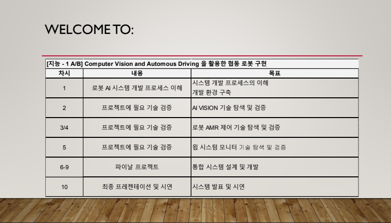
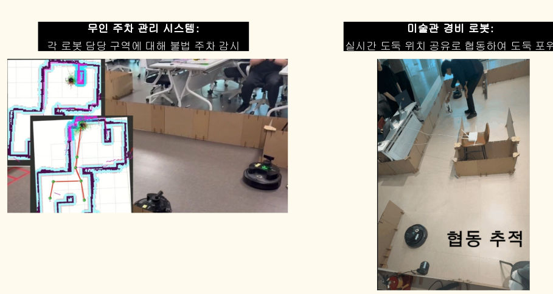
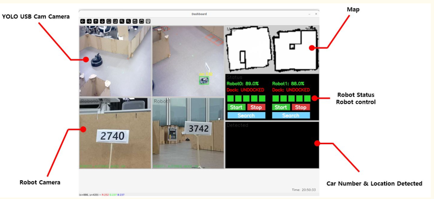

# 🐢 SLAM기반 자율주행 로봇 시스템

> 원본: https://teamsparkx.notion.site/30d563918e5981abbf74cf24d6853340  
> 최종 수정: 2026-04-03 14:18 / 변환: 2026-10-08 14:07

**1. 프로젝트 개요**

- **목표**

  - 컴퓨터 비전과 자율 주행을 활용한 멀티 로봇 시스템 개발

- **배경**

  - 최근 물류 자동화 및 스마트 팩토리의 확산으로, 다수의 로봇이 협력하는 멀티 로봇 시스템이 핵심 기술로 부상

- **기간:** 총 10일 (2주)

- **참여 인원:** 5~6인 팀 프로젝트

  - **1~4차시:** 4인 1조 개별 프로젝트

  - **5~10차시:** 두 개 팀을 통합하여 대규모 프로젝트 완성

**2. 주요 과제 및 역할**

- **주요 과제:** 

  - **비전 인지:** AI Vision 객체 인식 및 Point Cloud 3D 공간 분석

  - **자율 주행:** SLAM 지도 생성, 최적 경로 계획 및 Navigation 튜닝

  - **로봇 협업:** 다중 로봇 상태 공유 및 협력 미션 자동 수행

  - **관제 시스템:** 실시간 로봇 모니터링 및 원격 제어 GUI 구축

- **역할 분담 (팀 프로젝트의 경우):** 

  - 2D/3D 융합 비전 인지 시스템 개발

  - 자율주행(SLAM & Navigation) 시스템 구축 및 최적화

  - ROS2 기반 멀티 로봇 협업 시스템 구현

  - 통합 관제 시스템 및 GUI 개발

**3. 기술 스택 및 활용 도구**

- **사용 언어/프레임워크**

  - **OS:** Linux (Ubuntu 22.04)

  - **Framework:** ROS2 Humble, YOLO, AMCL, Costmap, Nav2, SLAM, PyQt

  - **Language:** Python (ROS2 프로그래밍)

- **활용 도구**

  - **H/W:** TurtleBot4

  - **S/W:** Gazebo 시뮬레이터

  - **Version Control:** Git, GitHub

  - **Communication:** Slack, Notion

**4. 개발 프로세스**

- **프로세스:** `기술 검증 및 탐색` → `프로젝트 설계` → `통합 및 테스트` → `발표 및 시연`

- **일정:** 

| **일차** | 주제 | 주요 내용 |  |
|---|---|---|---|
| **1일차** | 프로젝트 기획 및 환경 구축 | 시스템 개발 프로세스의 이해, 개발 환경 구축 |  |
| **2일차** | 기술 탐색 및 검증 | AI VISION 기술 탐색 및 검증 |  |
| **3일차** | 기술 탐색 및 검증 | AMR 제어 기술 탐색 및 검증 |  |
| **4일차** | 기술 탐색 및 검증 | AI VISION 기술과 AMR 통합 검증 |  |
| **5일차** | 프로젝트 설계 | 시스템 설계 및 환경 구성 |  |
| **6일차** | 개발 | 기능 구현 및 Unit Test |  |
| **7일차** | 개발 | 기능 구현 및 Unit Test |  |
| **8일차** | 개발 | 통합 시스템 구축 및 테스트 |  |
| **9일차** | 개발 | 통합 시스템 구축 및 테스트 |  |
| **10일차** | 프로젝트 발표 | 프로젝트 발표 및 시연, 산출물 정리, 기술 레퍼런스 |  |

**5. 평가 기준**

- **제출물**

  - SYSTEM DESIGN DOCUMENT

  - 발표 자료

  - 시연 영상

- **평가 항목**

  |  |  |
  |---|---|
  | **항목** | **평가기준** |
  | **기능 구현 완전성** | 요구 기능 구현 여부 |
  | **기능 구현 정확성** | 계획한 모든 기능의 정확한 동작 여부 |
  | **동작 및 운용 안정성** | 동작 중 오류 발생 빈도, 작업자 개입 없는 안정적 운용 가능성 |
  | **입출력 데이터 이해도** | 데이터 입출력(ROS2, 로봇 I/O, GUI 등) 편의성 및 요구사항 적합성 |
  | **기능 동작 지속성** | 장애/오류 발생 시 예외 처리 및 지속 가능성 |

**6. 참고 자료**

- **필수 참고 자료:** 프로젝트 수행에 반드시 필요한 문서, 튜토리얼, 강의 링크 등을 제공합니다.

  - 지능 1 강의 자료

    

- **추가 참고 자료:** 더 깊이 있는 학습을 원하는 학생들을 위한 추가 자료를 제공합니다.

**7. Q&A**

- **질의응답:** 학생들이 자주 묻는 질문과 답변을 미리 정리하여 제공합니다.

**8. 프로젝트 결과물**

