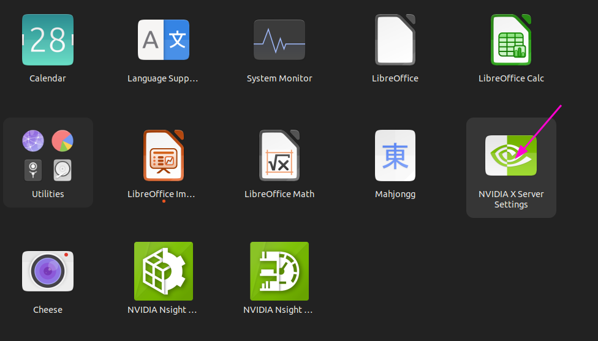
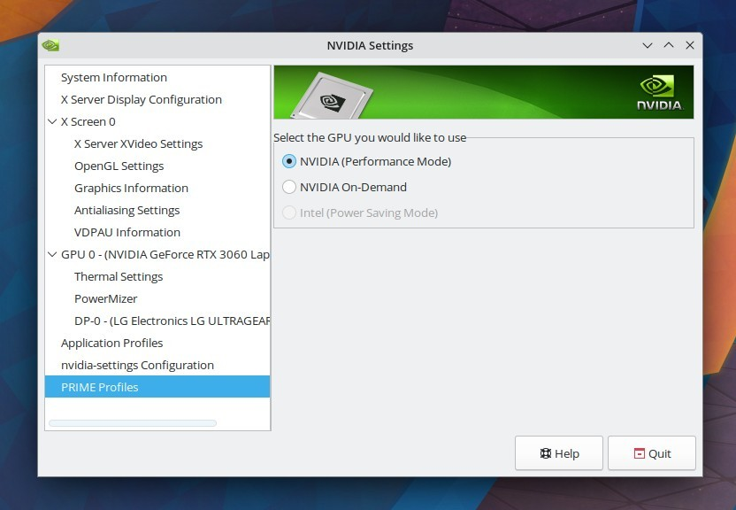
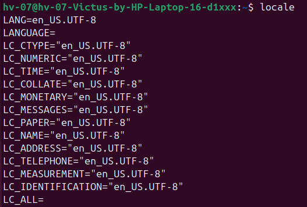
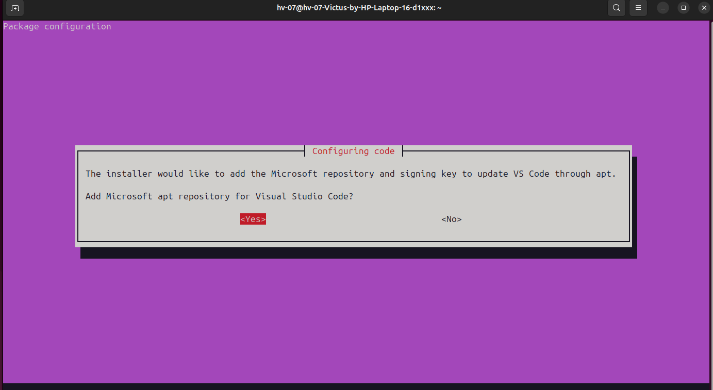
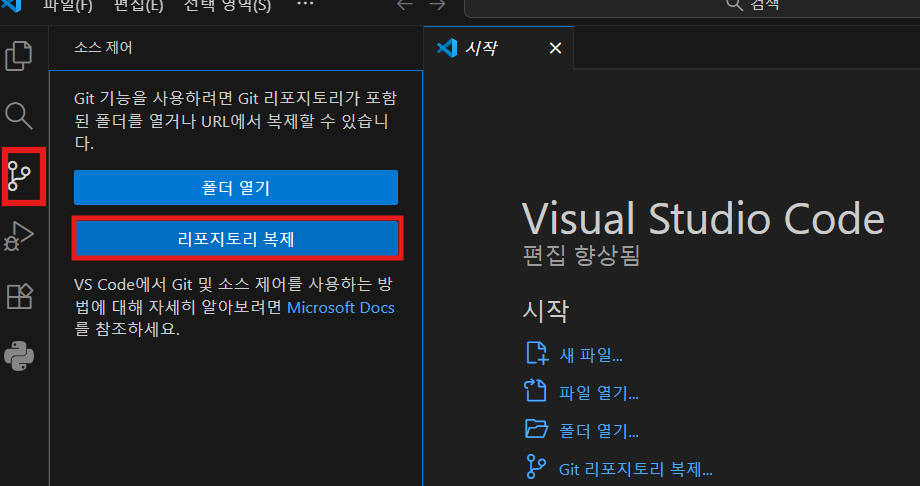
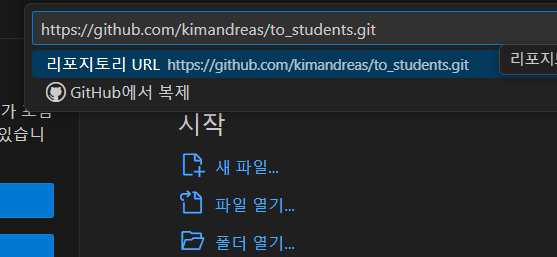
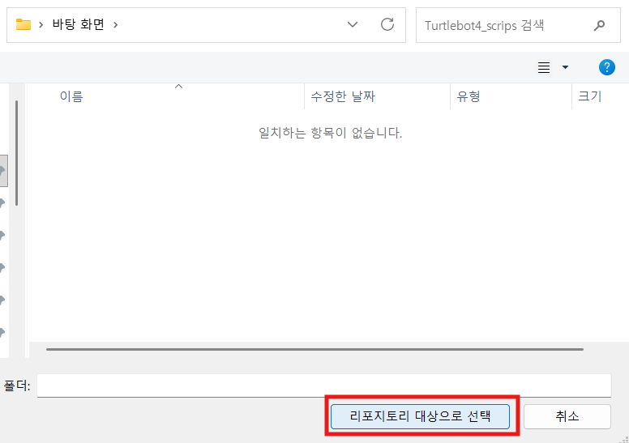
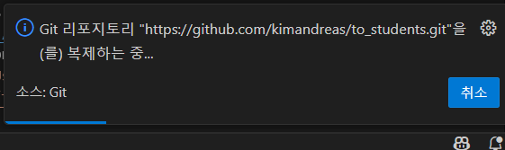
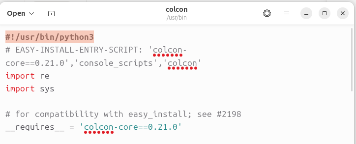
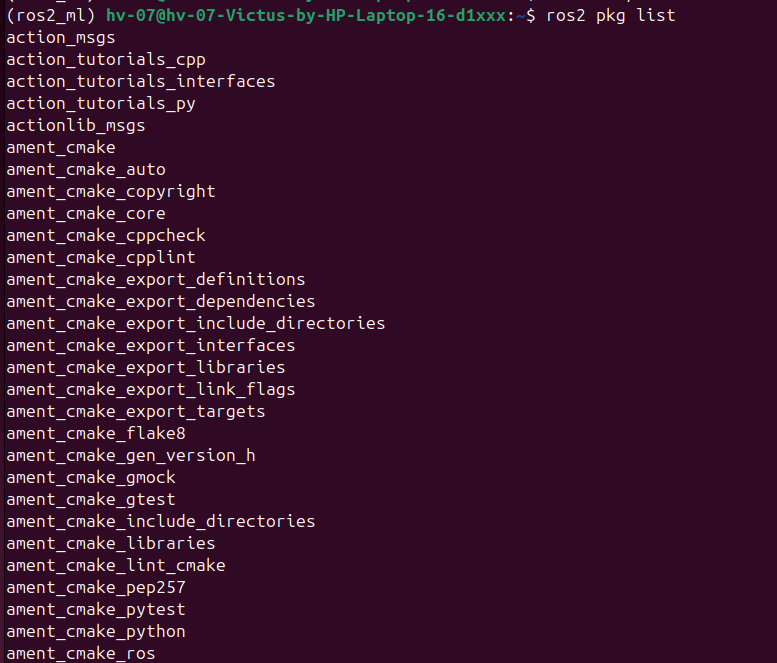

# PC 환경

> 원본: https://indecisive-freedom-6e8.notion.site/abe8e215779c82948de681fc7338371f  
> 최종 수정: 2026-10-02 09:12 / 변환: 2026-10-08 14:04

| 속성 | 값 |
|---|---|
| 환경 | ubuntu24.04,jazzy |
| 상태 | 완료 |
| 순서 | 1-1 |

#### 네트워크 SSID

| 조 | 와이파이 SSID  | 비밀번호 |
|---|---|---|
| 기본 | Rokey_Guest | `rokey1234` |
| 1, 2 | turtle**07** | `rokey12345` |
| 3, 4 | turtle**08** | `rokey12345` |
| 5, 6 | turtle**09** | `rokey12345` |

#### 노트북 비밀번호

rokey1234

#### 시스템 기본 정보 확인

```bash
# === OS & GPU Driver Setup ===
# with ubuntu 24.04 installed
# Check Ubuntu version

lsb_release -a
```

#### 패키지 리스트 업데이트

```bash
sudo apt update
```

```bash
sudo apt upgrade
```

#### Nvidia GPU 드라이버 설치

```bash
# Add NVIDIA graphics drivers PPA
sudo add-apt-repository ppa:graphics-drivers/ppa -y
sudo apt-get update
```

아래 둘 중 하나만 수행

<details><summary>Victus</summary>

  ```bash
  # For Victus
  sudo apt-get install -y nvidia-driver-570
  echo "Reboot required to apply NVIDIA driver changes."
  # nvidia driver 버전이 자동으로 맞춰지므로, 실제로는 570이 아닌 580 버전으로 설치된다. 
  ```

  ```bash
  sudo reboot #execute if gpu driver is newly installed by above
  ```

</details>

<details><summary>MSI</summary>

  ```bash
  # For MSI Pulse 16 machine
  sudo apt install nvidia-driver-575
  #   while installing you will see a prompt for the MOK setup, select ok; setup password and select ok
  # nvidia driver 버전이 자동으로 맞춰지므로, 실제로는 575가 아닌 580 버전으로 설치된다.
  ```

  ```bash
  sudo reboot
  # while booting, when prompted select enroll MOK, press continue, press yes, enter password to complete the reboot
  
  # optional
  #   once rebooted, reboot again
  #   while booting, press DEL/F2/F12 to enter BIOS, goto security and set Secure Boot to Disabled 
  #   after successful boot then reboot again
  ```

</details>

#### 시스템 확인

```bash
# View CPU details
cat /proc/cpuinfo
# Check NVIDIA GPU status (580 버전 확인)
nvidia-smi
```

#### GPU 설정 (NVIDIA GPU만 해당)

1. NVIDIA XServer Setting GUI 를 클릭

   

2. PRIME Profiles > NVIDIA(Performance Mode) 선택

   Gazebo 실행시 그래픽 엔진 돌리는데 필요함 

   

3. PC를 재부팅하여 Performance Mode가 적용되도록 한다. 

   ```python
   sudo reboot
   ```

### 💡 ROS2 Installation

> 📢 **반드시 단계를 확인하며 순서대로 설치하세요.**

#### **Ubuntu Locale 설정 확인 및 UTF-8 지원:**  

터미널을 열고 다음 명령어를 입력하여 Ubuntu Locale이 UTF-8을 지원하는지 확인하고 설정합니다.

```bash
#Check current locale
locale  # check for UTF-8

# Update package list
sudo apt update
```

```bash
sudo apt install locales
# Generate and configure locale
sudo locale-gen en_US en_US.UTF-8
# Generate and configure locale
sudo update-locale LC_ALL=en_US.UTF-8 LANG=en_US.UTF-8
export LANG=en_US.UTF-8

# Verify locale settings
locale  # verify settings
```


*locale 설정 후 출력*

#### **ROS 2 apt 저장소 설정:**  

시스템에 ROS 2 apt 저장소를 추가.

먼저 [Ubuntu Universe 저장소가](https://help.ubuntu.com/community/Repositories/Ubuntu) 활성화되어 있는지 확인하세요.

```bash
# === Development Tools Installation ===
# Install required software-properties-common package
sudo apt install software-properties-common
# Add 'universe' repository
sudo add-apt-repository universe
```

ROS2 apt 저장소를 등록하여, apt가 `ros-jazzy-*` 를 찾을 수 있게 합니다.

```bash
sudo apt update
```

```bash
sudo apt install curl -y
export ROS_APT_SOURCE_VERSION=$(curl -s https://api.github.com/repos/ros-infrastructure/ros-apt-source/releases/latest | grep -F "tag_name" | awk -F'"' '{print $4}')
curl -L -o /tmp/ros2-apt-source.deb "https://github.com/ros-infrastructure/ros-apt-source/releases/download/${ROS_APT_SOURCE_VERSION}/ros2-apt-source_${ROS_APT_SOURCE_VERSION}.$(. /etc/os-release && echo ${UBUNTU_CODENAME:-${VERSION_CODENAME}})_all.deb"
sudo apt install -y /tmp/ros2-apt-source.deb
```

#### **ROS2 패키지 설치:**  

```bash
sudo apt update
```

```bash
sudo apt upgrade
```

```python
# Install ROS2 Jazzy desktop version
sudo apt install -y ros-jazzy-desktop
```

```python
# Install ROS development tools
sudo apt install -y python3-rosdep python3-setuptools
```

```python
# install image compressed-transport plugins
sudo apt install -y ros-jazzy-image-transport-plugins
```

#### **other package:**  

필수 도구와 추가 패키지를 설치합니다.

```bash
# === Essential software installation ===
#Install Essential Software
# Install basic development tools
sudo apt install -y build-essential git wget cmake gpg neofetch vim htop

#For development:
# Install Python development tools
sudo apt install -y python3-pip python3-venv
```

```bash
#install vscode
# 1) 최신 .deb 다운로드
wget -O /tmp/vscode.deb "https://code.visualstudio.com/sha/download?build=stable&os=linux-deb-x64"
# 2) 설치 (키 + 저장소 등록까지 자동)
sudo apt install -y /tmp/vscode.deb
```


*다음과 같은 화면이 뜨면 Yes 탭에서 ENTER를 치면 된다.*

```bash
sudo apt install terminator
```

#### Git 설치:

```bash
sudo apt update
```

```bash
sudo apt upgrade
sudo apt install git
```

GitHub에서 사용할 사용자 이름과 이메일을 설정한다.

```bash
git config --global user.name <내 GitHub 사용자 이름>
git config --global user.email <내 이메일 주소>

git config --list # check 
```

 버전 확인

```bash
git --version
```

#### VSCode로 Git 강의록 다운받기:

[깃허브 공유 페이지](https://github.com/kimandreas/to_students/tree/main)에 접속해 아래의 방식으로 리포지토리 링크를 복사한다.


VSCode에서 복사한 링크를 붙여 넣는다.





리포지토리 대상 폴더를 지정한다. 가급적 폴더 내에 설치하는 걸 권장.



잠시 기다리면 강의록 파일 다운로드가 완료된다.



#### 가상환경 생성:

- 앞으로의 모든 작업은 **venv 안에서** 이뤄진다. venv를 먼저 만든 후 **빌드 도구인** **`colcon`을 venv 안에 설치**한다.

<details><summary>❗ **왜 colcon을 venv에 설치할까?**</summary>

  `colcon`이 파이썬 패키지를 빌드하면, **빌드에 사용된 python의 경로가 노드 실행파일 첫 줄(shebang)에 그대로 새겨진다.**

  
  *shebang*

  시스템 `colcon`은 항상 시스템 python으로 돌기 때문에, 시스템 colcon으로 빌드하면 노드가 시스템 python으로 실행되어 **venv에 설치한 torch를 찾지 못한다.**

  따라서, 시스템에 `colcon` 을 설치하지 않고, `venv` 내에만 `colcon` 을 설치해 두면, `colcon` 이 시스템 python이 아닌 venv python으로 빌드된다. 

</details>

```bash
# 1. venv 생성 (--system-site-packages 필수)
python3 -m venv --system-site-packages ~/venvs/rokey_venv
touch ~/venvs/rokey_venv/COLCON_IGNORE

# --system-site-packages : venv 안에서도 시스템에 깔린 ROS2 패키지(rclpy 등)를 그대로 import 하기 위함
# COLCON_IGNORE          : colcon이 이 폴더를 빌드 대상으로 스캔하지 않게 하는 안전장치
```

- venv를 활성화한 후에는 pip로 설치하는 **패키지들이 모두 venv 환경 내에 설치**된다. 

```bash
# 2. venv 활성화 후 colcon 설치
source ~/venvs/rokey_venv/bin/activate
pip install colcon-common-extensions
```

#### **환경설정*:***  

ROS setup 스크립트를 .bashrc에 추가합니다.

```bash
# ~/.bashrc 끝에 추가
# 순서 중요: venv 활성화 → ROS2(underlay)
echo 'source ~/venvs/rokey_venv/bin/activate' >> ~/.bashrc
echo 'source /opt/ros/jazzy/setup.bash' >> ~/.bashrc

# colcon 탭 자동완성 편의 기능
echo 'source ~/venvs/rokey_venv/share/colcon_argcomplete/hook/colcon-argcomplete.bash' >> ~/.bashrc

```

```bash
# Confirm ROS 2 CLI is installed
source ~/.bashrc
```

#### System Monitor 도구 설치:

```bash
# tools for system monitor
pip install flask
sudo apt install sqlite3
sudo apt install sqlitebrowser
```

---

### 💡 설치 확인

#### 설치된 패키지 확인:

```bash
### 1. 설치된 패키지 확인:
ros2 pkg list
```



#### ROS2 버전 확인

```bash
printenv | grep ROS          #ROS_DISTRO=jazzy
```

#### Python 버전 확인

```bash
python3 -V         #Python 3.12.XX
```

#### VScode 확인

```bash
code --version
```

#### venv / colcon 배치 확인

새 터미널을 열면 프롬프트 앞에 `(rokey_venv)`이 보여야 하고, 아래 경로가 맞아야 한다.

```bash
which python3   # → ~/venvs/rokey_venv/bin/python3   (venv)
which colcon    # → ~/venvs/rokey_venv/bin/colcon    (venv)
which rosdep    # → /usr/bin/rosdep               (시스템)
```

### 💡 Restart

```bash
#restart with clean reboot
sudo reboot
```

#### 시스템은 현재 날짜 시간일 것!

```bash
date
```

---

#### (선택) ROS 삭제

📄 [✏️ ROS 삭제](02_PC%20%ED%99%98%EA%B2%BD/ROS%20%EC%82%AD%EC%A0%9C.md)
