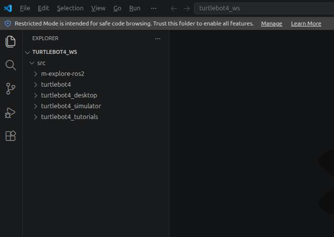
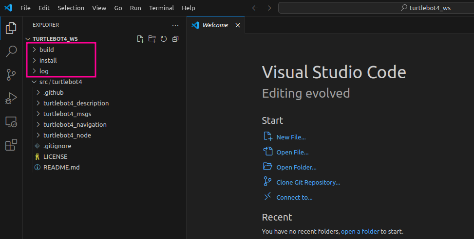
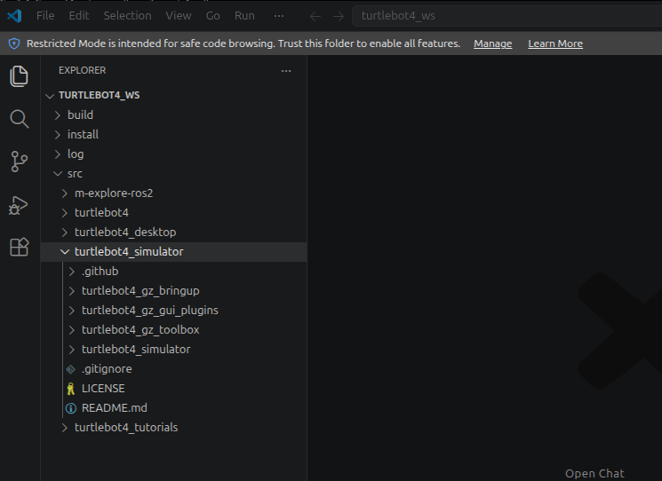

# Turtlebot4 SW Setup

> 원본: https://indecisive-freedom-6e8.notion.site/fd48e215779c8388beb801b26fc8c3e8  
> 최종 수정: 2026-10-02 09:12 / 변환: 2026-10-08 15:48

| 속성 | 값 |
|---|---|
| 환경 | ubuntu22.04,humble,ubuntu24.04,jazzy |
| 상태 | 완료 |
| 순서 | 1-2 |

### 📚 학습 목표

TurtleBot4의 SLAM 및 Navigation을 실행하기 위해 필요한 패키지를 설치하고, 시뮬레이션 환경을 구성한다.

### 🔑Turtlebot4


### 💡 로봇 환경 구성 및 설치

### 1. 패키지 업데이트 및 기본 패키지 설치 

> 💡 **모든 작업은** **`rokey_venv`** **안에서 실행**해야 합니다.
>
> 터미널에 **(rokey_venv)** 가 없을 경우, **반드시** 아래 커맨드를 실행해 venv 환경을 활성화하세요.
>
> ```python
> source ~/venvs/rokey_venv/bin/activate
> ```

#### TurtleBot4 소스코드 설치

- PC 터미널:

```bash
# === Create the TurtleBot4 workspace ===
mkdir -p ~/turtlebot4_ws/src
cd ~/turtlebot4_ws

# === Build the empty workspace once (optional at this stage, can be deferred) ===
colcon build

# Source the environment (can be skipped here since nothing is built yet)
source install/setup.bash
```

```bash
# === Clone TurtleBot4 and related packages ===
cd ~/turtlebot4_ws/src
git clone https://github.com/turtlebot/turtlebot4.git -b jazzy
git clone https://github.com/turtlebot/turtlebot4_simulator.git -b jazzy
git clone https://github.com/turtlebot/turtlebot4_desktop.git -b jazzy
git clone https://github.com/turtlebot/turtlebot4_tutorials.git -b jazzy
git clone https://github.com/robo-friends/m-explore-ros2.git
```



#### 의존성 관리도구(rosdep) 초기화

**초기 한 번만 실행**하면 됨

```bash
# === Install dependencies with rosdep ===
cd ~/turtlebot4_ws

# Initialize rosdep if not already initialized
if [ ! -f /etc/ros/rosdep/sources.list.d/20-default.list ]; then
    sudo rosdep init
fi

# Update rosdep and install dependencies
rosdep update
```

#### 종속성 패키지 설치

```bash
cd ~/turtlebot4_ws
rosdep install --from-path src -yi --rosdistro jazzy
```

- 옵션별 의미

  |  |  |
  |---|---|
  | 옵션 | 의미 |
  | `--from-path src` | `src` 폴더 내의 **모든 패키지의 의존성을 확인하고 설치** |
  | `-y` | 설치 시 **사용자 확인(`yes/no`)을 자동으로** **`yes`** **처리** |
  | `-i` | 이미 설치된 패키지는 **건너뛰고, 누락된 패키지만 설치** |
  | `--rosdistro jazzy` | **Jazzy 버전에 맞는 의존성을 설치** |

#### 패키지 보완

- 아래 **bash 파일을 다운로드** **후, 명령어 실행**

  > 📎 [setup_nav2.sh](assets_03_Turtlebot4_SW_Setup/setup_nav2.sh)

```python
bash ~/Downloads/setup_nav2.sh
```

#### 패키지 빌드

```bash
cd ~/turtlebot4_ws
source /opt/ros/jazzy/setup.bash
colcon build --symlink-install

# 출력: 다음 stderr output 라인은 테스트 지도(.pgm) 다운로드용 wget 진행률 출력 관련이므로 무시한다.
# Summary: 17 packages finished [33.5s]
#  1 package had stderr output: multirobot_map_merge

```



---

### 2. Gazebo(시뮬레이터) 설치 (필수 X)

ROS2 Jazzy는 modern Gazebo(gz-harmonic)을 쓴다.

```bash
# osrfoundation 저장소 등록
sudo curl https://packages.osrfoundation.org/gazebo.gpg \
  --output /usr/share/keyrings/pkgs-osrf-archive-keyring.gpg
echo "deb [arch=$(dpkg --print-architecture) signed-by=/usr/share/keyrings/pkgs-osrf-archive-keyring.gpg] http://packages.osrfoundation.org/gazebo/ubuntu-stable $(lsb_release -cs) main" \
  | sudo tee /etc/apt/sources.list.d/gazebo-stable.list > /dev/null
```

```python
# apt로 modern Gazebo 설치
sudo apt-get update
sudo apt-get install -y gz-harmonic
```

```python
# 설치 확인
gz sim --version     # 8.11.xx
```



#### 종속성 패키지 설치

```bash
cd ~/turtlebot4_ws
rosdep update
rosdep install --from-path src -yi --rosdistro jazzy
# #All required rosdeps installed successfully
```

```bash
cd ~/turtlebot4_ws/src
```

```bash
#Corrects the known Harmonic/Jazzy issue 
git clone --branch jazzy --depth 1 https://github.com/iRobotEducation/create3_sim.git
```

```bash
grep -n "render_engine" ~/turtlebot4_ws/src/create3_sim/irobot_create_common/irobot_create_description/urdf/create3.urdf.xacro
sed -i 's#<render_engine>ogre</render_engine>#<render_engine>ogre2</render_engine>#' ~/turtlebot4_ws/src/create3_sim/irobot_create_common/irobot_create_description/urdf/create3.urdf.xacro
grep -n "render_engine" ~/turtlebot4_ws/src/create3_sim/irobot_create_common/irobot_create_description/urdf/create3.urdf.xacro
```

#### 패키지 빌드

```bash
cd ~/turtlebot4_ws
```

```bash
source /opt/ros/jazzy/setup.bash
colcon build --symlink-install
source install/setup.bash
```

#### .bashrc 수정

```bash
# .bashrc 등록
echo 'source ~/turtlebot4_ws/install/setup.bash' >> ~/.bashrc
source ~/.bashrc
```

---

### 3. 실행 확인

#### ROS2 및 TurtleBot4 환경 확인

```bash
cd ~/turtlebot4_ws
source install/setup.bash
ros2 pkg list | grep turtlebot4
```

- 설치된 `turtlebot4` 관련 패키지가 정상적으로 출력되면 성공

```bash
(rokey_venv) hv-07@hv-07-Victus-by-HP-Laptop-16-d1xxx:~/turtlebot4_ws$ ros2 pkg list | grep turtlebot4
turtlebot4_cpp_tutorials
turtlebot4_description
turtlebot4_desktop
turtlebot4_gz_bringup
turtlebot4_gz_gui_plugins
turtlebot4_gz_toolbox
turtlebot4_msgs
turtlebot4_navigation
turtlebot4_node
turtlebot4_openai_tutorials
turtlebot4_python_tutorials
turtlebot4_simulator
turtlebot4_tutorials
turtlebot4_viz
```

```bash
#verifiy again the setup for Harmonic GZ Simulation
source ~/turtlebot4_ws/install/setup.bash
ros2 pkg prefix irobot_create_description
grep -n "render_engine" $(ros2 pkg prefix irobot_create_description)/share/irobot_create_description/urdf/create3.urdf.xacro
```
