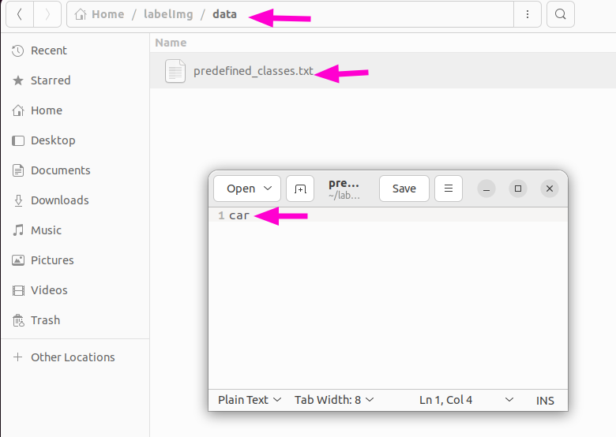

# YOLO Setup

> 원본: https://indecisive-freedom-6e8.notion.site/87d8e215779c833885cc817df8b1df50  
> 최종 수정: 2026-10-02 09:12 / 변환: 2026-10-08 14:04

| 속성 | 값 |
|---|---|
| 환경 | ubuntu22.04,humble,ubuntu24.04,jazzy |
| 상태 | 완료 |
| 순서 | 1-3 |

> 💡 **모든 작업은** **`rokey_venv`** **안에서 실행**해야 합니다.
>
> 터미널에 **(rokey_venv)** 가 없을 경우, **반드시** 아래 커맨드를 실행해 venv 환경을 활성화하세요.
>
> ```python
> source ~/venvs/rokey_venv/bin/activate
> ```

### IabelImg 설치

1. **의존성 설치**

   ```bash
   sudo apt update
   ```

   ```bash
   sudo apt install pyqt5-dev-tools qttools5-dev-tools python3-pyqt5 -y
   ```

2. **LabelImg 소스 코드 클론**

   ```bash
   cd ~
   git clone https://github.com/tzutalin/labelImg.git
   cd labelImg
   ```

3. **YOLO 형식 지원 버전으로 빌드**

   ```bash
   make qt5py3
   ```

4. **Label 편집**

   - labelImg > data 로 이동해서 predefined_classes.txt를 수정한다.

   - label이름 기입한다.

   

5. **LabelImg 실행**

   ```bash
   cd .. #move up to lableimg directory
   python3 labelImg.py
   ```

### YOLO / Torch 설치

1. venv 활성화 상태 확인

   ```bash
   cd ~
   which python3
   
   # → ~/venvs/rokey_venv/bin/python3 이어야 함
   # 아니라면: source ~/venvs/rokey_venv/bin/activate
   ```

2. 설치

   ```bash
   pip install --upgrade pip
   ```

   ```python
   nvidia-smi # Cheak if the GPU is available
   # If you have a GPU, install the CUDA version of PyTorch
   
   ```

   ```bash
   pip install torch torchvision
   ```

   ```bash
   pip install "setuptools<80"
   ```

   Ultralytics 설치 시 자동으로 다운로드되는 OpenCV 버전에 호환성 오류가 발생할 수 있다. 아래 스텝을 진행해 OpenCV 버전을 다운그레이드한다. 

   ```python
   pip install ultralytics
   ```

   ```python
   pip install "opencv-python==4.9.0.80" "numpy==1.26.4"
   ```

### 설치 확인

```bash
python3 -c "
import torch; print('PyTorch:', torch.__version__)
print('CUDA available:', torch.cuda.is_available())
print('GPU:', torch.cuda.get_device_name(0))
from ultralytics import YOLO; print('Ultralytics OK')
import rclpy; print('rclpy OK')
import numpy; print('numpy:', numpy.__version__)
from cv_bridge import CvBridge; print('cv_bridge OK')
"
```

```python
# 출력

PyTorch: 2.13.0+cu130
CUDA available: True
GPU: NVIDIA GeForce RTX 3060 Laptop GPU
Creating new Ultralytics Settings v0.0.6 file ✅ 
View Ultralytics Settings with 'yolo settings' or at '/home/hv-07/.config/Ultralytics/settings.json'
Update Settings with 'yolo settings key=value', i.e. 'yolo settings runs_dir=path/to/dir'. For help see https://docs.ultralytics.com/quickstart/#ultralytics-settings.
Ultralytics OK
rclpy OK
numpy: 1.26.4
cv_bridge OK

```
