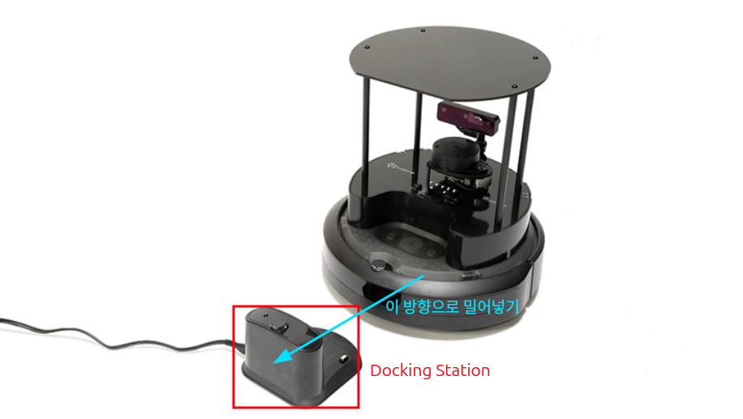
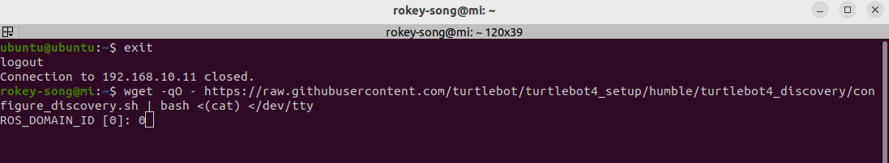
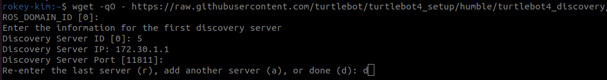
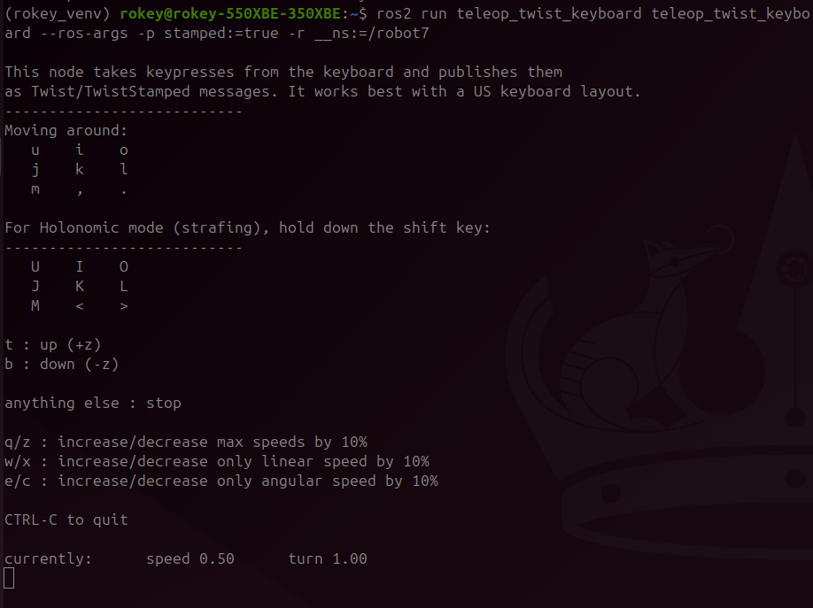

# User PC Single Robot Network Setup

> 원본: https://indecisive-freedom-6e8.notion.site/d768e215779c825cb47d019718019c87  
> 최종 수정: 2026-10-02 09:12 / 변환: 2026-10-08 14:04

| 속성 | 값 |
|---|---|
| 환경 | ubuntu22.04,humble,ubuntu24.04,jazzy |
| 상태 | 완료 |
| 순서 | 1-4 |

## 반드시 PC에서 실행 !! (Turtlebot에 접속하여 실행하면 절대 안됨)

터틀봇에서 진행했을 경우 바로 강사님 또는 조교에게 알려주세요.

### 🔑 개발 환경 구성

#### **ROS2 기반 로봇 시스템의 네트워크 구성**

| 구성 요소 | 역할 |
|---|---|
| 무선 공유기 | 독립적인 로컬 ROS 네트워크 구성의 중심 허브 |
| 노트북들 | 실습자 ROS 클라이언트 (RViz, CLI, rqt 등 실d행) |
| Raspberry Pi | 로봇 제어용 ROS2 노드 구동 (publisher, service server 등) |
| Create3 | 하드웨어 모빌리티 제공 (모터 제어, 센서 통합) |

**이 구성의 장점**

- 외부 인터넷과 분리되어 있어 **통신 충돌 위험이 낮고**, **학습용 네트워크로 안정적**입니다.

- 모든 장비가 동일한 로컬 네트워크 대역 안에 있어 **ROS2 DDS 통신이 원활**합니다.

**공식 문서 참고**

🔖 [Networking · User Manual](https://turtlebot.github.io/turtlebot4-user-manual/setup/networking.html) — Networking The TurtleBot 4 consists of two computing units: the Create® 3, and the Raspberry Pi. They connect to each other over a USB-C cable, whi...

### 💡 Networking

#### Robot Connection setup

Connect the robots to same wifi router and obtain the ip addresses

#### PC setup

[https://turtlebot.github.io/turtlebot4-user-manual/setup/discovery_server.html](https://turtlebot.github.io/turtlebot4-user-manual/setup/discovery_server.html)

> 💡 **모든 작업은** **`rokey_venv`** **안에서 실행**해야 합니다.
>
> 터미널에 **(rokey_venv)** 가 없을 경우, **반드시** 아래 커맨드를 실행해 venv 환경을 활성화하세요.
>
> ```python
> source ~/venvs/rokey_venv/bin/activate
> ```

0. Turtlebot을 도킹 스테이션에 밀어넣어 전원을 킨다. (Power ON)

   

   - TurtleBot4를 도킹 스테이션에 정확히 올려놓으면

   - **자동으로 전원이 켜진다** (별도의 버튼 조작 불필요)

   - 터틀봇의 HMI Display에서 터틀봇의 IP address를 확인할 수 있다.

1. 공유기에 PC를 연결한다.

   | 조 | 와이파이 SSID  | 비밀번호 |
   |---|---|---|
   | 1, 2 | turtle**07** | `rokey12345` |
   | 3, 4 | turtle**08** | `rokey12345` |
   | 5, 6 | turtle**09** | `rokey12345` |
   | 7, 8 | turtle**01** | `rokey12345` |

   ```bash
   # Turtlebot과 같은 공유기에 속해 있는지 확인하기 위해 터미널 창에 아래 코드를 입력한다.
   # 돌아오는 메세지가 없다면 본인 노트북의 Wifi 이름 확인.
   # You can find the Turtlebot IP address on the top line of Turtlebot HMI LED screen 
   ping <각 팀의 Turtlebot IP>
   ```

2. 아래의 명령을 실행시킨다.

   ```bash
   #make sure pc is connected to the same wifi router as the robot
   wget -qO - https://raw.githubusercontent.com/turtlebot/turtlebot4_setup/jazzy/turtlebot4_discovery/configure_discovery.sh | bash <(cat) </dev/tty
   ```

   

   

   Enter your team # as ROS_DOMAIN_ID (1 or 2 or …~6)
   Enter ***<각 팀의 Turtlebot IP>*** ***as Discovery Server IP***
   Leave the Discovery Server Port as [11811]

   **ROS 2 TurtleBot4 Discovery Server 설정 입력표**

   | 항목 | 입력 예시 값 | 설명 |
   |---|---|---|
   | **ROS_DOMAIN_ID** | `1,2,3,4,5,or 6` | 로봇 및 PC가 공유할 ROS 도메인 번호 (기본값: 0) **팀 별로 부여된 번호** |
   | **Discovery Server ID** | `1,2,3,4,5,or 6` | 고유한 서버 ID (로봇마다 다르게 설정해야 함), **팀 별로 부여된 번호** |
   | **Discovery Server IP** | `192.168.10.16` | 로봇(Raspberry Pi)의 IP 주소 |
   | **Discovery Server Port** | *(엔터)* 또는 `11811` | 기본 포트 11811 사용 시 엔터 입력 |
   | **Server 입력 선택** | `r`, `a`, `d` | `r`: 재입력, `a`: 다른 서버 추가, `d`: 완료 |

3. 설정 내용 source해서 반영

   ```bash
   source .bashrc
   ```

4. ROS2 daemon restart

   ```bash
   ros2 daemon stop
   ros2 daemon start
   ```

5. 연결 확인

   - 아래 명령어를 두 번정도 시도 해야한다. 

   - 처음 command 명령을 실행하면 daemon이 가능한 토픽 리스트를 취합하느라 바로 토픽리스트를 반환하지 못한다.

   ```bash
   ros2 topic list
   ```

6. 설정 내용 확인

   위의 설정 내용이 어떤 파일에 저장되어 있고 어떤 내용으로 설정되었는지 확인한다. (**경로 기억할 것!**)

   ```bash
   cat /etc/turtlebot4_discovery/setup.bash
   ```

---

**여러 로봇의 ROS 2 Discovery Server 설정** **예시** **(robot1 ~ robot4) : ROS_DOMAIN_ID 같음** **(로봇 이름 및 IP, Server ID는 예시이므로 각 조에 맞게 진행)**

|  |  |  |  |  |
|---|---|---|---|---|
| 로봇 이름 | Discovery Server ID | Ros Domain ID | 사용 포트 | 설명 |
| robot0 | 0 | 0 | 11811 |  |
| robot1 | 1 | 1 | 11811 | 첫 번째 로봇 |
| robot2 | 2 | 2 | 11811 | 두 번째 로봇 |
| robot3 | 3 | 3 | 11811 | 세 번째 로봇 |
| robot4 | 4 | 4 | 11811 | 네 번째 로봇 |

### 💡 테스트

키보드로 turtlebot4를 움직여 봅시다. (**반드시 undock 해야함.**)

- undock & move robot

  ```bash
  
  #Undock the robot if not undocked; enter your robot namespace
  ros2 action send_goal /robot<n>/undock irobot_create_msgs/action/Undock "{}"
  
  ```

  ```bash
  
  #make sure update the <n> to match your robot namespace
  ros2 run teleop_twist_keyboard teleop_twist_keyboard \
    --ros-args -p stamped:=true -r /cmd_vel:=/robot<n>/cmd_vel
  
  ```

  - `-ros-args` : ROS 2 런타임 인자 설정을 시작함을 의미

  - `-r /cmd_vel:=/robot<n>/cmd_vel` : 토픽 리매핑: `/cmd_vel` → `/robot<n>/cmd_vel` 으로 변경

    

- view robot camera:

  ```python
  rqt --clear-config
  #goto plugins and select visualization --> image view
  #refresh and select the image topic
  ```

  

  

- dock robot

  ```python
  #Dock your robot
  ros2 action send_goal /robot<n>/dock irobot_create_msgs/action/Dock "{}"
  ```
