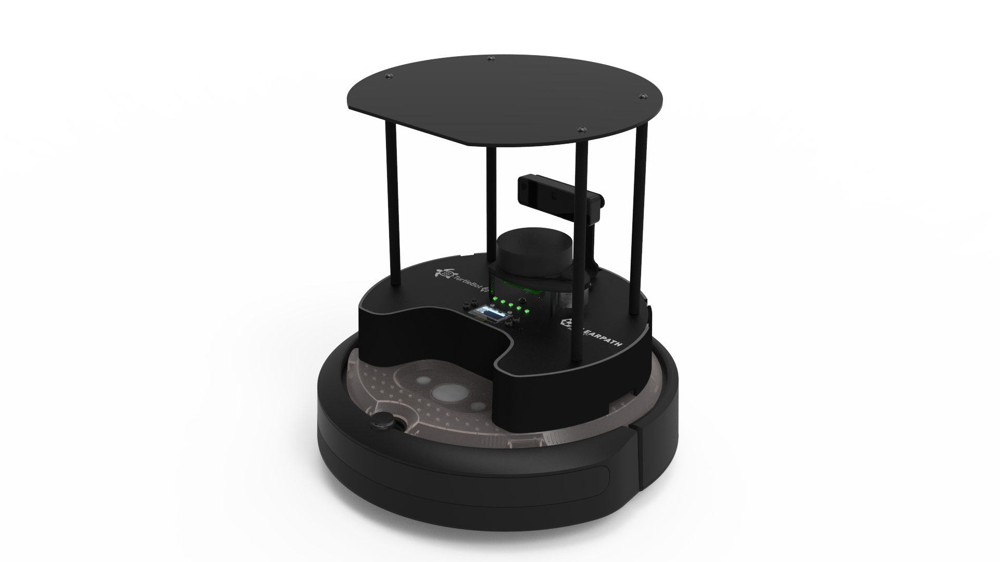
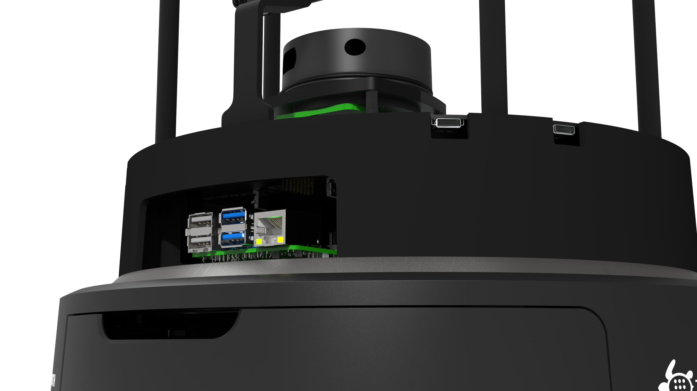
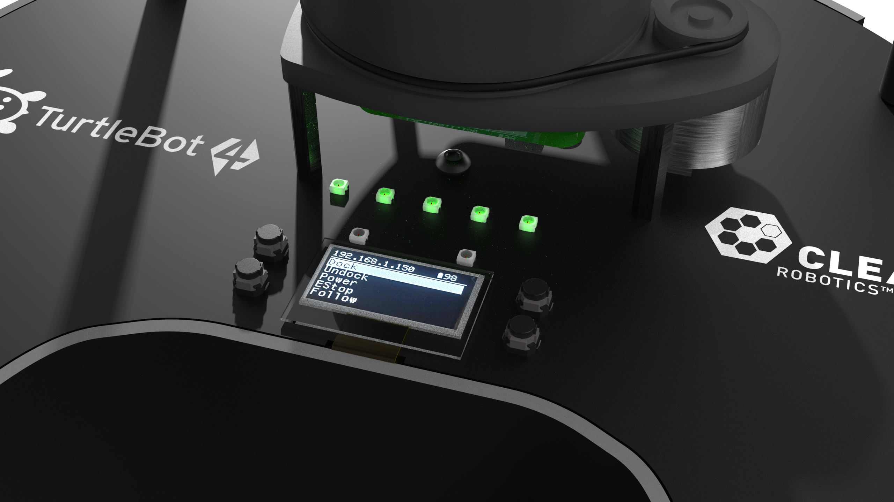
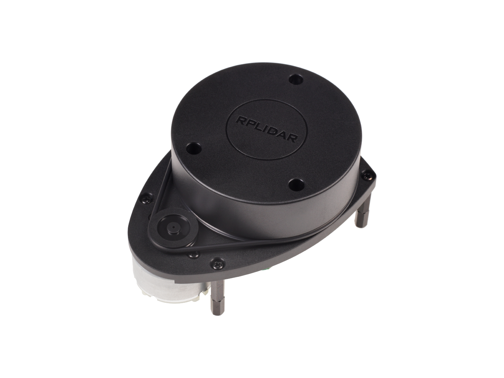
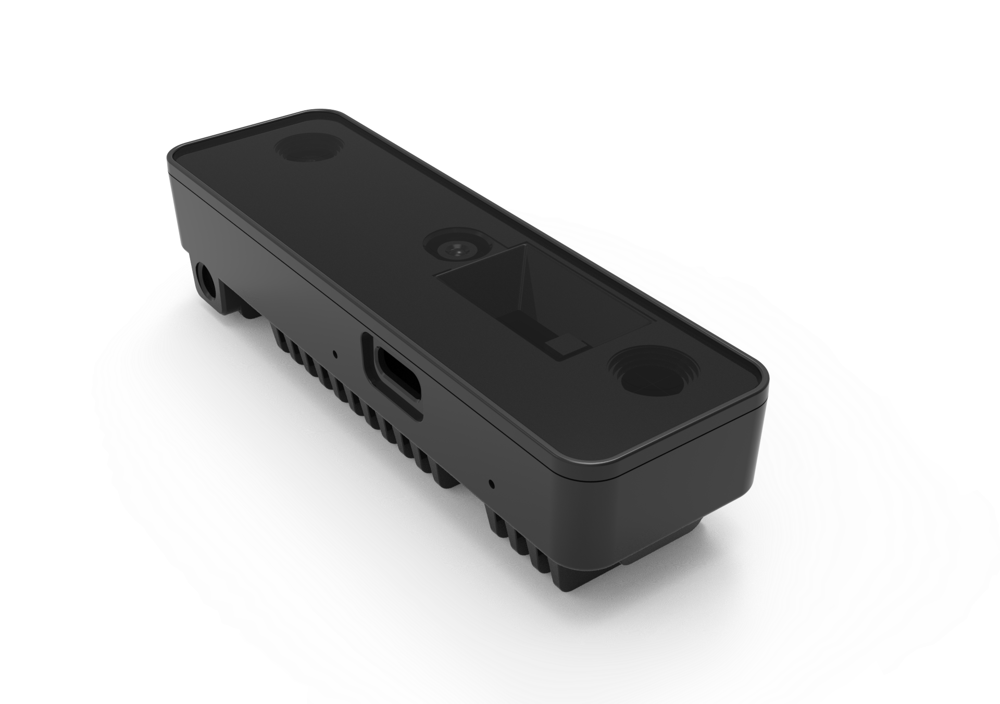
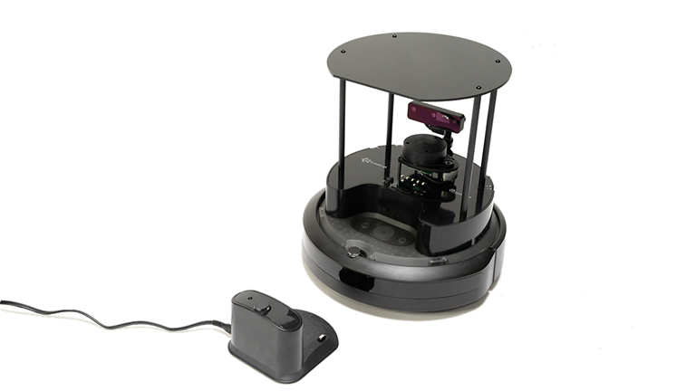
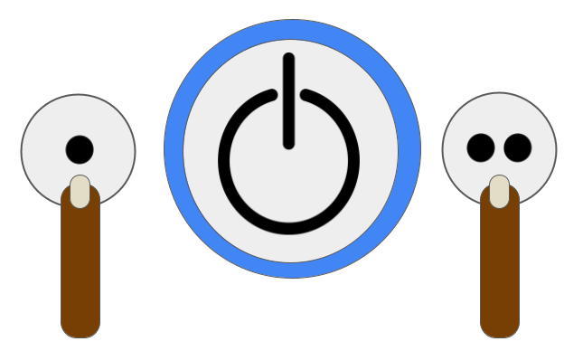
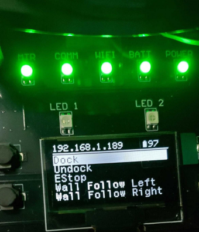

# Turtlebot4 Robot 만나기

> 원본: https://indecisive-freedom-6e8.notion.site/ff18e215779c831cb5e0017b519a7a5e  
> 최종 수정: 2026-10-02 09:13 / 변환: 2026-10-08 15:49

| 속성 | 값 |
|---|---|
| 환경 | ubuntu22.04,humble,ubuntu24.04,jazzy |
| 상태 | 완료 |
| 순서 | 1-6 |

### 🔑Turtlebot4 Feature

*Raspberry Pi 4B*

*UI 보드 or HMI*

-  [Create® 3](https://iroboteducation.github.io/create3_docs/) as the base platform

- Raspberry Pi 4B에서 소프트웨어 실행 됨

- UI 보드는 상태 및 사용자 LED, 사용자 버튼, 128x64 사용자 디스플레이를 제공

- UI 보드 위에는 [RPLIDAR A1M8](https://turtlebot.github.io/turtlebot4-user-manual/overview/features.html#rplidar-a1m8) 360도 라이더와 [OAK-D-Pro](https://turtlebot.github.io/turtlebot4-user-manual/overview/features.html#oak-d-pro) 카메라가 있음.

- **충전시간: 2시간 30분**

- **작업시간: 2시간 30분 ~ 4시간(부하량에 따라 다름)**

*RPLIDAR*

- 2m 범위의 360도 레이저 범위 스캐너

- 로봇 주변 환경의 2D 스캔을 생성

*OAK-D Pro*

- 고품질 depth Image 생성

- 저조도 환경에도 사용 가능

---

### **Hardware Specifications**

| **Feature** | **TurtleBot 4**  |
|---|---|
| Size (L x W x H) | 342 x 339 x 351 mm |
| Weight | 3945 g |
| **Base platform** | **iRobot® Create® 3** |
| Wheels (Diameter) | 72 mm |
| Ground Clearance | 4.5 mm |
| **On-board Computer** | **Raspberry Pi 4B 4GB** |
| Maximum linear velocity | 0.31 m/s in safe mode, 0.46 m/s without safe mode |
| Maximum angular velocity | 1.90 rad/s |
| Maximum payload | 9 kg |
| **Operation time** | **2h 30m - 4h depending on load** |
| **Charging time** | **2h 30m** |
| Bluetooth Controller | TurtleBot 4 Controller |
| Lidar | RPLIDAR A1M8 |
| Camera | OAK-D-Pro |
| User Power | VBAT @ 300 mA   12V @ 300 mA 5V @ 500 mA 3.3v @ 250 mA |
| USB Expansion | USB 2.0 (Type A) x2  USB 3.0 (Type A) x1 USB 3.0 (Type C) x4 |
| Programmable LEDs | Create® 3 LightringUser LED x2 |
| **Status LEDs** | **Power LED Motors LED WiFi LED Comms LED Battery LED** |
| Buttons and Switches | Create® 3 User buttons x2 Create® 3 Power Button x1 User Buttons x4 |
| Battery | 26 Wh Lithium Ion (14.4V nominal) |
| **Charging Dock** | **Included** |

### 🔎 Power On/Off

#### TurtleBot4 전원 켜기 (Power On)

- **도킹 스테이션을 사용할 경우**

  1. TurtleBot4를 도킹 스테이션에 정확히 올려놓으면

  2. **자동으로 전원이 켜진다** (별도의 버튼 조작 불필요)

#### TurtleBot4 전원 끄기 (Power Off)

- **도킹 스테이션에서 분리된 상태에서 진행해야 함**

  1. TurtleBot4를 **도킹 스테이션에서 분리**한다.

  2. 본체의 **전원 버튼을 약 5초간 길게 누른다.**

  3. **벨소리가 울릴 때까지** 기다린다.

  4. 벨소리가 울리면 **전원 버튼에서 손을 뗀다.**

  5. 전원이 정상적으로 종료된다.

#### ❗주의사항

- 도킹 상태에서는 전원이 자동 유지되므로 **전원 버튼을 눌러도 꺼지지 않습니다.**

- 항상 **도킹에서 분리한 후 전원을 끄는 절차**를 따라야 안전하게 종료됩니다.

---

> ❓ **탐색하기**
>
> - 전원이 완전히 켜지는 데 소요되는 시간은?
>
> - 전원이 켜지면서 LED 상태, 전원 버튼의 색깔 변화, UI  보드 상태는 어떻게 변하나?
>
> - 전원이 완전히 꺼지는 데 소요되는 시간은?
>
> - 충전는 몇 % 인가?
>
> - IP 주소는?
>
> - 나만의 발견 포인트?

### 🔎 Dock / Undock

- **Dock**: 로봇이 도킹 스테이션에 **자동 또는 수동으로 접촉하여 충전 및 대기 상태**로 전환되는 과정 (왼쪽 버튼: 점1개)

- **Undock**: 도킹 상태에서 **로봇이 스스로 또는 수동으로 분리되어 이동을 시작**하는 과정 (오른쪽 버튼: 점2개)

| 항목 | 확인 포인트 |
|---|---|
| **정렬 정확도** | 도킹 시 로봇이 스테이션과 정확히 정렬되어 있는지 확인 (비스듬하면 충전 실패) |
| **충전 반응** | 도킹 후 충전이 시작되지 않으면 충전 핀 또는 전원 연결 상태 점검 |
| **언도킹 후 위치** | 언도킹 시 로봇이 충분히 스테이션에서 이탈했는지 확인 (충전 단자 완전 분리) |
| **로봇 반응** | 버튼 누른 후 즉시 동작하지 않으면 ROS 동작 상태나 하드웨어 연결 여부 확인 |

### ✅ TurtleBot4 LED 문제 진단표

| **LED 종류** | **설명** |
|---|---|
| **MTR LED** | - ROS2에서 모터가 활성화되고, 모터 드라이버에 전원이 공급되어야 한다.- 꺼져 있으면 드라이버 미작동, 전원 미공급 가능성 |
| **Comm LED** | - ROS2 네트워크 통신이 정상 작동 중이어야 한다. - 꺼져 있으면 ROS 노드 미실행, FastDDS 설정 오류, 통신단절 상태일 수 있음. |
| **WiFi LED** | - 로봇이 Wi-Fi 네트워크에 정상 연결되어 있어야 한다. - 꺼져 있다면 Wi-Fi 연결이 해제된 상태 (SSID/PW 오류, 거리 문제 등). |
| **Battery LED** | - 초록색: 배터리 양호  - 빨간색: 배터리 부족 (30% 이하)-  - 꺼짐: 배터리 상태 인식 실패 또는 하드웨어 문제 |
| **Power LED** | - 전원 공급이 정상적으로 이루어져야 한다 (배터리 또는 어댑터). - 꺼져 있다면 전원 케이블 문제, 배터리 방전, 전원 보드 연결 확인 필요. |

2초 미만

> ❗ 모든 LED가 초록색 불이 들어와야 정상입니다.
