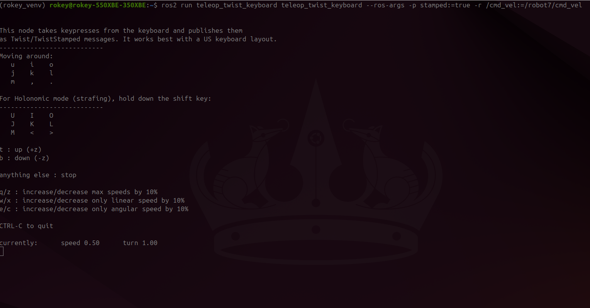
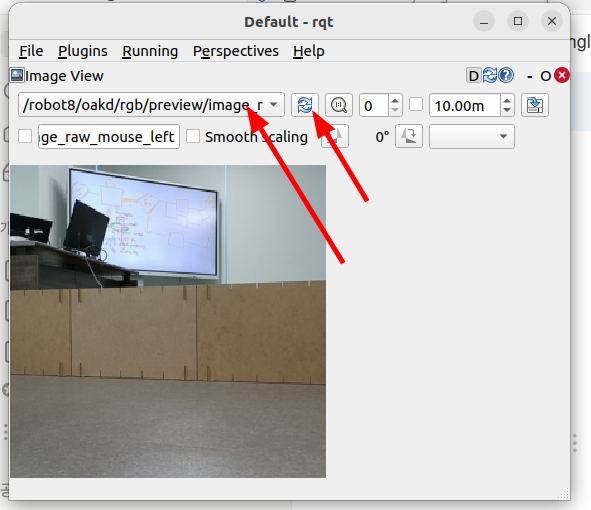
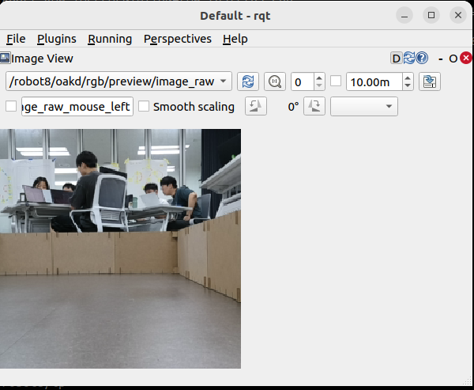

# ⚫ Move Robot CLI

> 원본: https://indecisive-freedom-6e8.notion.site/5e28e215779c839881bd81373b1ebf66  
> 최종 수정: 2026-10-02 09:13 / 변환: 2026-10-08 15:49

| 속성 | 값 |
|---|---|
| 환경 | ubuntu22.04,humble,ubuntu24.04,jazzy |
| 상태 | 완료 |
| 순서 | 1-8 |

### 📝 로봇 움직이기

키보드로 turtlebot4를 움직여 봅시다. (**반드시 undock 해야함.**)

> 💡 **모든 작업은** **`rokey_venv`** **안에서 실행**해야 합니다.
>
> 터미널에 **(rokey_venv)** 가 없을 경우, **반드시** 아래 커맨드를 실행해 venv 환경을 활성화하세요.
>
> ```python
> source ~/venvs/rokey_venv/bin/activate
> ```

##### undock & move robot

```bash

#Undock the robot if not undocked; enter your robot namespace
ros2 action send_goal /robot<n>/undock irobot_create_msgs/action/Undock "{}"

```

```bash

#make sure update the <n> to match your robot namespace
ros2 run teleop_twist_keyboard teleop_twist_keyboard \
  --ros-args -p stamped:=true -r /cmd_vel:=/robot<n>/cmd_vel
```

- `-ros-args` : ROS 2 런타임 인자 설정을 시작함을 의미

- `stamped:=true`  : `/cmd_vel` 메세지 타입이 `TwistStamped` 이므로, `-p stamped:=true` 를 추가

- `-r /cmd_vel:=/robot<n>/cmd_vel` : 토픽 리매핑: `/cmd_vel` → `/robot<n>/cmd_vel` 으로 변경

  

---

#### 직진 속도 1m/s로 이동

**설명**: 로봇이 x축 방향으로 1m/s 속도로 직진 (회전 없음)

**명령어**: 토픽 리매핑을 적용해야 로봇이 움직입니다!

```bash
ros2 topic pub /cmd_vel geometry_msgs/msg/TwistStamped "{twist: {linear: {x: 1.0, y: 0.0, z: 0.0}, angular: {x: 0.0, y: 0.0, z: 0.0}}}"
```

---

#### 직진과 회전을 동시에 수행 (1m/s 직진, 1rad/s 회전)

**설명**: 1m/s 속도로 직진하면서 동시에 z축 기준으로 1rad/s로 회전하여 원형 경로 이동

**명령어**:

```bash
ros2 topic pub /cmd_vel geometry_msgs/msg/TwistStamped "{twist: {linear: {x: 1.0, y: 0.0, z: 0.0}, angular: {x: 0.0, y: 0.0, z: 1.0}}}"
```

---

#### 거리 기반 직진 제어 (0.5m 이동, 속도 0.3m/s)

**설명**: 0.5m 전진하며 최대 속도는 0.3m/s로 제한 (action 사용)

**명령어**:

```bash
ros2 action send_goal /drive_distance irobot_create_msgs/action/DriveDistance "{distance: 0.5, max_translation_speed: 0.3}"

```

---

#### 곡선 경로 이동 (반지름 0.3m, 각도 1.57rad)

**설명**: 반지름 0.3m의 곡선 경로를 따라 1.57rad 만큼 회전하며 전진

**명령어**:

```bash
ros2 action send_goal /drive_arc irobot_create_msgs/action/DriveArc "{angle: 1.57, radius: 0.3, translate_direction: 1, max_translation_speed: 0.3}"
```

---

#### 회전 제어 (1.0rad 회전, 속도 0.3rad/s)

**설명**: 로봇을 제자리에서 1.0rad 만큼 회전, 최대 회전 속도는 0.3rad/s

**명령어**:

```bash
ros2 action send_goal /rotate_angle irobot_create_msgs/action/RotateAngle "{angle: 1.0, max_rotation_speed: 0.3}"
```

---

##### view robot camera:

```python
rqt --clear-config
#goto plugins and select visualization --> image view
#refresh and select the image topic
```





---

#### Dock

```bash
ros2 action send_goal /robot<n>/dock irobot_create_msgs/action/Dock "{}"
```
