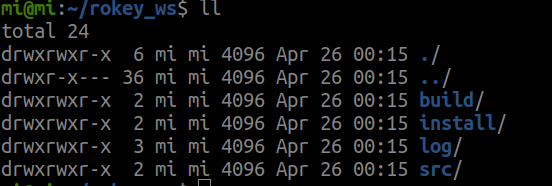
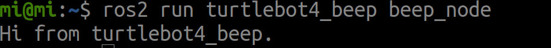

# ⚫ ROS Workspace Example

> 원본: https://indecisive-freedom-6e8.notion.site/00a8e215779c83b1930c8196d841789e  
> 최종 수정: 2026-10-02 09:13 / 변환: 2026-10-08 15:49

| 속성 | 값 |
|---|---|
| 환경 | ubuntu22.04,humble,ubuntu24.04,jazzy |
| 상태 | 완료 |
| 키워드 | workspace,package |
| 순서 | 1-9 |

### 핵심 개념

#### ROS2 워크스페이스

- ROS2 워크스페이스는 패키지와 소스 코드를 조직적으로 관리하는 작업 공간이다.

- `colcon`은 ROS2에서 공식적으로 사용되는 빌드 도구로, ROS2 패키지를 병렬로 효율적으로 빌드한다.

- `venv`가 활성화된 상태에서 다음 내용을 진행할 것.

### 워크스페이스

> 💡 **모든 작업은** **`rokey_venv`** **안에서 실행**해야 합니다.
>
> 터미널에 **(rokey_venv)** 가 없을 경우, **반드시** 아래 커맨드를 실행해 venv 환경을 활성화하세요.
>
> ```python
> source ~/venvs/rokey_venv/bin/activate
> ```

#### **CMD:필수 도구 설치 및 워크스페이스 생성** 

**1.개발 환경 및 빌드 도구를 설치합니다.**

```bash
sudo apt update && sudo apt install -y \
  build-essential \
  cmake \
  git \
  python3-pip \
  python3-rosdep \
  python3-setuptools
```

```python
pip install colcon-common-extensions
```

**패키지 설명:**

- `build-essential`: 컴파일과 빌드를 위한 기본 도구 (gcc, g++).

- `cmake`: CMake 빌드 시스템.

- `git`: 소스 코드 관리 도구.

- `python3-pip`: Python 패키지 관리자.

- `python3-rosdep`: ROS2 의존성 관리 도구.

- `python3-setuptools`: Python 패키지 빌드 도구.

- `colcon-common-extensions`: colcon 빌드 도구 및 확장.

---

**2.Python 및 rosdep 초기화**

`pip`를 최신 버전으로 업그레이드:

```bash
python3 -m pip install --upgrade pip
```

`rosdep` 초기화:

```bash
sudo rosdep init
rosdep update
```

---

**3.디렉토리 생성**

```bash
mkdir -p ~/rokey_ws/src
```

- `~/rokey_ws`: 워크스페이스 루트 디렉터리.

- `src`: ROS2 패키지를 저장할 서브 디렉터리.

---

**4.패키지 의존성 자동 설치**

패키지를 생성하고 빌드하기 전에 필요한 의존성을 자동으로 설치

```bash
cd ~/rokey_ws
rosdep install --from-paths src --ignore-src -r -y
```

#### **CMD: 워크스페이스 빌드**

1. **colcon 빌드 실행**

`colcon build`는 `src` 디렉터리에 있는 모든 패키지를 빌드한다.

빌드 실행 위치는 워크스페이스 위치여야 한다.

```bash
cd ~/rokey_ws
colcon build --symlink-install
```



**빌드 상태 확인**

- 빌드가 성공적으로 완료되면 `build`, `install`, `log` 디렉터리가 생성된다:

  - `build`: 빌드하는 동안 생성된 **중간 파일**(object files, CMake 파일 등)이 저장

  - `install`: 실행 가능한 파일 저장.ROS2 런타임에서 실제로 참조되는 디렉터리.

  - `log`: 빌드 로그 저장.

2. **sourcing**

빌드한 작업공간을 ROS 2 환경에 반영.

```bash
source install/setup.bash
```

> ❗ source 내용을 .bashrc에 등록해 두면 편합니다.

### Package 생성

> 💡 **모든 작업은** **`rokey_venv`** **안에서 실행**해야 합니다.
>
> 터미널에 **(rokey_venv)** 가 없을 경우, **반드시** 아래 커맨드를 실행해 venv 환경을 활성화하세요.
>
> ```python
> source ~/venvs/rokey_venv/bin/activate
> ```

#### **CMD:패키지,노드 생성 및 실행**

1. **패키지 생성**
   워크스페이스의 `src` 디렉터리로 이동한 후 새로운 패키지를 생성합니다.
   

   ```bash
   cd ~/rokey_ws/src
   ros2 pkg create --build-type ament_python --license Apache-2.0 --node-name beep_node turtlebot4_beep
   ```

   **옵션 설명:**

   - `-build-type ament_python`: Python 기반 패키지를 생성.

   - `-node-name beep_node`: 기본 노드를 `beep_node.py`로 생성.

   - `turtlebot4_beep`: 패키지 이름.

---

2. **패키지 빌드**

   `src` 디렉터리로부터 상위 워크스페이스로 이동한 후 패키지를 빌드

   ```bash
   cd ~/rokey_ws
   colcon build --symlink-install --packages-select turtlebot4_beep
   ```

   빌드 성공 후 환경 설정:

   ```bash
   source install/setup.bash
   ```

---

3. **테스트**

   ```bash
   ros2 run turtlebot4_beep beep_node
   ```

   

   #### beep_node.py 파일 확인

   패키지 생성시 기본으로 생성된 node 파일이다. 

   해당 파이썬 파일이 실행되면서 쉘에 ‘Hi from turtlebot4_beep’ 문장이 출력된다. 

   ```python
   def main():
       print('Hi from turtlebot4_beep.')
   
   
   if __name__ == '__main__':
       main()
   
   ```
