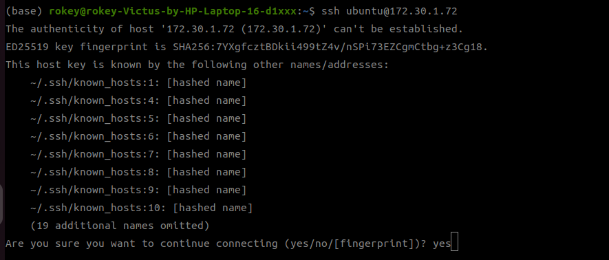
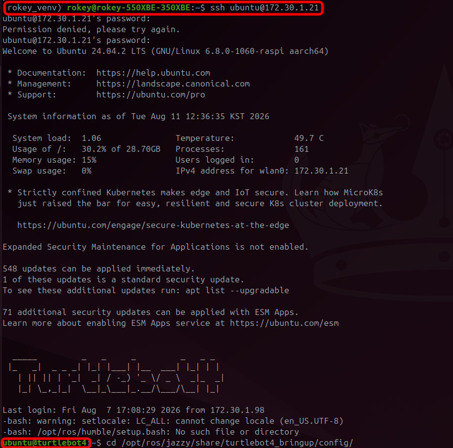

# Turtlebot4 SSH Access

> 원본: https://indecisive-freedom-6e8.notion.site/a148e215779c821ab4f501712d01b8f1  
> 최종 수정: 2026-10-02 09:13 / 변환: 2026-10-08 14:05

| 속성 | 값 |
|---|---|
| 환경 | ubuntu22.04,humble,Turtlebot4,ubuntu24.04,WSL2,jazzy |
| 상태 | 완료 |
| 순서 | 1-10 |

### Turtlebot4 SSH 접속 Guide

1. 터미널에 다음 명령어를 입력한다.

   ```bash
   ssh ubuntu@<각 조의 로봇 IP Address>
   ```

2. 위 화면은 최초 접속시에만 나타난다. 신뢰할 수 있는 호스트인지 묻는 창이므로 `yes`입력.

   

3. 터틀봇4 패스워드 입력 후 접속된 것 확인

   - password: `turtlebot4`

   - 터미널 이름이 ubuntu@turtlebot4로 바뀐 것을 확인할 수 있음

   

#### 💡 터미널 이름을 항상 확인하여 PC에서의 작업을 터틀봇 안에서 진행하지 않도록 유의할 것!!!!!!
