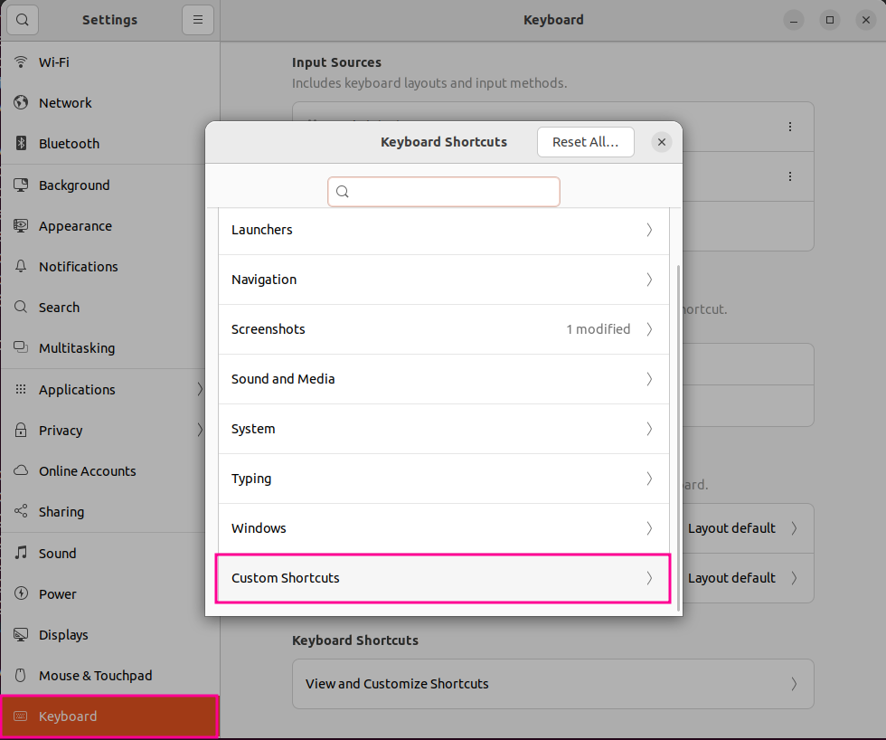
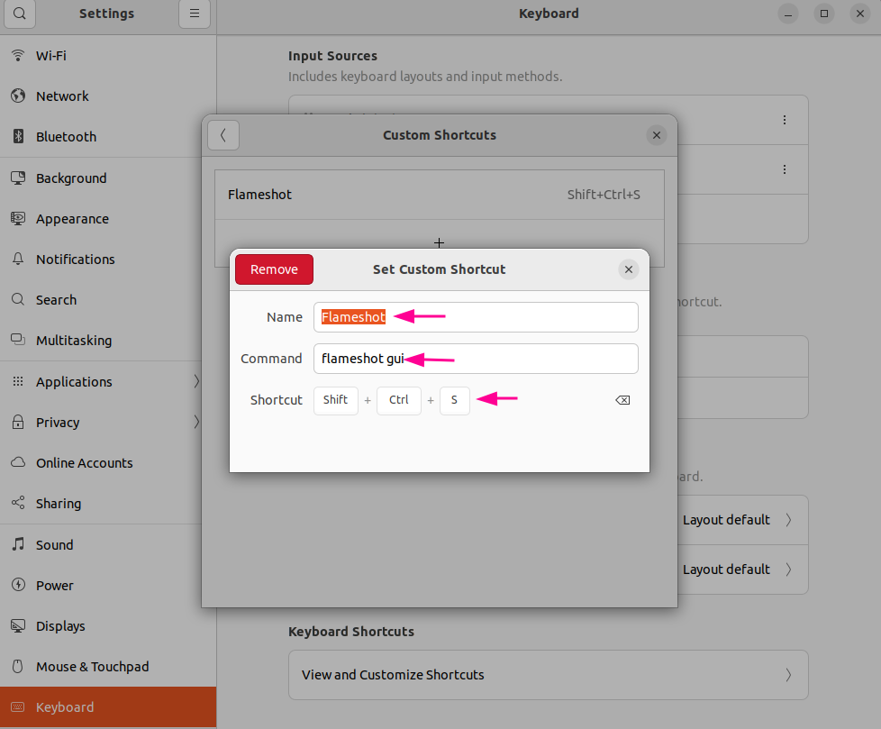
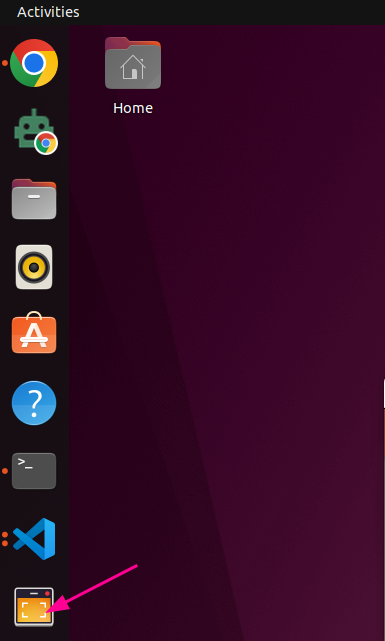
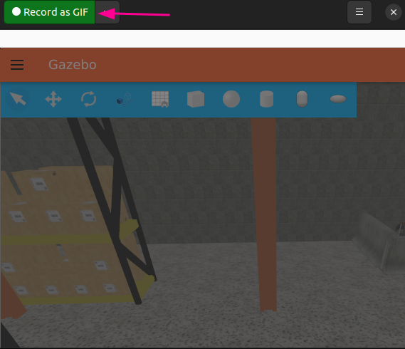

# 화면 캡쳐 및 영상 녹화 도구

> 원본: https://indecisive-freedom-6e8.notion.site/3888e215779c82d886a081f950bbfc9a  
> 최종 수정: 2026-07-20 16:33 / 변환: 2026-10-08 15:49

| 속성 | 값 |
|---|---|
| 상태 | 완료 |
| 순서 | 1-0-1 |

### 화면 영역 지정해서 캡쳐 및 편집_Flamesholameshot

#### **1. Flameshot 설치**

터미널에서 다음 명령어 실행:

```bash
sudo apt update
sudo apt install flameshot -y
```

설치가 완료되면 다음 명령어로 버전 확인:

```bash
flameshot --version
```

---

#### **2. Flameshot 실행 방법**

1. **GUI 실행**
   터미널에서 실행:
   
   또는

   ```bash
   flameshot gui
   ```

   ```bash
   flameshot
   ```

2. **단축키 추가 (Ubuntu 데스크톱 환경)**

   - **설정 → 키보드 → 단축키 → 사용자 정의 단축키 추가**

   - 이름: `Flameshot`

   - 명령어: `flameshot gui`

   - 단축키: 원하는 키 설정 (예: `PrtSc`)

   

   

---

#### 3**. 화면 캡쳐**

1. 화면 캡쳐 활성화: **`shift+ctrl+s`**

2. 마우스로 드래그하여 영역 지정

3. 캡쳐 화면 클립보드에 저장: **`crtl+c`**

4. 문서에 바로 붙여넣기: **`ctrl+v`**

---

### 화면 영역 지정해서 녹화 및 gif로 변환_Peek

#### **1. 프로그램 설치**

터미널에서 다음 명령어 실행:

```bash
sudo apt update
sudo apt install peek -y
```

---

#### **2. peek 실행 방법**

1. **GUI 실행**
   




