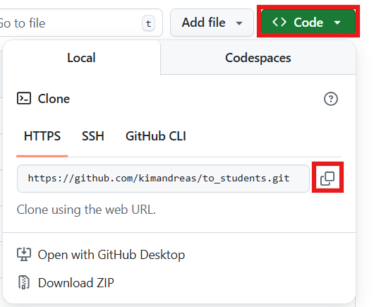
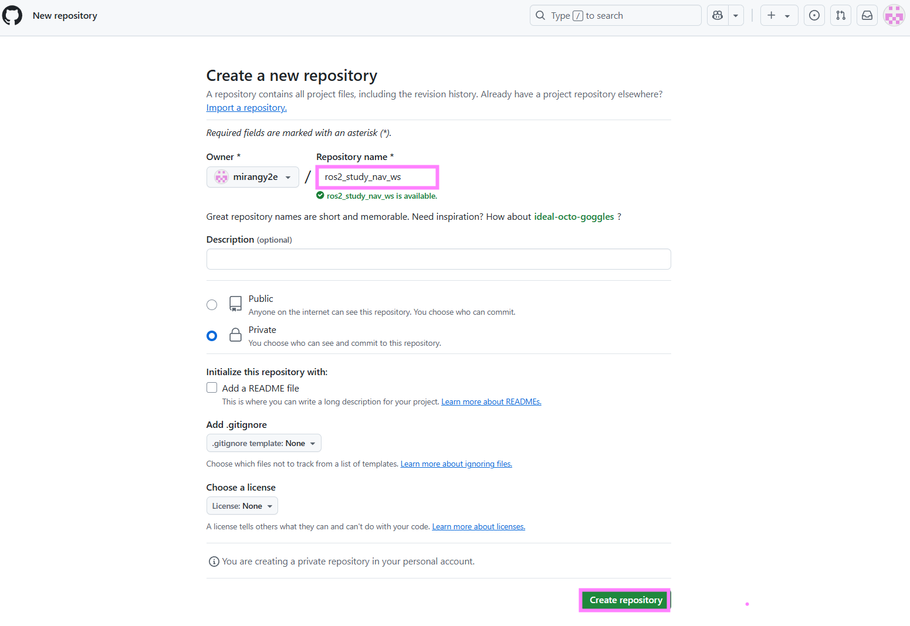
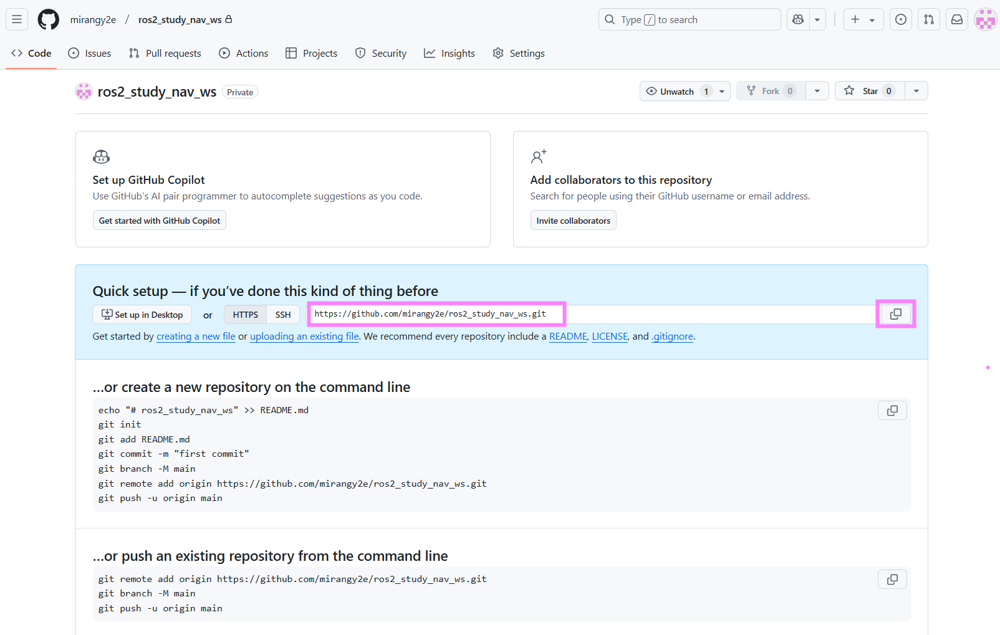
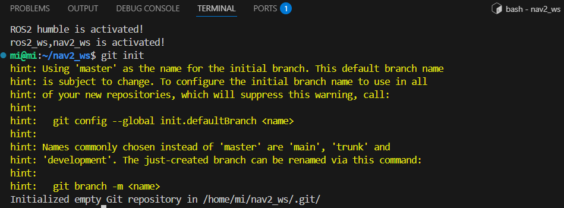
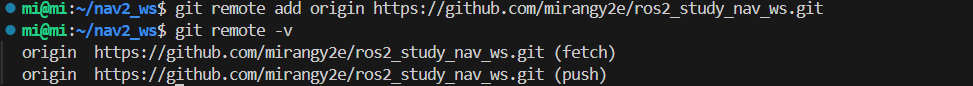

# Git 연동 및 사용 (Git+VSCode)

> 원본: https://indecisive-freedom-6e8.notion.site/7898e215779c837d945e011bfe0c3f26  
> 최종 수정: 2026-07-20 16:33 / 변환: 2026-10-08 14:05

| 속성 | 값 |
|---|---|
| 상태 | 완료 |
| 순서 | 1-0-2 |

### VSCode로 Git 강의록 다운받기:

[깃허브 공유 페이지](https://github.com/kimandreas/to_students/tree/main)에 접속해 아래의 방식으로 리포지토리 링크를 복사한다.



VSCode에서 복사한 링크를 붙여 넣는다.


리포지토리 대상 폴더를 지정한다. 가급적 폴더 내에 설치하는 걸 권장.


잠시 기다리면 강의록 파일 다운로드가 완료된다.


### VSCode로 팀 프로젝트 진행:

#### **1. Git 설치 및 환경 설정:**  

#### **1-1. Git 설치 확인**

Ubuntu에 Git이 설치되어 있는지 확인하고, 없다면 설치한다.

```bash
git --version
```

설치되어 있지 않다면 다음 명령어로 설치한다.

```bash
sudo apt update
sudo apt install git
```

#### **1-2. Git 사용자 정보 설정**

GitHub에서 사용할 사용자 이름과 이메일을 설정한다.

```bash
git config --global user.name <내 GitHub 사용자 이름>
git config --global user.email <내 이메일 주소>
```

설정 확인:

```bash
git config --list
```

#### **2. GitHub 저장소(Repository) 생성:**  

1. [GitHub](https://github.com/)에 로그인한다.

2. 오른쪽 상단의 `+` 버튼 → `New repository`를 클릭한다.

3. `Repository name`을 입력하고, `Public` 또는 `Private`을 선택한 후 `Create repository`를 클릭한다.

   

4. 저장소가 생성되면 화면에 `git remote` 설정 방법이 표시되는데, 이 정보를 사용하여 로컬 프로젝트와 연결할 것이다.

   

#### **3. VSCode에서 GitHub 연결 및 프로젝트 업로드:**  

#### **3-1. 프로젝트 디렉터리 이동**

GitHub에 업로드할 프로젝트 폴더로 이동한다.

```bash
cd ~/프로젝트_폴더
```

#### **3-2. Git 저장소 초기화**

Git을 사용하기 위해 저장소를 초기화한다.

```bash
git init
```



#### **3-3. GitHub 원격 저장소 연결**

GitHub에서 생성한 저장소 URL을 원격 저장소로 추가한다.

```bash
git remote add origin https://github.com/내_사용자이름/저장소이름.git
```

연결 확인:

```bash
git remote -v
```



#### **3-4. 변경 사항 커밋 및 푸시**

GitHub에 파일을 업로드하려면 다음 과정을 거친다.

1. 모든 파일을 추가

   ```bash
   git add .
   # 매번 모든 파일을 추가하기 보단, 팀원들과 상의하여 commit별로 파일 구분을 하면 좋습니다.
   ```

2. 커밋 메시지 작성

   ```bash
   git commit -m "프로젝트 첫 커밋"
   ```

3. 원격 저장소에 업로드 (브랜치가 `main`인지 확인)

   ```bash
   git branch -M main
   git push -u origin main
   ```

4. **GitHub에서 확인**

   - GitHub 저장소 페이지로 이동하면 업로드된 파일을 확인할 수 있다.

#### **4. 이후 변경 사항 업데이트하기:**  

프로젝트를 수정한 후 GitHub에 반영하는 과정:

```bash
git add .
# 해당 명령어는 모든 수정사항을 업로드합니다.
# 팀원들과 상의하여 파일별 add를 권장합니다.
git commit -m "업데이트 설명"
git push origin main
```

GitHub에서 최신 변경 사항을 가져올 때:

```bash
git pull origin main
```

#### **5. ROS2 워크스페이스에서** **`log`** **폴더를 Git 커밋에서 제외하는 방법 :**  

ROS2 워크스페이스에서 `log/` 폴더는 실행 중 생성되는 로그 데이터이므로, Git에 커밋할 필요가 없다.

이를 방지하려면 **`.gitignore`** **파일을 설정**하면 된다.

### **1.** **`.gitignore`** **파일에** **`log/`** **추가**

`.gitignore` 파일이 없다면 먼저 생성한다.

```bash
touch .gitignore
```

그 후, `log/` 폴더를 제외하도록 `.gitignore` 파일을 수정한다.

```bash
echo "log/" >> .gitignore
```

또는 직접 편집하여 아래 내용을 추가한다.

```bash
# ROS2 워크스페이스 불필요 파일 제외
log/
build/
install/
```

---

### **2. 기존에 커밋된** **`log/`** **폴더 삭제 (이미 커밋된 경우)**

기존에 `log/` 폴더가 Git에 추가되었다면, `.gitignore` 설정만으로는 제외되지 않는다.

이 경우 Git에서 제거한 후 다시 커밋해야 한다.

```bash
git rm -r --cached log/
git add .gitignore
git commit -m "Ignore log directory"
git push origin main
```

---

### **3.** **`.gitignore`** **적용 확인**

이제 `log/` 폴더가 Git 커밋에서 제외되었는지 확인한다.

```bash
git status
```

- `log/` 폴더가 `Untracked files` 목록에 보이지 않으면 성공

- 만약 보이면 `.gitignore`가 정상적으로 적용되지 않은 것이므로 다시 확인

---

**최종 정리**

1. `.gitignore` 파일에 `log/` 추가

2. `git rm -r --cached log/` 실행 (이미 추가된 경우)

3. `git commit -m "Ignore log directory"` 후 푸시

4.  `git status`로 확인

이제 ROS2 실행 시 생성되는 로그 파일이 Git 커밋에서 자동으로 제외된다!
