# Turtlebot4 Setup(NO ACTION NEEDED)

> 원본: https://indecisive-freedom-6e8.notion.site/b568e215779c821bbd2581abcdac3f1a  
> 최종 수정: 2026-07-20 16:34 / 변환: 2026-10-08 15:49

| 속성 | 값 |
|---|---|
| 상태 | 완료 |
| 환경 | ubuntu24.04,jazzy,Turtlebot4 |
| 순서 | 1-0-5 |

### Robot Setup

[https://www.youtube.com/watch?v=tlXa2TTpQrw&t=239s](https://www.youtube.com/watch?v=tlXa2TTpQrw&t=239s)

#### 1. 로봇 전원 켜기

- TurtleBot 4를 도크에 놓기

- 도크의 녹색 LED가 몇 초 동안 켜지고 TurtleBot 4가 켜집니다. 로봇이 부팅될 때까지 잠시 기다리세요.

- 로봇 버튼과 표시등에 대한 자세한 내용은 [Create®3 설명서를 참조하세요.](https://iroboteducation.github.io/create3_docs/hw/face/)

#### 2. **Raspberry Pi에 SSH로 접속**

[Discovery Server · User Manual](https://turtlebot.github.io/turtlebot4-user-manual/setup/discovery_server.html)

- PC에서 터미널을 열고 ssh로 로봇(Raspberry Pi)에 접속

- 로그인 비밀번호: `turtlebot4`

- PC 터미널:

  ```bash
  ssh ubuntu@192.168.10.16
  ```

  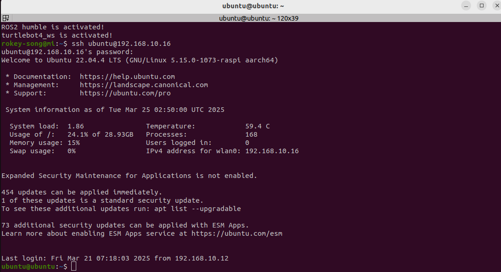

#### 4. Turtlebot4 setup

- Robot 터미널:

```bash
turtlebot4-setup
```

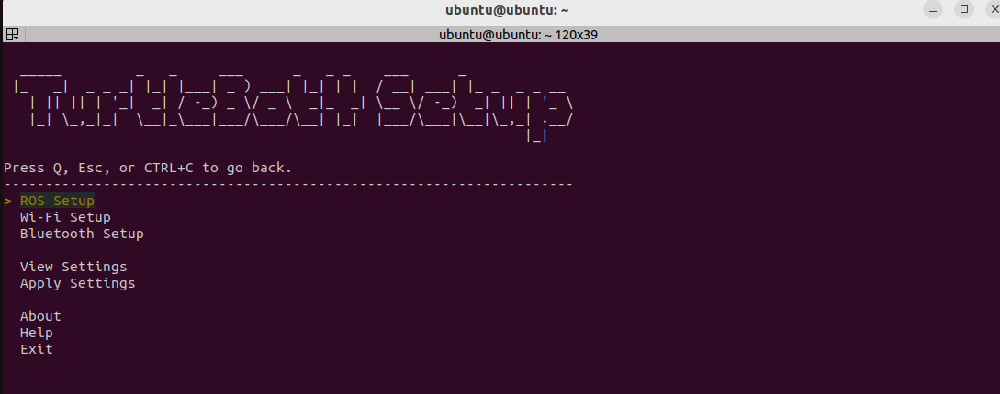

- ROS Setup > Bash Setup 메뉴 선택

  - robot namesspace should use your robot number (i.e. /robot4)

  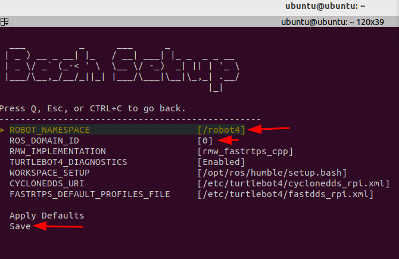

- Discovery Server

  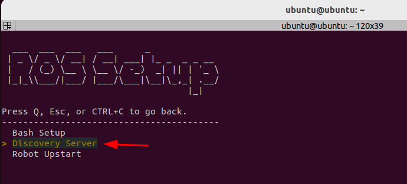

  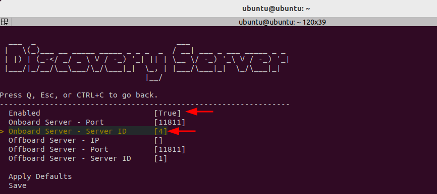

  enter number of your robot as server ID

- Restart Robot Upstart and check status

  - TBD

- WIFI- Setup

  - use your designated wifi router SSID and password

  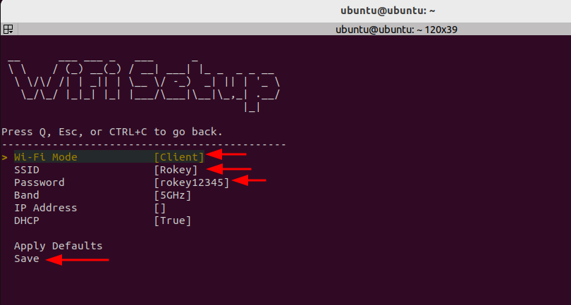

- Apply Settings

  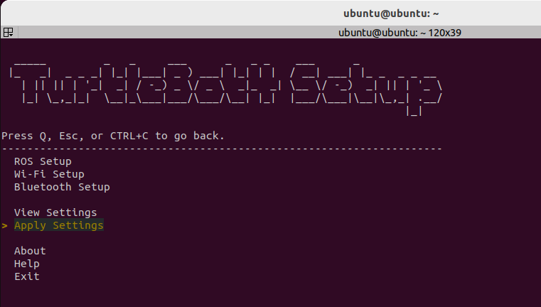

  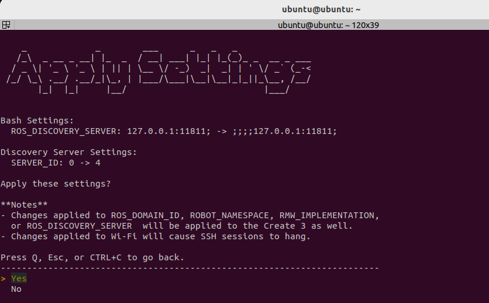

- View setting

  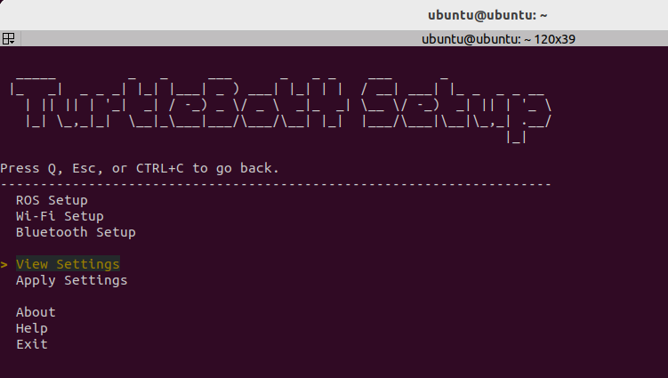

  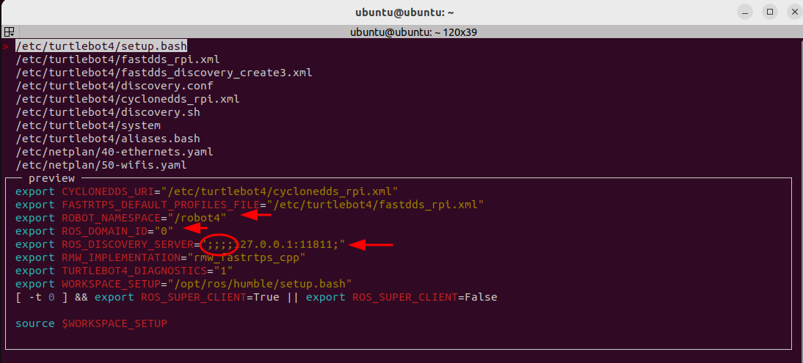

- Exit

- Source 및 Restart

  ```bash
  turtlebot4-source 
  turtlebot4-daemon-restart
  ```

  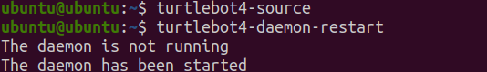

  - Restarting the turtlebot4 bringup

  ```python
  #checking the status of turtlebot4 bring up
  sudo systemctl status turtlebot4.service 
  
  #restarting the bring up, if needed
  sudo systemctl restart turtlebot4.service 
  #wait for the all five lights to turnoff and back on.
  ```
