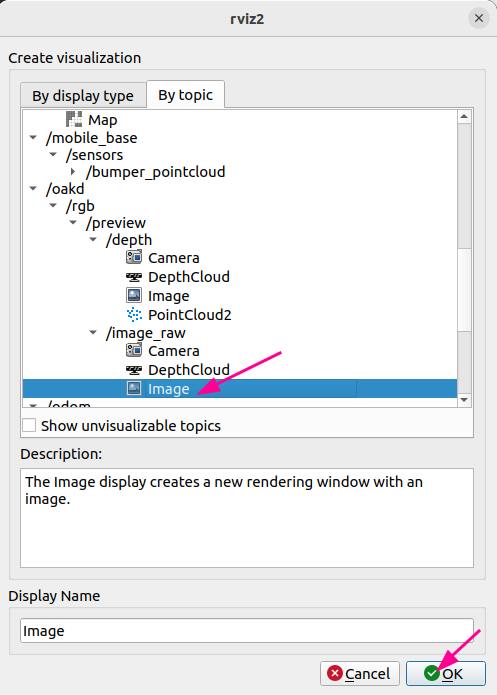
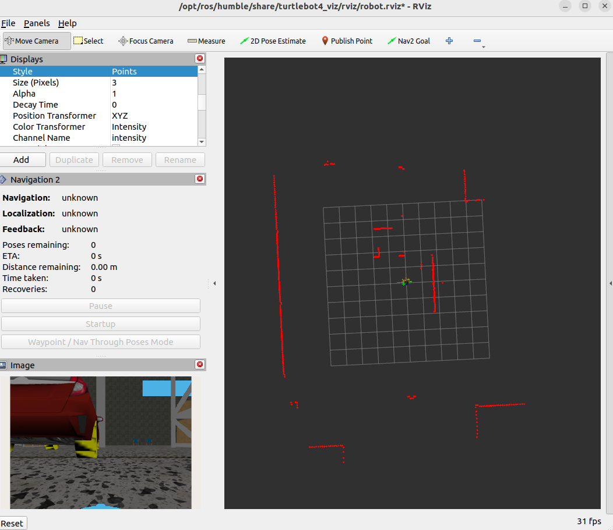
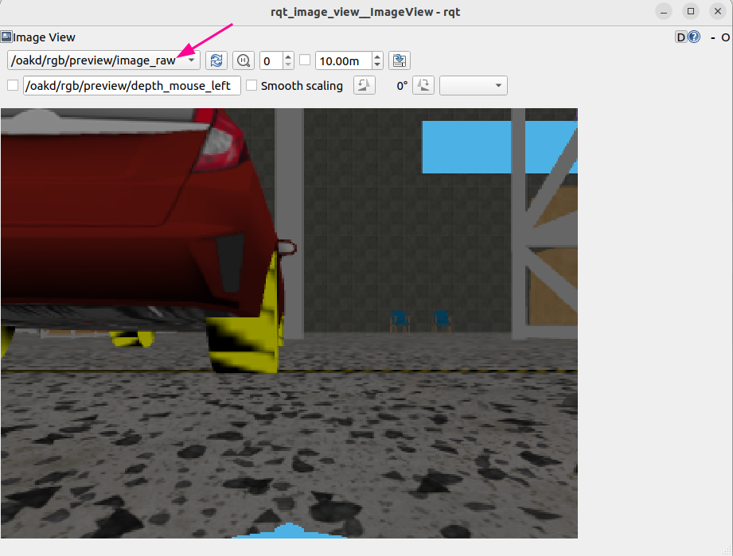

# RGB Camera

> 원본: https://indecisive-freedom-6e8.notion.site/bb78e215779c8329b42081d3133bb4f5  
> 최종 수정: 2026-10-02 16:33 / 변환: 2026-10-08 15:49

| 속성 | 값 |
|---|---|
| 환경 | ubuntu22.04,humble,Turtlebot4 |
| 상태 | 완료 |
| 순서 | 2-1 |

> 💡 **모든 작업은** **`rokey_venv`** **안에서 실행**해야 합니다.
>
> 터미널에 **(rokey_venv)** 가 없을 경우, **반드시** 아래 커맨드를 실행해 venv 환경을 활성화하세요.
>
> ```python
> source ~/venvs/rokey_venv/bin/activate
> ```

### 📝 RGB 카메라 토픽 확인

- 카메라 토픽은 undock 시 발행되므로, 먼저 undock 명령을 실행합니다.

  ```bash
  ros2 action send_goal /robot<n>/undock irobot_create_msgs/action/Undock "{}"
  ```

- 카메라 토픽 확인

  ```bash
  ros2 topic list | grep oakd
  ```

  ```yaml
  /robot<n>/oakd/rgb/preview/camera_info
  /robot<n>/oakd/rgb/preview/image_raw
  ```

#### RGB Camera:

- preview 토픽이 기본적으로 발행된다.

```bash
ros2 topic echo /robot<n>/oakd/rgb/preview/image_raw --once
```

```bash
mi@mi:~$ ros2 topic echo /robot<n>/oakd/rgb/preview/image_raw --once
header:
  stamp:
    sec: 587
    nanosec: 103000000
  frame_id: oakd_rgb_camera_optical_frame
height: 240
width: 320
encoding: rgb8
is_bigendian: 0
step: 960
data:
- 84
- 84
- 84
- 84
- 84
- 84
- 84

```

#### Image View를 통해 보기

```bash
ros2 run rqt_image_view rqt_image_view 
```

#### rviz2

```bash
rivz2
```





#### Camera Info:

```bash
ros2 topic echo /robot<n>/oakd/rgb/preview/camera_info --once
```

```bash
mi@mi:~$ ros2 topic echo /robot<n>/oakd/rgb/preview/camera_info --once
header:
  stamp:
    sec: 854
    nanosec: 601000000
  frame_id: oakd_rgb_camera_optical_frame
height: 240
width: 320
distortion_model: plumb_bob
d:
- 0.0
- 0.0
- 0.0
- 0.0
- 0.0
k:
- 277.0
- 0.0
- 160.0
- 0.0
- 277.0
- 120.0
- 0.0
- 0.0
- 1.0
r:
- 1.0
- 0.0
- 0.0
- 0.0
- 1.0
- 0.0
- 0.0
- 0.0
- 1.0
p:
- 277.0
- 0.0
- 160.0
- 0.0
- 0.0
- 277.0
- 120.0
- 0.0
- 0.0
- 0.0
- 1.0
- 0.0
binning_x: 0
binning_y: 0
roi:
  x_offset: 0
  y_offset: 0
  height: 0
  width: 0
  do_rectify: false
---

```

#### CameraInfo 메시지 구조와 의미

| 필드 이름 | 의미 | 예시 값 |
|---|---|---|
| `header.stamp` | 타임스탬프 (촬영된 시각) | sec=854, nanosec=601000000 |
| `header.frame_id` | 이미지가 속한 좌표계 프레임 이름 | oakd_rgb_camera_optical_frame |
| `height` | 이미지 높이 (픽셀) | 240 |
| `width` | 이미지 너비 (픽셀) | 320 |
| `distortion_model` | 왜곡 모델 이름 (plumb_bob = OpenCV 표준 모델) | plumb_bob |
| `d` | 왜곡 계수 (lens distortion parameters) | [0.0, 0.0, 0.0, 0.0, 0.0] |
| `k` | 카메라 내부행렬 (3x3 intrinsic matrix) | 아래 설명 |
| `r` | 보정 행렬 (3x3 rectification matrix) | 단위행렬 (identity) |
| `p` | 프로젝션 행렬 (3x4 projection matrix) | 아래 설명 |
| `binning_x` | 수평 binning (픽셀 압축) 수치 | 0 |
| `binning_y` | 수직 binning (픽셀 압축) 수치 | 0 |
| `roi` | Region of Interest (관심 영역) 설정 정보 | x_offset=0, y_offset=0 |

###  `k` (Intrinsic Matrix: 카메라 내부 파라미터)

```
[ fx  0  cx ]
[  0  fy  cy ]
[  0   0   1 ]
```

**예시:**

```
277.0  0.0  160.0
0.0    277.0 120.0
0.0    0.0    1.0
```

- **fx = 277.0** →  x 방향 확대 비율 (픽셀 단위)

- **fy = 277.0** →  y 방향 확대 비율(픽셀 단위)

- **cx = 160.0** → 이미지 좌표계에서 광학 중심(principal point) X 좌표

- **cy = 120.0** → 이미지 좌표계에서 광학 중심(principal point) Y 좌표

✅ 우리가 (u, v, z) → (x, y, z) 변환할 때 바로 쓰는 값들!

### 📝 RGB 설정 바꾸기

1. turtlebot4 로봇에 접속

   ```bash
   ssh ubuntu@<turtlebot4 IP 주소>
   # 비밀번호: turtlebot4
   ```

2. oakd_pro.yaml 파일 수정(**원본은 항상 백업**)

   ```bash
   cd /opt/ros/jazzy/share/turtlebot4_bringup/config
   
   #원본 백업
   sudo cp oakd_pro.yaml oakd_pro_orig.yaml
   
   #설정
   sudo nano oakd_pro.yaml
   ```

   #### oakd_pro_orig.yaml 내용이 다음과 같아야 합니다.

   ```bash
   /oakd:
     ros__parameters:
       camera:
         i_enable_imu: false
         i_enable_ir: false
         i_floodlight_brightness: 0
         i_laser_dot_brightness: 100
         i_nn_type: none
         i_pipeline_type: RGB
         i_usb_speed: SUPER_PLUS
       rgb:
         i_board_socket_id: 0
         i_fps: 30.0
         i_height: 720
         i_interleaved: false
         i_max_q_size: 10
         i_preview_size: 250
         i_enable_preview: true
         i_low_bandwidth: true
         i_keep_preview_aspect_ratio: true
         i_publish_topic: false
         i_resolution: '1080P'
         i_width: 1280
       use_sim_time: false
   ```

#### preview 이미지 사이즈 변경하기:

1. **250 X 250에서  320 x 320 사이즈로 수정**

   ```bash
   /oakd:
     ros__parameters:
       camera:
         i_enable_imu: false
         i_enable_ir: false
         i_floodlight_brightness: 0
         i_laser_dot_brightness: 100
         i_nn_type: none
         i_pipeline_type: RGB
         i_usb_speed: SUPER_PLUS
       rgb:
         i_board_socket_id: 0
         i_fps: 30.0
         i_height: 720
         i_interleaved: false
         i_max_q_size: 10
         i_preview_size: 320    #Resizes to 320x320
         i_enable_preview: true
         i_low_bandwidth: true
         i_keep_preview_aspect_ratio: true
         i_publish_topic: true  #Publishes RGB Topics
         i_resolution: '1080P'
         i_width: 1280
       use_sim_time: false
   
   ```

2. turtlebot4 로봇 설정 적용 및 ros restart

   ```bash
   turtlebot4-source
   turtlebot4-service-restart
   ```

3. 설정이 반영되었는지 확인

   ```bash
   ros2 topic echo /robot<n>/oakd/rgb/preview/camera_info --once
   ```

   - Image View를 통해 보기

   ```bash
   ros2 run rqt_image_view rqt_image_view 
   ```

   

#### 원본 이미지 발행 및 사이즈 변경하기:

1. preview 토픽이 아닌 원본 이미지를 발행

```bash
/oakd:
  ros__parameters:
    camera:
      i_enable_imu: false
      i_enable_ir: false
      i_floodlight_brightness: 0
      i_laser_dot_brightness: 100
      i_nn_type: none
      i_pipeline_type: RGB
      i_usb_speed: SUPER_PLUS
    rgb:
      i_board_socket_id: 0
      i_fps: 30.0
      i_height: 480
      i_interleaved: false
      i_max_q_size: 10
      i_preview_size: 250    
      i_enable_preview: true
      i_low_bandwidth: true
      i_keep_preview_aspect_ratio: true
      i_publish_topic: true
      i_resolution: '1080P'
      i_width: 640
    use_sim_time: false

```

3. turtlebot4 로봇 설정 적용 및 ros restart

   ```bash
   turtlebot4-source
   turtlebot4-service-restart
   ```

4. 설정이 반영되었는지 확인

   1. 재시작 후 몇 초 기다린 뒤 `ros2 topic list`  확인

      ```yaml
      /robot<n>/oakd/rgb/camera_info
      /robot<n>/oakd/rgb/image_raw
      /robot<n>/oakd/rgb/image_raw/compressed
      /robot<n>/oakd/rgb/image_raw/compressedDepth
      /robot<n>/oakd/rgb/image_raw/theora
      /robot<n>/oakd/rgb/preview/image_raw/zstd
      /robot<n>/oakd/rgb/preview/camera_info
      /robot<n>/oakd/rgb/preview/image_raw
      ```

   2. 토픽 echo 확인

      ```bash
      ros2 topic echo /robot<n>/oakd/rgb/camera_info --once
      ```

      ```bash
      ros2 topic echo /robot<n>/oakd/rgb/image_raw --once
      ```

- 카메라 토픽 확인

  ```bash
  ros2 topic list | grep oakd
  ```

  ```yaml
  /robot<n>/oakd/rgb/camera_info
  /robot<n>/oakd/rgb/image_raw
  /robot<n>/oakd/rgb/image_raw/compressed
  /robot<n>/oakd/rgb/image_raw/compressedDepth
  /robot<n>/oakd/rgb/image_raw/theora
  /robot<n>/oakd/rgb/preview/camera_info
  /robot<n>/oakd/rgb/preview/image_raw
  ```
