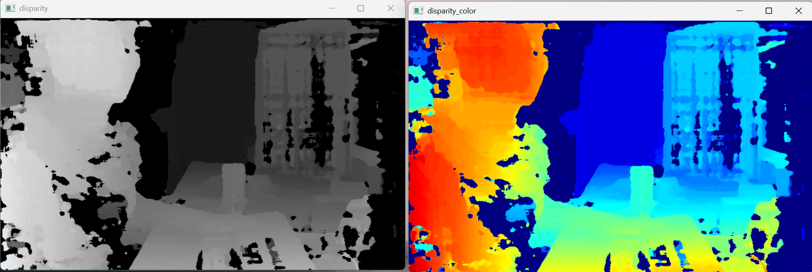
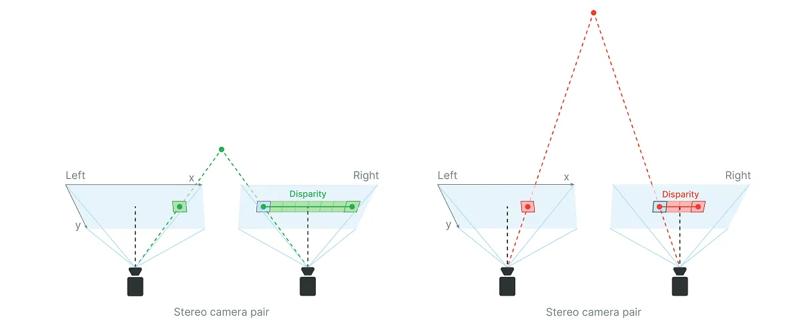

# Depth Camera

> 원본: https://indecisive-freedom-6e8.notion.site/6698e215779c824b85cf01d25b9a6143  
> 최종 수정: 2026-10-02 16:33 / 변환: 2026-10-08 15:49

| 속성 | 값 |
|---|---|
| 환경 | ubuntu22.04,humble,Turtlebot4 |
| 상태 | 완료 |
| 순서 | 2-3 |

#### 🔍 어떤 원리로 동작하나?

1. **스테레오 카메라 (왼쪽/오른쪽)** 간의 시차(disparity)를 계산

2. disparity 값을 통해 픽셀당 거리(mm 단위)를 계산

3. 이 결과를 2D 이미지로 만들어 시각화 (깊이에 따라 색상 다르게 표현 가능)



#### 🔍 시차(Disparity)란?

**스테레오 카메라에서 동일한 물체가 왼쪽 카메라와 오른쪽 카메라에서 찍힌 위치 차이**를 말한다.

- **왼쪽: 가까운 물체일수록**

  - 왼쪽과 오른쪽 카메라에서의 위치 차이가 `7픽셀` 난다.

  - 시차가 크다.

  - disparity가 큰 값은 가까운 거리로 계산

- **오른쪽: 먼 물체일수록**

  - 왼쪽과 오른쪽 카메라에서의 위치 차이가 `3픽셀` 난다.

  - 시차가 작다.

  - 먼 거리로 계산



### 📝 Depth 카메라 토픽 확인

```bash
ros2 topic list
```

> 📢 기본적으로 Depth 카메라 토픽은 발행되지 않는다!!
>
> 설정을 통해서 발행되도록 해야 한다.

#### 참고 문서: 로봇에 설치되어 있는 소스코드 참고:

🔖 [turtlebot4_robot/turtlebot4_bringup at jazzy · turtlebot/turtlebot4_robot](https://github.com/turtlebot/turtlebot4_robot/tree/jazzy/turtlebot4_bringup) — TurtleBot 4 Robot packages. Contribute to turtlebot/turtlebot4_robot development by creating an account on GitHub.

🔖 [Driver](https://docs.luxonis.com/software/ros/depthai-ros/driver/#Pipeline%20parameters#) — The DepthAI ROS Driver allows OAK cameras to operate as ROS2 Components or ROS1 Nodelets, enabling customization via ROS parameters. It supports launching multiple cameras, configuring sensors and managing neural networks.

### 📝 Depth 토픽 활성화

1. turtlebot4 로봇에 접속

   ```bash
   ssh ubuntu@<turtlebot4 IP 주소>
   
   #ssh ubuntu@
   ```

2. **(이전에 진행하였다면 skip)** oakd_pro.yaml 파일 백업 

   ```bash
   cd /opt/ros/jazzy/share/turtlebot4_bringup/config
   
   #원본 백업
   sudo cp oakd_pro.yaml oakd_pro_orig.yaml
   
   #설정
   sudo nano oakd_pro.yaml
   ```

3. 파라미터 수정:

   - **YOLO 실시간 추론**에 최적화

   - **Preview 이미지 크기**는 YOLO input에 맞게 가볍게

   - **Depth align 유지** (필요한 경우 3D 위치 계산용)

   - **최대한 경량화** (불필요한 기능 제거)

   - **ROS 네트워크 대역폭 최소화**

   위와 같이 **`i_pipeline_type: RGBD`로 변경**하면 DepthAI 드라이버가 **깊이 연산 파이프라인**을 로드합니다.

   ```bash
   # oakd_pro_new.yaml 파일 생성하여 내용 업데이트
   sudo nano oakd_pro_new.yaml
   ```

   #### oakd_pro_new.yaml

   ```bash
   /oakd:
     ros__parameters:
       use_sim_time: false
   
       camera:
         i_enable_imu: false
         i_enable_ir: false
         i_floodlight_brightness: 0
         i_laser_dot_brightness: 100
         i_nn_type: none
         i_pipeline_type: RGBD         # RGB + Depth
         i_usb_speed: SUPER_PLUS
   
       rgb:
         i_board_socket_id: 0
         i_width: 640
         i_height: 480
         i_fps: 30.0
         i_enable_preview: true
         i_interleaved: false
         i_low_bandwidth: true
         i_publish_topic: true
         i_resolution: '1080P'          
   
       left:
         i_fps: 10.0
   
       right:
         i_fps: 10.0
   
       stereo:  # ✅ Required to enable depth
         i_align_depth: true
         i_publish_topic: true
   
   ```

   ```bash
   # oakd_pro_new.yaml 파일의 내용을 oakd_pro.yaml에 덮어쓴다.
   sudo cp oakd_pro_new.yaml oakd_pro.yaml
   ```

4. Launch 파일 적용 및 ros 재시작

   설정을 변경했다면, 로봇 bringup에 적용해야 합니다.

   ```bash
   turtlebot4-source
   turtlebot4-service-restart
   ```

   카메라 토픽은 undock 시 발행되므로, 먼저 undock 명령을 실행합니다.

   ```bash
   ros2 action send_goal /robot<n>/undock irobot_create_msgs/action/Undock "{}"
   ```

   재시작 후 몇 초 기다린 뒤 `ros2 topic list`를 확인합니다.

   ```yaml
   /robot7/oakd/rgb/preview/camera_info
   /robot7/oakd/rgb/preview/image_raw
   /robot7/oakd/rgb/preview/image_raw/compressed
   /robot7/oakd/rgb/preview/image_raw/compressedDepth
   /robot7/oakd/rgb/preview/image_raw/theora
   /robot7/oakd/rgb/preview/image_raw/zstd
   /robot7/oakd/stereo/camera_info
   /robot7/oakd/stereo/image_raw
   /robot7/oakd/stereo/image_raw/compressed
   /robot7/oakd/stereo/image_raw/compressedDepth
   /robot7/oakd/stereo/image_raw/theora
   /robot7/oakd/stereo/image_raw/zstd
   ```

    #### ✅ 토픽별 설명 및 활용도

    |  |  |  |
    |---|---|---|
    | 토픽 이름 | 설명 | 사용 목적 |
    | `/oakd/rgb/preview/image_raw` | RGB 카메라의 원본 이미지 | YOLO 등 객체 인식, GUI 시각화 (OpenCV, RViz 등) |
    | `/oakd/rgb/preview/image_raw/compressed` | RGB 이미지의 압축 버전 (jpeg 등) | 네트워크 전송 최적화 (대역폭 절약용) |
    | `/oakd/rgb/preview/image_raw/compressedDepth` | (의미 없음) RGB는 depth가 없음 | 사용하지 않음 |
    | `/oakd/rgb/preview/image_raw/theora` | Theora 코덱으로 인코딩된 영상 스트림 | 웹 기반 뷰어나 저대역폭 스트리밍용 |
    | `/oakd/rgb/preview/camera_info` | RGB 카메라의 내부 파라미터 (K matrix 등) | 픽셀 좌표 → 3D 변환, 거리 측정, 카메라 캘리브레이션 |
    | `/oakd/stereo/image_raw` | 좌우 스테레오 영상 (gray scale or rectified) | Depth 계산의 원본 이미지 |
    | `/oakd/stereo/image_raw/compressed` | 의미 없음 (Depth는 압축 불필요) | 사용하지 않음 |
    | `/oakd/stereo/image_raw/compressedDepth` | 스테레오 영상의 압축 버전 | <br>대역폭 절약, 비주얼 디버깅 |
    | `/oakd/stereo/image_raw/theora` | Theora 기반 스트리밍 | 저지연 웹 스트리밍 용도 |
    | `/oakd/stereo/image_raw/zstd` | Zstandard 무손실 | 픽셀 보존, 압축/해제 매우 빠름 |
    | `/oakd/stereo/camera_info` | 스테레오 카메라 파라미터 (baseline, K matrix 등) | Depth 계산 및 3D point 변환 |
