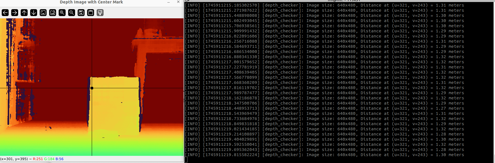

# Robot_Depth

> 원본: https://indecisive-freedom-6e8.notion.site/ddd8e215779c827b95ca810e2a07d426  
> 최종 수정: 2026-10-06 09:03 / 변환: 2026-10-08 15:49

| 속성 | 값 |
|---|---|
| 환경 | ubuntu22.04,humble |
| 상태 | 완료 |
| 순서 | 2-4 |

> 💡 **모든 작업은** **`rokey_venv`** **안에서 실행**해야 합니다.
>
> 터미널에 **(rokey_venv)** 가 없을 경우, **반드시** 아래 커맨드를 실행해 venv 환경을 활성화하세요.
>
> ```python
> source ~/venvs/rokey_venv/bin/activate
> ```

### 💡**Depth 토픽 활성화**

1. 토픽 리스트 확인

   ```yaml
   ros2 topic list
   ```

   - stereo 관련 확인

   ```yaml
   /robot<n>/oakd/stereo/camera_info
   /robot<n>/oakd/stereo/image_raw
   /robot<n>/oakd/stereo/image_raw/compressed
   /robot<n>/oakd/stereo/image_raw/compressedDepth
   /robot<n>/oakd/stereo/image_raw/theora
   /robot<n>/oakd/stereo/image_raw/zstd
   ```

### 💡**Depth 토픽으로 거리 측정하기**

#### CODE:depth checker

```python
import rclpy
from rclpy.node import Node
from sensor_msgs.msg import Image, CameraInfo
import numpy as np
import cv2
from cv_bridge import CvBridge

# ================================
# 설정 상수
# ================================
DEPTH_TOPIC = '/robot<n>/oakd/stereo/image_raw'  # Depth 이미지 토픽
CAMERA_INFO_TOPIC = '/robot<n>/oakd/stereo/camera_info'  # CameraInfo 토픽
MAX_DEPTH_METERS = 5.0                 # 시각화 시 최대 깊이 값 (m)
NORMALIZE_DEPTH_RANGE = 3.0            # 시각화 정규화 범위 (m)
# ================================

class DepthChecker(Node):
    def __init__(self):
        super().__init__('depth_checker')
        self.bridge = CvBridge()
        self.K = None
        self.should_exit = False

        self.subscription = self.create_subscription(
            Image,
            DEPTH_TOPIC,
            self.depth_callback,
            10)

        self.camera_info_subscription = self.create_subscription(
            CameraInfo,
            CAMERA_INFO_TOPIC,
            self.camera_info_callback,
            10)

    def camera_info_callback(self, msg):
        if self.K is None:
            self.K = np.array(msg.k).reshape(3, 3)
            self.get_logger().info(f"CameraInfo received: fx={self.K[0,0]:.2f}, fy={self.K[1,1]:.2f}, cx={self.K[0,2]:.2f}, cy={self.K[1,2]:.2f}")

    def depth_callback(self, msg):
        if self.should_exit:
            return

        if self.K is None:
            self.get_logger().warn('Waiting for CameraInfo...')
            return

        # depth_image: uint16 or float32 in mm
        depth_mm = self.bridge.imgmsg_to_cv2(msg, desired_encoding='passthrough')
        height, width = depth_mm.shape

        cx = self.K[0, 2]
        cy = self.K[1, 2]
        u, v = int(cx), int(cy)

        distance_mm = depth_mm[v, u]
        distance_m = distance_mm / 1000.0  # mm → m

        self.get_logger().info(f"Image size: {width}x{height}, Distance at (u={u}, v={v}) = {distance_m:.2f} meters")

        # 시각화용 정규화 (mm → m 고려)
        depth_vis = np.nan_to_num(depth_mm, nan=0.0)
        depth_vis = np.clip(depth_vis, 0, NORMALIZE_DEPTH_RANGE * 1000)  # mm
        depth_vis = (depth_vis / (NORMALIZE_DEPTH_RANGE * 1000) * 255).astype(np.uint8)

        # 컬러맵 적용
        depth_colored = cv2.applyColorMap(depth_vis, cv2.COLORMAP_JET)

        # 중심점 시각화
        cv2.circle(depth_colored, (u, v), 5, (0, 0, 0), -1)
        cv2.line(depth_colored, (0, v), (width, v), (0, 0, 0), 1)
        cv2.line(depth_colored, (u, 0), (u, height), (0, 0, 0), 1)

        cv2.imshow('Depth Image with Center Mark', depth_colored)

        key = cv2.waitKey(1) & 0xFF
        if key == ord('q'):
            self.should_exit = True

def main():
    rclpy.init()
    node = DepthChecker()

    try:
        while rclpy.ok() and not node.should_exit:
            rclpy.spin_once(node, timeout_sec=0.1)
    except KeyboardInterrupt:
        pass
    finally:
        node.destroy_node()
        rclpy.shutdown()
        cv2.destroyAllWindows()

if __name__ == '__main__':
    main()

```

#### CODE:depth checker mouse click

```python
import rclpy
from rclpy.node import Node
from sensor_msgs.msg import Image, CameraInfo
import numpy as np
import cv2
from cv_bridge import CvBridge

# ================================
# 설정 상수
# ================================
DEPTH_TOPIC = '/robot<n>/oakd/stereo/image_raw'  # Depth 이미지 토픽
CAMERA_INFO_TOPIC = '/robot<n>/oakd/stereo/camera_info'  # CameraInfo 토픽
MAX_DEPTH_METERS = 5.0                 # 시각화 시 최대 깊이 값 (m)
NORMALIZE_DEPTH_RANGE = 3.0            # 시각화 정규화 범위 (m)
WINDOW_NAME = 'Depth Image (Click to get distance)'
# ================================

class DepthChecker(Node):
    def __init__(self):
        super().__init__('depth_checker')
        self.bridge = CvBridge()
        self.K = None
        self.should_exit = False
        self.depth_mm = None  # 최신 depth 이미지 저장
        self.depth_colored = None  # 시각화 이미지 저장

        self.subscription = self.create_subscription(
            Image,
            DEPTH_TOPIC,
            self.depth_callback,
            10)

        self.camera_info_subscription = self.create_subscription(
            CameraInfo,
            CAMERA_INFO_TOPIC,
            self.camera_info_callback,
            10)

        # OpenCV 마우스 콜백 설정
        cv2.namedWindow(WINDOW_NAME)
        cv2.setMouseCallback(WINDOW_NAME, self.mouse_callback)

    def camera_info_callback(self, msg):
        if self.K is None:
            self.K = np.array(msg.k).reshape(3, 3)
            self.get_logger().info(f"CameraInfo received: fx={self.K[0,0]:.2f}, fy={self.K[1,1]:.2f}, cx={self.K[0,2]:.2f}, cy={self.K[1,2]:.2f}")

    def depth_callback(self, msg):
        if self.should_exit:
            return

        if self.K is None:
            self.get_logger().warn('Waiting for CameraInfo...')
            return

        self.depth_mm = self.bridge.imgmsg_to_cv2(msg, desired_encoding='passthrough')
        height, width = self.depth_mm.shape

        # 시각화 이미지 생성
        depth_vis = np.nan_to_num(self.depth_mm, nan=0.0)
        depth_vis = np.clip(depth_vis, 0, NORMALIZE_DEPTH_RANGE * 1000)
        depth_vis = (depth_vis / (NORMALIZE_DEPTH_RANGE * 1000) * 255).astype(np.uint8)
        self.depth_colored = cv2.applyColorMap(depth_vis, cv2.COLORMAP_JET)

        # 중심점 표시
        cx = int(self.K[0, 2])
        cy = int(self.K[1, 2])
        cv2.circle(self.depth_colored, (cx, cy), 5, (0, 0, 0), -1)
        cv2.line(self.depth_colored, (0, cy), (width, cy), (0, 0, 0), 1)
        cv2.line(self.depth_colored, (cx, 0), (cx, height), (0, 0, 0), 1)

        cv2.imshow(WINDOW_NAME, self.depth_colored)

        key = cv2.waitKey(1) & 0xFF
        if key == ord('q'):
            self.should_exit = True

    def mouse_callback(self, event, x, y, flags, param):
        if event == cv2.EVENT_LBUTTONDOWN and self.depth_mm is not None:
            distance_mm = self.depth_mm[y, x]
            distance_m = distance_mm / 1000.0  # mm → m
            self.get_logger().info(f"Clicked at (u={x}, v={y}) → Distance = {distance_m:.2f} meters")

def main():
    rclpy.init()
    node = DepthChecker()

    try:
        while rclpy.ok() and not node.should_exit:
            rclpy.spin_once(node, timeout_sec=0.1)
    except KeyboardInterrupt:
        pass
    finally:
        node.destroy_node()
        rclpy.shutdown()
        cv2.destroyAllWindows()

if __name__ == '__main__':
    main()

```

### 📝 Build & Test

1. **`setup.py`** 수정

   ```bash
       entry_points={
           'console_scripts': [
   				
   					#알아서 작성하세요.
           ],
       },
   ```

2. 빌드

   ```bash
   cd ~/rokey_ws
   colcon build --symlink-install --packages-select rokey_pjt
   source install/setup.bash
   ```

3. 로봇 실행

   ```bash
   #undock
   ros2 action send_goal /robot4/undock irobot_create_msgs/action/Undock "{}"
   
   #키보드 제어
   ros2 run teleop_twist_keyboard teleop_twist_keyboard --ros-args -p stamped:=true -r /cmd_vel:=/robot<n>/cmd_vel
   ```

4. 노드 실행

   ```bash
   #depth camera로부터 거리값 출력
   ros2 run rokey_pjt depth_checker
   
   
   #마우스 클릭한 픽셀 거리값 출력
   ros2 run rokey_pjt depth_checker_click
   ```

   

   
