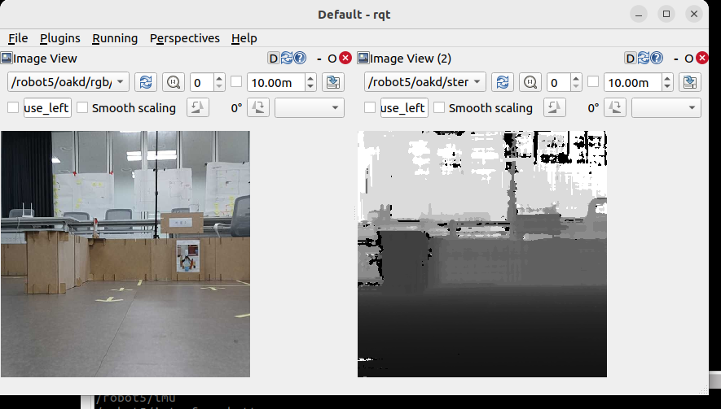

# Aligned RGB/Depth FOV/Dim.

> 원본: https://indecisive-freedom-6e8.notion.site/7568e215779c83ffa3ab01fd85a4f091  
> 최종 수정: 2026-10-02 12:53 / 변환: 2026-10-08 15:49

| 속성 | 값 |
|---|---|
| 상태 | 시작 전 |
| 환경 | Turtlebot4 |
| 차시 | 2-9-1 |



704X704 720p

```bash
/oakd:
  ros__parameters:
    camera:
      i_enable_imu: false
      i_enable_ir: false
      i_floodlight_brightness: 0
      i_laser_dot_brightness: 100
      i_nn_type: none
      i_pipeline_type: RGBD
      i_usb_speed: SUPER_PLUS
    rgb:
      i_board_socket_id: 0
      i_fps: 10.0
      i_height: 704
      i_interleaved: false
      i_max_q_size: 10
      i_preview_size: 352
      i_enable_preview: true
      i_low_bandwidth: true
      i_keep_preview_aspect_ratio: true
      i_publish_topic: true
      i_resolution: '1080P'
      i_width: 704

    use_sim_time: false

    left:
      i_fps: 10.0

    right:
      i_fps: 10.0

    stereo:  # ✅ Required to enable depth
      i_align_depth: true
      i_publish_topic: true

```
