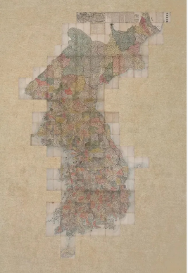
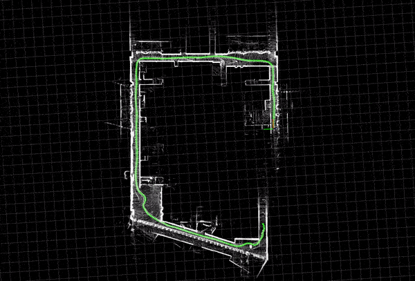
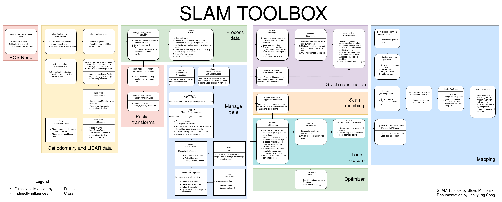

# SLAM 개요

> 원본: https://indecisive-freedom-6e8.notion.site/35f8e215779c821597578174bd08452e  
> 최종 수정: 2026-10-06 12:15 / 변환: 2026-10-08 15:49

| 속성 | 값 |
|---|---|
| 상태 | 완료 |
| 수정 | 대기 |
| 차시 | 3-0 |
| 환경 | ubuntu24.04,jazzy |

### 💡 **SLAM(Simultaneous Localization and Mapping) 이란?**

**S**imultaneous   동시적

**L**ocalization     위치 추정

**A**nd                  및

**M**apping          지도작성

#### Localization:

- 지도가 주어진 상황에서 공간 속 **내 위치 찾기**

*에버랜드 지도*

#### Mapping:

- 이동 정보가 주어진 상황에서 지도 만들기

*대동여지도*

#### SLAM:

- SLAM 알고리즘은 이 두 가지 문제를 동시에 해결하기 위해 설계됨

  - Localization과 Mapping을 동시에 수행
    

-  다양한 센서 데이터를 사용하여 주변 환경을 인식하고, 이를 바탕으로 지도를 생성하면서 로봇의 위치를 실시간으로 추적

  - 로봇은 이전에 본 적 없는 환경에서도 자신이 어디에 있는지 알고, 그 환경의 지도를 만들어낼 수 있음

    
    *chicken and egg problem*

### 💡 2D Lidar SLAM framework.

](assets_01_SLAM/img_04.png)
*[https://www.mdpi.com/2072-4292/17/7/1214](https://www.mdpi.com/2072-4292/17/7/1214)*

#### 1. Lidar

- **입력 장치**: TurtleBot4의 2D LiDAR 센서가 주변 환경을 스캔하여 거리 데이터를 제공합니다.

---

#### 2. Front-end Odometer (전방 처리기)

- **Data Preprocessing**: 센서 노이즈 제거, 스캔 정렬 등 사전 처리

- **Frame to Frame Matching**: 연속된 LiDAR 스캔 간의 상대적 이동 계산 (ex. ICP 알고리즘)

- **Pose Estimation**: 로봇의 현재 위치(pose) 추정

☞ **역할**: SLAM에서 **로봇이 지금 어디 있는지** 대략적으로 추정

---

#### 3. Back-end Optimization (후방 최적화기)

- **Kalman Filter**, **Particle Filter**, **Graph Optimization** 등의 방법으로

- 추정된 pose들을 **전체 경로 그래프**로 구성하고 오차 최소화

☞ **역할**: 로봇의 전체 경로를 다시 정렬하여 **정확한 지도와 위치** 확보

---

#### 4. Loop Detection (루프 클로저)

- 과거에 방문했던 위치와 현재 위치가 일치하는지를 탐지

- **위치 누적 오차를 보정**하기 위한 핵심 단계

☞ 예시: 로봇이 복도 한 바퀴를 돌고 처음 위치로 돌아왔을 때 이를 인식

    

---

#### 5. Global Grid Map (전역 격자 지도 생성)

- 최종적으로 백엔드에서 최적화된 위치 정보에 기반하여

- **Occupancy Grid Map (점유격자 지도)** 형식으로 지도 생성

---

#### 📌 흐름 요약 

- **"어디 있는지 추정"**: Front-end가 센서로 현재 위치를 계산

- **"지나온 길 보정"**: Back-end가 누적된 오차를 줄여 정확한 위치로 정렬

- **"지도 완성"**: 그 결과로 정교한 2D 지도 생성

### 💡 ROS2 Package로 제공

SLAM Toolbox는 2D 라이다 센서를 이용해 로봇이 실시간으로 지도를 만들고 자기 위치를 추정할 수 있도록 하는 고성능 SLAM 패키지이다.

