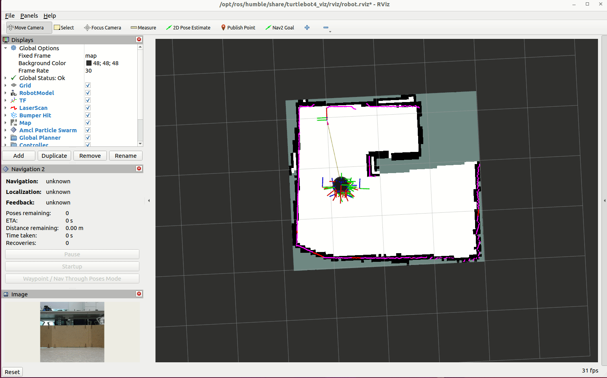
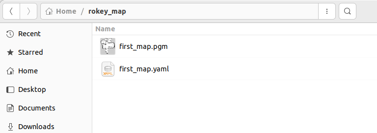
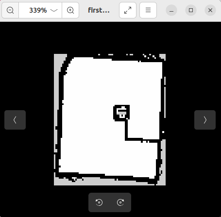

# Robot_SLAM

> 원본: https://indecisive-freedom-6e8.notion.site/8b68e215779c83f59d198176f700227e  
> 최종 수정: 2026-10-06 12:15 / 변환: 2026-10-08 14:05

| 속성 | 값 |
|---|---|
| 상태 | 완료 |
| 수정 | 대기 |
| 차시 | 3-1 |
| 환경 | ubuntu24.04,jazzy |

### ❗주의

- .baschrc 에 Robot Turtlebot4와 연결을 위한 설정 내용을 활성화해야 한다. 

  ```bash
  #the below are executed on PC
  
  Make sure bashrc has:
  export ROS_DOMAIN_ID = 0 # 각 조에 할당된 DOMAIN ID 지정
  alias ros-restart='ros2 daemon stop; ros2 daemon start'
  
  Make sure discovery setup.bash is sourced!
  
  source ~/.bashrc
  ```

  ```bash
  echo "/etc/turtlebot4_discovery/setup.bash"
  source /etc/turtlebot4_discovery/setup.bash
  ```

### 🔑 Operating the real Robot

> 💡 **모든 작업은** **`rokey_venv`** **안에서 실행**해야 합니다.
>
> 터미널에 **(rokey_venv)** 가 없을 경우, **반드시** 아래 커맨드를 실행해 venv 환경을 활성화하세요.
>
> ```python
> source ~/venvs/rokey_venv/bin/activate
> ```

- dock/undock 

  ```bash
  ros2 action send_goal /robot<n>/undock irobot_create_msgs/action/Undock "{}"
  ```

  ```bash
  ros2 action send_goal /robot<n>/dock irobot_create_msgs/action/Dock "{}"
  ```

-  teleop

  ```bash
  ros2 run teleop_twist_keyboard teleop_twist_keyboard
  
  ros2 run teleop_twist_keyboard teleop_twist_keyboard --ros-args -p stamped:=true -r /cmd_vel:=/robot<n>/cmd_vel
  ```

  ```
  his node takes keypresses from the keyboard and publishes them
  as Twist messages. It works best with a US keyboard layout.
  ---------------------------
  Moving around:
     u    i    o
     j    k    l
     m    ,    .
  
  For Holonomic mode (strafing), hold down the shift key:
  ---------------------------
     U    I    O
     J    K    L
     M    <    >
  
  t : up (+z)
  b : down (-z)
  
  anything else : stop
  
  q/z : increase/decrease max speeds by 10%
  w/x : increase/decrease only linear speed by 10%
  e/c : increase/decrease only angular speed by 10%
  
  CTRL-C to quit
  
  currently:  speed 0.5turn 1.0
  ```

### 🔑 Turtlebot4 SLAM

- Reference

  [User Manual · Turtlebot4 User Manual](https://turtlebot.github.io/turtlebot4-user-manual/)

0. Undock your robot

   ```bash
   ros2 action send_goal /robot<n>/undock irobot_create_msgs/action/Undock "{}"
   ```

1. SLAM 실행

   ```bash
   #Terminal 1
   ros2 launch turtlebot4_navigation slam.launch.py namespace:=/robot<n>
   ```

2. rviz 실행

   ```bash
   #Terminal 2
   ros2 launch turtlebot4_viz view_navigation.launch.py namespace:=/robot<n>
   #Undock and set init pose
   ```

3. 키보드 제어 실행

   ```bash
   #Terminal 3
   ros2 run teleop_twist_keyboard teleop_twist_keyboard --ros-args -p stamped:=true -r /cmd_vel:=/robot<n>/cmd_vel
   ```

4. 키보드로 월드를 탐험하며 지도를 만든다.

   

5. Map 저장하기

   - 폴더 생성하고 저장하기

     ```bash
     mkdir -p $HOME/rokey_ws/maps
     ```

   - 저장할 경로 및 파일 이름 지정

     ```bash
     #Terminal 4
     cd <map_directory>
     ros2 run nav2_map_server map_saver_cli -f "<map_name>" --ros-args -p map_subscribe_transient_local:=true -r __ns:=/robot<n> 
     
     ```

   |  |  |
   |---|---|
   | 인자 | 설명 |
   | `ros2 run nav2_map_server map_saver_cli` | **맵 저장 기능을 수행하는 CLI 노드** 실행. SLAM 또는 map_server가 제공하는 `/map` 토픽을 저장. |
   | `-f $HOME/rokey_ws/maps/first_map` | 저장할 맵 파일 이름 (prefix). 실제로는 `first_map.yaml`과 `first_map.pgm` 또는 `.png`가 생성됨. |
   | `--ros-args` | ROS 2 노드 실행 시 **추가 파라미터나 리맵**을 넘기기 위한 표준 옵션 시작점. |
   | `-p map_subscribe_transient_local:=true` | `/map` 토픽 구독 방식 설정. **Transient Local QoS**를 활성화하여 이전에 발행된 마지막 맵도 받을 수 있게 함. 즉, `map_server`가 먼저 실행된 경우에도 마지막 맵 메시지를 받아 저장 가능. |
   | `-r __ns:=/robot4` | 네임스페이스 리맵. 노드의 네임스페이스를 `/robot4`로 설정. 결과적으로 노드는 `/robot4/map_saver_cli`로 작동하며, `/robot4/map`을 구독함. |

   - pgm(맵 이미지) 파일과 yaml(속성) 파일이 생성된다.

   

   
