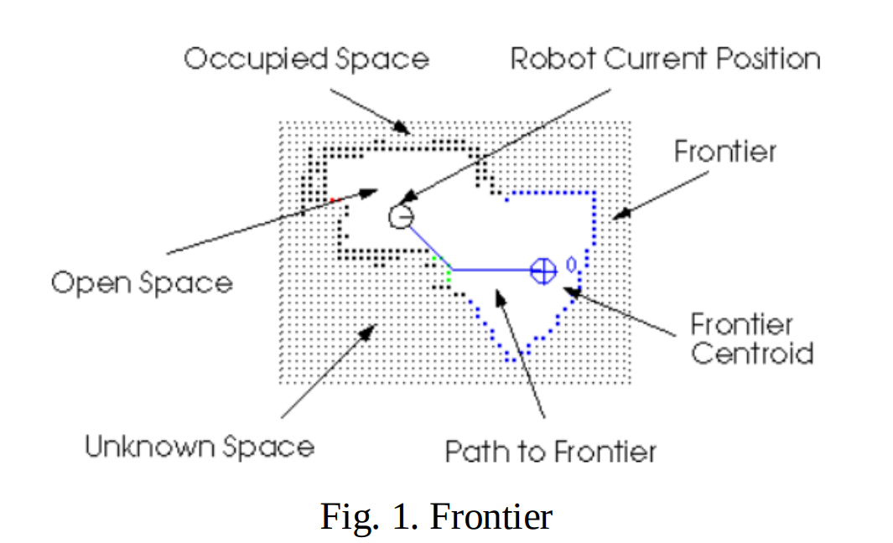
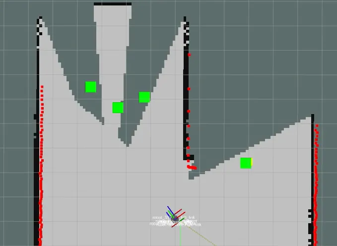

# Auto SLAM 개요

> 원본: https://indecisive-freedom-6e8.notion.site/4c58e215779c8318b4ed81486680c04d  
> 최종 수정: 2026-10-06 12:15 / 변환: 2026-10-08 14:05

| 속성 | 값 |
|---|---|
| 상태 | 완료 |
| 차시 | 3-2 |
| 환경 | ubuntu24.04,WSL2,jazzy |

### 🔑 핵심 개념

`explore_lite`는 TurtleBot4 같은 로봇이 **미지의 환경을 자율적으로 탐색**하도록 도와주는 패키지이다. 

SLAM을 수행하며 지도 작성이 진행될 때, **아직 탐색되지 않은 경계(froniter)**를 찾아 그쪽으로 이동하도록 한다.

1. **Robot Current Position**

   - 로봇의 현재 위치를 나타냅니다 (십자형 원 기호로 표시).

   - 이 위치를 기준으로 주변의 탐사 대상(Frontier)을 선정합니다.

2. **Occupied Space (검은 점)**

   - 센서(LiDAR 등)를 통해 **장애물**이 있다고 판단된 셀입니다.

   - 벽이나 가구 등 실제로 차 있는 공간에 해당합니다.

3. **Open Space (흰색)**

   - **로봇이 지나갈 수 있는 공간**으로, 센서를 통해 빈 공간임이 확인된 영역입니다.

   - 이 공간은 로봇이 자유롭게 움직일 수 있는 공간입니다.

4. **Unknown Space (점으로 표시된 영역)**

   - **아직 센서로 관측하지 못한 미지의 공간**입니다.

   - SLAM에서 흔히 `1`로 표시되는 셀입니다.

   - Frontier 탐사의 주요 대상입니다.

5. **Frontier**

   - **Open Space와 Unknown Space의 경계선**입니다.

   - 로봇은 이 경계선을 넘어서면 새로운 공간을 관측할 수 있으므로 탐사의 우선순위 대상이 됩니다.

6. **Frontier Centroid (작은 동그라미)**

   - 탐사 알고리즘은 여러 개의 Frontier를 찾아낸 후, 각 Frontier의 중심점(Centroid)을 계산합니다.

   - 이 중심점이 다음 탐사 목표가 됩니다.

7. **Path to Frontier (파란 직선)**

   - 현재 로봇 위치에서 선택된 Frontier 중심점까지의 경로입니다.

   - 이 경로는 Nav2 등 내비게이션 스택에 의해 계획되며, 로봇은 이 경로를 따라 이동합니다.

](assets_03_Auto_SLAM/img_03.png)
*[https://www.mdpi.com/2072-4292/13/23/4881](https://www.mdpi.com/2072-4292/13/23/4881)*

#### 탐사 흐름 요약

1. SLAM이 `Occupied`, `Open`, `Unknown` 공간을 식별함.

2. 탐사 노드가 `Open`과 `Unknown` 경계인 `Frontier`를 탐색함.

3. 가장 적절한 `Frontier`를 선택하고 중심점(Centroid)을 목표로 설정.

4. 로봇이 해당 지점으로 이동하고, 새로운 공간을 센서로 스캔.

5. SLAM이 지도를 업데이트 → 다시 Frontier 탐색 → 반복.
