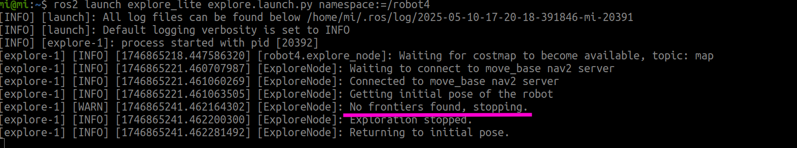
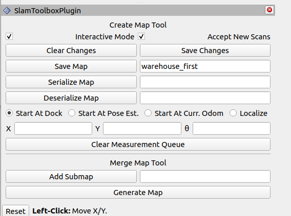
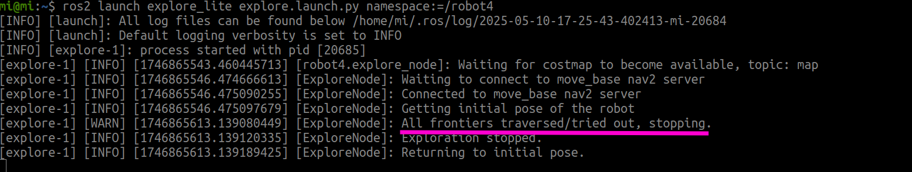
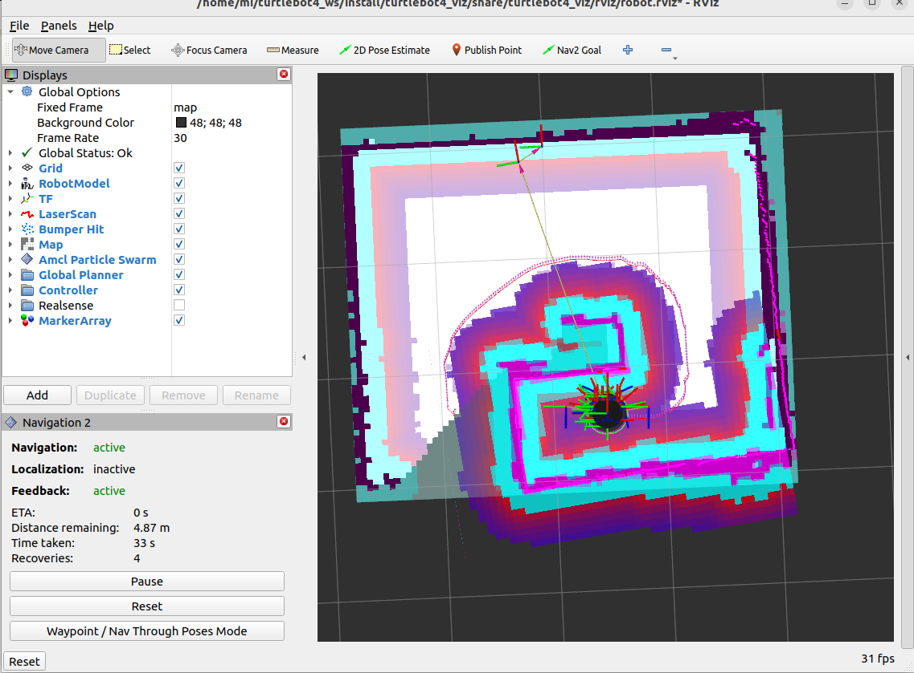
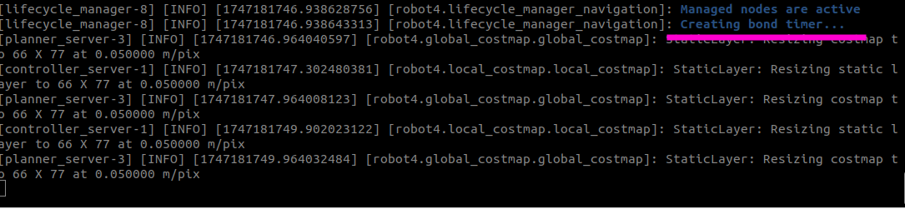
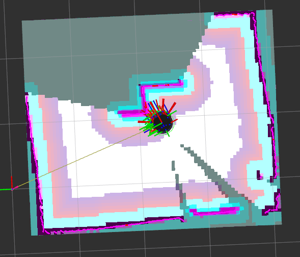
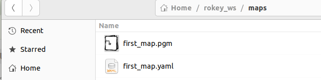

# Robot SLAM_explore_lite

> 원본: https://indecisive-freedom-6e8.notion.site/c2a8e215779c83528a7e019e7f7a3959  
> 최종 수정: 2026-10-06 12:15 / 변환: 2026-10-08 14:05

| 속성 | 값 |
|---|---|
| 상태 | 완료 |
| 수정 | 대기 |
| 차시 | 3-3 |
| 환경 | ubuntu24.04,jazzy |

> 💡 **모든 작업은** **`rokey_venv`** **안에서 실행**해야 합니다.
>
> 터미널에 **(rokey_venv)** 가 없을 경우, **반드시** 아래 커맨드를 실행해 venv 환경을 활성화하세요.
>
> ```python
> source ~/venvs/rokey_venv/bin/activate
> ```

### 💡 Auto SLAM

> ❗ **아래 순서대로 launch를 실행해야 합니다.** 

1. Turtlebot4 undock 

   ```bash
   ros2 action send_goal /robot<n>/undock irobot_create_msgs/action/Undock "{}"
   ```

2. SLAM 실행

   SLAM 노드 실행으로 라이다 기반으로 맵 생성 시작

   ```bash
   # Terminal 1
   ros2 launch turtlebot4_navigation slam.launch.py namespace:=/robot<n>
   ```

3. Rviz를 통한 시각화

   ```bash
   # Terminal 2
   ros2 launch turtlebot4_viz view_navigation.launch.py namespace:=/robot<n>
   ```

4. Nav2 Navigation Stack 실행

   Navigation stack 실행(map, costmap, planner, controller 등)

   ```bash
   # Terminal 3
   ros2 launch turtlebot4_navigation nav2.launch.py namespace:=robot<n>
   ```

5. explore_lite launch

   SLAM + Navigation이 모두 실행된 상태에서 explore_lite가 경로를 탐색함.

   ```bash
   # Terminal 4
   ros2 launch explore_lite explore.launch.py namespace:=/robot<n>
   ```

   map을 다 완성하면 `No frontiers` 메시지를 출력하며 종료한다. 

   

   🔗 video: <attachment:3342c9d5-80ac-4d05-a65f-9361e0e7e52f:explore_(online-video-cutter.com).mp4>

6. 저장할 경로 및 파일 이름 지정

   ```bash
   Terminal 5
   cd <map_directory>
   ros2 run nav2_map_server map_saver_cli -f "<map_name>" --ros-args -p map_subscribe_transient_local:=true -r __ns:=/robot<n> 
   
   ```

7. map 저장하기

   1. CLI 사용:

      폴더 생성하고 저장하기

      ```bash
      mkdir ~/rokey_ws/maps
      ```

      ```bash
      Terminal 5
      cd <map_directory>
      ros2 run nav2_map_server map_saver_cli -f “<map_name>" --ros-args -p map_subscribe_transient_local:=true -r __ns:=/robot<n> 
      ```

      - 명령어 구성 요소 설명

      |  |  |
      |---|---|
      | 구성 요소 | 설명 |
      | `ros2 run nav2_map_server map_saver_cli` | `nav2_map_server` 패키지의 `map_saver_cli` 실행. 맵을 저장하는 클라이언트 실행 |
      | `-f ~/rokey_ws/maps/first_map` | 저장할 맵 파일 이름(=prefix). `first_map.pgm`, `first_map.yaml` 파일로 저장됨 |
      | `--ros-args` | ROS 2 전용 인자 전달 시작 |
      | `-p map_subscribe_transient_local:=true` | 맵 토픽(`/map`)을 *transient local* 방식으로 구독하여, 기존 메시지를 즉시 수신 가능하게 설정 |
      | `-r __ns:=/robot<n>` | 노드의 네임스페이스를 `/robot4`로 리매핑. `/robot4/map`, `/robot4/map_metadata` 토픽을 대상으로 함 |

   2. slam_toolbox_plugin 사용:

      

<details><summary>**map이 완성되지 않았는데 중단되었을 경우:** </summary>

  inflation(장애물 주위의 위험 영역을 확장) 값에 의해 장애물로 가득차서 Navigation이 중단된 상태이다.

  파라미터 튜닝에 의해 inflation 값을 수정하고 시도한다.

  

  

  #### Nav2 파라미터 튜닝:inflation

  ```bash
  cd $HOME/turtlebot4_ws/src/turtlebot4/turtlebot4_navigation/config
  cp nav2.yaml <your_ws_dir>/<your_nav_config_filename>.yaml
  
  cd <your_ws_dir>
  nano <your_nav_config_filename>.yaml
  
  #update inflation_radius for local_costmap and global_costmap
  ```

  `inflation_radius`의 **단위는 미터(m)**

  **origin**

  ```bash
  # -- 중간 생략 ---
  local_costmap:
    local_costmap:
      ros__parameters:
  # -- 중간 생략 ---    
        inflation_layer:
          plugin: "nav2_costmap_2d::InflationLayer"
          cost_scaling_factor: 4.0
          inflation_radius: 0.45   
  ```

  **After**

  ```bash
  # -- 중간 생략 ---
  local_costmap:
    local_costmap:
      ros__parameters:
  # -- 중간 생략 ---    
        inflation_layer:
          plugin: "nav2_costmap_2d::InflationLayer"
          cost_scaling_factor: 4.0
          inflation_radius: 0.20   
  ```

  ```python
  global_costmap:
    global_costmap:
      ros__parameters:
      # -- 중간 생략 ---
      inflation_layer:
          plugin: "nav2_costmap_2d::InflationLayer"
          cost_scaling_factor: 4.0
          inflation_radius: 0.20    
  ```

  8-1. SLAM 시작

  8-2. Rviz 시작

  8-3. Nav2 파라미터 설정 파일을 지정해서 launch (둘 중 하나만 실행)

      use above example yaml or your file created in **Nav2 파라미터 튜닝:inflation** step

      ```bash
      ros2 launch turtlebot4_navigation nav2.launch.py namespace:=/robot<n> params_file:=$HOME/rokey_ws/configs/nav2_explorelite.yaml
      
      or
      
      ros2 launch turtlebot4_navigation nav2.launch.py namespace:=/robot<n> params_file:=$HOME/<your_ws_dir>/<your_nav_config_filename>.yaml
      ```

      **create bond timer… 까지 기다린다. (Nav2 내부 여러개의 서버들이 기동될 때까지 기다림.)**

      

      

  8-4. explore_lite 실행

</details>

8. map 확인하기

   

   
