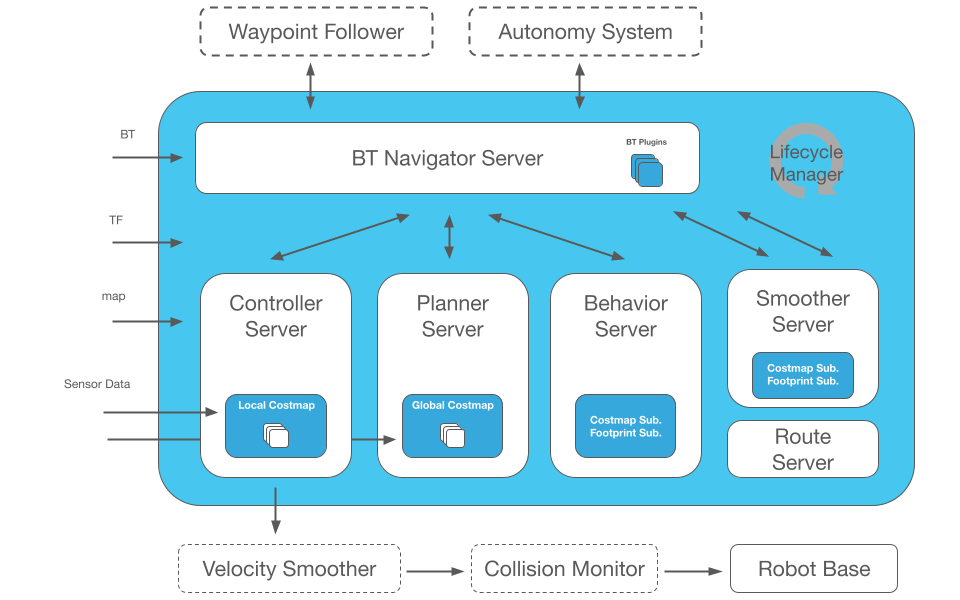

# Nav2 개요

> 원본: https://indecisive-freedom-6e8.notion.site/47e8e215779c83968c328159e88d3dc7  
> 최종 수정: 2026-10-06 12:57 / 변환: 2026-10-08 15:49

| 속성 | 값 |
|---|---|
| 상태 | 완료 |
| 차시 | 3-4 |

### 💡 Nav2는 무엇인가?

- **Nav2 (Navigation2)**: ROS2 기반 로봇 자율 주행 프레임워크

- 목적: 로봇이 지도 위에서 목적지까지 경로 계획 → 장애물 회피 → 이동 수행

|  |  |
|---|---|
| **Component** | **Description** |
| `Nav2 Navigation Server` | 큰 파란색 박스. 내부의 모든 것이 ROS 2 라이프사이클 노드로 실행됩니다. |
| `BT Navigator Server` | 최상단에 위치. 로봇이 다음에 무엇을 해야 할지 결정하는 Behavior Tree를 실행합니다: 경로 계획, 평활화, 제어, 복구, 대기 등. 웨이포인트 추종기와 상위 자율성 로직이 목표를 전달합니다. BT 플러그인은 추가할 수 있는 커스텀 리프 노드입니다. |
| `Controller Server` | 로컬 컨트롤러(DWB, RPP, MPPI 등)를 실행합니다. 입력: 로컬 코스트맵, 로봇 풋프린트, 센서 관측값. 출력: 하위로 전송되는 속도 명령(속도 평활화기 → 충돌 모니터 → 로봇 베이스). |
| `Planner Server` | 글로벌 경로를 계산합니다. 사용: 글로벌 코스트맵, 맵, TF. 출력은 BT Navigator로 전달되는 글로벌 경로입니다. |
| `Behavior Server` | 복구 동작을 처리합니다: 코스트맵 클리어, 회전, 후진, 대기. 이러한 동작들은 코스트맵과 풋프린트 구독을 읽습니다. |
| `Smoother Server` | 원본 글로벌 경로를 개선합니다(스플라인, 곡률 제한). 기하학적으로 인지하기 위해 코스트맵과 풋프린트를 구독합니다. 출력은 BT로 전달됩니다. |
| `Route Server` | 장거리 내비게이션을 위한 맵 경로를 제공합니다(종종 비활성화됨). |
| `Velocity Smoother` | 큰 박스 외부에 위치. 컨트롤러의 속도 명령을 받아 모터가 급격히 움직이지 않도록 부드러운 램프로 변환합니다. |
| `Collision Monitor` | 긴급 제동을 위해 센서 데이터를 모니터링합니다. 속도 평활화 이후, 베이스 직전에 작동합니다. |
| `Robot Base` | 안전하고 평활화된 속도 명령을 수신합니다. |
| `Lifecycle Manager` | ROS 2 라이프사이클 상태를 사용하여 모든 Nav2 서버를 시작, 중지 및 모니터링합니다. |
| `Data Flow` | TF, 맵, 센서 데이터가 코스트맵 서버로 흐릅니다. 코스트맵은 플래너, 컨트롤러, 스무더에 전달됩니다. 플래너 경로 → 스무더 → BT Navigator → 컨트롤러 → 속도 평활화기 → 충돌 모니터 → 로봇 베이스. Behavior 서버는 복구를 위해 BT에 연결됩니다. |

### 💡 **Nav2 실행 시 주요 상태 흐름**

1. launch 파일 실행 → lifecycle_manager가 각 노드 상태 관리 시작

2. 각 노드가 아래 순서로 전이:

   - **unconfigured → configuring → inactive → activating → active**

3. 모든 노드가 **active 상태**가 되면 네비게이션 준비 완료

4. `/amcl_pose`가 발행되면 **Localization 성공**

5. `/cmd_vel`로 속도 명령 발행 → 실제 이동

### ❌ 비정상 상황: 셧다운이 필요한 경우

|  |  |
|---|---|
| 상황 | 조치 |
| `amcl`에서 TF 관련 에러 (예: TF `extrapolation` 오류) | 맵 or 위치 초기화 문제. RViz 초기 포즈 다시 지정해보기 |
| `/amcl_pose` 미발행 | `amcl` 노드가 동작 안함. 다시 실행 필요 |
| 일부 노드가 `inactive` 상태에서 멈춤 | `lifecycle_manager`가 실패한 경우. 전체 셧다운 후 재실행 |
| RViz에 맵은 보이나 로봇 아이콘이 고정됨 | 위치 추정 실패. 포즈 재설정 필요 또는 셧다운 |

> 📢 
> #### 정리:
>
> - Nav2는 **여러 개의 노드**가 **순서대로 동작**해야 하는 **상태 기계** 기반 시스템이다.
>
> - 하나라도 제대로 활성화되지 않으면 전체 네비게이션이 실패할 수 있다.
>
> - **디버깅 시 핵심은**:
>
>   1. 맵이 떴는가?
>
>   2. 위치가 추정되고 있는가?
>
>   3. 모든 노드가 active인가?
>
>   4. 속도 명령이 나오는가?
>
>
> - 실패 시 전체 재시작이 빠를 수 있으나, **상태를 관찰해서 원인을 추론해보는 습관**이 중요하다.
