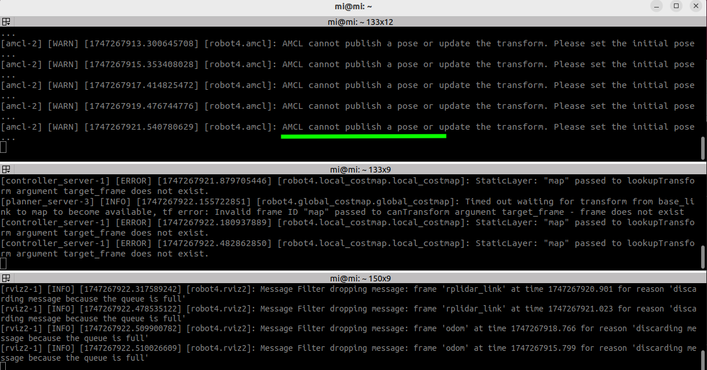
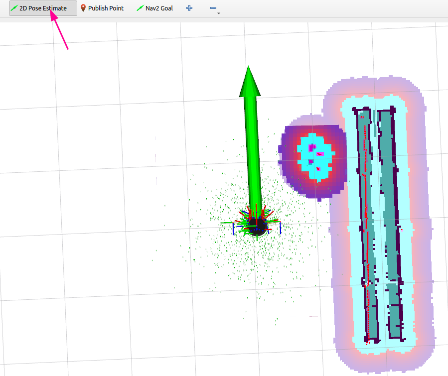
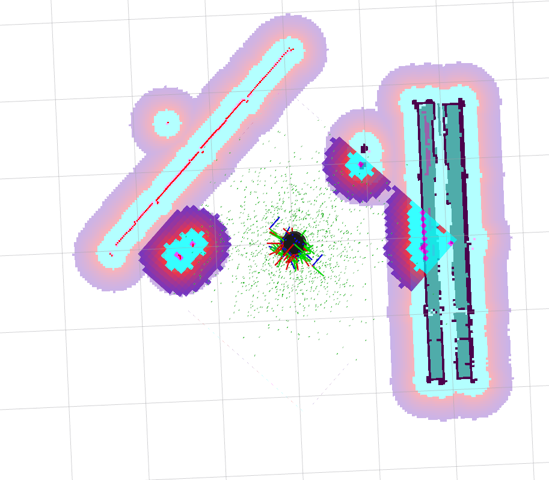
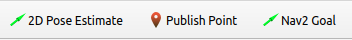
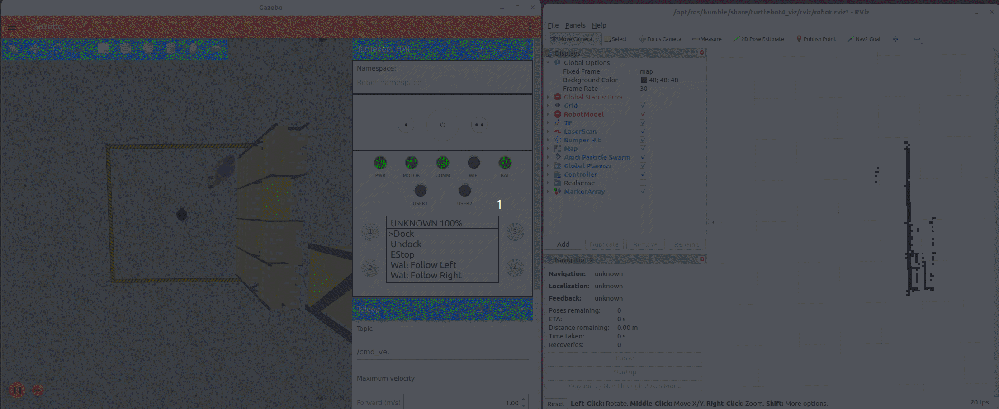

# Robot_Navigation

> 원본: https://indecisive-freedom-6e8.notion.site/09e8e215779c83a1ba3f810b07e956a8  
> 최종 수정: 2026-10-06 12:57 / 변환: 2026-10-08 14:05

| 속성 | 값 |
|---|---|
| 상태 | 완료 |
| 차시 | 3-5 |

> 💡 **모든 작업은** **`rokey_venv`** **안에서 실행**해야 합니다.
>
> 터미널에 **(rokey_venv)** 가 없을 경우, **반드시** 아래 커맨드를 실행해 venv 환경을 활성화하세요.
>
> ```python
> source ~/venvs/rokey_venv/bin/activate
> ```

### Navigation (1) 기본 실행

- Reference

  [User Manual · Turtlebot4 User Manual](https://turtlebot.github.io/turtlebot4-user-manual/)

0. Undock your robot

   ```bash
   ros2 action send_goal /robot<n>/undock irobot_create_msgs/action/Undock "{}"
   ```

1. localization 실행

   ```bash
   ros2 launch turtlebot4_navigation localization.launch.py \
     namespace:=/robot<n> \
     map:=$HOME/<map_directory>/<map_name>.yaml
   ```

2. rviz 실행

   ```bash
   ros2 launch turtlebot4_viz view_navigation.launch.py namespace:=/robot<n>
   ```

   

3. rviz에서 초기 위치 지정 (Send Initial Pose)

   <details><summary>`2D Pose Estimate 버튼`을 클릭 → 초기 pose 설정</summary>

     - rviz의 메뉴에서  **`2D Pose Estimate`** 선택하여 맵에서 로봇의 대략적인 **`초기 포즈를 설정`**합니다.

     
     *초기 위치가 실제 로봇의 위치와 방향이 맞는 경우*

     
     *초기 위치가 실제 로봇의 위치와 방향이 틀린 경우*

     - 이는 Nav2 스택이 로컬라이제이션을 시작할 위치를 설정하는데 필요합니다. 

     - 도구를 클릭한 다음 맵에서 화살표를 클릭하고 끌어 로봇의 위치와 방향을 대략적으로 추정합니다.

     

     

   </details>

4. navigation 실행

   ```bash
   ros2 launch turtlebot4_navigation nav2.launch.py namespace:=/robot<n>
   
   or
   
   ros2 launch turtlebot4_navigation nav2.launch.py namespace:=/robot<n> params_file:=$HOME/<your_ws_dir>/<your_nav_config_filename>.yaml
   ```

5. 목적지 지정

   ```bash
   on Rviz send goal
   ```

---

### Navigation (2) 파라미터 변경 후 실행

- Reference

  [User Manual · Turtlebot4 User Manual](https://turtlebot.github.io/turtlebot4-user-manual/)

0. Undock your robot

   ```bash
   ros2 action send_goal /robot<n>/undock irobot_create_msgs/action/Undock "{}"
   ```

1. localization 실행

   ```bash
   ros2 launch turtlebot4_navigation localization.launch.py \
     namespace:=/robot<n> \
     map:=$HOME/<map_directory>/<map_name>.yaml
   ```

2. rviz 실행

   ```bash
   ros2 launch turtlebot4_viz view_navigation.launch.py namespace:=/robot<n>
   ```

   

3. rviz에서 초기 위치 지정 (Send Initial Pose)

   <details><summary>`2D Pose Estimate 버튼`을 클릭 → 초기 pose 설정</summary>

     - rviz의 메뉴에서  **`2D Pose Estimate`** 선택하여 맵에서 로봇의 대략적인 **`초기 포즈를 설정`**합니다.

     
     *초기 위치가 실제 로봇의 위치와 방향이 맞는 경우*

     
     *초기 위치가 실제 로봇의 위치와 방향이 틀린 경우*

     - 이는 Nav2 스택이 로컬라이제이션을 시작할 위치를 설정하는데 필요합니다. 

     - 도구를 클릭한 다음 맵에서 화살표를 클릭하고 끌어 로봇의 위치와 방향을 대략적으로 추정합니다.

     

     

   </details>

4. **Nav2 파라미터 튜닝: inflation** 

   ```bash
   cd $HOME/turtlebot4_ws/src/turtlebot4/turtlebot4_navigation/config
   cp nav2.yaml <your_ws_dir>/<your_nav_config_filename>.yaml
   
   cd <your_ws_dir>
   nano <your_nav_config_filename>.yaml
   
   #update inflation_radius for local_costmap and global_costmap
   ```

   `inflation_radius`의 **단위는 미터(m)**

   **origin**

   ```bash
   # -- 중간 생략 ---
   local_costmap:
     local_costmap:
       ros__parameters:
   # -- 중간 생략 ---    
         inflation_layer:
           plugin: "nav2_costmap_2d::InflationLayer"
           cost_scaling_factor: 4.0
           inflation_radius: 0.45   
   ```

   **After**

   ```bash
   # -- 중간 생략 ---
   local_costmap:
     local_costmap:
       ros__parameters:
   # -- 중간 생략 ---    
         inflation_layer:
           plugin: "nav2_costmap_2d::InflationLayer"
           cost_scaling_factor: 4.0
           inflation_radius: 0.05    
   ```

   ```python
   global_costmap:
     global_costmap:
       ros__parameters:
       # -- 중간 생략 ---
       inflation_layer:
           plugin: "nav2_costmap_2d::InflationLayer"
           cost_scaling_factor: 4.0
           inflation_radius: 0.05    
   ```

4. navigation 실행 (둘 중 하나만 실행)

   ```bash
   ros2 launch turtlebot4_navigation nav2.launch.py namespace:=/robot<n> params_file:=$HOME/<your_ws_dir>/<your_nav_config_filename>.yaml
   ```

5. 목적지 지정

   ```bash
   on Rviz send goal
   ```

### Navigation_Python

#### ROS2 패키지 생성: rokey_pjt

```bash

cd ~/rokey_ws/src
ros2 pkg create --build-type ament_python --license Apache-2.0 rokey_pjt
```

#### Turtlebot4_navigation API 활용: 간단한 순차 이동만 필요할 때

📄 [Robot_TB4_nav_to_pose](06_Robot_Navigation/Robot_TB4_nav_to_pose.md)

📄 [Robot_TB4_nav_through_pose ](06_Robot_Navigation/Robot_TB4_nav_through_pose.md)

📄 [Robot_TB4_follow_waypoints ](06_Robot_Navigation/Robot_TB4_follow_waypoints.md)

#### Simple Commander API 활용: 수행 상태 추적, 제어 필요할 때

📄 [Robot_SC_nav_to_pose ](06_Robot_Navigation/Robot_SC_nav_to_pose.md)

📄 [Robot_SC_nav_through_pose ](06_Robot_Navigation/Robot_SC_nav_through_pose.md)

📄 [Robot_SC_follow_waypoints ](06_Robot_Navigation/Robot_SC_follow_waypoints.md)
