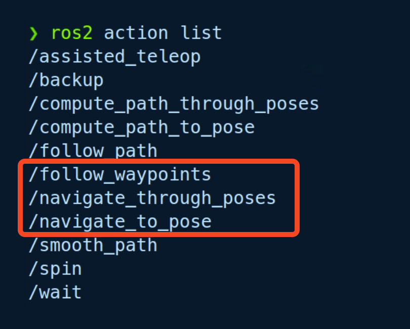

# Robot_SC_nav_through_pose

> 원본: https://indecisive-freedom-6e8.notion.site/3a48e215779c806fa34ee8fda6a886d0  
> 최종 수정: 2026-07-30 16:11 / 변환: 2026-10-08 14:07

### 학습 목표

### 핵심 개념

#### Simple Commander API

- **Nav2 Simple Commander**는 Python3 코드를 통해 Nav2 시스템에서 사용가능한 일련의 메서드를 제공합니다. 

- 즉, 내비게이션 스택과 쉽게 상호작용할 수 있는 **파이썬 API**라고 생각하면 됩니다.

- 파이썬 API를 사용하면 복잡한 네비게이션 명령어를 보다 직관적으로 작성할 수 있으며, C++에서는 아래 예시 코드와 같이 **`/navigate_to_pose`**, **`/navigate_through_poses`,** **`/follow_waypoints`** action을 활용하여 개발을 해야합니다.

  

- **`/navigate_to_pose`**, **`/navigate_through_poses`**, **`/follow_waypoints`** 액션은 ROS 2 네비게이션 스택에서 사용되는 주요 액션이며 각기 다른 방식으로 목표를 설정하고 이동합니다.

  - **`/navigate_to_pose`**

    - 로봇이 단일 목표 지점으로 이동하도록 지시

    - 단일 좌표(위치와 방향)를 포함하는 목표 포즈를 수신하여 로봇을 해당 위치로 이동시키는 데 사용

  - **`/navigate_through_poses`**

    - 로봇이 다중 목표 지점을 경유하여 최종 목표 지점에 도달하도록 지시

    - 복잡한 경로 설정과 중간 지점을 경유하는 이동에 적합

  - **`/follow_waypoints`**

    - 각 웨이포인트는 별도의 목표 지점으로 간주되며, 로봇은 한 웨이포인트에 도착한 후 다음 웨이포인트로 이동

    - 각 웨이포인트 마다 특정 동작을 수행할 때 적합

- 추가적인 **Simple Commander API**에 대한 정보는 [이 링크](https://docs.nav2.org/commander_api/index.html)를 참고해주세요.

  [Simple Commander API — Nav2 1.0.0 documentation](https://docs.nav2.org/commander_api/index.html)

### 코드 구현

#### **목표 지점 좌표 찾기:**

- localization 실행

  ```bash
  ros2 launch turtlebot4_navigation localization.launch.py namespace:=/robot<n> map:=$HOME/<map_directory>/<map_name>.yaml
  ```

- rivz 실행

  ```bash
  ros2 launch turtlebot4_viz view_robot.launch.py namespace:=/robot<n>
  ```

- RViz 상단에서 "Publish Point" 버튼 선택

  - 마우스 커서가 십자 모양으로 바뀜

  - 지도 위 원하는 위치를 클릭

- 새로운 좌표가 `/clicked_point` 토픽으로 발행됨

  ```bash
  ros2 topic echo /robot<n>/clicked_point
  ```

  ```bash
  mi@mi:~$ ros2 topic echo /robot4/clicked_point
  header:
    stamp:
      sec: 280
      nanosec: 407000000
    frame_id: map
  point:
    x: -1.491623992919922
    y: -2.1892388038635254
    z: 0.002471923828125
  ---
  ```

- **참고: loop cloure가 되면 안 됨.**

  

  - 현재 `xy_goal_tolerance`가 **0.25m**입니다.

  - 이 값 때문에 로봇이 목표 pose 근처에만 도달해도 **“도착했다”고 판단**되어 다음 pose로 넘어갈 수 있습니다.

#### **nav_through_poses.py:**

```python
#!/usr/bin/env python3

import rclpy
from rclpy.node import Node
from geometry_msgs.msg import PoseStamped
from nav2_simple_commander.robot_navigator import BasicNavigator, TaskResult
from turtlebot4_navigation.turtlebot4_navigator import TurtleBot4Navigator
from tf_transformations import quaternion_from_euler
import time

def create_pose(x, y, yaw_deg, navigator):
    """x, y, yaw(도 단위) → PoseStamped 생성"""
    pose = PoseStamped()
    pose.header.frame_id = 'map'
    pose.header.stamp = navigator.get_clock().now().to_msg()
    pose.pose.position.x = x
    pose.pose.position.y = y

    yaw_rad = yaw_deg * 3.141592 / 180.0
    q = quaternion_from_euler(0, 0, yaw_rad)
    pose.pose.orientation.x = q[0]
    pose.pose.orientation.y = q[1]
    pose.pose.orientation.z = q[2]
    pose.pose.orientation.w = q[3]
    return pose

def main():
    rclpy.init()

    dock_navigator = TurtleBot4Navigator()
    nav_navigator = BasicNavigator()

    # 초기 pose 설정
    initial_pose = create_pose(-0.01, -0.01, 0.0, nav_navigator)
    nav_navigator.setInitialPose(initial_pose)
    nav_navigator.get_logger().info(f'초기 위치 설정 중...')
    time.sleep(1.0) #AMCL이 초기 pose 처리 시 필요한 시간과 TF를 얻을 수 있게 됨

    nav_navigator.waitUntilNav2Active()

    if dock_navigator.getDockedStatus():
        dock_navigator.get_logger().info('도킹 상태 → 언도킹')
        dock_navigator.undock()

    # 목적지 경유지 3개 (한 번에 전달)
    goal_poses = [
        create_pose(-0.02, -1.39, 0.0, nav_navigator),
        create_pose(-1.65, -1.10, 90.0, nav_navigator),
        create_pose(-2.77, -1.29, 180.0, nav_navigator),
    ]

    # 한 번에 경로 전송
    nav_navigator.goThroughPoses(goal_poses)

    while not nav_navigator.isTaskComplete():
        feedback = nav_navigator.getFeedback()
        if feedback:
            nav_navigator.get_logger().info(
                f'경유지 이동 중, 남은 거리: {feedback.distance_remaining:.2f} m'
            )

    result = nav_navigator.getResult()
    if result == TaskResult.SUCCEEDED:
        nav_navigator.get_logger().info('모든 경유지 도달 완료')
        dock_navigator.dock()
    else:
        nav_navigator.get_logger().warn(f'실패 코드: {result}')

    dock_navigator.destroy_node()
    nav_navigator.destroy_node()
    rclpy.shutdown()

if __name__ == '__main__':
    main()

```

### 빌드 및 실행

- 빌드

  ```bash
  cd ~/rokey_ws
  colcon build --packages-select rokey_pjt
  source install/setup.bash
  ```

- localization 실행

  ```bash
  ros2 launch turtlebot4_navigation localization.launch.py namespace:=/robot<n> map:=$HOME/<map_directory>/<map_name>.yaml
  ```

- rivz 실행

  ```bash
  ros2 launch turtlebot4_viz view_navigation.launch.py namespace:=/robot<n>
  ```

- nav2 실행

  ```bash
  ros2 launch turtlebot4_navigation nav2.launch.py namespace:=/robot<n>
  ```

- navigation node 실행

  ```bash
  ros2 run rokey_pjt nav_to_pose_sc --ros-args -r __ns:=/robot<n>
  ```
