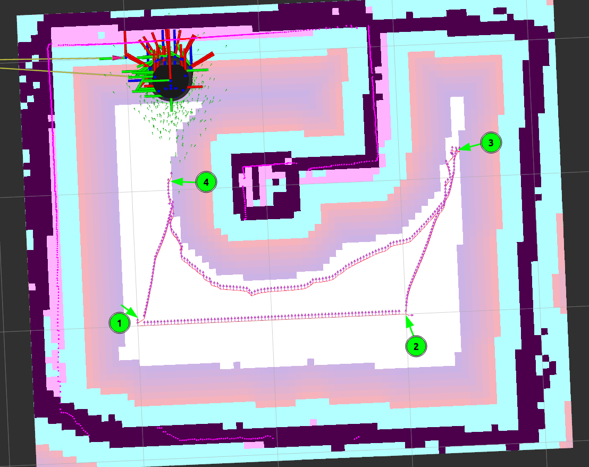

# Robot_TB4_nav_through_pose

> 원본: https://indecisive-freedom-6e8.notion.site/3a48e215779c8027aba6fb195aaade8c  
> 최종 수정: 2026-07-30 16:11 / 변환: 2026-10-08 14:07

### 학습 목표

- 단일 목적지로 이동하는 `Nav2`의 핵심 사용법 익힌다.

### 핵심 개념

- **Nav2 Action Client 활용**

  - `NavigateThroughPoses` 액션을 통해 **여러 Pose**를 순차적으로 자동 이동

- **목표 경로(Pose) 리스트 생성**

  - `PoseStamped` 객체들을 리스트로 만들어 전달

- **지도(`map`) 좌표계 기준**

  - 좌표는 RViz의 `/clicked_point` 또는 Gazebo/지도에서 수동 추정 가능

- **TurtleBot4Directions 또는 쿼터니언 방향 지정**

### 코드 구현

#### **목표 지점 좌표 찾기:**

- localization 실행

  ```bash
  ros2 launch turtlebot4_navigation localization.launch.py namespace:=/robot<n> map:=$HOME/rokey_ws/maps/first_map.yaml
  ```

- rivz 실행

  ```bash
  ros2 launch turtlebot4_viz view_robot.launch.py namespace:=/robot<n>
  ```

- RViz 상단에서 "Publish Point" 버튼 선택

  - 마우스 커서가 십자 모양으로 바뀜

  - 지도 위 원하는 위치를 클릭

- 새로운 좌표가 `/clicked_point` 토픽으로 발행됨

  ```bash
  ros2 topic echo /robot<n>/clicked_point
  ```

  ```bash
  mi@mi:~$ ros2 topic echo /robot<n>/clicked_point
  header:
    stamp:
      sec: 280
      nanosec: 407000000
    frame_id: map
  point:
    x: -1.491623992919922
    y: -2.1892388038635254
    z: 0.002471923828125
  ---
  ```

- **참고: loop cloure가 되면 안 됨.**

  

  - 현재 `xy_goal_tolerance`가 **0.25m**입니다.

  - 이 값 때문에 로봇이 목표 pose 근처에만 도달해도 **“도착했다”고 판단**되어 다음 pose로 넘어갈 수 있습니다.

#### **nav_through_poses.py:**

```python
#!/usr/bin/env python3

import rclpy
from turtlebot4_navigation.turtlebot4_navigator import TurtleBot4Directions, TurtleBot4Navigator

# ======================
# 초기 설정 (파일 안에서 직접 정의)
# ======================
INITIAL_POSE_POSITION = [0.01, 0.01]
INITIAL_POSE_DIRECTION = TurtleBot4Directions.NORTH

GOAL_POSES = [
    ([-0.02, -1.39], TurtleBot4Directions.NORTH),
    ([-1.65, -1.10], TurtleBot4Directions.EAST),
    ([-2.77, -1.29], TurtleBot4Directions.SOUTH),
]
# ======================

def main():
    rclpy.init()
    navigator = TurtleBot4Navigator()

    if not navigator.getDockedStatus():
        navigator.info('Docking before initializing pose')
        navigator.dock()

    initial_pose = navigator.getPoseStamped(INITIAL_POSE_POSITION, INITIAL_POSE_DIRECTION)
    navigator.setInitialPose(initial_pose)

    navigator.waitUntilNav2Active()

    navigator.undock()

    goal_pose_msgs = [navigator.getPoseStamped(position, direction) for position, direction in GOAL_POSES]
    navigator.startThroughPoses(goal_pose_msgs)

    navigator.dock()

    rclpy.shutdown()

if __name__ == '__main__':
    main()

```

### 빌드 및 실행

- 빌드

  ```bash
  cd ~/rokey_ws
  colcon build --packages-select rokey_pjt
  source install/setup.bash
  ```

- localization 실행

  ```bash
  ros2 launch turtlebot4_navigation localization.launch.py namespace:=/robot<n> map:=$HOME/<map_directory>/<map_name>.yaml
  ```

- rviz 실행

  ```bash
  ros2 launch turtlebot4_viz view_navigation.launch.py namespace:=/robot<n>
  ```

- nav2 실행

  ```bash
  ros2 launch turtlebot4_navigation nav2.launch.py namespace:=/robot<n>
  
  ```

- navigation node 실행

  ```bash
  ros2 run rokey_pjt nav_through_poses --ros-args -r __ns:=/robot<n>
  ```

### 요약 정리

|  |  |
|---|---|
| 항목 | 설명 |
| 도킹 여부 확인 | `getDockedStatus()` |
| 도킹 수행 | `dock()` |
| 초기 포즈 설정 | `setInitialPose()` |
| 목표 위치 지정 | `getPoseStamped([x, y], 방향)` |
| 이동 명령 | `startToPose(goal_pose)` |
| 방향 정의 | `TurtleBot4Directions.NORTH`, `EAST`, ... |
