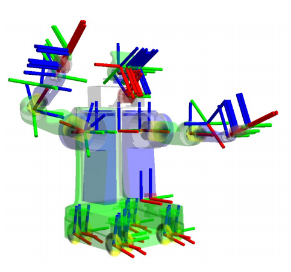
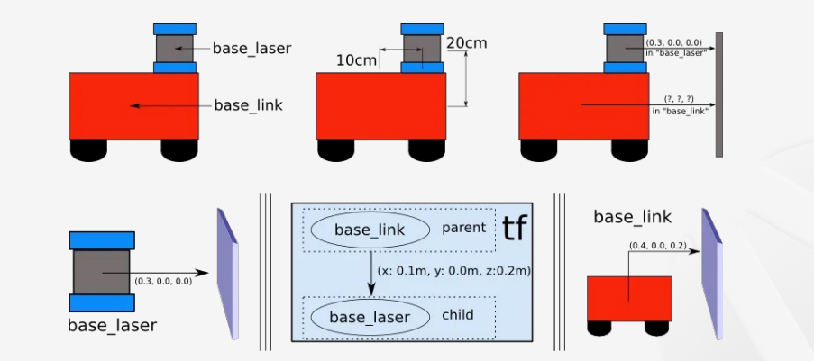
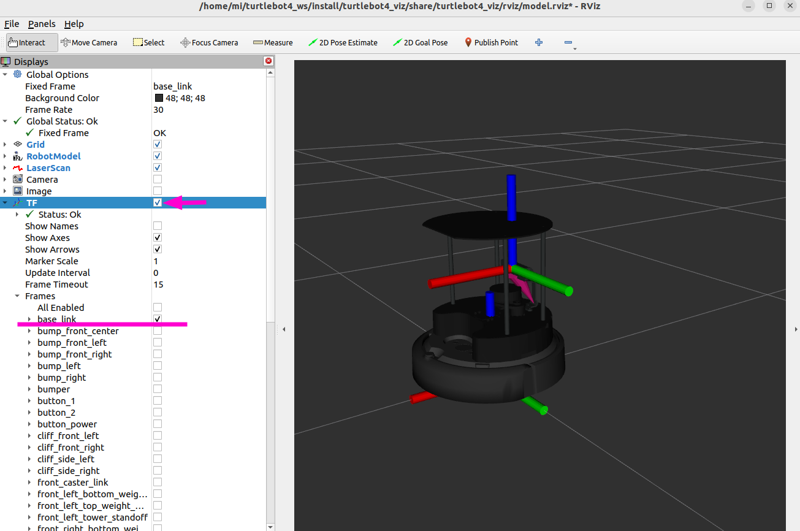

# TF Transform 개요

> 원본: https://indecisive-freedom-6e8.notion.site/31a8e215779c822aad5681a5db7afac6  
> 최종 수정: 2026-10-06 16:34 / 변환: 2026-10-08 14:06

| 속성 | 값 |
|---|---|
| 상태 | 완료 |
| 차시 | 3-6 |

### 💡 TF 

**TF**는 ROS(Robot Operating System)에서 **여러 좌표계(Frame)** 간의 **변환 관계(Transform)** 를 **실시간으로 관리하고 계산해주는 시스템**이다.

    

### 💡TF 관련 용어

- **프레임(Frame)**:

  - 로봇의 각 부분이나 환경의 기준점을 나타내는 **독립적인 좌표계**

  - 로봇의 부위, 센서, 지도 등에서 사용됨

  - ROS 메시지의 `header.frame_id`로 어떤 기준인지 명시

- **변환(Transform)**:

  - 한 프레임에서 **다른 프레임으로 좌표를 변환**

  - 위치(x, y, z 이동) + 회전(쿼터니언 등) 포함

  - 수학적으로는 **변환 행렬**로 표현됨

- **TF 시스템 (Transform)**:

  - ROS에서 **프레임 간의 관계를 실시간으로 관리**하는 시스템

  - ROS2는 `tf2` 라이브러리 사용

  - 여러 프레임을 트리 구조로 연결하여 변환 추적

### 💡TF 적용 예



1. 두 개의 프레임

   - `base_link`: 로봇 본체 중심 좌표계

   - `base_laser`: 레이저 센서 기준 좌표계

2. `base_link` 기준으로 레이저 센서는 **앞쪽으로 10cm**, **위쪽으로 20cm** 떨어진 위치에 있음

   - 두 프레임 간의 변환은 `(x: 0.1, y: 0.0, z: 0.2)`로 정의됨

3. 센서는 벽까지의 거리를 자체 좌표계(`base_laser`) 기준으로 측정함: `(0.3, 0.0, 0.0)`

4. 실제 로봇 제어에는 로봇 중심 좌표(`base_link`)  위치가 필요하고 

   TF를 통해 로봇 기준으로 변환하면

   (0.1 + 0.3, 0.0 + 0.0, 0.2 + 0.0) = (0.4, 0.0, 0.2)

### 💡Turtlebot4의 TF 살펴보기

```bash
ros2 launch turtlebot4_viz view_model.launch.py description:=true model:=standard
```


