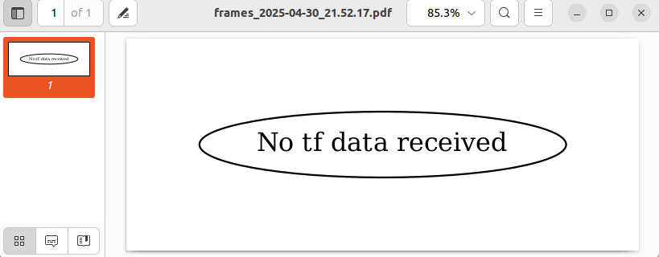
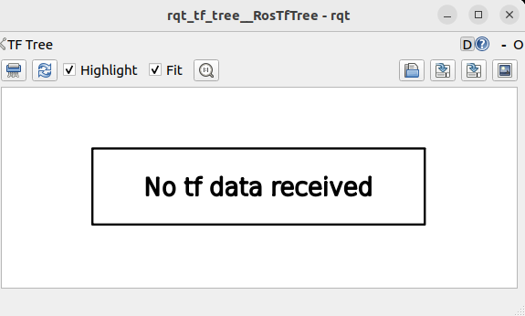
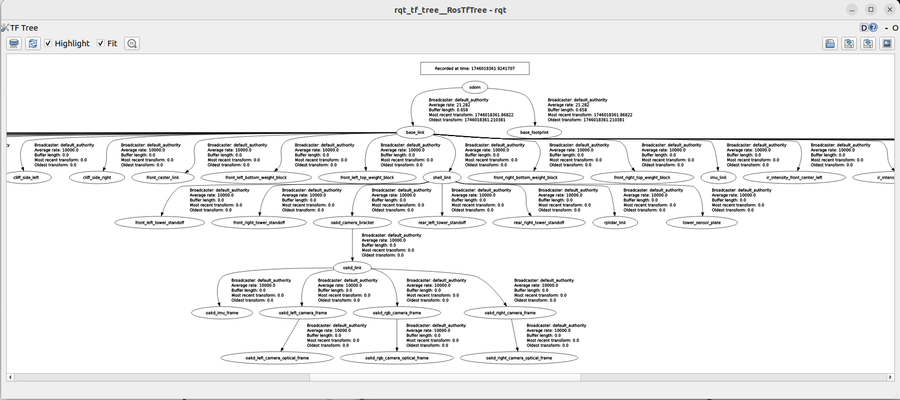

# Robot_TF Check

> 원본: https://indecisive-freedom-6e8.notion.site/f758e215779c8375b9438118217177b6  
> 최종 수정: 2026-10-06 16:34 / 변환: 2026-10-08 15:50

| 속성 | 값 |
|---|---|
| 상태 | 완료 |
| 차시 | 3-7 |

> 💡 **모든 작업은** **`rokey_venv`** **안에서 실행**해야 합니다.
>
> 터미널에 **(rokey_venv)** 가 없을 경우, **반드시** 아래 커맨드를 실행해 venv 환경을 활성화하세요.
>
> ```python
> source ~/venvs/rokey_venv/bin/activate
> ```

### TF tool 설치 

```bash
sudo apt update
sudo apt install ros-jazzy-tf2-tools
sudo apt install ros-jazzy-rqt-tf-tree
sudo apt install ros-jazzy-tf2-ros
```

|  |  |  |
|---|---|---|
| 기능 | 명령어 | 설명 |
| TF 트리 PDF 저장 | `ros2 run tf2_tools view_frames` | 모든 프레임 관계 시각화해서 `frames.pdf`로 저장 |
| 실시간 TF 트리 보기 | `ros2 run rqt_tf_tree rqt_tf_tree` | 실시간 parent-child 관계를 GUI로 보기 |
| 프레임 간 거리/방향 확인 | `ros2 run tf2_ros tf2_echo parent_frame child_frame` | 두 프레임 사이 변환 정보 실시간 출력 |

### TF 트리  

1. 전체 트리 PDF로 저장하기

   ```bash
   ros2 run tf2_tools view_frames
   ```

   - HOME 디렉토리에 **`frames.pdf`** 라는 파일로 저장됨

     

     - **tf data가 없다고 한다.**

2. rqt를 사용해서 실시간 트리 보기

   ```bash
   ros2 run rqt_tf_tree rqt_tf_tree
   ```

   - **tf data가 없다고 한다.**

     

3. tf 토픽 확인

   ```bash
   ros2 topic echo /robot<n>/tf
   ```

   ```bash
   - header:
       stamp:
         sec: 1746017486
         nanosec: 572811354
       frame_id: base_link
     child_frame_id: wheel_drop_left
     transform:
       translation:
         x: 0.0
         y: 0.1165
         z: 0.04020000000000001
       rotation:
         x: -0.7071067811865475
         y: 0.0
         z: 0.0
         w: 0.7071067811865476
   - header:
       stamp:
         sec: 1746017486
         nanosec: 572811354
       frame_id: base_link
     child_frame_id: wheel_drop_right
     transform:
       translation:
         x: 0.0
         y: -0.1165
         z: 0.04020000000000001
       rotation:
         x: -0.7071067811865475
         y: 0.0
         z: 0.0
         w: 0.7071067811865476
   ---
   
   ```

   - 실시간 토픽이 발행되고 있음.

4. tf_static 토픽 확인

   ```bash
   ros2 topic echo /robot<n>/tf_static
   ```

   ```bash
   - header:
       stamp:
         sec: 1746017482
         nanosec: 316816664
       frame_id: odom
     child_frame_id: base_link
     transform:
       translation:
         x: -0.03433799743652344
         y: -0.013935964554548264
         z: -0.0007764931069687009
       rotation:
         x: -0.003405071794986725
         y: -0.010774685069918633
         z: -0.02376922406256199
         w: 0.9996535778045654
   - header:
       stamp:
         sec: 1746017482
         nanosec: 316816664
       frame_id: odom
     child_frame_id: base_footprint
     transform:
       translation:
         x: -0.033905893441044554
         y: -0.013931648879735192
         z: 0.0
       rotation:
         x: 0.0
         y: 0.0
         z: -0.023736579343676567
         w: 0.9997182488441467
   ---
   
   ```

   - 실시간 토픽이 발행되고 있음.

> **[원인 분석 및 해결 방법]**
>
> - 원래 ROS 2 Python 노드는 기본적으로 **전역** **`/tf`** 와 **`/tf_static`** 토픽을 구독함
>
> - 그런데 **우리 로봇(TurtleBot4)** 은 **모든 TF를** **`/robot<n>/tf`,** **`/robot<n>/tf_static`에 발행**하고 있음
>
> - 그래서 그냥 실행하면 "map 프레임 없음" 에러가 난다
>
> - **따라서 실행할 때 이 노드가**
>
>   `/tf` 대신 `/robot<n>/tf`,
>
>   `/tf_static` 대신 `/robot<n>/tf_static`
>
>   을 구독하도록 **리매핑(remap)** 시켜줘야한다.

```bash
ros2 run rqt_tf_tree rqt_tf_tree --ros-args -r /tf:=/robot<n>/tf -r /tf_static:=/robot<n>/tf_static
```



> 🔔 **다음과 같은 에러 발생 시:**
>
> ```
> qt_gui_main() found no plugin matching "rqt_tf_tree.tf_tree.RosTfTree"
> try passing the option "--force-discover"
> Warning: class_loader.ClassLoader: SEVERE WARNING!!! Attempting to unload library while objects created by this loader exist in the heap! You should delete your objects before attempting to unload the library or destroying the ClassLoader. The library will NOT be unloaded.
> at line 127 in ./src/class_loader.cpp
> [ros2run]: Process exited with failure 1
> ```
>
> `--force-discover` 옵션을 통해, rqt의 플러그인 탐색 결과 목록을 지우고 다시 스캔해 목록을 업데이트한다.
>
> ```python
> # 옵션 사용 예시
> ros2 run rqt_tf_tree rqt_tf_tree --force-discover
> ```
