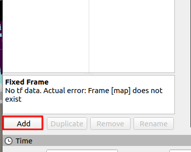
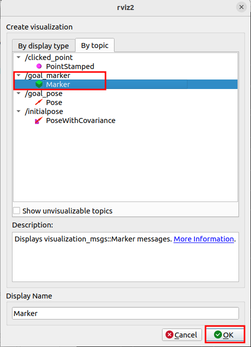
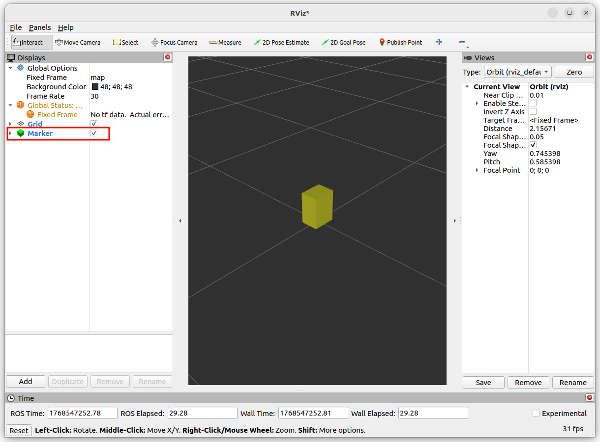
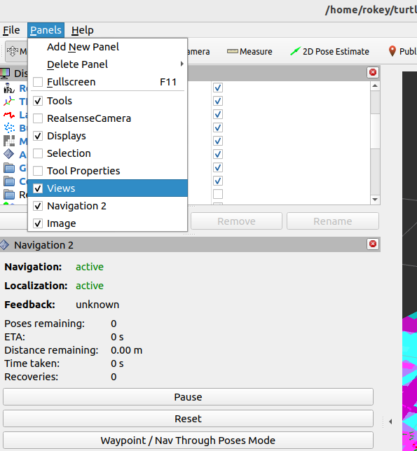
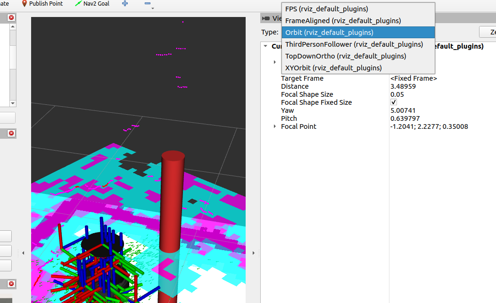
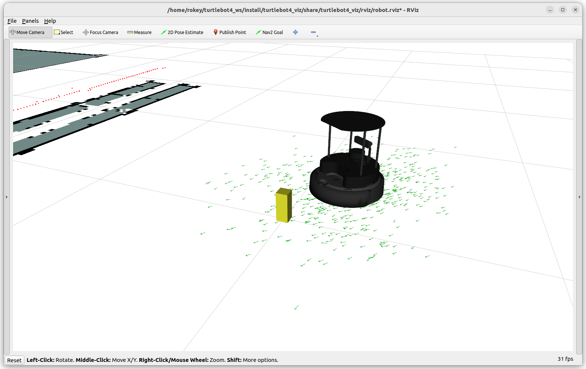
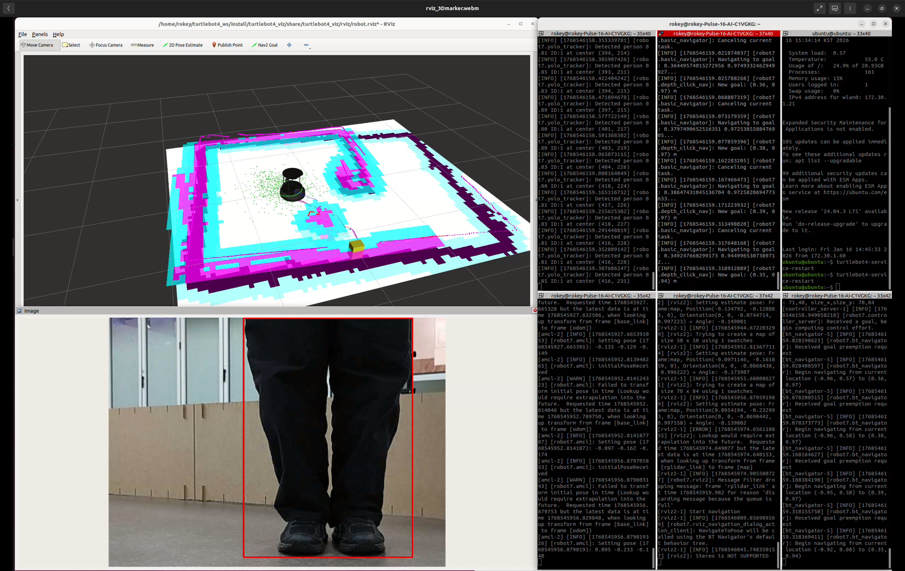

# Rviz에서 Marker 3D로 보는 방법

> 원본: https://indecisive-freedom-6e8.notion.site/4f48e215779c82c3bb3501900860db01  
> 최종 수정: 2026-07-30 16:12 / 변환: 2026-10-08 15:50

| 속성 | 값 |
|---|---|
| 순서 | 3-1 |

> 💡 **모든 작업은** **`rokey_venv`** **안에서 실행**해야 합니다.
>
> 터미널에 **(rokey_venv)** 가 없을 경우, **반드시** 아래 커맨드를 실행해 venv 환경을 활성화하세요.
>
> ```python
> source ~/venvs/rokey_venv/bin/activate
> ```

#### Marker Topic 추가

<details><summary>Marker Topic Publisher 예제</summary>

  ```javascript
  import rclpy
  from rclpy.node import Node
  from visualization_msgs.msg import Marker
  from geometry_msgs.msg import Point
  
  
  class MarkerPub(Node):
      def __init__(self):
          super().__init__('marker_pub')
          self.pub = self.create_publisher(Marker, 'visualization_marker', 10)
          self.timer = self.create_timer(0.5, self.tick)
  
      def tick(self):
          m = Marker()
          m.header.frame_id = 'map'          # RViz2 Fixed Frame과 일치시켜야 보임
          m.header.stamp = self.get_clock().now().to_msg()
          m.ns = 'demo'
          m.id = 0
          m.type = Marker.CUBE               # 3D 큐브
          m.action = Marker.ADD
          m.pose.position = Point(x=1.0, y=0.0, z=0.0)
          m.pose.orientation.w = 1.0
          m.scale.x = m.scale.y = m.scale.z = 0.3
          m.color.r, m.color.g, m.color.b, m.color.a = 1.0, 0.2, 0.2, 1.0
          self.pub.publish(m)
  
  
  def main():
      rclpy.init()
      rclpy.spin(MarkerPub())
  
  
  if __name__ == '__main__':
      main()
  ```

</details>

---

1. rviz 상의 토픽 Add 버튼 선택

   

2. By topic 탭에서 /goal_marker의 Marker 선택 후 OK하여 추가

   

3. Marker 토픽 상태가 정상일 경우 다음과 같이 rviz 상에 정상으로 표시됨.

   

#### View 변경

---

1. Panels에서 Views check



2. Type: TopDownOrtho → Orbit으로 변경

   

   TopDownOrtho를 제외한 모든 옵션은 3D로 나타나므로 필요한 시점에 따라 선택 가능

#### 예시 화면

---





🔗 video: <https://youtu.be/xKYYLx_jEaw>
