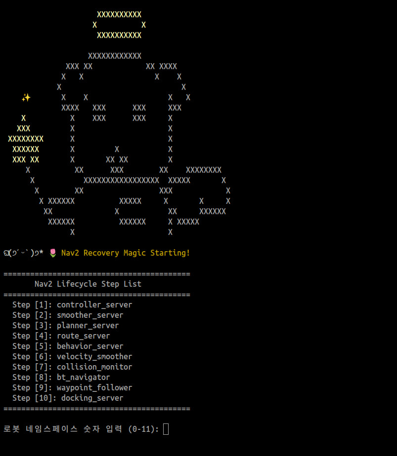
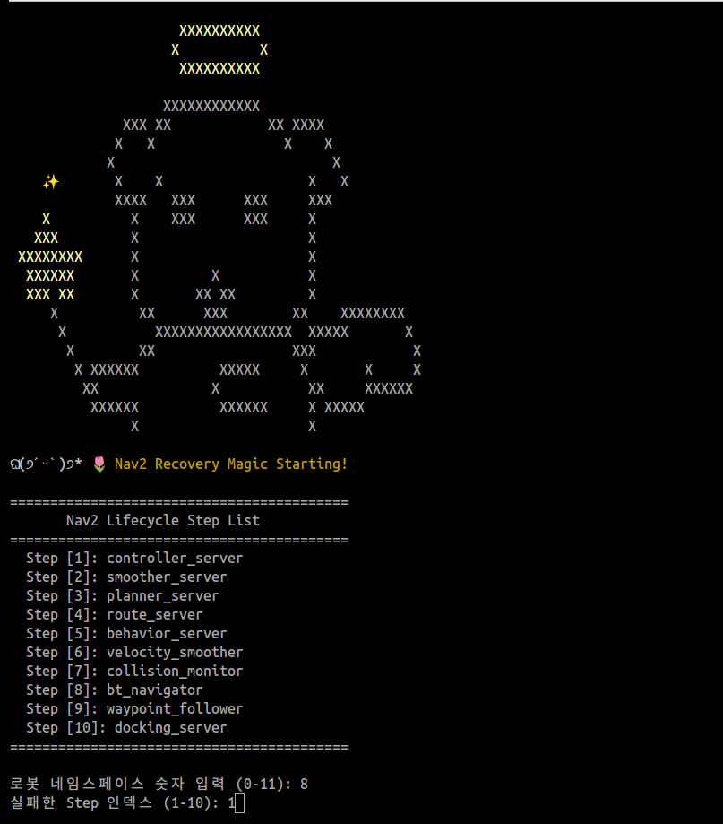
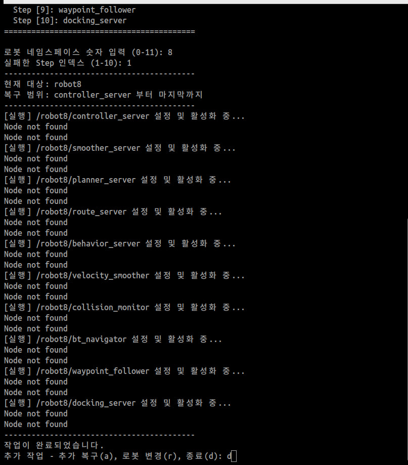

# Navigation Recovery

> 원본: https://indecisive-freedom-6e8.notion.site/8638e215779c83c4aff3013ee0e73eee  
> 최종 수정: 2026-09-03 11:41 / 변환: 2026-10-08 15:50

| 속성 | 값 |
|---|---|
| 순서 | 5-2 |

#### Navigation Recovery (1)

---

- `lifecycle_manager` 의 노드 상태 변경을 통해 nav2 stack을 실행하는 방법이다.

- navigation 실행 중, 오류로 인한 정상 실행이 되지 않을 때 해당 단계를 새로운 터미널에서 진행한다.

- navigation 실행 터미널은 반드시 그대로 유지하여 경과를 확인한다.

1. 아래의 스크립트 파일 다운

   📎 [nav_recovery_fetch.sh](assets_04_Navigation_Recovery/nav_recovery_fetch.sh)

2. 터미널을 켜고 해당 스크립트 파일이 위치한 디렉토리로 이동

   ```bash
   cd <your directory> 
   ```

3. 아래 명령어로 스크립트 파일 실행

   ```bash
   source nav_recovery.sh
   ```

4. 로봇 네임스페이스 입력

   - 예시 화면

     

5. 실패한 단계 입력**(1을 입력하여 처음부터 다시 올리는 것이 가장 확실히 회복됨)**

   - 예시 화면

     

6. 같은 네임스페이스에서 추가 작업이 필요하면 a, 다른 로봇의 recovery가 필요하면 r, 종료 시 d 입력 후 엔터

   - 예시 화면

     

7. 정상 회복 되었는지 Rviz 상으로 확인 후, nav2goal 을 통해 nav 수행을 시켜본다.

8. 복구 실패시 recovery를 1번 step 부터 다시 실행 또는, navigation 종료 후 재실행 한다.

---

#### Navigation Recovery (2)

---

- FastDDS의 Discovery Server는 기본적으로 로봇으로 설정되어 있다.

- Discovery Server에 전송되는 요청량을 줄이기 위해 환경변수를 변경하는 방법

1. 현재 터미널의 환경변수 값 확인

   ```bash
   echo $ROS_SUPER_CLIENT
   ```

   - 만약 출력되는 값이 `True`라면, 다음 단계를 진행한다.

2. 환경변수 값 변경

   - 환경변수 값을 변경한 터미널에만 설정이 적용되며, 
     해당 명령어를 실행하지 않은 터미널은 설정값이 변경되지 않는다.

   ```bash
   export ROS_SUPER_CLINET=False
   ```

3. daemon 재시작

   ```bash
   ros2 daemon stop; ros2 daemon start
   ```

4. 환경변수 값이 적용된 터미널에서 nav2 stack을 재실행한다.
