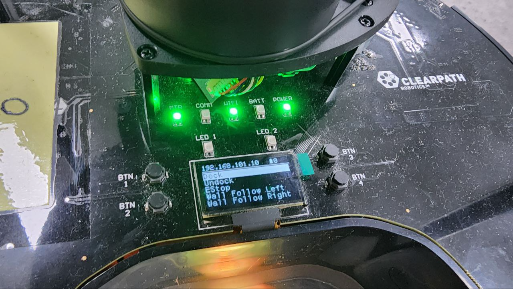
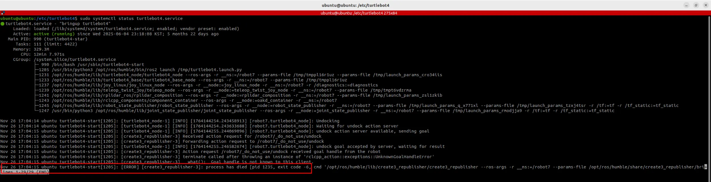
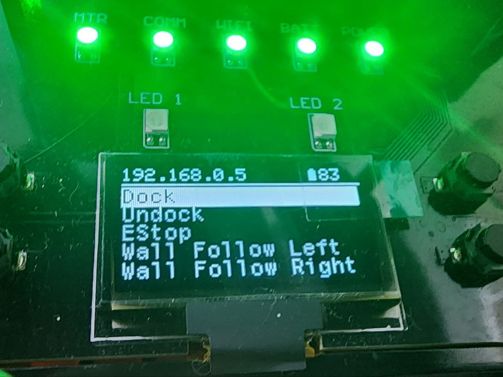

# Turtlebot4 Recovery

> 원본: https://indecisive-freedom-6e8.notion.site/7168e215779c83b48d0301242c31251e  
> 최종 수정: 2026-07-24 17:45 / 변환: 2026-10-08 14:06

| 속성 | 값 |
|---|---|
| 순서 | 3-2 |

### 로봇 상태 확인

- 터틀봇이 응답하지 않을 때, 취할 수 있는 조치를 알아본다.

- 로봇 LED를 확인하여, 5개 모두 정상으로 불빛이 들어오는지 확인

- 아래와 비슷하게 전부 불이 들어오지 않는 경우 비정상 상황이라고 판단한다.

  

### Turtlebot4 bringup Service Restart

1. Turtlebot SSH 접속

   ```bash
   ssh ubuntu@<각 조의 Robot IP>
   ```

2. turtlebot4 bringup service의 상태를 확인한다.

   ```bash
   #checking the status of turtlebot4 bring up
   sudo systemctl status turtlebot4.service 
   ```

   - 아래 예시의 경우 undock 상태에서 undock 명령을 보내 com 불빛이 나간 상황

   - 상태 확인 시 ERROR 로그가 남은 것을 볼 수 있다.

   

3. 필요한 경우 bringup service를 restart 한다.

   - `/etc/turtlebot4/aliases.bash`를 확인하면 alias로 등록된 명령어들을 확인할 수 있다.(참고)

   ```bash
   turtlebot4-source
   turtlebot4-service-restart
   turtlebor4-daemon-restart
   ```

4. LED 불이 전부 꺼졌다가, 5개 모두 다시 켜질 때 까지 기다린다.

   

### Service Restart로 해결 되지 않는 경우 로봇 시스템 재부팅

1. Turtlebot SSH 접속

   ```bash
   ssh ubuntu@<각 조의 Robot IP>
   ```

2. 로봇 종료 후 재시작하는 명령어

   ```bash
   sudo reboot
   ```

### 두 가지 방법으로도 Recovery가 불가능 한 경우 전원을 완전 차단한 후 재시작

1. Turtlebot SSH 접속

   ```bash
   ssh ubuntu@<각 조의 Robot IP>
   ```

2. 로봇을 종료시킨다.

   ```bash
   sudo shutdown now
   ```

3. 로봇 LED가 꺼졌음을 확인한 후, Docking Station에서 내린다.

4. 전원 버튼을 길게 눌러 로봇을 종료시킨다. (불빛이 3번 정도 깜빡인 후 종료된다.)

5. 종료 후 잠시 기다린 뒤, 로봇을 Docking Station에 올려 전원을 켠다.

6. 부팅 소리가 난 후, LED 불빛이 5개가 전부 들어올 때까지 기다린다.
