# Multi Robot Custom Discovery Setup

> 원본: https://indecisive-freedom-6e8.notion.site/36e8e215779c820aaa6f81d0fecd2d25  
> 최종 수정: 2026-10-08 15:19 / 변환: 2026-10-08 15:50

| 속성 | 값 |
|---|---|
| 상태 | 완료 |

### 반드시 PC에서 실행 !!

터틀봇에서 진행했을 경우 바로 강사님 또는 조교에게 알려주세요.

#### Robot Connection setup

#### CASE 1-1. 한 PC 당 한 robot을 제어하는 경우

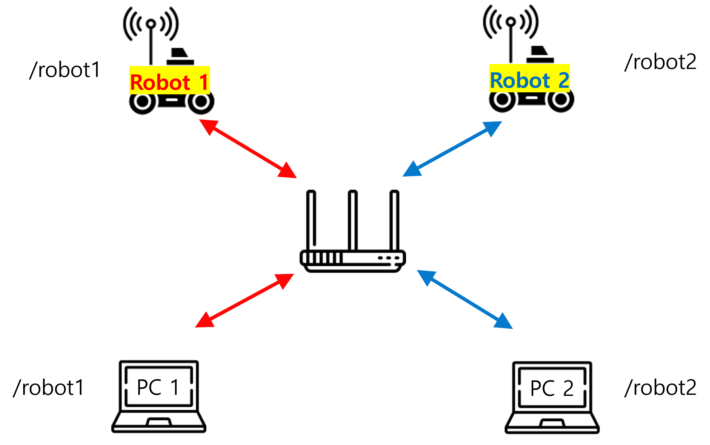

- 한 PC가 한 robot만 제어하는 경우(PC1-robot1 / PC2-robot2)

- **PC간 통신이 필요하지 않은 경우**

- 이미지 상 ***/robot**<n>*** 은 각 기기 터미널에서 보일 수 있는 토픽을 나타낸다.

---

1. 각 PC에 Single Robot Network Setup을 진행한다.

   1. 공유기에 PC를 연결한다.

      ```bash
      #Turtlebot과 같은 공유기에 속해 있는지 확인하기 위해 터미널 창에 아래 코드를 입력한다.
      # 돌아오는 메세지가 없다면 본인 노트북의 Wifi 이름 확인.
      ping <각 팀의 Turtlebot IP>
      #ping 관련 로그가 뜬다면 Turtlebot과 정상적으로 연결되어 있는 상황. 
      ```

   2. 아래의 명령을 실행시킨다.

      ```bash
      #make sure pc is connected to the same wifi router as the robot
      wget -qO - https://raw.githubusercontent.com/turtlebot/turtlebot4_setup/jazzy/turtlebot4_discovery/configure_discovery.sh | bash <(cat) </dev/tty
      ```

      

      Enter your team # as ROS_DOMAIN_ID (1 or 2 or …)

      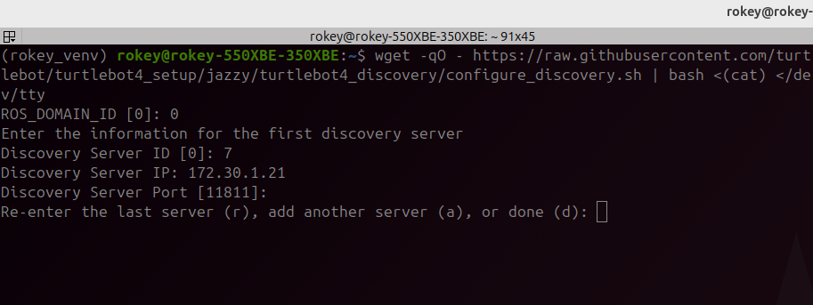

      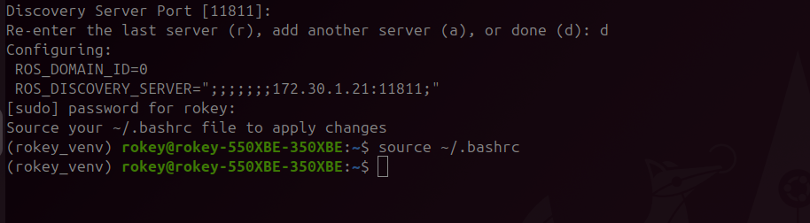

      **ROS 2 TurtleBot4 Discovery Server 설정 입력표**

      | 항목 | 입력 **예시** 값 | 설명 |
      |---|---|---|
      | **ROS_DOMAIN_ID** | `1,2,3,4,5,or 6` | 로봇 및 PC가 공유할 ROS 도메인 번호 (기본값: 0) **팀 별로 부여된 번호** |
      | **Discovery Server ID** | `1,2,3,4,5,or 6` | 고유한 서버 ID (로봇마다 다르게 설정해야 함), **팀 별로 부여된 번호** |
      | **Discovery Server IP** | `192.168.10.16` | 로봇(Raspberry Pi)의 IP 주소, |
      | **Discovery Server Port** | *(엔터)* 또는 `11811` | 기본 포트 11811 사용 시 엔터 입력 |
      | **Server 입력 선택** | `r`, `a`, `d` | `r`: 재입력, `a`: 다른 서버 추가, `d`: 완료 |

   3. 설정 내용 source해서 반영

      ```bash
      source .bashrc
      ```

   4. ROS2 daemon restart

      ```bash
      ros2 daemon stop
      ros2 daemon start
      ```

   5. 연결 확인

      - 아래 명령어를 두 번정도 시도 해야한다. 

      - 처음 command 명령을 실행하면 daemon이 가능한 토픽 리스트를 취합하느라 바로 토픽리스트를 반환하지 못한다.

      ```bash
      ros2 topic list
      ```

   6. 설정 내용 확인

      위의 설정 내용이 어떤 파일에 저장되어 있고 어떤 내용으로 설정되었는지 확인한다. (**경로 기억할 것!**)

      ```bash
      nano /etc/turtlebot4_discovery/setup.bash
      ```

#### CASE 1-2. 한 PC 당 robot을 제어하는 경우 (PC 간 통신 필요) 1

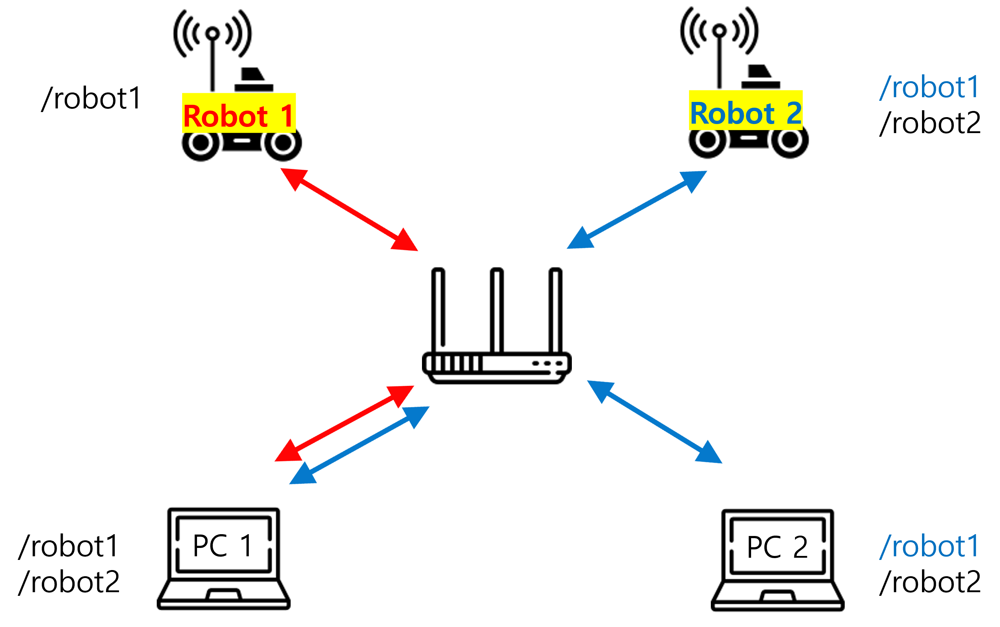

- 한 PC가 한 robot만 제어하는 경우

- **PC간 통신이 필요한 경우**

- PC1과 PC2 Discovery Server에 최소 한 대의 로봇을 공유하는 경우, PC간 통신이 가능하다.

- 예시) (PC1-robot1 / PC2-robot2) 제어하며 동시에 PC1-PC2 사이에 토픽을 주고받고 싶을 때, (PC1-robot1, robot2 / PC2-robot2)로 구성한다.

- 이미지 상 ***/robot**<n>*** 은 각 기기 터미널에서 보일 수 있는 토픽을 나타낸다.

---

1. PC1 setup

   1. 아래의 명령을 실행시킨다.

      ```bash
      #make sure pc is connected to the same wifi router as the robot
      wget -qO - https://raw.githubusercontent.com/turtlebot/turtlebot4_setup/jazzy/turtlebot4_discovery/configure_discovery.sh | bash <(cat) </dev/tty
      ```

   2. ROS_DOMAIN_ID는 사용하는 도메인 ID에 따라 설정

   3. robot1을 Discovery Server에 등록

      - 해당 이미지는 예시이므로 팀 별 Discovery Server ID와 IP를 등록할 것

      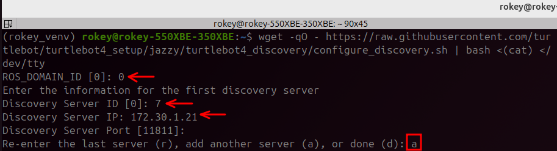

   4. a(add another server) 선택 후 robot2를 Discovery Server에 등록

      - 해당 이미지는 예시이므로 팀 별 Discovery Server ID와 IP를 등록할 것

      - 설정 완료 후 d(done)으로 종료

      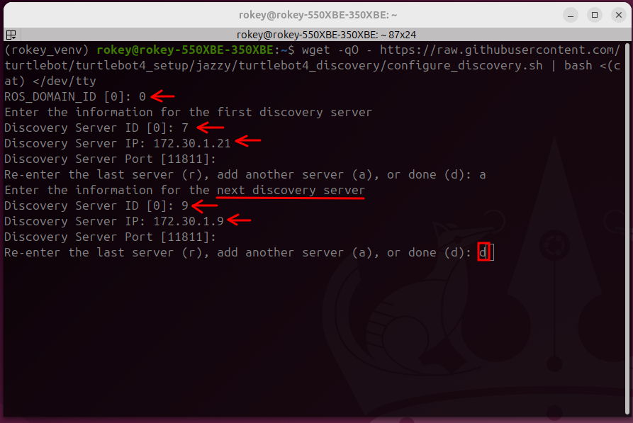

   5. 설정 내용 source해서 반영

      ```bash
      source .bashrc
      ```

   6. ROS2 daemon restart

      ```bash
      ros2 daemon stop
      ros2 daemon start
      ```

   7. 연결 확인

      - 아래 명령어를 두 번정도 시도 해야한다. 

      - 처음 command 명령을 실행하면 daemon이 가능한 토픽 리스트를 취합하느라 바로 토픽리스트를 반환하지 못한다.

      ```bash
      ros2 topic list
      ```

   8. 설정 내용 확인

      위의 설정 내용이 어떤 파일에 저장되어 있고 어떤 내용으로 설정되었는지 확인한다. (**경로 기억할 것!**)

      ```bash
      nano /etc/turtlebot4_discovery/setup.bash
      ```

      ```bash
      #In discovery /etc/turtlebot4_discovery/setup.bash
      #so it looks something like this
      ROS_DISCOVERY_SERVER="<ROBOT1 IP>:11811;<ROBOT2 IP>:11811;"
      # 세미콜론의 갯수는 로봇 ID에 따라 달라질 수 있다.
      ```

2. PC2 setup

   1. 아래의 명령을 실행시킨다.

      ```bash
      #make sure pc is connected to the same wifi router as the robot
      wget -qO - https://raw.githubusercontent.com/turtlebot/turtlebot4_setup/jazzy/turtlebot4_discovery/configure_discovery.sh | bash <(cat) </dev/tty
      ```

   2. ROS_DOMAIN_ID는 사용하는 도메인 ID에 따라 설정

   3. robot2을 Discovery Server에 등록

      - 해당 이미지는 예시이므로 팀 별 Discovery Server ID와 IP를 등록할 것

      - 설정 완료 후 d(done)으로 종료

      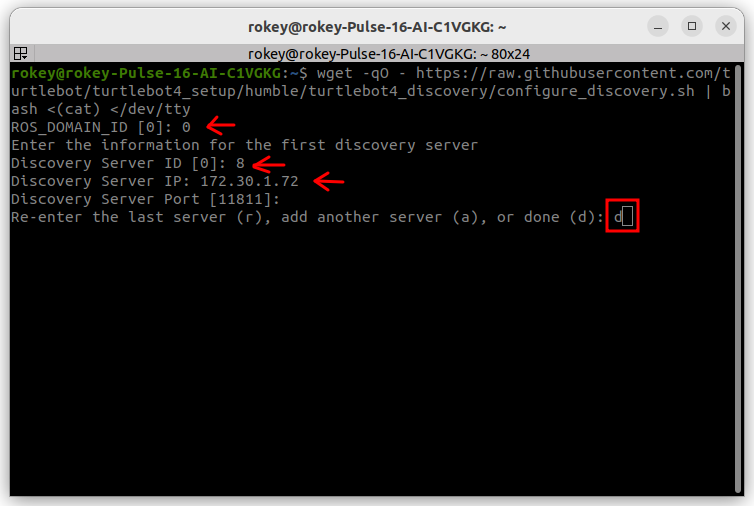

   4. 설정 내용 source해서 반영

      ```bash
      source .bashrc
      ```

   5. ROS2 daemon restart

      ```bash
      ros2 daemon stop
      ros2 daemon start
      ```

   6. 연결 확인

      - 아래 명령어를 두 번정도 시도 해야한다. 

      - 처음 command 명령을 실행하면 daemon이 가능한 토픽 리스트를 취합하느라 바로 토픽리스트를 반환하지 못한다.

      ```bash
      ros2 topic list
      ```

   7. 설정 내용 확인

      위의 설정 내용이 어떤 파일에 저장되어 있고 어떤 내용으로 설정되었는지 확인한다. (**경로 기억할 것!**)

      ```bash
      nano /etc/turtlebot4_discovery/setup.bash
      ```

      ```bash
      #In discovery /etc/turtlebot4_discovery/setup.bash
      #so it looks something like this
      ROS_DISCOVERY_SERVER=";;<ROBOT2 IP>:11811;"
      # 세미콜론의 갯수는 로봇 ID에 따라 달라질 수 있다.
      ```

#### CASE 1-3. 한 PC 당 robot을 제어하는 경우 (PC 간 통신 필요) 2

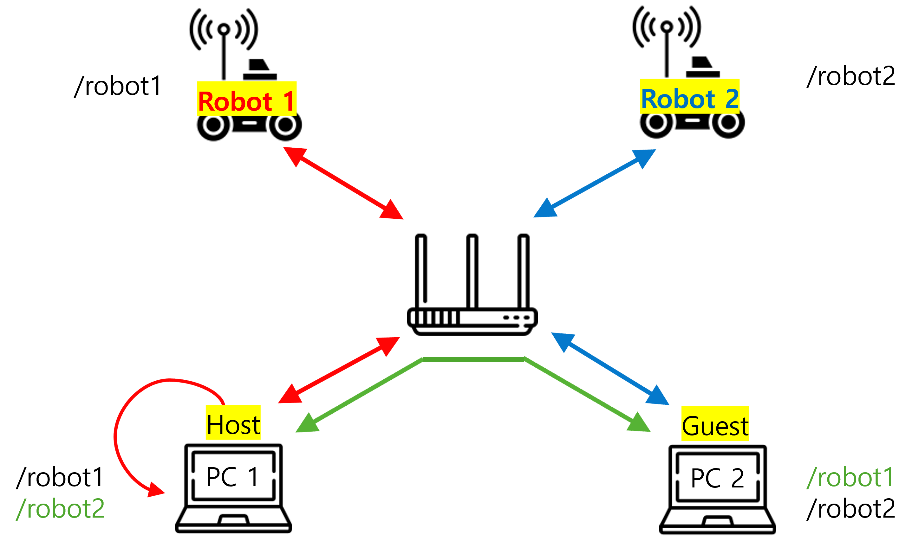

- 한 PC가 한 robot만 제어하는 경우(PC1-robot1 / PC2-robot2)

- **PC간 통신이 필요한 경우**

- PC1을 Host Server로, PC2를 Guest로 구성한다.

- 이미지 상 ***/robot**<n>*** 은 각 기기 터미널에서 보일 수 있는 토픽을 나타낸다.

---

1. Host PC setup(PC1)

   1. 아래의 명령을 실행시킨다.

      ```bash
      #make sure pc is connected to the same wifi router as the robot
      wget -qO - https://raw.githubusercontent.com/turtlebot/turtlebot4_setup/jazzy/turtlebot4_discovery/configure_discovery.sh | bash <(cat) </dev/tty
      ```

   2. ROS_DOMAIN_ID는 사용하는 도메인 ID에 따라 설정

   3. localhost를 Discovery server ID 0번으로 등록

      

      Discovery Server IP: 127.0.0.1 (고정)

   4. a(add another server) 선택 후 robot1을 Discovery Server에 등록

      - 해당 이미지는 예시이므로 팀 별 Discovery Server ID와 IP를 등록할 것

      - 설정 완료 후 d(done)으로 종료

      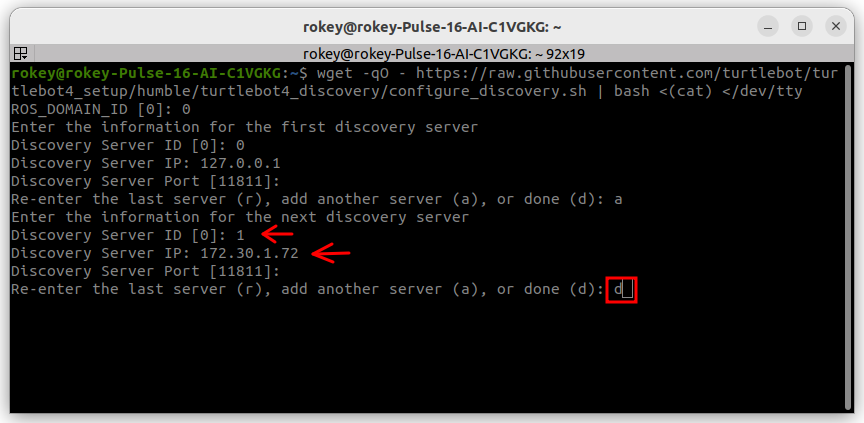

   5. 설정 내용 source해서 반영

      ```bash
      source .bashrc
      ```

   6. ROS2 daemon restart

      ```bash
      ros2 daemon stop
      ros2 daemon start
      ```

   7. 연결 확인

      - 아래 명령어를 두 번정도 시도 해야한다. 

      - 처음 command 명령을 실행하면 daemon이 가능한 토픽 리스트를 취합하느라 바로 토픽리스트를 반환하지 못한다.

      ```bash
      ros2 topic list
      ```

   8. 설정 내용 확인

      위의 설정 내용이 어떤 파일에 저장되어 있고 어떤 내용으로 설정되었는지 확인한다. (**경로 기억할 것!**)

      ```bash
      nano /etc/turtlebot4_discovery/setup.bash
      ```

      ```bash
      #HOST PC
      #In discovery /etc/turtlebot4_discovery/setup.bash
      #add 127.0.0.1:11811 in position 0 of ROS_DISCOVER_SERVER
      #so it looks something like this
      ROS_DISCOVERY_SERVER="127.0.0.1:11811;<ROBOT1 IP>:11811;"
      # 세미콜론의 갯수는 로봇 ID에 따라 달라질 수 있다.
      ```

2. Guest PC setup

   1. 아래의 명령을 실행시킨다.

      ```bash
      #make sure pc is connected to the same wifi router as the robot
      wget -qO - https://raw.githubusercontent.com/turtlebot/turtlebot4_setup/jazzy/turtlebot4_discovery/configure_discovery.sh | bash <(cat) </dev/tty
      ```

   2.  ROS_DOMAIN_ID는 사용하는 도메인 ID에 따라 설정

   3. Host PC를 Discovery server ID 0번으로 등록

      - 해당 이미지는 예시이므로 팀 별 Host PC의 IP 확인 후 진행

      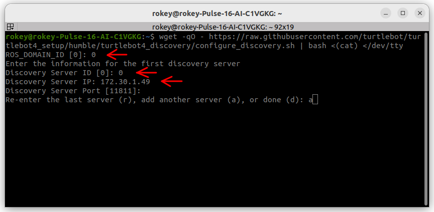

      - Discovery Server IP: <Host PC(PC1) IP>

      - Host PC IP 확인법: Host PC 터미널에 아래 명령어 입력

        ```bash
        hostname -I
        ```

   4. a(add another server) 선택 후 로봇2를 Discovery Server에 등록

      - 해당 이미지는 예시이므로 팀 별 Discovery Server ID와 IP를 등록할 것

      - 설정 완료 후 d(done)으로 종료

      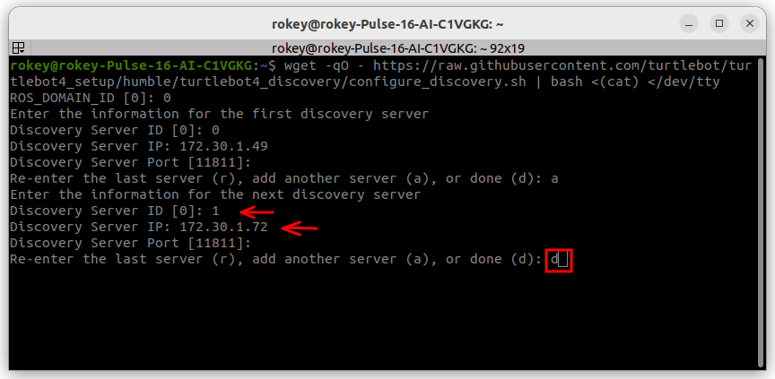

   5. 설정 내용 source해서 반영

      ```bash
      source .bashrc
      ```

   6. ROS2 daemon restart

      ```bash
      ros2 daemon stop
      ros2 daemon start
      ```

   7. 연결 확인

      - 아래 명령어를 두 번정도 시도 해야한다. 

      - 처음 command 명령을 실행하면 daemon이 가능한 토픽 리스트를 취합하느라 바로 토픽리스트를 반환하지 못한다.

      ```bash
      ros2 topic list
      ```

   8. 설정 내용 확인

      위의 설정 내용이 어떤 파일에 저장되어 있고 어떤 내용으로 설정되었는지 확인한다. (**경로 기억할 것!**)

      ```bash
      nano /etc/turtlebot4_discovery/setup.bash
      ```

      ```bash
      #Guest PC with discovery server-id=4 (example)
      #In discovery /etc/turtlebot4_discovery/setup.bash
      #add <IP Address of HOST PC>:11811 in position 0 of ROS_DISCOVER_SERVER
      #so it looks something like this
      ROS_DISCOVERY_SERVER="<IP Address of HOST PC>:11811;<ROBOT2 IP>:11811;"
      # 세미콜론의 갯수는 로봇 ID에 따라 달라질 수 있다.
      ```

3. Host PC Server 열기 (Guest와 통신하는 동안 터미널 창 유지할 것)

   ```bash
   #HOST PC
   #open new terminator window
   unset ROS_DISCOVERY_SERVER
   fastdds discovery --server-id 0
   ```

   

#### CASE 2-1. 한 PC가 두 로봇을 제어하는 경우

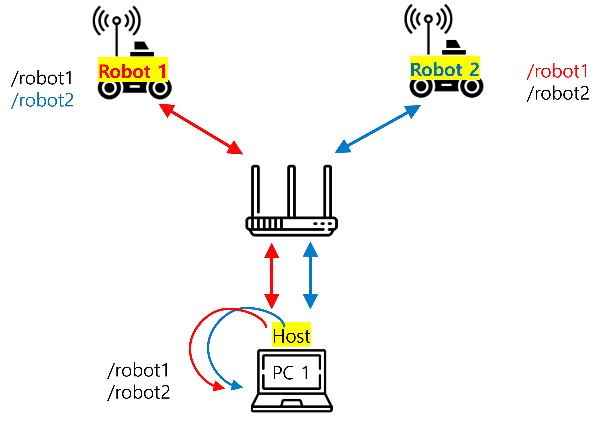

- 한 PC가 두 로봇을 제어하는 경우

- 한 PC에서 Navigatoin을 동시에 두 개 실행하는 경우 과부화 방지를 위해 PC를 Host로 만든다.

- 노드에서 메세지를 참조할 때 이미 PC와 로봇 간의 통신으로 참조한 메세지를 중복 참조하지 않고, PC 자체에서 메세지를 받아올 수 있도록 setup하는 방식.

- 이미지 상 ***/robot**<n>*** 은 각 기기 터미널에서 보일 수 있는 토픽을 나타낸다.

---

1. PC1 setup

   1. 아래의 명령을 실행시킨다.

      ```bash
      #make sure pc is connected to the same wifi router as the robot
      wget -qO - https://raw.githubusercontent.com/turtlebot/turtlebot4_setup/jazzy/turtlebot4_discovery/configure_discovery.sh | bash <(cat) </dev/tty
      ```

   2. ROS_DOMAIN_ID는 사용하는 도메인 ID에 따라 설정

   3. localhost를 Discovery server ID 0번으로 등록

      

      Discovery Server IP: 127.0.0.1 (고정)

   4. a(add another server) 선택 후 robot1을 Discovery Server에 등록

      - 해당 이미지는 예시이므로 팀 별 Discovery Server ID와 IP를 등록할 것

      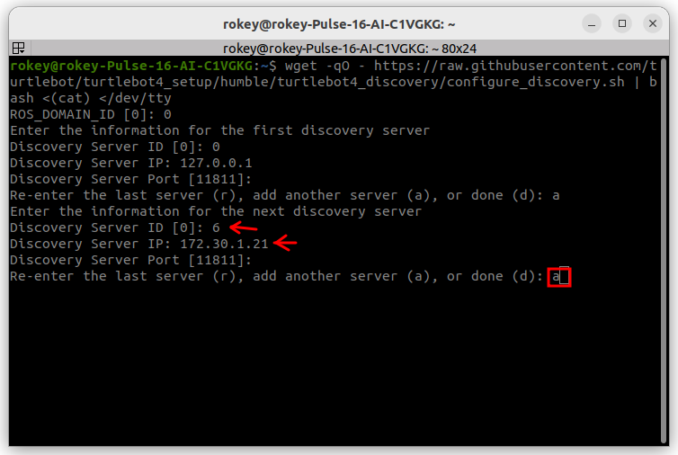

   5. a(add another server) 선택 후 robot2를 Discovery Server에 등록

      - 해당 이미지는 예시이므로 팀 별 Discovery Server ID와 IP를 등록할 것

      - 설정 완료 후 d(done)으로 종료

      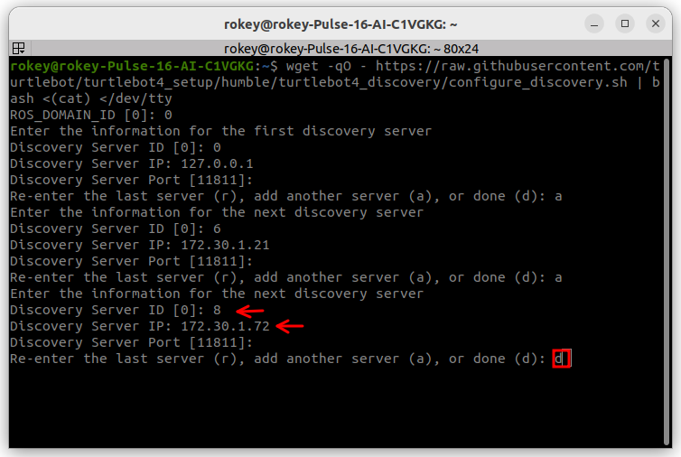

   6. 설정 내용 source해서 반영

      ```bash
      source .bashrc
      ```

   7. ROS2 daemon restart

      ```bash
      ros2 daemon stop
      ros2 daemon start
      ```

   8. 연결 확인

      - 아래 명령어를 두 번정도 시도 해야한다. 

      - 처음 command 명령을 실행하면 daemon이 가능한 토픽 리스트를 취합하느라 바로 토픽리스트를 반환하지 못한다.

      ```bash
      ros2 topic list
      ```

   9. 설정 내용 확인

      위의 설정 내용이 어떤 파일에 저장되어 있고 어떤 내용으로 설정되었는지 확인한다. (**경로 기억할 것!**)

      ```bash
      nano /etc/turtlebot4_discovery/setup.bash
      ```

      ```bash
      #In discovery /etc/turtlebot4_discovery/setup.bash
      #so it looks something like this
      ROS_DISCOVERY_SERVER="<ROBOT1 IP>:11811;<ROBOT2 IP>:11811;"
      # 세미콜론의 갯수는 로봇 ID에 따라 달라질 수 있다.
      ```

2. Host PC Server 열기 (터미널 창 유지할 것)

   ```bash
   #HOST PC
   #open new terminator window
   unset ROS_DISCOVERY_SERVER
   fastdds discovery --server-id 0
   ```

   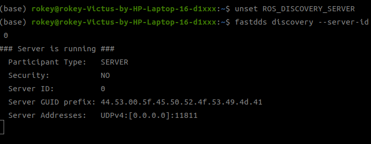

#### CASE 2-2. 한 PC가 두 로봇을 제어하는 경우 (PC 간 통신 필요)

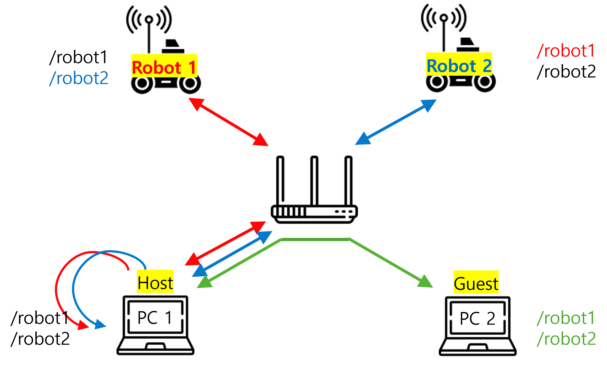

- 한 PC가 두 로봇을 제어하는 경우

- **PC간 통신이 필요한 경우**

- 예시) (PC1-robot1, robot2) 제어하며 동시에 PC1-PC2 사이에 토픽을 주고받고 싶을 때, (PC1-PC1, robot1, robot2 / PC2-PC1)로 구성한다.

- 이미지 상 ***/robot**<n>*** 은 각 기기 터미널에서 보일 수 있는 토픽을 나타낸다.

---

1. Host PC setup(PC1)

   1. 아래의 명령을 실행시킨다.

      ```bash
      #make sure pc is connected to the same wifi router as the robot
      wget -qO - https://raw.githubusercontent.com/turtlebot/turtlebot4_setup/jazzy/turtlebot4_discovery/configure_discovery.sh | bash <(cat) </dev/tty
      ```

   2. ROS_DOMAIN_ID는 사용하는 도메인 ID에 따라 설정

   3. localhost를 Discovery server ID 0번으로 등록

      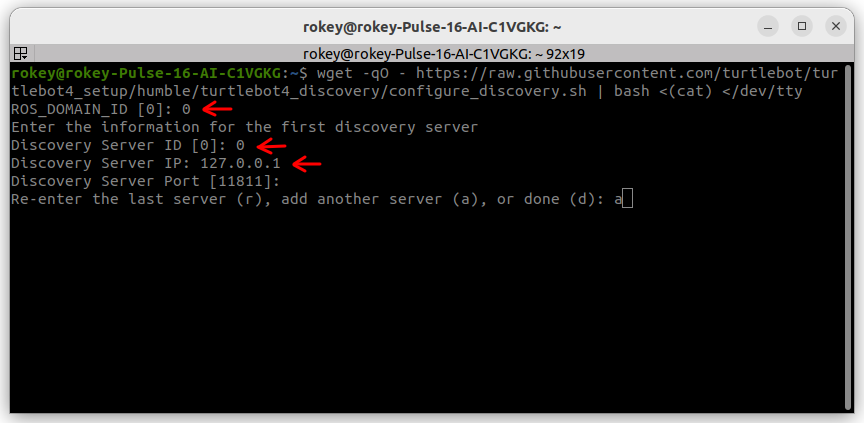

      Discovery Server IP: 127.0.0.1 (고정)

   4. a(add another server) 선택 후 robot1, robot2를 차례대로 Discovery Server에 등록

      - 해당 이미지는 예시이므로 팀 별 Discovery Server ID와 IP를 등록할 것

      - robot1 등록 후 a(add)로 robot2를 이어 등록.

      - 둘 모두 입력 후 d(done)으로 종료

      

   5. 설정 내용 source해서 반영

      ```bash
      source .bashrc
      ```

   6. ROS2 daemon restart

      ```bash
      ros2 daemon stop
      ros2 daemon start
      ```

   7. 연결 확인

      - 아래 명령어를 두 번정도 시도 해야한다. 

      - 처음 command 명령을 실행하면 daemon이 가능한 토픽 리스트를 취합하느라 바로 토픽리스트를 반환하지 못한다.

      ```bash
      ros2 topic list
      ```

   8. 설정 내용 확인

      위의 설정 내용이 어떤 파일에 저장되어 있고 어떤 내용으로 설정되었는지 확인한다. (**경로 기억할 것!**)

      ```bash
      nano /etc/turtlebot4_discovery/setup.bash
      ```

      ```bash
      #HOST PC
      #In discovery /etc/turtlebot4_discovery/setup.bash
      #add 127.0.0.1:11811 in position 0 of ROS_DISCOVER_SERVER
      #so it looks something like this
      ROS_DISCOVERY_SERVER="127.0.0.1:11811;<ROBOT1 IP>:11811;<ROBOT2 IP>:11811;"
      # 세미콜론의 갯수는 로봇 ID에 따라 달라질 수 있다.
      ```

2. Guest PC setup

   1. 아래의 명령을 실행시킨다.

      ```bash
      #make sure pc is connected to the same wifi router as the robot
      wget -qO - https://raw.githubusercontent.com/turtlebot/turtlebot4_setup/jazzy/turtlebot4_discovery/configure_discovery.sh | bash <(cat) </dev/tty
      ```

   2.  ROS_DOMAIN_ID는 사용하는 도메인 ID에 따라 설정

   3. Host PC를 Discovery server ID 0번으로 등록

      - 해당 이미지는 예시이므로 팀 별 Host PC의 IP 확인 후 진행

      

      - Discovery Server IP: <Host PC(PC1) IP>

      - Host PC IP 확인법: Host PC 터미널에 아래 명령어 입력

        ```bash
        hostname -I
        ```

   4. a(add another server) 선택 후 로봇2를 Discovery Server에 등록

      - 해당 이미지는 예시이므로 팀 별 Discovery Server ID와 IP를 등록할 것

      - 설정 완료 후 d(done)으로 종료

      

   5. 설정 내용 source해서 반영

      ```bash
      source .bashrc
      ```

   6. ROS2 daemon restart

      ```bash
      ros2 daemon stop
      ros2 daemon start
      ```

   7. 연결 확인

      - 아래 명령어를 두 번정도 시도 해야한다. 

      - 처음 command 명령을 실행하면 daemon이 가능한 토픽 리스트를 취합하느라 바로 토픽리스트를 반환하지 못한다.

      ```bash
      ros2 topic list
      ```

   8. 설정 내용 확인

      위의 설정 내용이 어떤 파일에 저장되어 있고 어떤 내용으로 설정되었는지 확인한다. (**경로 기억할 것!**)

      ```bash
      nano /etc/turtlebot4_discovery/setup.bash
      ```

      ```bash
      #Guest PC with discovery server-id=4 (example)
      #In discovery /etc/turtlebot4_discovery/setup.bash
      #add <IP Address of HOST PC>:11811 in position 0 of ROS_DISCOVER_SERVER
      #so it looks something like this
      ROS_DISCOVERY_SERVER="<IP Address of HOST PC>:11811;"
      # 세미콜론의 갯수는 로봇 ID에 따라 달라질 수 있다.
      ```

3. Host PC Server 열기 (Guest와 통신하는 동안 터미널 창 유지할 것)

   ```bash
   #HOST PC
   #open new terminator window
   unset ROS_DISCOVERY_SERVER
   fastdds discovery --server-id 0
   ```

   
