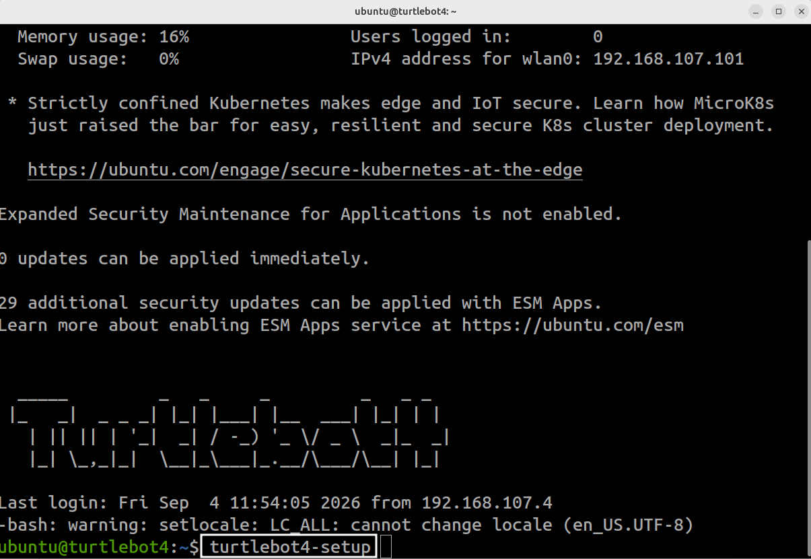
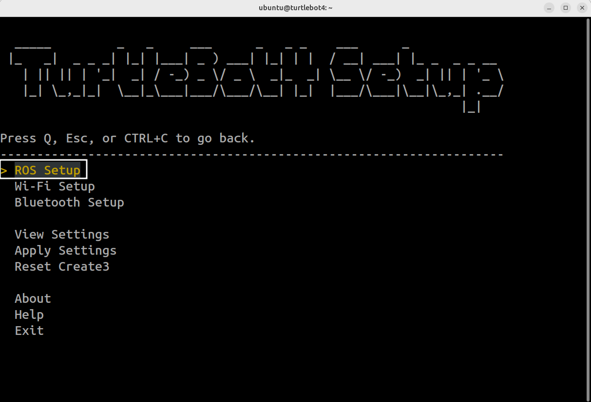
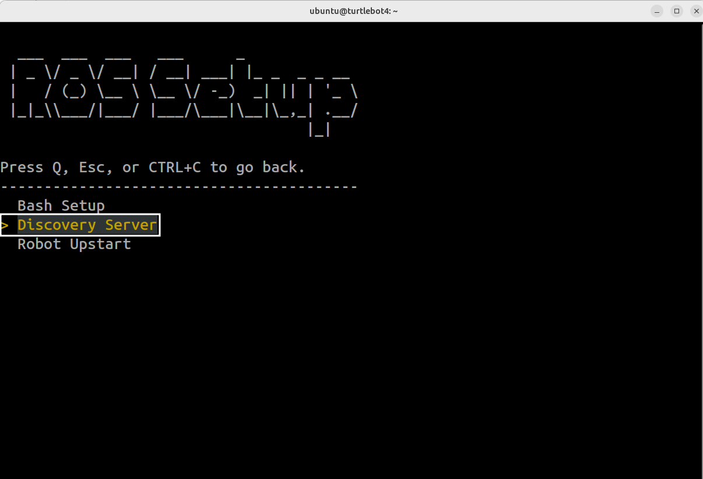
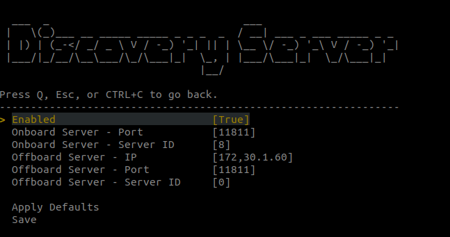
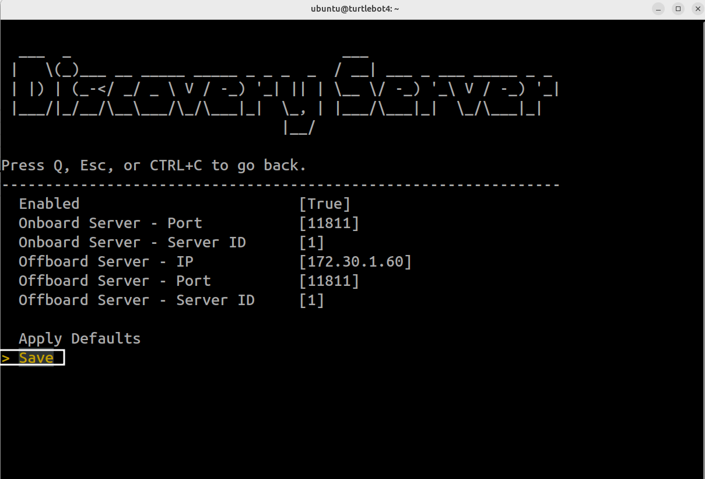
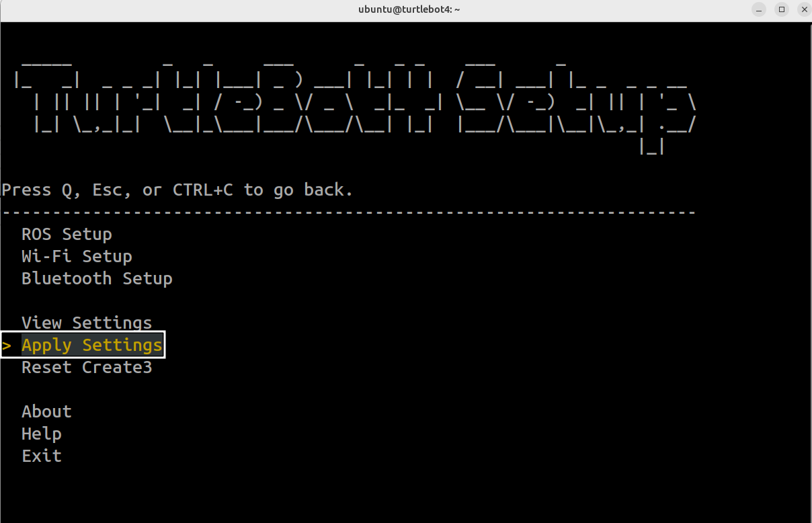
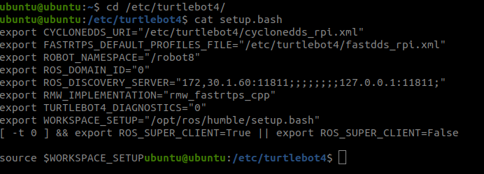
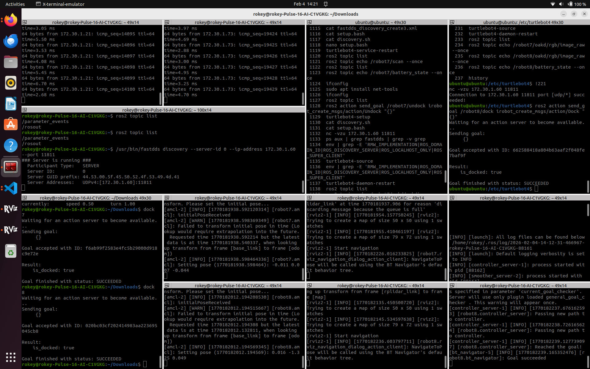

# Multi Robot Client Setup

> 원본: https://indecisive-freedom-6e8.notion.site/3d18e215779c800e98e9cea8d38a8390  
> 최종 수정: 2026-10-08 15:19 / 변환: 2026-10-08 15:51

| 속성 | 값 |
|---|---|
| 상태 | 완료 |

### 통신 구조

#### Discovery Servers

- **모니터 PC (PC3)**

  - Discovery Server

  - server-id 0, UDP 11811

- **TB4**

  - 2개의 local server와 각각의 서버에 대한 Discovery Server ID가 있다. 

  - **robot1:** local server

    - server-id A, UDP 11811

  - **robot2:** local server

    - server-id B, UDP 11811

#### Clients

- **PC1 (TB4-A 제어):** PC3의 클라이언트

- **PC2 (TB4-B 제어):** PC3의 클라이언트

- **PC3 (모니터):** 스스로의 클라이언트 (즉, PC3는 Server이자 Client이다.)

### 왜 이 통신 구조가 “TB4가 Server인 방식”보다 나은가?

TB4에만 server를 두는 방식에서:

    - 모니터 PC가 각 TB4 서버에 개별적으로 연결해야 한다.

      - 한 번에 한 로봇만 보이는 문제를 겪을 수 있다.

    - 여러 서버를 사용하도록 설정할 때, 작은 변경에도 쉽게 문제를 겪을 수 있다.

반면, 공용 모니터 PC를 공유하면:

    - PC3 하나가 모든 로봇의 ROS graph를 한 곳에서 볼 수 있음

    - PC1/PC2가 각각 특정 로봇의 서버를 바라보도록 별도의 설정을 할 필요가 없음

    - 그리고 PC3를 중앙 관리 지점으로 두고

      - 로그 수집

      - 대시보드

      - rosbag 기록

      - Prometheus exporter

      - 모니터링
        등을 붙이기 쉬워짐.

### Setup

아래 설정을 모두 진행해야 위 통신 구조대로 setup이 가능하다.

##### PC3 (Server PC)

#### A) server tool 설치

```bash
sudo apt update
sudo apt install -y fastdds-tools
```

#### B) 설정 파일 변경

```bash
	sudo nano /etc/turtlebot4_discovery/setup.bash
```

```bash
source /opt/ros/jazzy/setup.bash
export RMW_IMPLEMENTATION=rmw_fastrtps_cpp
export ROS_DOMAIN_ID=0
export ROS_DISCOVERY_SERVER=<PC3_IP>:11811
export ROS_LOCALHOST_ONLY=0
export ROS_SUPER_CLIENT=True
```

- 왜 `ROS_SUPER_CLIENT=True`로 설정할까?

  - Discovery Server를 사용하는 환경에서 `ros2 node list`나 `ros2 topic list` 같은 CLI 명령으로 전체 ROS graph를 보려면, ROS 2 daemon을 Super Client로 설정해야 한다.

#### C) PC server 열기

```bash
source ~/.bashrc
which -a fastdds

/usr/bin/fastdds discovery --server-id 0 --ip-address <PC3_IP> --port 11811
```

해당 셋업을 완료했다면, 로봇을 사용하는 중에 **반드시** **서버를 실행**해두어야 한다.

모든 ROS 통신이 해당 PC를 통해 동작한다.

### CLI에서 PC3 Setup 확인하기

#### 1) 환경

- 새 터미널에서 다음과 같은 명령어 실행 후 출력값 확인

```bash
source ~/.bashrc
env | grep -E 'RMW_IMPLEMENTATION|ROS_DOMAIN_ID|ROS_DISCOVERY_SERVER|ROS_LOCALHOST_ONLY|ROS_SUPER_CLIENT'
```

```bash
ROS_SUPER_CLIENT=True
ROS_DOMAIN_ID=0
ROS_LOCALHOST_ONLY=0
ROS_DISCOVERY_SERVER=<PC3_IP>:11811
RMW_IMPLEMENTATION=rmw_fastrtps_cpp
```

#### 2) 서버 상태 확인

```bash
ss -lunp | grep 11811
```

```bash
UNCONN 0      0            0.0.0.0:11811      0.0.0.0:*    users:(("fast-discovery-",pid=26590,fd=9)) 

```

#### 3) ROS 재시작

```bash
ros2 daemon stop
ros2 daemon start
```

---

##### TB4 설정

각 TB4는 2개의 서버를 사용한다:

1. PC3 서버: 전체 로봇 Discovery

2. TB4 로컬 서버: Create 3 safety

두 서버를 사용하는 것은 의도적인 설계이며, 중복된 구성이 아니다.

### 1) TB4를 PC에 대한 클라이언트로 설정하기

1. TB4에서 `turtlebot4-setup` 으로 Discovery Server 설정을 할 수 있다.

   ```bash
   turtlebot4-setup
   ```

   

   - 왜 직접 설정 파일을 수정하지 않을까?

     - `turtlebot4-setup` 은 Discovery Server 관련 설정을 Create 3에도 함께 적용하고, `create3_republisher` 가 정상 동작하기 위해 필요한 설정까지 관리하기 때문

2. `ROS Setup` Enter

   

3. `Discovery Server` Enter

   

4. Discovery Server 설정을 다음과 같이 변경

   

   - **Enabled: True Discovery Server**

   - **Onboard server:** 변경하지 않음. 해당 설정을 통해 각 로봇에 server id(1, 2…)가 부여된다.

   - **Offboard server:**

     - IP: `<PC3_IP>:11811` 

     - Server ID: 0

5. Save enter

   

6. ESC를 2번 눌러 다음 화면으로 돌아온 후, Apply Settings

   

7. 확인

   - 로봇 터미널에서 setup.bash 파일이 다음과 같이 출력되는지 확인하기

     

8. 로봇의 LED 불빛이 모두 밝혀질 때까지 기다린다.

### 2) TB4에서 PC에 통신이 되는지 확인하기

```bash
nc -vzu <PC3_IP> 11811
```

- 출력으로 “succeeded”가 나오면 성공 (UDP).

### 3) onboard server가 off되었는지 확인하기

```bash
systemctl status discovery.service --no-pager
ps aux | grep -E "fastdds.*discovery|fastdds.py discovery|fast-discovery-server" | grep -v grep
```

### 4) bringup restart

```bash
turtlebot4-service-restart
turtlebot4-daemon-restart
```

---

##### PC1 & PC2 설정 (로봇 제어 PC, Client)

### 1) 설정 파일 수정

- **로봇이 아닌 PC에서 파일을 수정할 것**

- 각각의 로봇 제어 클라이언트 PC에서 설정 파일을 다음과 같이 수정한다.

```bash
sudo nano /etc/turtlebot4_discovery/setup.bash
```

```bash
source /opt/ros/jazzy/setup.bash
export RMW_IMPLEMENTATION=rmw_fastrtps_cpp
export ROS_DOMAIN_ID=0
export ROS_DISCOVERY_SERVER=<PC3_IP>:11811
export ROS_LOCALHOST_ONLY=0
export ROS_SUPER_CLIENT=True
```

- 열려 있는 모든 터미널에 다음 커맨드를 적용한다.

```bash
source ~/.bashrc
ros2 daemon stop
ros2 daemon start
```

### 2) 환경 확인하기

```bash
env | grep -E'RMW_IMPLEMENTATION|ROS_DOMAIN_ID|ROS_DISCOVERY_SERVER|ROS_LOCALHOST_ONLY|ROS_SUPER_CLIENT'
```

---

```bash
ROS_SUPER_CLIENT=True
ROS_DOMAIN_ID=0
ROS_LOCALHOST_ONLY=0
ROS_DISCOVERY_SERVER=<PC3_IP>:11811
RMW_IMPLEMENTATION=rmw_fastrtps_cpp
```

---

##### 모든 토픽이 PC와 TB4에서 보이는지 확인하기

```bash
ros2 topic list
```


