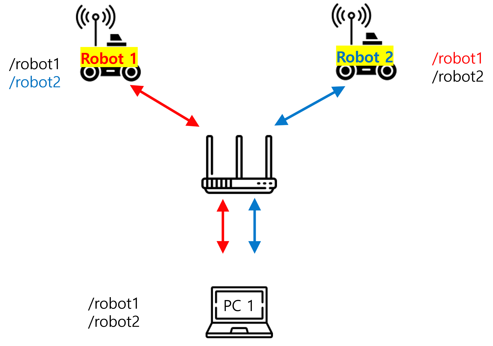
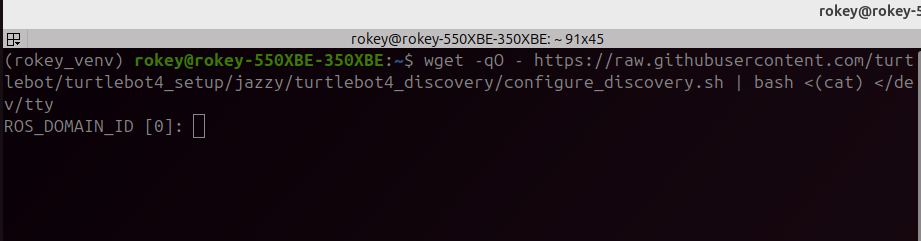
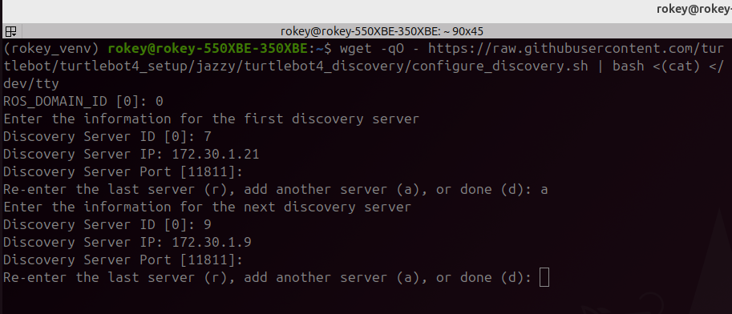
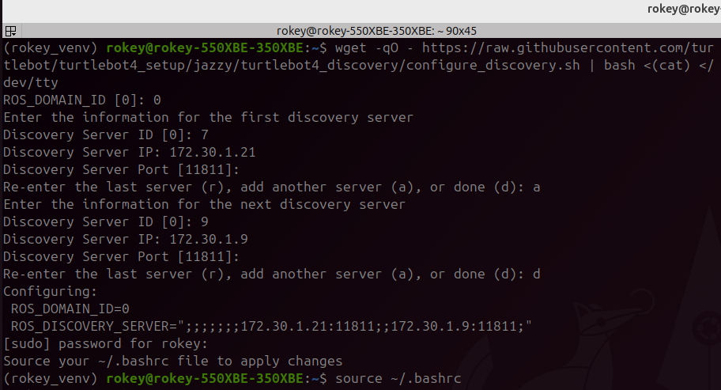
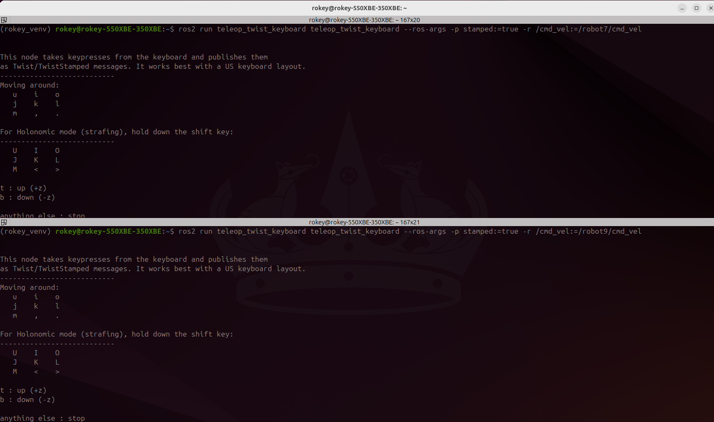
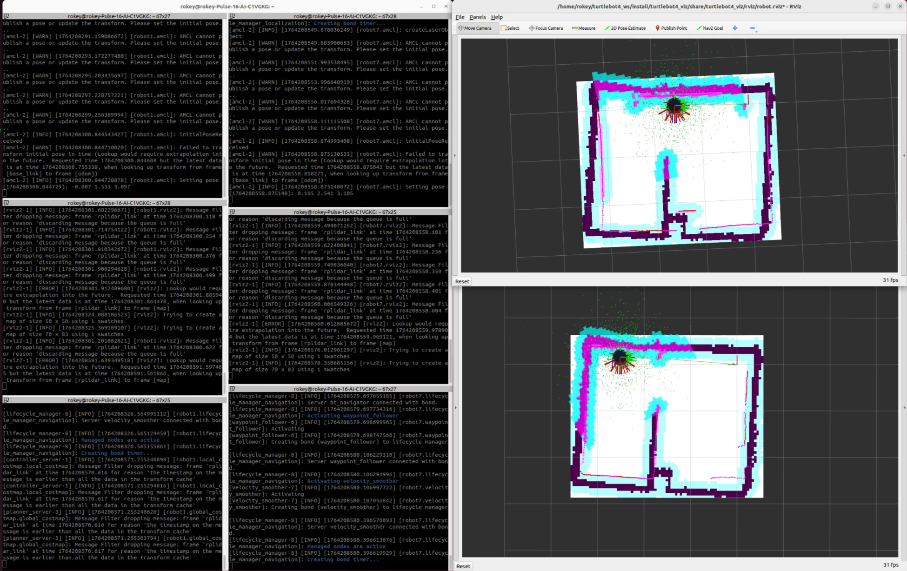

# Multi Robot Standard Setup

> 원본: https://indecisive-freedom-6e8.notion.site/6b38e215779c83fdaf9d014804458f53  
> 최종 수정: 2026-10-08 15:19 / 변환: 2026-10-08 15:51

| 속성 | 값 |
|---|---|
| 차시 | 5-1 |
| 상태 | 완료 |

## 반드시 PC에서 실행 !!

터틀봇에서 진행했을 경우 바로 강사님 또는 조교에게 알려주세요.

Reference:  [https://turtlebot.github.io/turtlebot4-user-manual/setup/discovery_server.html](https://turtlebot.github.io/turtlebot4-user-manual/setup/discovery_server.html)

#### Robot Connection setup

1. Connect the pc to the same wifi router as the first robot

2. ssh to the second robot

3. on the robot terminal execute turtlebot4-setup

4. change the wifi setting to the new combine router

5. save and apply settings

6. obtain the ip addresse on the second robot from the LED HMI screen on the robot



#### PC Setup

- PC 터미널:

```bash
wget -qO - https://raw.githubusercontent.com/turtlebot/turtlebot4_setup/jazzy/turtlebot4_discovery/configure_discovery.sh | bash <(cat) </dev/tty
```



#### 각 로봇의 ID와 IP를 입력한다.





설정 내용 source해서 반영

```bash
source .bashrc
```

ROS2 daemon restart

```bash
ros2 daemon stop
ros2 daemon start
```

연결 확인

- 아래 명령어를 두 번정도 시도 해야한다. 

- 처음 command 명령을 실행하면 daemon이 가능한 토픽 리스트를 취합하느라 바로 토픽리스트를 반환하지 못한다.

```bash
ros2 topic list
```

---

#### 테스트

- PC 터미널:

  ```bash
  ros2 run teleop_twist_keyboard teleop_twist_keyboard --ros-args -r /cmd_vel:=/robot<n>/cmd_vel
  ```

- PC 터미널:

  ```bash
  ros2 run teleop_twist_keyboard teleop_twist_keyboard --ros-args -r /cmd_vel:=/robot<n>/cmd_vel
  ```



---

#### Multi Robot Navigation

- 위와 같은 Multi Robot Setting을 한 경우, 한 PC에서 두 로봇의 Navigation을 실행할 수 있다.



#### 💡 해당 Setup은 MSI 노트북에서 하길 권장(performance issue)

#### 💡 이러한 Setup으로 한 PC에서 두 로봇의 Nav 실행이 어려운 경우, Multi Robot Custom Discovery Setup 문서를 참고하여 진행
