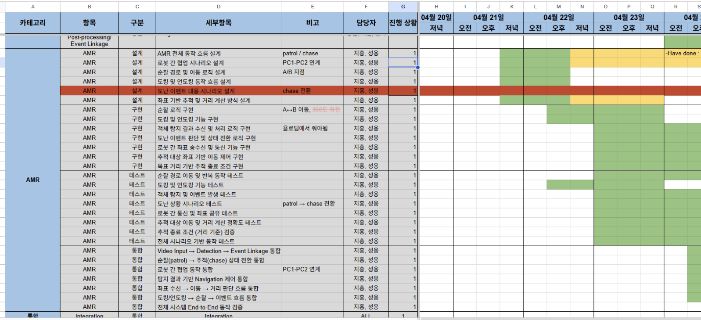
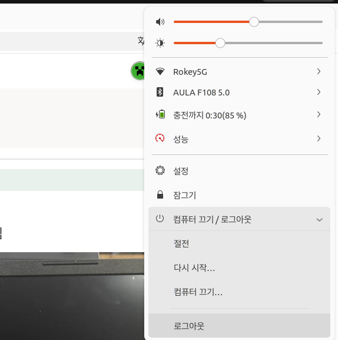
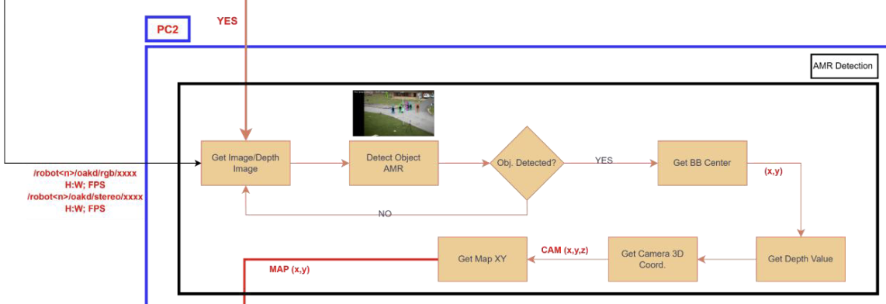
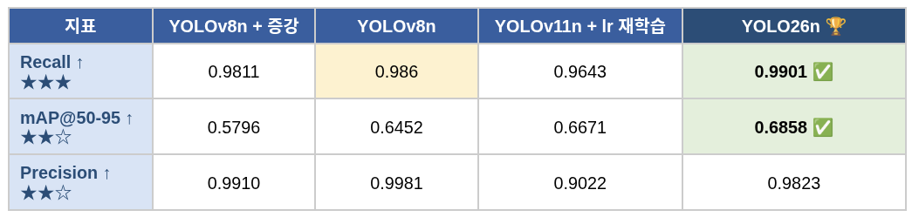
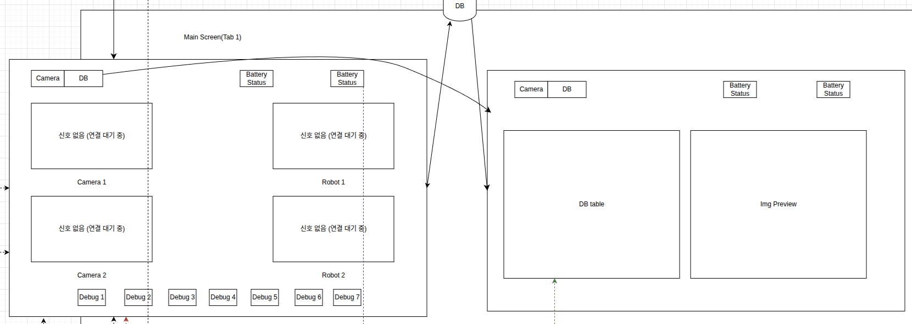

# 🟠 Code Review 안내

> 원본: https://indecisive-freedom-6e8.notion.site/3b48e215779c801d95e0e32f8d03f38a  
> 최종 수정: 2026-10-07 18:35 / 변환: 2026-10-08 14:07

### 사전 안내

- 팀당 **3파트**(AMR, Detection, SysMon)를 각각 **30분**씩 미팅룸에서 진행

  - 예: 

    - 8일 11시: Detection Code Review

    - 8일 16시: SysMon Code Review

    - 9일 13시: AMR Code Review

- 질의응답 시간을 고려해서 발표 분량을 준비할 것.

- 코드리뷰 일정 신청

  - **선착순** (일부 조율)

  - 노션 타임라인에 등록된 빈 코드리뷰 시간에 신청 가능

  - 각 팀 PM이 팀 타임라인을 조교에게 보여주고 신청

    - 코드리뷰 일정 등록 가능 기준

      - 타임라인 문서에 각 파트의 task가 설계, 개발, 테스트로 나뉘어 있고,

      - 타임라인상 각 파트의 테스트까지 끝나는 기간이 코드리뷰 일정 이전일 경우

    
    *타임라인 예시*

---

### 준비 과정

코드리뷰를 위해 **PPT를 만들지 말 것.** 대신 아래 자료들을 미리 수집·정리해두세요.

#### 1. 공통 준비물

- 코드리뷰에서 사용할 PC 1대의 HDMI 연결 사전 확인

**노트북 세팅 참조:** 

  - 노트북 로그아웃

    

  - user 선택 후 비밀번호 입력창이 뜨면 오른쪽 아래에 톱니바퀴가 보임

    

  - 톱니바퀴를 누르고 Ubuntu on Xorg 선택 (또는 Wayland)

    

  - 비밀번호 입력 후 로그인.

- **세부 설계도**

  - 설계 단계에서 그렸던 다이어그램을 그대로 활용

  - function flow diagram, message interface 포함

  - 코드와 로직이 같은 설계도를 가져와야 함

  - 예시:

    
    *설계도 예시*

  - 부득이하게 준비하지 못한 경우, 최소한 전체 시스템 설계도에서 코드 리뷰 대상에 해당하는 부분이라도 발췌하여 제시 필수.

- **코드**

  - 실제 솔루션에 적용될 코드 (테스트용 코드 X)

  - 프로그램, 노드, 함수, 라인(적절한 위치에서) 단위로 주석이 달려 있어야 함 (LLM 활용 추천)

  - 해당 파트 패키지의 디렉토리 구조를 열어놓을 수 있게 준비

  - Including `README.md` would be good

  - 설계 → 코드 → 테스트 결과가 서로 매칭되도록 정리

- **테스트 자료**

  - test code, log output, screenshot / video, 실물 촬영 영상 등

  - 개발 중 마주한 문제를 해결·개선한 내용이 있다면 전후 변화를 확인 가능하도록 준비

  - 각 파트의 **기능 테스트까지만** 리뷰

    - 타 파트와의 data 통신으로 동작하는 기능은, 해당 파트가 정상 동작함만 보여주면 됨 (dummy data 발행 or rosbag 활용 가능)

    - 단, 기능 테스트 동작을 보여주기 위해 쓴 테스트 코드 자체는 리뷰 대상 아님

    - 예시 (Detection 파트): 이미지 토픽을 rosbag으로 저장 → play → 객체가 detect되는 장면과 detect 후 topic을 publish하는 log를 함께 담은 영상 자료

#### 2. 파트별 추가 준비물

- **Detection**

  - 개발 솔루션의 목적과 평가지표에 대한 이해를 기반으로, 모델 선택에 대한 **수치 비교·분석 자료** 준비 필수

  - 예시: 후보 모델들의 정확도 / 추론 속도 등 비교표

    
    *비교표 참고*

- **Sysmon**

  - 설계 설명 시 **UI mock-up, WebPage, DB 테이블 구조** 반드시 포함

  - 예시:

    
    *UI 목업 예시 *

  - 설계도는 시작 → 페이지 생성, 빈 데이터셋 생성 → 빈 db에 content를 넣고 웹페이지에 반영되는 Logic이 포함되어야 함.

  - 로그인 화면 등 시나리오상 구현 기능 동작이 확인 가능한 영상 촬영

- **AMR**

  - 공통 준비물 기준으로 준비.

  - 기타 추가된 알고리즘, 사용된 Nav2 API를 이해하고 설명할 수 있을 것.

---

### 진행 중

#### 1. 발표 방식

- **메인 발표자 1명 + 서포터 N명**

  - 한 사람이 전체 흐름을 메인으로 발표

  - 다른 팀원은 서포팅 (질의응답, 세부 설명 담당)

  - 발표 중 PC를 바꿔가며 진행하지 않는다

- **참여 인원**

  - 해당 파트를 개발한 **모든 개발자가 참여**

  - 필요 시 PM 추가 참여 가능

#### 2. 발표 순서

- **설계도 → 코드 → 테스트 결과** 순으로 진행.

1. **설계 설명**

   - 세부 설계도를 띄워놓고 설명

   - 시나리오 흐름에 따라 flow diagram을 리뷰

2. **코드 설명**

   - 해당 파트 패키지 디렉토리 내의 구성 설명

     - 설계도의 어떤 블록에 해당하는 코드인지 매칭

     - 각 파일간의 연관성, 구현된 기능

   - 그 다음에 개별 코드 내용 설명

     - 이 파트에서 사용하는 노드가 몇 개인지, 각 노드가 어떤 기능을 하는지 먼저 설명

   - **line by line X** — 중요한 부분 위주로

3. **테스트 및 검증 결과**

   - 어떻게 테스트했고 어떻게 검증했는지, 테스트 결과 자료와 함께 보여줄 것

   - 테스트 결과는 자료로 보여줄 것: **코드리뷰 중 코드 실행 금지**

     - 예: SysMon 파트 코드리뷰 중 웹페이지 생성 코드 실행 등

4. **Q&A**

   - 질의가 들어오면 실제 개발한 사람이 대답
