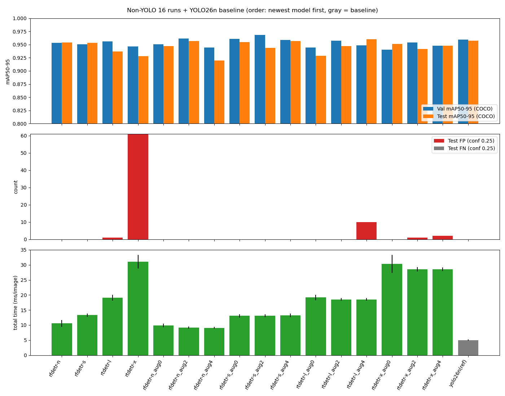
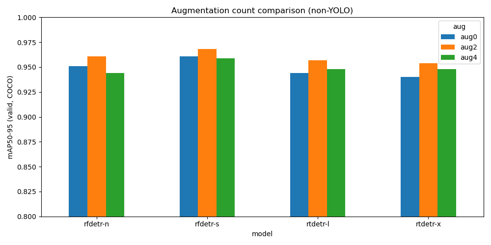
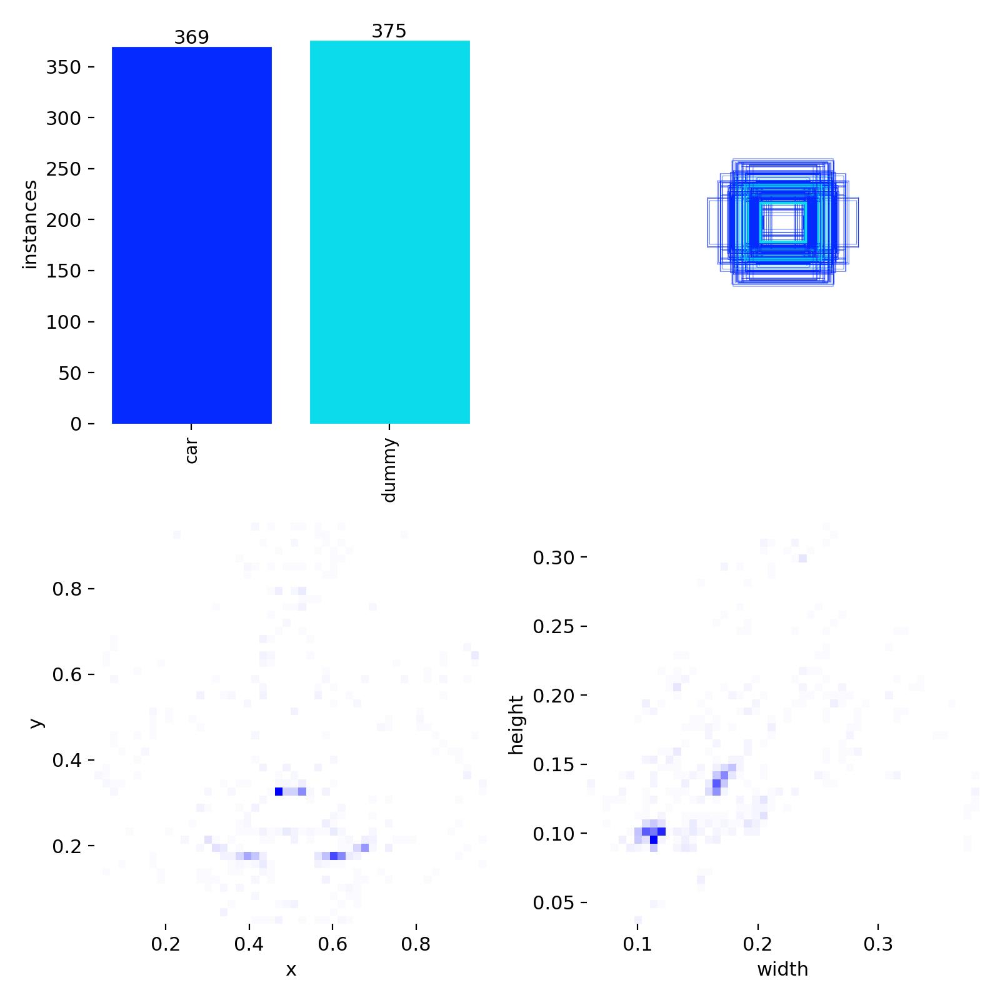
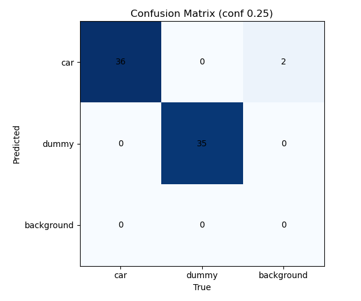
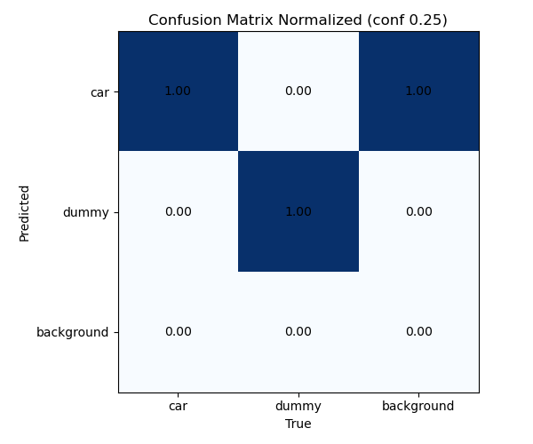
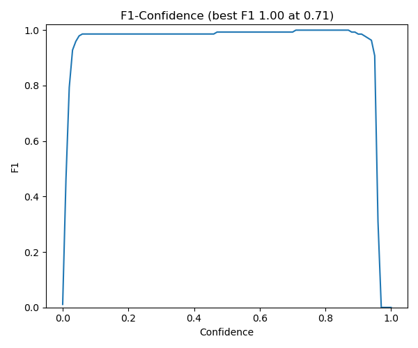
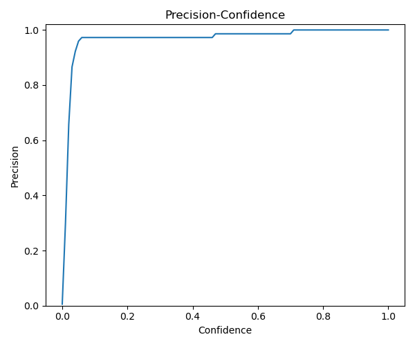
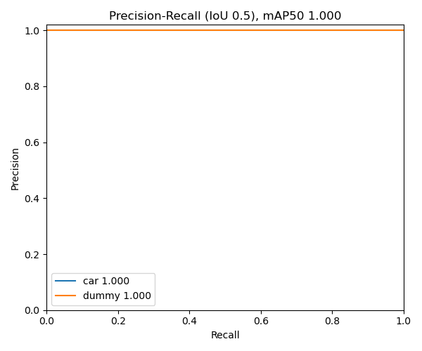
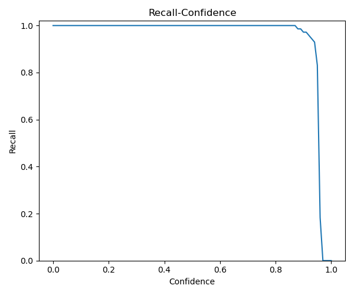
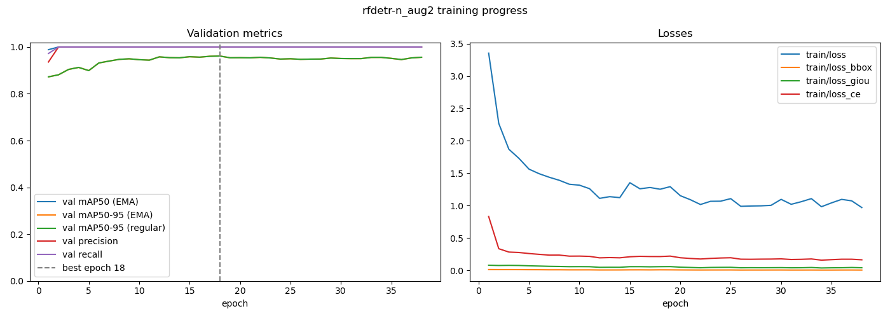

# [기술검증] YOLO 외 모델 비교분석 — Web Cam

- 작성: 2026-10-06_1424

> 형식: "[기술검증] YOLO 모델 비교분석 — Web Cam"(`vision_compare_wc.md`)과 같은 구성 · 두 페이지를 함께 게재
> 이미지: `docs/notion_draft/vision_compare_nonyolo_wc/` · 원본 결과: `wc/05_non_YOLO_object_detection/result_detection/`
> 모델 선택 근거: `docs/notion_draft/detector_survey_wc.md`(YOLO 외 모델 탐색)의 추천 1·2순위

# 0. 요약

YOLO가 아닌 실시간 검출 모델 2계열(RF-DETR, RT-DETR) × 크기 2개 × 학습 증강 설정 4개(기본 1 + 증강 개수 3), 총 16개 실험을 **YOLO 실험과 같은 데이터·같은 평가 기준**으로 비교한 기록. YOLO 실험의 선정 모델 YOLO26n을 **같은 평가 코드로 다시 채점**해 기준선으로 함께 실었다.

**YOLO 외 모델 중 선정: RF-DETR Nano (aug2: 밝기 + scale jitter).** Test 오류(FP·FN)가 없고, 운용 conf 0.8에서도 car를 놓치지 않으며, 오류가 없는 후보 중 Validation·Test mAP50-95가 모두 2위(0.9615 / 0.9564)이고 처리 시간이 가장 짧다(9.15 ms).

**YOLO26n과의 비교:** 정확도는 사실상 같다(Validation 0.9615 vs 0.9591, Test 0.9564 vs 0.9572). 처리 시간은 YOLO26n이 약 1.8배 빠르다(4.99 vs 9.15 ms). 따라서 **실제 적용 모델은 YOLO26n을 유지**하고, RF-DETR Nano aug2는 정확도가 같은 수준인 **YOLO 외 대안**으로 기록한다.

**평가 구분:** Validation 지표와 고정 confidence에서 직접 집계한 Test 지표는 서로 다른 평가다. 이 페이지의 mAP는 모두 **pycocotools(COCO 공식 코드)** 로 다시 계산한 값이며, YOLO 페이지의 Ultralytics mAP와 계산 방식이 조금 다르다 (9-4 참고).

# 1. 실험 개요

| 항목 | 내용 |
| --- | --- |
| 모델 | RF-DETR Nano / RF-DETR Small / RT-DETR-l / RT-DETR-x · 각 4개 설정 |
| 기준선 | YOLO26n (YOLO 실험 선정 모델, 학습 없이 같은 코드로 재평가) |
| 작업 | 객체 탐지(Detection) · 고정 웹캠으로 경기장 안의 car 탐지 → AMR에 알림(Detection Alert) |
| 출력 | Bounding Box, class ID, confidence |
| 클래스 | 2개 클래스 · ID 0: car(검은 장난감 지프) / ID 1: dummy(검은 LAN-hub 박스) — `data.yaml`의 names 순서 기준 |
| 라이브러리 | rfdetr 1.11.2 (RF-DETR) / Ultralytics 8.4.170 (RT-DETR, YOLO26n) |
| 실험 이름 | 실험 1: `<모델>` (기본 증강) / 실험 2: `<모델>_aug0`, `_aug2`, `_aug4` |
| 목표 / 기록 | 탐지 정확도·오탐·미탐·처리 지연·학습 시간 비교 YOLO 외 대안 모델 선정, YOLO26n과 비교 |
| 최적 모델 대응 시점 | 선정 run은 38 epoch에서 조기 종료. (best checkpoint epoch 18) |
| 평가 분할 | Train 444장 / Validation 43장 / Test 21장 · 이미지 비중 87.4% / 8.5% / 4.1% (YOLO 실험과 동일) |
| 학습 방식 | 각 실험마다 COCO 사전학습 가중치에서 새로 학습 · seed=0 단일 학습 · **run마다 별도 프로세스** |
| 핵심 설정 | 최대 100 epoch, patience=20, 한 번에 넣는 batch 4, device=GPU 0, seed=0, amp=true |

## 1-1. 비교한 모델

| 모델 | 발표 | 구조 요약 | 파라미터 | 입력 해상도 |
| --- | --- | --- | --- | --- |
| RF-DETR Nano | 2025 (Roboflow) | DINOv2 backbone + DETR decoder, NMS 없음, 소량 데이터 fine-tuning에 강하도록 설계 | 30.2M | 384 (모델 고유값) |
| RF-DETR Small | 2025 (Roboflow) | 위와 같은 구조, 더 큰 해상도 | 31.8M | 512 (모델 고유값) |
| RT-DETR-l | 2023 (Baidu) | 최초의 실시간 DETR, HGNetv2 backbone, NMS 없음 | 32.8M | 640 |
| RT-DETR-x | 2023 (Baidu) | 위와 같은 구조, 더 큰 모델 | 67.3M | 640 |
| (기준선) YOLO26n | 2025 (Ultralytics) | 1-stage CNN, end-to-end(NMS 없이 학습) | 2.5M | 640 |

- RT-DETR은 Ultralytics에서 l / x 두 크기만 제공한다.
- RF-DETR 해상도는 모델이 설계·사전학습된 값을 그대로 썼다. 공개된 속도·정확도도 이 해상도 기준이다.

## 1-2. 비교한 학습 설정

| 실험 | 실제 optimizer (RF-DETR / RT-DETR) | 켜는 학습 증강 (개수) |
| --- | --- | --- |
| 기본 (실험 1) | AdamW lr 1e-4 (encoder 1.5e-4) / AdamW lr 0.001667 | 각 라이브러리 기본값 |
| aug0 | 같음 | 없음 (0) |
| aug2 | 같음 | mosaic(RF-DETR은 scale jitter로 대체), 밝기 (2) |
| aug4 | 같음 | + 이동, 크기 (4) |

| 조건 | RT-DETR (Ultralytics, YOLO 실험 2와 동일 값) | RF-DETR (같은 효과의 설정) |
| --- | --- | --- |
| 기본 | mosaic 1.0, hsv_h/s/v, translate 0.1, scale 0.5, fliplr 0.5 | 좌우 반전 50%, multi-scale, scale jitter |
| aug0 | 모두 0 | `aug_config={}`, multi-scale·scale jitter 끔 |
| aug2 | mosaic 1.0, hsv_v 0.4 | **scale jitter**, 밝기 ±40% |
| aug4 | mosaic 1.0, hsv_v 0.4, translate 0.1, scale 0.5 | scale jitter, 밝기 ±40%, 이동 ±10%, 크기 0.5~1.5배 |

**RF-DETR에는 mosaic이 없다.** 가장 가까운 기본 기능인 scale jitter(무작위 crop 후 resize — 한 장 안에서 물체의 크기·위치·잘림을 바꿈)로 대체했다. 따라서 aug2·aug4의 첫 번째 증강은 두 계열에서 완전히 같지 않다. aug 조건에서는 위 표의 증강 외 나머지(좌우 반전 등)를 모두 껐다.

RT-DETR 8개 run의 실제 optimizer는 모두 AdamW(lr=0.001667, momentum=0.9)다 (학습 log의 `optimizer:` 줄 8개 확인). RF-DETR 8개 run은 모두 AdamW(lr=1e-4, encoder lr=1.5e-4)다 (`training_config.json`).

# 2. 최적 모델 성능

**상세 기록 대상: RF-DETR Nano aug2의 `checkpoint_best_total.pth`.** 아래 표는 선정 모델의 Validation 재평가 결과이며, 모든 모델 중 각 지표의 최고값을 의미하지 않는다.

| 지표 | Bounding Box · Validation |
| --- | --- |
| Precision | 97.26% (conf 0.25) |
| Recall | 100.00% (conf 0.25) |
| mAP50 | 100.00% |
| mAP50-95 | 96.15% |

- Precision·Recall은 conf 0.25에서 같은 class 정답과 IoU≥0.5 일대일 매칭으로 계산했다 (YOLO 페이지의 Ultralytics Validation 요약 P·R과 계산 방식이 다르다).
- 학습 중 18 epoch의 Validation mAP50-95(RF-DETR 내부 COCO 평가)는 96.14%로, 재평가(96.15%)와 거의 같다. 두 평가 모두 COCO 방식이기 때문이다.

## 2-1. 고정 기준 Test 성능과 처리 시간

| 항목 | 내용 |
| --- | --- |
| GT / 예측 / TP | 37 / 37 / 37 (car 21, dummy 16) |
| FP / FN | 0 / 0 |
| Test Precision / Recall / F1 | 100% / 100% / 100% · 이번 Test 집계 기준 |
| Test mAP50 / mAP50-95 | 100% / 95.64% · pycocotools |
| 정답 예측 평균 confidence | 95.49% (최저 0.9185) |
| 운용 conf 0.8 기준 car 미검출 / 오검출 | 0 / 0 |
| 평균 처리 시간 (전처리~후처리) | **9.154 ms/image** |
| 처리 시간 표준편차 | 0.361 ms |
| 처리 시간 p95 | 9.758 ms |
| 처리 시간 환산 FPS | 109.2 · 전체 처리 시간의 역수 |
| (기준선) YOLO26n 같은 방법 측정 | 4.993 ms (p95 5.225) |

Test는 이미지 21장에 포함된 car 21개·dummy 16개, 정답 객체 37개를 평가한 결과다. 오류 0개는 해당 Test에서의 관측 결과이며 실제 환경에서 오류가 없음을 보장하지 않는다. 처리 시간은 모델마다 내부 구간 구분이 달라 **전처리~후처리 전체**를 GPU 동기화 후 벽시계로 잰 값이다 (카메라·ROS2 처리 미포함, 웹캠 30fps의 프레임 간격은 33 ms, 웹캠 node는 15 Hz).

## 2-2. 16개 실험 비교

단위: mAP는 비율(0~1), 시간은 ms/image 및 분. 순서: 실험 1 → 실험 2, 각 실험 안에서 최신 모델부터. 마지막 줄은 기준선.

| 모델 | 설정 | Val mAP50-95 | Test mAP50-95 | TP / FP / FN | conf 0.8 car FN | 평균 처리 | p95 | 학습 시간 |
| --- | --- | --- | --- | --- | --- | --- | --- | --- |
| rfdetr-n | 기본 | 0.9530 | 0.9542 | 37 / 0 / 0 | 0 | 10.544 | 13.324 | 12.53 |
| rfdetr-s | 기본 | 0.9502 | 0.9532 | 37 / 0 / 0 | 0 | 13.316 | 14.420 | 9.97 |
| rtdetr-l | 기본 | 0.9559 | 0.9371 | 37 / **1** / 0 | 0 | 19.106 | 21.389 | 24.16 |
| rtdetr-x | 기본 | 0.9466 | 0.9277 | 37 / **61** / 0 | 0 | 31.041 | 35.653 | 19.48 |
| rfdetr-n | aug0 | 0.9507 | 0.9469 | 37 / 0 / 0 | 0 | 9.831 | 10.723 | 8.14 |
| **rfdetr-n** | **aug2** | **0.9615** | **0.9564** | 37 / 0 / 0 | 0 | **9.154** | 9.758 | 9.47 |
| rfdetr-n | aug4 | 0.9441 | 0.9199 | 37 / 0 / 0 | 0 | 9.085 | 9.641 | 10.07 |
| rfdetr-s | aug0 | 0.9607 | 0.9546 | 37 / 0 / 0 | 0 | 13.054 | 13.833 | 12.13 |
| rfdetr-s | aug2 | **0.9682** | 0.9435 | 37 / 0 / 0 | 0 | 13.090 | 13.745 | 28.54 |
| rfdetr-s | aug4 | 0.9586 | 0.9569 | 37 / 0 / 0 | 0 | 13.259 | 14.433 | 25.54 |
| rtdetr-l | aug0 | 0.9440 | 0.9284 | 37 / 0 / 0 | **1** | 19.157 | 20.465 | 13.76 |
| rtdetr-l | aug2 | 0.9574 | 0.9473 | 37 / 0 / 0 | 0 | 18.528 | 19.310 | 21.45 |
| rtdetr-l | aug4 | 0.9483 | **0.9599** | 37 / **10** / 0 | 0 | 18.536 | 19.431 | 17.69 |
| rtdetr-x | aug0 | 0.9402 | 0.9513 | 37 / 0 / 0 | 0 | 30.326 | 35.607 | 30.17 |
| rtdetr-x | aug2 | 0.9536 | 0.9416 | 37 / **1** / 0 | 0 | 28.545 | 29.863 | 39.30 |
| rtdetr-x | aug4 | 0.9478 | 0.9477 | 37 / **2** / 0 | 0 | 28.575 | 29.628 | 24.82 |
| *yolo26n (기준선)* | *기본* | *0.9591* | *0.9572* | *37 / 0 / 0* | *0* | *4.993* | *5.225* | *4.49* |

- Val / Test mAP50-95는 모두 pycocotools로 같은 코드로 계산했다. Val mAP50은 16개 run 모두 0.996~1.000, Test mAP50은 모두 1.000으로 포화되어 비교 지표로 쓰지 않았다.
- **FN은 16개 run 모두 0이다.** 오류는 전부 FP이고, 모두 RT-DETR에서 나왔다. rtdetr-x(기본)의 FP 61개는 car 41·dummy 20개, conf 0.256~0.784이며, 나머지 RT-DETR run의 FP는 모두 conf 0.36 이하다. **운용 기준 conf 0.8에서는 16개 run 모두 FP 0**이다.
- RT-DETR은 낮은 점수(0.25~0.4)의 예측을 많이 내는 경향이 있다. 실험 1 Validation에서 conf 0.25 Precision이 rtdetr-x 0.345, rtdetr-l 0.887로 낮았던 것도 같은 이유다.
- rtdetr-l_aug0은 conf 0.25에서는 오류가 없지만, car 1개의 confidence가 0.376이라 conf 0.8에서는 미검출이 된다.
- 처리 시간: RF-DETR Nano 9~11 ms, Small 13 ms, RT-DETR-l 19 ms, RT-DETR-x 29~31 ms다. RT-DETR-x는 웹캠 프레임 간격(33 ms)의 약 90%를 써서 실시간 여유가 거의 없다.
- rfdetr-n(기본)의 처리 시간 표준편차(1.134 ms)가 다른 run보다 큰 것은 측정 중 일시적인 지연(최대 14 ms) 때문이다. 같은 모델 구조인 aug run들은 9.1~9.8 ms로 안정적이다.

**증강 설정별 Val mAP50-95 (실험 2)**

| 모델 | aug0 | aug2 | aug4 |
| --- | --- | --- | --- |
| rfdetr-n | 0.9507 | **0.9615** | 0.9441 |
| rfdetr-s | 0.9607 | **0.9682** | 0.9586 |
| rtdetr-l | 0.9440 | **0.9574** | 0.9483 |
| rtdetr-x | 0.9402 | **0.9536** | 0.9478 |
| **평균** | 0.9489 | **0.9602** | 0.9497 |

Validation에서는 **4개 모델 모두 aug2가 가장 높다.** 그러나 같은 run들의 Test mAP50-95 평균은 aug0 0.9453 / aug2 0.9472 / aug4 0.9461로 차이가 거의 없고, 계열별로도 RF-DETR은 aug0≈aug2, RT-DETR은 aug4가 가장 높아 일관되지 않다. YOLO 실험과 마찬가지로, 결과는 "증강 개수의 효과"보다 "증강 조합의 효과"로 해석한다.

### 실험 Hyperparameter 비교

| 번호 | 모델 | 실험 | 실제 optimizer | 실제 초기 LR | 한 번에 넣는 batch | 갱신 단위 | mosaic / scale jitter | 밝기 | 이동 | 크기 | 좌우 반전 |
| --- | --- | --- | --- | --- | --- | --- | --- | --- | --- | --- | --- |
| 1~2 | RF-DETR n/s | 기본 | AdamW | 1e-4 (encoder 1.5e-4) | 4 | 16 (4×4) | scale jitter + multi-scale | - | - | - | 0.5 |
| 3~4 | RT-DETR l/x | 기본 | AdamW | 0.001667 | 4 | 64 (nbs) | mosaic 1.0 | 0.4 | 0.1 | 0.5 | 0.5 |
| 5~10 | RF-DETR n/s | aug0/2/4 | AdamW | 1e-4 | 4 | 16 | 끔 / jitter / jitter | 0 / 0.4 / 0.4 | 0 / 0 / 0.1 | 0 / 0 / 0.5~1.5 | 0 |
| 11~16 | RT-DETR l/x | aug0/2/4 | AdamW | 0.001667 | 4 | 64 | 0 / 1.0 / 1.0 | 0 / 0.4 / 0.4 | 0 / 0 / 0.1 | 0 / 0 / 0.5 | 0 |

### 모든 실험의 공통 설정

| Hyperparameter | 값 |
| --- | --- |
| epochs | 100 (최대) |
| patience | 20 (RF-DETR: `early_stopping_patience=20`, 개선 기준 0, EMA 가중치 기준) |
| 한 번에 넣는 batch | 4 |
| 입력 크기 | RT-DETR 640 / RF-DETR 모델 고유값 (Nano 384, Small 512) |
| device | GPU 0 (RTX 4070 Laptop 8GB) |
| seed | 0 |
| pretrained | COCO 사전학습 가중치 |
| amp | true |
| 데이터 | `wc/data_wc/rokey_mp4_a1.v2i.yolo26` (YOLO 형식, YOLO 실험과 동일) |

**batch를 4로 통일한 이유:** 퀵테스트에서 RT-DETR이 8GB GPU의 메모리를 넘었고, 이때 Ultralytics가 batch를 16 → 8 → 4로 **자동으로 줄여 재시도**해 run마다 batch가 달라졌다. 같은 설정으로 따로 측정하니 RT-DETR-x는 batch 8에서도 메모리가 부족했고, RT-DETR-l은 8이 한계(6.7GB)였다. 그래서 RT-DETR 8개 run을 모두 4로 통일했고, RF-DETR이 한 번에 넣는 batch(4)와도 같다. 가중치 갱신 단위는 RT-DETR이 64장(Ultralytics `nbs=64` gradient 누적, YOLO 실험과 같음), RF-DETR이 16장(4×4 누적)이다. 학습은 run마다 별도 프로세스로 실행해 앞 run의 GPU 메모리가 남지 않게 했고, batch 자동 감소가 생기면 멈추도록 했다 (본 실험에서 0회).

## 2-3. 선정 판단 흐름

1. Detection Alert에서는 **car 미탐(알림 누락)과 car 오탐(잘못된 알림)**을 먼저 확인한다 (YOLO 실험과 같은 기준).
2. 동일한 Test 조건(conf 0.25)에서 FP=0, FN=0인 11개 조합을 남긴다 (rtdetr-x FP 61, rtdetr-l_aug4 FP 10, rtdetr-x_aug4 FP 2, rtdetr-l·rtdetr-x_aug2 FP 1 제외).
3. 웹캠 node가 실제로 쓰는 **conf 0.8**에서 다시 확인한다. rtdetr-l_aug0은 car 1개를 놓쳐 제외 → **10개 후보** (RF-DETR 8개 전부 + rtdetr-l_aug2, rtdetr-x_aug0).
4. 처리 시간을 본다. RT-DETR-x(28~31 ms)는 웹캠 프레임 간격 33 ms에 거의 다 차서 실시간 여유가 없다. YOLO 실험과 달리 **이번 비교에서는 속도가 후보를 가른다.** RF-DETR Nano(9~10 ms)가 가장 빠르다.
5. 다음으로 **box 위치 정밀도(mAP50-95)**를 Validation·Test 두 평가에서 함께 본다.
   - Validation 1위 rfdetr-s_aug2(0.9682)는 Test 0.9435로 후보 10개 중 9위다.
   - Test 1위 rfdetr-s_aug4(0.9569)는 Validation 0.9586으로 4위다.
   - **rfdetr-n_aug2는 Validation 0.9615(2위), Test 0.9564(2위)로 두 평가 모두 상위**이고, 처리 시간은 후보 중 가장 짧은 축(9.15 ms)이다.
6. 평가 간 순위가 뒤집히는 run이 많다 (rfdetr-s_aug2: 후보 중 Val 1위 → Test 9위, rtdetr-l_aug4: Val 하위권 → Test 전체 1위지만 FP 10). Validation 하나만으로 고르지 않는다.
7. 정답 예측 confidence는 운용 conf 0.8에서의 여유를 보여준다. rfdetr-n_aug2의 Test 정답 예측 최저 confidence는 0.9185, Validation에서 Recall은 conf 0.87까지 1.00을 유지한다.

**YOLO26n과의 최종 비교 (같은 평가 코드)**

| 항목 | RF-DETR Nano aug2 | YOLO26n (기본) |
| --- | --- | --- |
| Val mAP50-95 | **0.9615** | 0.9591 |
| Test mAP50-95 | 0.9564 | **0.9572** |
| Test TP / FP / FN | 37 / 0 / 0 | 37 / 0 / 0 |
| conf 0.8 car 미검출 | 0 | 0 |
| 정답 예측 최저 confidence | 0.9185 | 0.9357 |
| 평균 처리 시간 | 9.154 ms | **4.993 ms** |
| 학습 시간 | 9.47분 (38 epoch) | 4.49분 (100 epoch) |
| 가중치 파일 | 약 121 MB | 약 5.4 MB |

정확도 차이는 ±0.003 이내로 이번 평가 규모(Validation 객체 71개, Test 37개)에서는 구분되지 않는다. 처리 시간과 가중치 크기는 YOLO26n이 확실히 유리하다. **결론: 웹캠 Detection Alert의 적용 모델은 YOLO26n을 유지한다.** RF-DETR Nano aug2는 YOLO 외 모델 중 최선이며, 학습 데이터가 적은 상황에서 짧은 학습(최적 18 epoch)으로 같은 수준에 도달한 점이 장점이다.

**추가 검증 후보:** RF-DETR Small aug4(Test 0.9569, 오류 0), RF-DETR Small aug0(Val 0.9607 / Test 0.9546, 오류 0). Test를 보고 선정한 후보이므로 최종 검증에는 별도의 새 영상·데이터를 사용한다.

# 3. 데이터셋과 클래스

## 3-1. 라벨 분포

YOLO 실험과 같은 데이터셋이다. 클래스 순서는 `data.yaml`의 names(`['car', 'dummy']`)로 확인했고, RF-DETR도 YOLO 형식을 그대로 읽어 class ID가 같다 (test 이미지 예측으로 car=0, dummy=1 확인).

| ID | 클래스 | Train | Validation | Test | 전체 | 전체 비중 |
| --- | --- | --- | --- | --- | --- | --- |
| 0 | car | 369 | 36 | 21 | 426 | 50.00% |
| 1 | dummy | 375 | 35 | 16 | 426 | 50.00% |
| **합계** |  | **744** | **71** | **37** | **852** | **100%** |

## 3-2. 평가 데이터와 분할 확인

| 분할 | 이미지 수 | GT 객체 수 | 이미지 비중 |
| --- | --- | --- | --- |
| train | 444 | 744 | 87.4% |
| val | 43 | 71 | 8.5% |
| test | 21 | 37 | 4.1% |
| 합계 | 508 | 852 | 100% |

- 웹캠(1920x1080)으로 촬영한 원본 212장 → Roboflow 라벨링 → 640x640(Fill, center crop) → train만 증강 3배.
- Roboflow 증강 (README 기준): 좌우 반전 50%, 회전 ±5°, 밝기 ±15%, Gaussian blur 0~1px.
- **같은 촬영 시퀀스의 유사 프레임이 분할에 섞여 있다.** Validation 43장 중 35장, Test 21장 중 16장이 2초 이내에 찍힌 train 이미지를 갖는다. Validation·Test 점수가 실제 일반화 성능보다 높게 나올 수 있다.
- RT-DETR은 `custom_data.yaml`(절대 경로)로, RF-DETR은 데이터셋 폴더(`data.yaml` + `train/valid/test`)를 변환 없이 읽었다.

# 4. 학습 옵션

선정 run(RF-DETR Nano aug2)의 `training_config.json` 기준이다.

## 4-1. 기본 학습·실행

| 옵션 | 값 | 의미 |
| --- | --- | --- |
| model | RFDETRNano (`rf-detr-nano.pth` COCO 사전학습) | DINOv2 windowed small encoder + 2층 decoder |
| epochs | 100 · 실제 수행 38 | 목표 최대 epoch와 실제 수행량 구분 (조기 종료) |
| early_stopping / patience | true / 20 | EMA 가중치의 Val mAP50-95 기준, 개선 기준 0 |
| batch_size × grad_accum_steps | 4 × 4 = 16 | 한 번에 4장, 4번 모아 한 번 갱신 |
| resolution | 384 | 모델 고유 입력 해상도 |
| num_queries / num_select | 300 / 300 | decoder가 내는 후보 box 수 |
| device | GPU 0 | RTX 4070 Laptop GPU |
| num_workers | 4 | 데이터 로딩 작업자 |
| amp | true (`amp_dtype=auto` → bf16) | 학습 자동 혼합 정밀도 |
| seed | 0 | seed 반복 실험 없음 |
| 실행 방식 | run마다 별도 프로세스 | GPU 메모리를 run마다 비움 |

## 4-2. 경로

| 항목 | 내용 |
| --- | --- |
| dataset_dir | `wc/data_wc/rokey_mp4_a1.v2i.yolo26` (YOLO 형식 그대로) |
| output_dir | `result_detection/exp2_aug/rfdetr-n_aug2` |
| 평가 가중치 | `result_detection/exp2_aug/rfdetr-n_aug2/checkpoint_best_total.pth` |
| 학습 log | `result_detection/log/train_rfdetr-n_aug2.txt` |

## 4-3. 최적화·학습률

| 옵션 | 설정값 | 의미 |
| --- | --- | --- |
| optimizer | AdamW | RF-DETR 고정 |
| `lr` | `1e-4` | decoder 등 나머지 부분 학습률 |
| `lr_encoder` | `1.5e-4` | backbone(DINOv2) 학습률 |
| `lr_vit_layer_decay` | `0.8` | backbone 층이 얕을수록 학습률을 줄임 |
| `lr_component_decay` | `0.7` | 구성 요소별 학습률 감쇠 |
| `weight_decay` | `1e-4` | 가중치 감쇠 |
| `warmup_epochs` | `0` | 워밍업 없음 |
| `lr_scheduler` | `step` (`lr_drop` 미지정) | 이번 학습 범위에서 학습률 고정 (log: 1e-4 유지) |
| `use_ema / ema_decay` | `true / 0.993` | 가중치 이동평균(EMA) 사용 · 선정 checkpoint도 EMA 가중치 |
| `drop_path` | `0.0` | 비활성화 |

## 4-4. 데이터 증강

| 옵션 | 적용값 | 의미 |
| --- | --- | --- |
| **`scale_jitter`** | **`true`** | 무작위로 직접 resize 하거나, resize → 무작위 crop → resize (mosaic 대체) |
| **`aug_config`** | **`RandomBrightnessContrast(brightness_limit=0.4, contrast_limit=0, p=1.0)`** | 밝기 ±40% (YOLO `hsv_v=0.4`에 대응) |
| `multi_scale` | `off` | 여러 해상도 학습 비활성화 |
| 좌우 반전 | 없음 | aug 조건에서는 끔 (기본 설정에서만 50%) |
| 이동 / 크기 / 회전 | 없음 | aug4에서만 이동·크기 사용 |

선정 run은 aug2 조건이다. Roboflow에서 이미 좌우 반전·회전·밝기·blur를 적용한 데이터 위에 학습 증강이 한 번 더 걸린다.

## 4-5. 검증·저장·기타

| 옵션 | 확인된 값 | 의미 |
| --- | --- | --- |
| `eval_interval` | 1 | 매 epoch Validation |
| `best_model_metric` | `map` | best 선정 기준: Val mAP50-95 |
| `checkpoint_interval` | 10 | 10 epoch마다 checkpoint 저장 |
| `eval_max_dets` | 500 | 평가 시 이미지당 최대 검출 수 |
| `conf` | 재평가 0.001 / Test 0.25 / 운용 0.8 | 단계별 confidence 설정 구분 |
| `MATCH_IOU` | 0.5 | Test 정답 인정용 매칭 기준 |
| NMS | 없음 | DETR 구조라 후처리 NMS가 없음 (RT-DETR·YOLO26n은 Ultralytics `iou=0.7` 전달) |
| 평가 batch / 정밀도 | 1 / FP32 | `inference(compile=False)` — 컴파일·반정밀도 없이 추론 |

# 5. 학습 진행과 best checkpoint 선택

## 5-1. 주요 epoch 성능

RF-DETR Nano aug2는 최대 100 epoch로 설정했으며, 18 epoch 이후 20 epoch 동안 개선이 없어 38 epoch에서 조기 종료됐다. 아래는 학습 중 Validation 지표(RF-DETR 내부 COCO 평가)이며, 단위는 %다.

| Epoch | Precision | Recall | Box mAP50 | Box mAP50-95 |
| --- | --- | --- | --- | --- |
| 1 | 93.59 | 97.22 | 98.85 | 87.24 |
| 5 | 100.00 | 100.00 | 100.00 | 89.91 |
| 10 | 100.00 | 100.00 | 100.00 | 94.58 |
| 15 | 100.00 | 100.00 | 100.00 | 95.85 |
| **18 · Best** | **100.00** | **100.00** | **100.00** | **96.14** |
| 20 | 100.00 | 100.00 | 100.00 | 95.43 |
| 25 | 100.00 | 100.00 | 100.00 | 94.98 |
| 30 | 100.00 | 100.00 | 100.00 | 95.09 |
| 35 | 100.00 | 100.00 | 100.00 | 95.14 |
| **38 · 마지막** | **100.00** | **100.00** | **100.00** | **95.61** |

1 epoch부터 mAP50 98.85%, mAP50-95 87.24%로 시작했다. 사전학습된 DINOv2 backbone 덕분에 YOLO26n(1 epoch mAP50-95 21.3%)보다 훨씬 빨리 수렴한다. 2 epoch에 mAP50·Precision·Recall이 100%에 도달해 끝까지 유지했고, 이후 차이는 mAP50-95에서만 나타난다.

## 5-2. 지표별 최고값

| 지표 | 최고값 | Epoch |
| --- | --- | --- |
| Precision | 100.00% | 2~38 epoch 전부 |
| Recall | 100.00% | 2~38 epoch 전부 |
| mAP50 | 100.00% | 2~38 epoch 전부 |
| mAP50-95 | **96.14%** | **18** |

## 5-3. 최적 모델이 18 epoch인 근거

RF-DETR은 `best_model_metric=map`(mAP50-95)이 가장 높은 가중치를 `checkpoint_best_total.pth`로 저장한다. `metrics.csv`에서 **18 epoch의 mAP50-95가 96.14%로 최고**이며, 학습 log의 "Best EMA metric improved to 0.9614 (epoch 17)"과 일치한다 (log의 epoch는 0부터 세므로 17 = 18번째 epoch). 학습 종료 시 log는 "Best total checkpoint saved from EMA (regular=0.0000, ema=0.9614)"로, **best checkpoint는 EMA 가중치**다. `metrics.csv`의 일반·EMA 열이 같은 값으로 기록된 것은 이 설정에서 EMA 가중치만 평가됐기 때문으로 보인다.

38 epoch의 마지막 모델은 mAP50-95가 95.61%로 최적 모델보다 0.53%p 낮다. 후속 평가에는 18 epoch에서 선정된 best checkpoint를 사용했다.

## 5-4. 종료 시점과 시간

| 항목 | 결과 |
| --- | --- |
| 최대 학습 설정 | 100 epoch |
| 최적 모델 선정 | **18 epoch** |
| 실제 학습 종료 | **38 epoch** |
| 종료 사유 | 조기 종료 (18 이후 20 epoch 동안 개선 없음) |
| 학습 시간 | 568.4초 · 약 9.47분 (프로세스 시작~종료, 사전학습 가중치 로딩 포함) |

16개 run 중 100 epoch에 도달한 run은 없다. 가장 오래 학습한 run은 rfdetr-s_aug2(97 epoch, best 77)다.

# 6. 클래스별 AP50

| 클래스 | 정답 객체 수 | Box AP50 | Box AP50-95 | 해석 |
| --- | --- | --- | --- | --- |
| car | 36 | 100.00% | **93.70%** | dummy보다 엄격한 위치 기준에서 성능이 낮음 |
| dummy | 35 | 100.00% | **98.60%** | 엄격한 IoU 기준에서도 매우 높음 |
| 전체 | 71 | 100.00% | 96.15% | 두 클래스 평균 |

YOLO26n(car 92.78% / dummy 96.22%, Ultralytics 기준)과 같은 경향으로, car가 방향(앞·옆·뒷모습)에 따라 모양이 크게 바뀌어 box 경계가 덜 정확하다.

# 7. 혼동행렬 상세 분석

## 7-1. 분석 자료와 평가 조건

| 구분 | 평가 대상 | 평가 조건 |
| --- | --- | --- |
| Validation 혼동행렬 | 43장 · 정답 객체 71개 | conf 0.25, class 구분 없이 IoU≥0.5 일대일 매칭 후 (정답, 예측) class 집계 |
| Validation mAP | 동일 Validation 분할 | conf 0.001, pycocotools |
| Test 결과 | 21장 · 정답 객체 37개 | conf 0.25, 같은 class 정답과 IoU≥0.5 일대일 매칭 |

이 혼동행렬은 두 계열을 같은 코드로 그리기 위해 직접 계산했다. **YOLO 페이지의 혼동행렬(Ultralytics 내부 집계)과 계산 방식이 달라 수치를 직접 비교하지 않는다.**

## 7-2. 축과 background 의미

| 위치 | 의미 |
| --- | --- |
| 가로축 True | 실제 정답 클래스 |
| 세로축 Predicted | 예측 클래스 |
| 대각선 | 정답과 올바르게 매칭된 검출 |
| 클래스 사이 비대각선 | 다른 클래스 예측으로 매칭된 오류 |
| 맨 아래 background 행 | 매칭되지 않은 실제 물체 · FN |
| 맨 오른쪽 background 열 | 정답에 매칭되지 않은 예측 · FP |

## 7-3. Validation 개수 행렬

- 실제 car 36개는 36개 모두 car로 예측했다.
- 실제 dummy 35개는 35개 모두 dummy로 예측했다.
- background 행은 비어 있다. 매칭되지 않은 정답(FN)은 0개다.
- 정답과 매칭되지 않은 예측은 car 2개다.
- 클래스 간 오분류는 0개다.

## 7-4. 혼동행렬에서 계산한 클래스별 지표

| 클래스 | 정답 수 | TP | FP | FN | Precision | Recall |
| --- | --- | --- | --- | --- | --- | --- |
| car | 36 | 36 | **2** | 0 | **94.74%** | **100.00%** |
| dummy | 35 | 35 | 0 | 0 | **100.00%** | **100.00%** |
| **합계 / Micro** | **71** | **71** | **2** | **0** | **97.26%** | **100.00%** |

## 7-5. 정규화 행렬 해석

| 실제 클래스 | 올바른 클래스 매칭 | 다른 클래스 매칭 | 매칭되지 않은 정답 |
| --- | --- | --- | --- |
| car | 100% | 0% | 0% |
| dummy | 100% | 0% | 0% |

정규화는 실제 클래스(열) 기준이다. background 열은 정답이 없는 열이라, 미매칭 예측 2개가 모두 car라는 구성비(100% car)만 의미한다.

## 7-6. Test 결과

| 클래스 | Test 정답 수 | TP | FP | FN | Precision | Recall |
| --- | --- | --- | --- | --- | --- | --- |
| car | 21 | 21 | 0 | 0 | 100% | 100% |
| dummy | 16 | 16 | 0 | 0 | 100% | 100% |
| **합계 / Micro** | **37** | **37** | **0** | **0** | **100%** | **100%** |

평가 기준은 confidence=0.25, 동일 클래스의 정답과 IoU≥0.5인 일대일 매칭이다. 운용 기준 conf 0.8로 높여도 결과가 같다 (정답 예측 최저 confidence 0.9185).

## 7-7. 높은 AP와 혼동행렬의 관계

Validation mAP50 100%, conf 0.25의 Precision 97.26%, Recall 100%이며, 혼동행렬 지표(Precision 97.26%, Recall 100%)도 같은 값이다. 이번 혼동행렬은 Test 집계와 같은 일대일 매칭 방식으로 직접 계산했기 때문에, YOLO 페이지처럼 AP와 혼동행렬 수치가 크게 어긋나지 않는다. Validation의 미매칭 car 예측 2개는 conf 0.71 이상에서 모두 사라진다 (8-2). Detection Alert에서 중요한 **실제 car의 미매칭(FN)은 혼동행렬·Test 모두 0개**다.

# 8. 그래프 이미지별 분석

본 절은 `selected/rfdetr-n_aug2/validation/`의 그래프와 `selected/rfdetr-n_aug2/results.png`를 기준으로 작성한다. 곡선은 모두 전체 클래스 기준으로 직접 계산했다 (PR 곡선만 클래스별).

## 8-1. Box F1–Confidence

**F1 최댓값 1.00, confidence 0.71**(처음 1.00이 되는 지점)이다.

- confidence 0.25~0.70에서 F1 0.986~0.993, **0.71~0.87에서 F1 1.00**이다.
- 0.88부터 Recall이 줄며 F1이 내려가고, 0.95 이후 급락한다.

**해석:** 운용 conf 0.8은 F1 1.00 구간(0.71~0.87) 안에 있다. 다만 이 구간은 Validation 71개 객체에서 본 것이며, 운용 threshold로 확정하지 않는다.

## 8-2. Box Precision–Confidence

- conf 0.25에서 0.973, 0.50~0.70에서 0.986, **0.71 이상에서 1.00**이다.
- 낮은 confidence 구간의 Precision 감소는 미매칭 car 예측 2개 때문이다.

**해석:** conf 0.71 이상이면 Validation에서 오탐이 없다.

## 8-3. Box Precision–Recall

| 구분 | AP50 |
| --- | --- |
| car | 1.000 |
| dummy | 1.000 |
| 전체 mAP50 | 1.000 |

두 클래스 모두 모든 Recall에서 Precision 1.00을 유지한다 (점수 순으로 보면 정답 예측이 미매칭 예측보다 항상 위에 있음). 이는 **IoU=0.5에서의 AP**로, 위치 정확도를 엄격하게 보는 mAP50-95(96.15%)와 구분한다.

## 8-4. Box Recall–Confidence

- **confidence 0.87까지 Recall 1.00**이다.
- 0.88에서 0.986, 0.90에서 0.972, 0.95에서 0.831로 내려가고, 0.96 이후 급락한다.

**해석:** 운용 conf 0.8에서 Validation 정답을 하나도 놓치지 않는다. YOLO26n은 car Recall이 conf 0.73부터 내려가 0.8에서 약 0.97이었던 것과 비교하면, RF-DETR Nano aug2의 confidence가 더 높게 모여 있어 **conf 0.8에 대한 여유가 더 크다** (Validation 기준).

## 8-5. Confusion Matrix · 개수

정답 71개가 모두 올바른 클래스로 매칭됐고, 미매칭 예측은 car 2개다. 상세 계산은 7번에 기록한다.

## 8-6. Confusion Matrix · 정규화

car·dummy 모두 대각선 100%다. 정규화 그림은 상대적인 비율이므로 오류 규모는 개수 행렬과 함께 확인한다.

## 8-7. Epoch별 학습·검증 추이

| Epoch | Box mAP50 | Box mAP50-95 |
| --- | --- | --- |
| 1 | 98.85% | 87.24% |
| 10 | 100.00% | 94.58% |
| **18 · best** | **100.00%** | **96.14%** |
| 38 · 마지막 | 100.00% | 95.61% |

- 2 epoch부터 Precision·Recall·mAP50이 100%로 안정된다.
- mAP50-95는 18 epoch에 최고점을 찍은 뒤 95% 안팎에서 오르내린다.
- 그래프의 EMA·일반 가중치 곡선은 같은 값으로 기록되어 겹쳐 보인다 (5-3 참고).

**해석:** 최고점 이후 20 epoch 동안 개선이 없어 조기 종료됐다. 18 epoch의 best checkpoint를 선정 모델로 사용한다.

## 8-8. 손실 항목 상세

RF-DETR은 DETR 계열이라 YOLO와 손실 항목이 다르다 (box 좌표 L1, GIoU, 분류 손실을 decoder 각 층과 encoder 출력에 걸어 합산).

| 손실 항목 | 의미 | Epoch 1 | Epoch 10 | Epoch 18 · best | Epoch 38 |
| --- | --- | --- | --- | --- | --- |
| train/loss | 전체 손실(보조 손실 포함 합) | 3.3522 | 1.3165 | 1.2539 | 0.9715 |
| train/loss_bbox | Box 좌표 L1 손실 | 0.0149 | 0.0103 | 0.0110 | 0.0071 |
| train/loss_giou | Box 겹침(GIoU) 손실 | 0.0819 | 0.0604 | 0.0598 | 0.0429 |
| train/loss_ce | 클래스 분류 손실 | 0.8328 | 0.2230 | 0.2158 | 0.1654 |

학습 손실은 끝까지 줄었지만 Validation mAP50-95는 18 epoch 이후 오르지 않았다. 이 run은 Validation 손실을 기록하지 않아(`compute_val_loss=auto`), 과적합 여부는 Validation 지표의 정체로만 판단한다. 손실 감소가 AP 향상을 보장하지 않으므로 모델 선정은 검증 지표로 한다.

# 9. 원본 설정 및 기록

## 9-1. 실행 환경과 데이터셋

| 항목 | 확인 내용 |
| --- | --- |
| rfdetr | 1.11.2 (학습 의존성 포함, albumentations 2.0.8) |
| Ultralytics | 8.4.170 |
| PyTorch | 2.14.1+cu130 |
| Python | 3.12.3 (`~/venvs/rokey_venv`) |
| 평가 | pycocotools 2.0.11 |
| GPU | NVIDIA GeForce RTX 4070 Laptop GPU (8GB) |
| 클래스 순서 | 0: car / 1: dummy |
| 데이터셋 규모 | 이미지 508장 · 객체 852개 (YOLO 실험과 동일) |
| 실험 구성 | 4개 모델 × 4개 설정(기본, aug0, aug2, aug4) = 16개 실험 + 기준선 1개 |
| 재현성 설정 | seed=0 |

`rokey_venv`는 ROS(cv_bridge)와 함께 쓰는 환경이라, numpy(1.26.4)·opencv(4.9.0)의 버전이 바뀌지 않도록 rfdetr 의존성을 설치했다 (opencv-python-headless 제외).

## 9-2. 확보한 원본과 확인 사항

모두 `wc/05_non_YOLO_object_detection/` 기준이다.

| 자료 | 확인 사항 |
| --- | --- |
| `2_5_a_non_yolo_obj_det_wc.ipynb` | 학습·평가·Test 집계·속도 측정 절차 전체, 공통 추론기(`Detector`), pycocotools 평가, 정답 매칭 로직 |
| `result_detection/custom_data.yaml` | RT-DETR용 데이터 경로·클래스 |
| `result_detection/log/log_261006_091221.txt` | 16개 run 학습 log (RT-DETR 실제 optimizer, RF-DETR best checkpoint 기록) |
| `result_detection/log/train_<run>.txt` | run별 학습 출력 (로컬 보관) |
| `result_detection/compare_models.csv / .png` | 실험 1 Validation 비교표 (기준선 포함) |
| `result_detection/compare_aug.csv`, `compare_aug_map.csv / .png` | 실험 2 Validation 비교표 |
| `result_detection/test_eval/final_comparison.csv` | 16개 run + 기준선의 학습·Validation·Test·속도 요약 |
| `result_detection/test_eval/test_detections.csv` | 예측별 class·confidence·정답 매칭 여부 |
| `result_detection/test_eval/speed_samples.csv` | 개별 속도 측정값 (run당 63개) |
| `result_detection/test_eval/comparison.png` | 16개 run + 기준선 비교 그래프 |
| `result_detection/exp2_aug/rfdetr-n_aug2/` | 선정 run의 `training_config.json`, `metrics.csv`, `checkpoint_best_total.pth` |
| `result_detection/selected/rfdetr-n_aug2/` | `per_class_ap.csv`, `results.png`, `validation/`(혼동행렬·곡선·`conf_curve.csv`) |

첫 Test 이미지로 **5회 워밍업**, 전체 Test 이미지에 대해 **3회 속도 측정**을 수행했다 (run당 표본 63개). 이미지는 미리 메모리에 올려 디스크 읽기 시간이 섞이지 않게 했다.

## 9-3. 요청 설정과 실제 적용값

| 계열 | 요청값 | 실제 적용값 |
| --- | --- | --- |
| RT-DETR | `optimizer=auto`, `lr0=0.01`, `batch=4` | AdamW, 초기 LR 0.001667, batch 4 (자동 감소 0회) |
| RF-DETR | 라이브러리 기본 optimizer, `batch_size=4`, `grad_accum_steps=4` | AdamW, LR 1e-4 / encoder 1.5e-4, 실효 batch 16 |
| 공통 | `epochs=100`, patience 20, seed 0 | 16개 run 모두 조기 종료 (최대 97 epoch) |

## 9-4. 평가 자료 구분과 기록 기준

| 구분 | 기록 기준 |
| --- | --- |
| 최적 모델 | 18 epoch의 `checkpoint_best_total.pth` |
| 마지막 학습 모델 | 38 epoch의 `last.ckpt` / `last_ema.pth` |
| Validation mAP | pycocotools 재평가 (conf 0.001) — 16개 run과 기준선 모두 같은 코드 |
| 학습 중 Validation | RF-DETR 내부 COCO 평가 / RT-DETR Ultralytics 평가 (`metrics.csv` / `results.csv`) |
| Test 성능 | confidence=0.25, 동일 클래스 정답 매칭 IoU≥0.5 (운용 conf 0.8 참고 집계 포함) |
| 처리 시간 | 전처리~후처리 전체, GPU 동기화 후 벽시계, batch 1, FP32 |
| Validation F1 선택점 | confidence 0.71 (F1 1.00 구간 0.71~0.87의 시작). Test에는 적용하지 않음 |

**mAP 계산 방식 차이:** 같은 YOLO26n을 Ultralytics와 pycocotools로 채점하면 Validation 0.9450 / 0.9591, Test 0.9552 / 0.9572로 pycocotools 쪽이 조금 높다. 그래서 이 페이지는 모든 모델을 pycocotools로 다시 채점했고, YOLO 페이지의 Ultralytics 수치와 직접 섞지 않는다. **처리 시간 측정 방식 차이:** YOLO 페이지의 처리 시간(YOLO26n 4.744 ms)은 Ultralytics가 잰 구간 합이고, 이 페이지(4.993 ms)는 함수 호출 전체를 잰 값이다.

## 9-5. 검증 한계

- **단일 seed 실험:** seed=0에서 얻은 결과이므로 반복 학습에 따른 성능 변동은 확인하지 않았다. Validation·Test 순위가 크게 뒤집히는 run이 많아(rfdetr-s_aug2, rtdetr-l_aug4) 변동 폭이 작지 않을 수 있다.
- **작은 평가 규모:** Validation 객체 71개, Test 객체 37개로 ±0.003 수준의 mAP 차이는 구분할 수 없다. YOLO26n과 RF-DETR Nano aug2의 정확도 우열은 이번 평가로 판단하지 않는다.
- **분할 간 유사 프레임:** Validation 43장 중 35장, Test 21장 중 16장이 train과 2초 이내 연속 촬영이다.
- **증강 조건의 불완전한 대응:** RF-DETR에는 mosaic이 없어 scale jitter로 대체했다. 두 계열의 aug2·aug4는 완전히 같은 조건이 아니다.
- **입력 해상도 차이:** RF-DETR은 모델 고유 해상도(384/512), RT-DETR·YOLO26n은 640으로 학습·추론했다. 해상도를 맞춘 비교는 하지 않았다.
- **batch 차이:** 8GB GPU 한계로 YOLO 외 모델은 한 번에 넣는 batch 4로 학습했다 (YOLO는 16). 가중치 갱신 단위는 맞췄지만 완전히 같은 조건은 아니다.
- **속도 최적화 미적용:** 모든 모델을 PyTorch FP32로 쟀다. TensorRT·FP16 변환 시 순위가 달라질 수 있다 (RF-DETR 공식 수치는 TensorRT FP16 기준).
- **Test를 참고한 모델 선정:** Test 성능과 속도를 모델 선정에 활용했으므로, 해당 Test를 독립된 최종 평가로 간주하지 않는다.
- **운영 기능 평가 범위:** 연속 영상의 탐지 끊김, bbox 흔들림, tracking 성능은 포함하지 않았다.

## 9-6. 기록 결론

**RF-DETR Nano aug2를 YOLO 외 모델 비교의 선정 모델로 기록한다.** 18 epoch의 best checkpoint는 이번 Test에서 TP=37, FP=0, FN=0, 운용 conf 0.8 미검출 0을 기록했고, 오류가 없는 후보 중 Validation(0.9615)·Test(0.9564) mAP50-95가 모두 2위이며 처리 시간이 가장 짧다(9.15 ms).

같은 평가 코드로 비교한 YOLO26n과 정확도는 같은 수준이지만, 처리 시간(4.99 ms)과 가중치 크기(5.4 MB vs 121 MB)는 YOLO26n이 유리하다. 따라서 **웹캠 Detection Alert의 적용 모델은 YOLO26n을 유지**한다. RT-DETR은 낮은 점수의 오검출이 많고(conf 0.25 기준), RT-DETR-x는 처리 시간이 프레임 간격에 가까워 이번 프로젝트에는 맞지 않는다. 이 결과는 소규모·유사 프레임이 섞인 Test와 RTX 4070 Laptop FP32 측정 조건에 한정된다.

# 10. Glossary

- `DETR` (DEtection TRansformer) — Transformer로 box를 직접 예측하는 검출 구조
    - 정해진 개수(이번 모델 300개)의 질의(query)가 각각 box 하나를 맡아 예측한다
    - 학습 때 정답과 예측을 일대일로 짝지어(헝가리안 매칭) 손실을 계산하므로, **NMS 후처리가 필요 없다**
- `RF-DETR` — Roboflow의 실시간 DETR (2025)
    - 사전학습이 매우 많이 된 DINOv2를 backbone으로 써서 **적은 데이터로도 빨리 수렴**한다
- `RT-DETR` — Baidu의 최초 실시간 DETR (2023), Ultralytics에 내장
- `DINOv2` — Meta의 대규모 자기지도학습 이미지 모델. 라벨 없이 대량 이미지로 학습해 범용 특징을 잘 뽑는다
- `scale jitter` — RF-DETR의 기본 증강. 이미지를 무작위로 그대로 resize 하거나, resize → 무작위 crop → resize 해서 물체의 크기·위치·잘림을 바꾼다
- `EMA` (Exponential Moving Average) — 학습 중 가중치의 이동평균을 따로 유지하는 방법
    - 매 step 가중치의 변동을 부드럽게 만들어, 보통 원래 가중치보다 평가 점수가 안정적이다
- `gradient 누적` (gradient accumulation) — 작은 batch를 여러 번 돌린 gradient를 모아 한 번에 갱신하는 방법
    - GPU 메모리가 부족할 때 큰 batch와 비슷한 효과를 낸다 (RF-DETR 4×4=16, Ultralytics `nbs=64`)
- `pycocotools` — COCO 데이터셋의 공식 평가 코드. 모델·라이브러리와 상관없이 같은 방식으로 mAP를 계산한다
- `mAP50-95` — IoU 기준을 0.50~0.95로 바꿔 가며 구한 AP의 평균. box 위치까지 엄격하게 보는 정확도
- `IoU` (Intersection over Union) — 예측 box와 정답 box가 겹치는 정도 (교집합 넓이 ÷ 합집합 넓이)
- `conf` (confidence) — 모델이 그 box를 해당 class라고 믿는 정도. 웹캠 node는 0.8을 쓴다
- `GIoU loss` — box가 겹치지 않을 때도 얼마나 떨어져 있는지 반영하는 위치 손실 (DETR 계열에서 사용)
- `FP32 / FP16` — 32비트 / 16비트 부동소수점. FP16은 더 빠르지만 이번 측정은 모두 FP32로 했다
